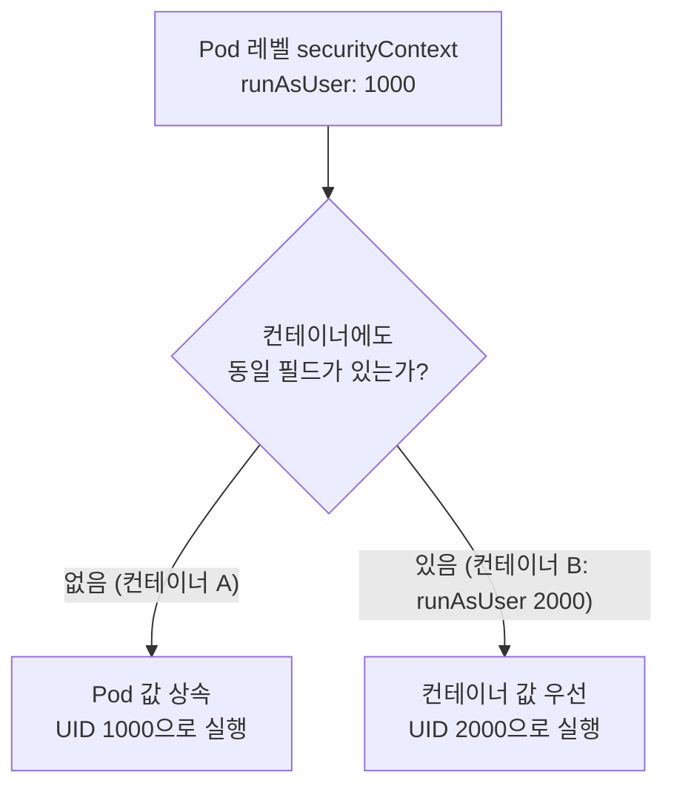

# Kubernetes SecurityContext로 최소 권한 컨테이너 구성하기

## 학습 목표
- Pod 레벨과 컨테이너 레벨 `securityContext`의 차이와 두 설정이 어떻게 병합되는지 이해하고, 각 설정을 올바른 위치에 배치한다.
- 핵심 필드의 의미와 보안 효과를 설명한다: `runAsNonRoot`/`runAsUser`, `allowPrivilegeEscalation`, `readOnlyRootFilesystem`, capability `drop`/`add`, `seccompProfile`.
- 위 필드를 조합해 루트 권한과 불필요한 커널 capability를 제거한 최소 권한 컨테이너 매니페스트를 작성하고, 실행 중인 Pod에서 결과를 검증한다.

## 본문

### Pod를 보안 강화해야 하는 이유

Kubernetes는 컨테이너를 손쉽게 실행할 수 있게 해주지만, 기본적으로 보안은 전혀 적용하지 않는다. 아무 설정 없이 Pod를 띄우고 exec로 접속해 `id`를 실행해보면, 십중팔구 **UID 0**, 즉 root 사용자로 실행 중임을 확인할 수 있다. `root` 그룹과 `wheel` 그룹의 구성원이기도 하다. 컨테이너 안의 프로세스가 네임스페이스 안에서 관리자 수준의 권한을 갖는다는 뜻이다.

이 기본값은 프로덕션 시스템이 지향해야 할 방향과 정반대다. 컨테이너 보안의 핵심 원칙은 **최소 권한(least privilege)**: 프로세스에게 실제로 필요한 권한만 부여하고 그 이상은 주지 않는다는 것이다. root로 실행하면 이 원칙을 여러 측면에서 위반하게 된다.

- **권한 상승.** 공격자가 root 컨테이너를 탈취하면 이미 root 권한을 확보한 상태이므로, 호스트 커널로 탈출을 시도할 수 있다.
- **호스트 노출.** 사용자 네임스페이스나 격리 설정이 미흡한 환경에서는 root 컨테이너가 노드에 대한 상승된 접근 권한을 얻을 수 있다.
- **의도치 않은 손상.** 데이터를 읽기만 하면 되는 워크로드가 시스템 파일을 덮어쓸 수 있어선 안 된다. root로 실행하면 이런 실수가 가능해진다.
- **컴플라이언스.** 많은 서드파티 보안 표준이 워크로드를 non-root로 실행하도록 명시적으로 요구한다. 플랫폼이 이 기준을 충족해야 한다면 선택 사항이 아니다.

> 컨테이너를 강화하는 데 드는 비용은 YAML 몇 줄이다. 강화하지 않았을 때의 비용은 컨테이너 탈출 사고의 전체 피해 반경이다. 최소 권한을 뒤늦게 챙기는 것이 아니라 기본값으로 삼아야 한다.

Kubernetes는 이를 강제하기 위한 두 가지 도구를 제공한다. **`securityContext`**(사용자·파일시스템·권한을 제한하는 설정)와 **Linux capability**(root 권한을 세밀하게 나누어 각각 허용하거나 차단할 수 있는 단위)가 그것이다.

### Pod 레벨 vs. 컨테이너 레벨 securityContext

`securityContext` 블록은 두 위치에 둘 수 있으며, 이 차이를 이해하는 것이 핵심이다.

- **Pod 레벨** — `spec.securityContext` 아래에 작성. Pod 안의 *모든* 컨테이너에 적용되며, 워크로드 전체에 일관되게 적용해야 하는 설정을 두는 곳이다.
- **컨테이너 레벨** — `spec.containers[].securityContext` 아래에 작성. 해당 컨테이너 하나에만 적용된다.

필드는 세 가지 범주로 나눌 수 있다.

| 범주 | 설정 가능한 위치 | 예시 |
|------|----------------|------|
| Pod 전용 | Pod 레벨에만 | `fsGroup` |
| Pod **겸** 컨테이너 | 어느 쪽이든, 충돌 시 컨테이너 우선 | `runAsUser`, `runAsGroup`, `runAsNonRoot`, `seccompProfile` |
| 컨테이너 전용 | 컨테이너 레벨에만 | `allowPrivilegeEscalation`, `readOnlyRootFilesystem`, `privileged`, `capabilities` |

**병합 규칙**이 핵심이다. 동일 필드가 두 곳에 모두 설정된 경우, 해당 컨테이너에서는 컨테이너 레벨 값이 Pod 레벨 값을 덮어쓴다. 따라서 일반적인 패턴은 Pod 레벨에 조직 전체에 통용되는 안전한 기본값을 두고, 특정 워크로드에 진짜 다른 설정이 필요한 경우에만 컨테이너 레벨에서 재정의하는 것이다.

`runAsUser` 필드를 예로 들면 병합 동작은 다음과 같다.

- Pod 레벨에 `runAsUser: 1000` 설정 → 모든 컨테이너가 UID 1000으로 실행.
- 특정 컨테이너가 자체 레벨에서 `runAsUser: 2000` 설정 → 해당 컨테이너만 UID 2000으로 실행, 나머지는 여전히 UID 1000.



### 핵심 필드 하나씩 살펴보기

**`runAsUser` / `runAsGroup`.** 컨테이너 프로세스를 지정한 숫자 UID와 GID로 강제 실행한다. Linux는 이름이 아닌 숫자로 사용자를 식별하므로, 매칭되는 사용자명이 없으면 `id` 명령이 `uid=1000(unknown)`을 출력하는데 이는 정상이며 오류가 아니다.

**`runAsNonRoot: true`.** 안전 장치 역할을 한다. 특정 UID를 지정하지는 않고, 해석된 사용자가 root(UID 0)인 경우 컨테이너 시작 자체를 거부한다. 기본적으로 root로 실행되는 `nginx` 이미지에 이 설정만 적용하고 non-root `runAsUser`는 지정하지 않으면 Pod 시작에 실패하는데, 이 실패 자체가 의도된 동작이다.

**`allowPrivilegeEscalation: false`.** 프로세스가 부모 프로세스보다 더 많은 권한을 얻는 것을 막는다. 이 설정이 없으면 `setuid`-root 바이너리를 통해 UID 1000 프로세스가 컨테이너 안에서 root 권한으로 실행될 수 있다. `false`로 설정하면 이 통로가 차단되므로 기본값으로 설정하는 것이 좋다.

**`privileged: false`.** `privileged: true`는 커널 수준 작업을 포함해 컨테이너에 호스트에 대한 거의 완전한 접근 권한을 부여한다. 프로덕션에서는 사실상 항상 `false`로 두어야 하며, 이것이 기본값이기도 하다.

**`readOnlyRootFilesystem: true`.** 컨테이너의 루트 파일시스템(`/`)을 읽기 전용으로 마운트해 프로세스가 파일을 생성하거나 수정할 수 없게 한다. 읽기만 하면 되는 앱이라면 쓰기 권한을 줄 이유가 없다. 앱이 로그·캐시·데이터 등을 써야 하는 경우, 파일시스템 전체를 열어두는 대신 볼륨으로 해당 경로만 쓰기 가능하게 열어주면 된다.

**`fsGroup`.** Pod 레벨 필드로, 마운트된 볼륨의 그룹 소유권을 설정한다. `readOnlyRootFilesystem`의 보완재 역할을 한다. 루트 파일시스템은 읽기 전용으로 유지하되, `fsGroup`이 소유한 볼륨은 컨테이너 사용자가 해당 그룹의 구성원이기 때문에 쓰기가 가능해진다.

**`capabilities` (drop / add).** root는 단일한 권한이 아니라 *capability*라고 부르는 개별 커널 권한들의 묶음이다. `CHOWN`(파일 소유권 변경), `NET_ADMIN`(네트워크 인터페이스·라우팅 수정), `SYS_TIME`(시스템 시계 변경) 등이 이에 해당한다. 최소 권한 패턴은 **`drop: ["ALL"]`**로 모든 capability를 먼저 제거한 뒤, 워크로드에 실제로 필요하다고 확인된 것만 **`add`**로 다시 추가하는 것이다. 항상 전부 제거부터 시작하고, 앱이 오류를 내면 그 오류 메시지를 읽고 필요한 단일 capability만 추가한다. `add: ["ALL"]`에서 시작하는 것은 금물이다.

**`seccompProfile`.** seccomp는 프로세스가 호출할 수 있는 Linux *시스템 콜(syscall)*을 필터링해 커널 공격 표면을 더욱 줄인다. `type: RuntimeDefault`로 설정하면 컨테이너 런타임이 제공하는 엄선된 기본 필터가 적용되며, 거의 모든 워크로드에 권장되는 기준값이다.

### 종합 정리: 최소 권한 매니페스트

다음은 위 설정을 모두 조합한 강화된 최소 권한 워크로드 예시다. 전체에 일관되게 적용해야 하는 기본값은 Pod 레벨에, 쓰기 관련 민감한 설정은 컨테이너 레벨에 두었다.

```yaml
apiVersion: v1
kind: Pod
metadata:
  name: secure-app
spec:
  securityContext:                  # Pod 레벨: 모든 컨테이너에 적용
    runAsNonRoot: true
    runAsUser: 1000
    runAsGroup: 3000
    fsGroup: 2000                   # 마운트된 볼륨의 그룹 소유권을 2000으로 설정
    seccompProfile:
      type: RuntimeDefault
  containers:
    - name: app
      image: busybox:1.36
      command: ["sleep", "3600"]
      securityContext:              # 컨테이너 레벨: 재정의 및 컨테이너 전용 필드
        allowPrivilegeEscalation: false
        readOnlyRootFilesystem: true
        capabilities:
          drop: ["ALL"]             # 모든 커널 capability 제거
      volumeMounts:
        - name: writable
          mountPath: /writable      # 앱이 쓸 수 있는 유일한 경로
  volumes:
    - name: writable
      emptyDir: {}
```

이 매니페스트가 보장하는 것:

- 프로세스는 UID 1000 / GID 3000으로 실행되며, root로 실행될 가능성이 생기면 Pod 시작 자체가 거부된다.
- 권한 상승 없음, 추가 capability 없음, 기본 seccomp 필터 적용 — 커널 공격 표면이 최소화된다.
- 루트 파일시스템은 읽기 전용이며, **`/writable`만 예외**로 `fsGroup` 2000이 소유하는 `emptyDir` 볼륨으로 마운트되어 UID 1000이 쓸 수 있다.

### 결과 검증

매니페스트를 적용하고 실행 중인 컨테이너를 확인한다.

```bash
kubectl apply -f secure-app.yaml
kubectl exec -it secure-app -- sh
```

Pod 안에서 다음 명령으로 확인한다.

```text
$ id
uid=1000 gid=3000 ...            # non-root 확인; "unknown" 이름은 정상

$ mkdir /test
mkdir: can't create directory '/test': Read-only file system

$ touch /writable/hello
$ ls -l /writable
-rw-r--r--  1 1000  2000  ...    # 소유자 1000, 그룹 2000 — 의도한 대로 쓰기 가능
```

`/test` 생성 실패는 `readOnlyRootFilesystem`이 적용되었음을, `/writable` 쓰기 성공은 `fsGroup`이 정확히 의도한 접근 권한을 부여했음을 증명한다. capability를 모두 제거했으므로 `chown 0:0 /writable/hello` 명령은 `Operation not permitted`를 반환한다. 컨테이너에 `CHOWN` capability가 없기 때문이다.

클러스터가 이 규칙을 자동으로 강제하게 할 수도 있다. **Pod Security Admission**을 활용하면 이 설정들이 빠진 매니페스트를 네임스페이스 레벨에서 거부할 수 있어, 빈 `securityContext`의 Deployment는 실행 전에 차단된다. 최소 권한이 개발자가 매번 기억해야 하는 관례가 아니라 플랫폼이 강제하는 가드레일이 되는 것이다.

## 핵심 정리
- 컨테이너는 기본적으로 **root로 실행**된다. 최소 권한은 root 권한과 워크로드에 불필요한 모든 capability를 제거하는 것을 의미한다.
- `securityContext`는 두 레벨에 존재하며, 동일 필드가 두 곳에 설정된 경우 **컨테이너 레벨이 Pod 레벨을 재정의**한다. 공통 기본값은 Pod 레벨에, 꼭 필요한 경우에만 컨테이너 레벨에서 재정의한다.
- 보안 강화 기준선: `runAsNonRoot: true` + non-root `runAsUser`, `allowPrivilegeEscalation: false`, `readOnlyRootFilesystem: true`, `capabilities.drop: ["ALL"]`, `seccompProfile.type: RuntimeDefault`.
- `fsGroup`과 마운트된 볼륨을 함께 사용해 루트 파일시스템은 읽기 전용으로 유지하면서 특정 경로에만 쓰기 권한을 부여한다.
- capability는 **전부 제거 후 문제가 생기는 것만 추가**하는 방식으로 접근한다. `add: ["ALL"]`에서 시작해서는 안 된다.
- `kubectl exec`으로 검증하고(`id`, `/`에 쓰기 시도, 볼륨에 쓰기 시도), Pod Security Admission으로 정책을 클러스터 전체에 강제한다.
