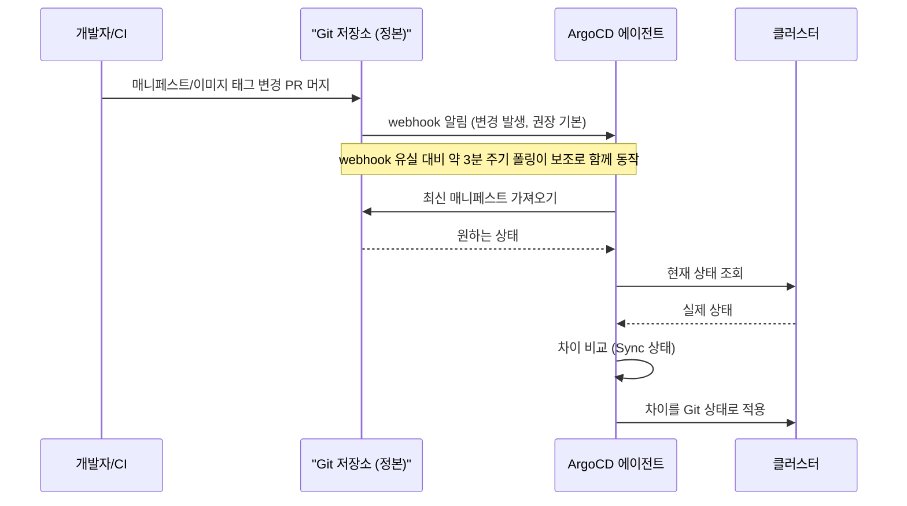

# GitOps and ArgoCD — Declarative Continuous Delivery

## Learning Objectives
- Understand GitOps principles and the concept of "Git as the single source of truth"
- Configure an ArgoCD Application to synchronize a Git repository with cluster state
- Observe drift detection, self-heal, and automated sync behavior in action

## Overview

### From Push to Pull — What GitOps Changes

Think about a traditional CI/CD pipeline. After a build succeeds, the pipeline pushes the result directly into the cluster via `kubectl apply` or `helm upgrade`. This push-based approach has structural problems: the CI system must hold cluster admin credentials (a security risk), the true current state of the cluster lives only in some pipeline log, and any change made with `kubectl edit` goes completely unrecorded.

GitOps inverts this flow. The core principles are:

1. **Declarative** — The entire desired state of the system is expressed as declarative manifests.
2. **Git as the single source of truth** — Those manifests live in Git, which becomes the one authoritative record of desired state.
3. **Automated pull** — An agent running inside the cluster watches Git for changes and reconciles cluster state to match. The cluster pulls from Git; CI no longer pushes into the cluster.
4. **Continuous reconciliation** — The agent continuously compares "actual state" against "declared state in Git" and automatically closes any gap it finds.

Principles 3 and 4 should sound familiar — they are exactly the **reconciliation loop** from the previous lecture. GitOps extends the controller pattern to cover deployments as a whole. The only difference is that the desired state lives in a Git repository rather than a Custom Resource in etcd.

### CI Doesn't Go Away — Its Responsibility Shifts

A common misconception is worth addressing head-on: **"the cluster pulls from Git" does not mean CI disappears.** CI remains essential in a GitOps workflow; what changes is the *final step* of what CI does.

- **Build and test remain CI's job** — compile sources, run tests, build container images, and push them to a registry.
- **What changes is "what comes next."** In the old model, CI deployed the artifact directly to the cluster (push). In GitOps, CI's job ends when it commits the new image tag (e.g., `web:v1.4.2`) back to the **Git manifest repository**. ArgoCD then detects that commit and applies it to the cluster via pull.

In other words, CI's responsibility shifts **from "push to cluster" to "push to Git."** As a result, CI no longer needs cluster admin credentials (a security win), and every deployment passes through a single, auditable path: CI (build / test / image push) → Git (manifest update) → CD (ArgoCD pulls and applies).

The sequence below shows this flow: CI pushes a new image tag to Git, Git notifies ArgoCD via webhook, and the in-cluster agent pulls the updated manifests and applies them.



> The most practical benefit of GitOps is **auditability and rollback**. Every change is a Git commit, so "who changed what, when, and why" is preserved in the PR history. When something goes wrong, a single `git revert` restores the previous state. Managing cluster state as version-controlled code rather than ad-hoc manual changes — that is the essence of GitOps.

### How ArgoCD Detects Changes — Webhook First, Polling as Fallback

In the diagram above, synchronization is triggered by a Git webhook notification. **In production, this webhook-based approach is the recommended default.** It is worth understanding the difference clearly.

- **Git webhook (recommended)** — You register ArgoCD's endpoint as a webhook on GitHub, GitLab, or your Git host of choice. The moment a commit is pushed, the Git server sends ArgoCD an immediate notification. ArgoCD starts syncing that Application right away, making propagation nearly instantaneous. This is the standard setup for production.
- **Periodic polling (fallback / safety net)** — ArgoCD also polls Git roughly every three minutes by default. This serves as a **safety net** for cases where a webhook event is missed or webhooks have not been configured. Relying on polling alone means changes can take up to a full poll interval to be reflected.

> In short: a webhook is "notify me the moment something changes (event-driven)," while polling is "I'll check periodically on my own." The recommended configuration is to use webhooks for fast propagation and keep polling as a backup in case a webhook event is dropped. That is why the sequence diagram above shows the webhook as the primary path and polling as the secondary.

Regardless of what triggers a sync, the reconciliation logic is the same: compare the declared state in Git against the actual state in the cluster, and close any gap.

### Installing ArgoCD and Configuring an Application

ArgoCD is the leading GitOps implementation. It runs as a controller inside your cluster, watches a designated Git repository, and continuously applies the desired state. The quickest way to get started is to apply the official `install.yaml` directly.

```bash
kubectl create namespace argocd
kubectl apply -n argocd -f \
  https://raw.githubusercontent.com/argoproj/argo-cd/stable/manifests/install.yaml
```

> Applying `install.yaml` directly is fine for learning and experimentation, but in production the preferred approach is the **official ArgoCD Helm chart or a Kustomize-based installation**, which makes it easy to version-control and customize the configuration. A common pattern is "self-managed" ArgoCD (app-of-apps), where the ArgoCD installation itself is tracked in Git and managed by ArgoCD — GitOps all the way down.

The central concept in ArgoCD is the **Application** CRD. It declares "which path in which Git repository to sync, into which cluster and namespace, and how."

```yaml
apiVersion: argoproj.io/v1alpha1
kind: Application
metadata:
  name: web-app
  namespace: argocd
spec:
  project: default
  source:
    repoURL: https://github.com/our-org/k8s-manifests.git
    targetRevision: main          # branch or tag to track
    path: apps/web                # path to manifests (Helm / Kustomize / plain YAML)
  destination:
    server: https://kubernetes.default.svc
    namespace: web
  syncPolicy:
    automated:
      prune: true                 # remove resources deleted from Git
      selfHeal: true              # auto-correct any drift
    syncOptions:
      - CreateNamespace=true
```

Once you `kubectl apply` this Application, ArgoCD immediately reads the Git repository and deploys to the cluster. Verify that the Application shows **Synced / Healthy** in the ArgoCD UI or with `argocd app get web-app`. ArgoCD accepts plain YAML, Helm charts, and Kustomize overlays as sources, so you can reuse existing assets.

> The example above uses `spec.project: default` for simplicity, but in production you should create separate **AppProjects** per team or purpose. AppProjects let you restrict which Git repositories, clusters, and namespaces each Application can target, giving you fine-grained access control and a bounded blast radius.

> The example also tracks the `main` branch directly for simplicity. Real-world organizations, however, **promote** changes through environments. A common pattern is to give each environment its own path or overlay (e.g., Kustomize `overlays/dev`, `overlays/staging`, `overlays/prod`) or a separate Application, and have CI promote a validated image tag from dev → staging → prod through pull requests. "Deploy this image to production" becomes "merge the PR that bumps the tag in the production manifest." This image promotion pipeline is what GitOps looks like in day-to-day operations.

> **Having a production Application track a development branch like `main` is dangerous.** With `targetRevision: main`, every commit a developer pushes to `main` instantly becomes a production deployment candidate. Unvalidated changes can flow all the way to production on a single webhook event, making it hard to control "what goes out and when" and widening the blast radius of any incident. In practice: (1) pin the production Application's `targetRevision` to an **environment-specific branch (`release/prod`) or an immutable version tag (`v1.4.2`)** to isolate the development and production flows, or (2) ensure that production manifests can only be updated via a **dedicated promotion PR** that requires review and approval. Either way, the key is to align your branching strategy (Git-flow, trunk-based, etc.) consistently with each Application's `targetRevision`, so that "goes to production" always means a deliberate, intentional promotion.

### Drift, Self-Heal, and Prune

ArgoCD tracks two kinds of state: **Sync status** (does the cluster match Git?) and **Health status** (are the resources operating correctly?). The most important concept here is **drift**.

Drift occurs when the actual cluster state diverges from what is declared in Git. If someone runs `kubectl edit deployment web` and sets `replicas` to 5, but Git says 3, ArgoCD marks that Application as **OutOfSync**.

With `selfHeal: true` enabled, ArgoCD automatically reconciles the cluster back to the Git state (replicas: 3). Any manual change made outside of Git is effectively rejected. Let's observe this directly.

```bash
# Git declares replicas: 3 — let's manually scale to 5
kubectl scale deployment web -n web --replicas=5
# A moment later, ArgoCD rolls it back to 3
kubectl get deployment web -n web -w
```

`prune: true` handles the opposite direction: when a resource is **deleted** from Git, ArgoCD removes it from the cluster as well. Without pruning, removed resources linger in the cluster as orphans. You generally want pruning on to maintain GitOps consistency — though it is prudent to start with manual pruning in production so you can review the impact before enabling full automation.

The day-to-day workflow in a GitOps setup is straightforward: to change a deployment, you open a **PR against Git** rather than touching the cluster directly. When the PR merges, ArgoCD detects the change (via webhook) and applies it. If something breaks, you revert the PR. Because you never directly touch the cluster, you never need to hand CI admin credentials.

> Self-heal is powerful, but a common gotcha is making a quick `kubectl edit` for debugging and watching ArgoCD immediately undo it. During incident investigation, you can temporarily disable automated sync for the affected Application — but the better long-term habit is to **always make changes through Git**, which is what GitOps intends.

## Key Takeaways
- GitOps flips deployment from push to pull. An agent inside the cluster watches Git and reconciles desired state on its own.
- CI does not disappear. It still handles build, test, and image push — but its final step changes from "deploy directly to the cluster" to "commit the new image tag to the Git manifest repository." ArgoCD handles the actual application via pull.
- The four principles: declarative, Git as single source of truth, automated pull, continuous reconciliation (auto-closing the gap between desired and actual state). This extends the controller reconciliation loop to cover the entire deployment lifecycle.
- ArgoCD change detection: **Git webhooks are the recommended default** — syncing fires immediately on push. **Periodic polling (roughly every 3 minutes) is the fallback safety net** for missed or unconfigured webhooks.
- The ArgoCD Application CRD declares "which Git path to sync into which cluster/namespace." It supports Helm, Kustomize, and plain YAML. In production, use AppProjects for access isolation and environment-specific overlays to implement a dev → staging → prod promotion pipeline.
- **Having a production Application track a development branch like `main` is risky** — every commit becomes an immediate production deployment candidate. Pin production to an environment-specific branch (`release/prod`) or an immutable version tag, or gate production manifest changes behind a promotion PR with required review. Keep your branching strategy and `targetRevision` consistently aligned.
- Drift is the OutOfSync state where the cluster diverges from Git. `selfHeal` automatically restores manual changes back to the Git state; `prune` removes resources from the cluster when they are deleted from Git.
