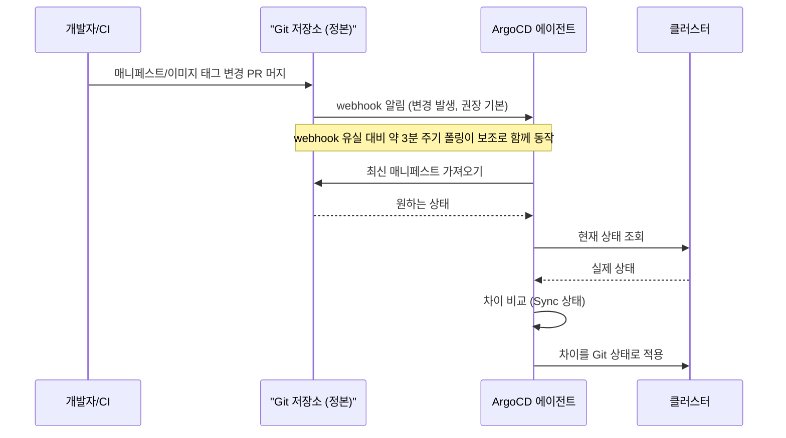

# GitOps와 ArgoCD — 선언형 지속적 배포

## 학습 목표
- GitOps 원칙과 "Git as single source of truth" 개념을 이해한다
- ArgoCD Application을 구성해 Git 저장소와 클러스터 상태를 동기화할 수 있다
- 드리프트(drift) 감지와 self-heal·자동 동기화 동작을 관찰할 수 있다

## 본문

### push에서 pull로 — GitOps가 바꾼 것

전통적인 CI/CD를 떠올려 보자. 파이프라인이 빌드 후 `kubectl apply`나 `helm upgrade`를 클러스터에 **밀어 넣는다(push)**. 이 방식엔 구조적 문제가 있다. CI 시스템이 클러스터의 admin 자격증명을 들고 있어야 하고(보안 위험), 클러스터의 진짜 현재 상태가 어딘가의 파이프라인 로그에만 남으며, 누군가 `kubectl edit`으로 손을 대면 그 변경은 어디에도 기록되지 않는다.

GitOps는 흐름을 뒤집는다. 핵심 원칙은 다음과 같다.

1. **선언형(Declarative)** — 시스템의 원하는 상태 전체를 선언형 매니페스트로 표현한다.
2. **Git이 단일 진실 공급원(Single Source of Truth)** — 그 매니페스트를 Git에 저장하고, Git이 "원하는 상태"의 유일한 정본이 된다.
3. **자동 적용(Pull)** — 클러스터 안의 에이전트가 Git의 변경을 받아, 클러스터 상태를 Git에 맞춘다. CI가 클러스터에 직접 미는 게 아니라 클러스터(에이전트)가 Git에서 당겨 온다.
4. **지속적 조정(Reconcile)** — 에이전트가 끊임없이 "현재 상태 == Git의 선언 상태"인지 비교하고, 어긋나면 **선언 상태와 실제 상태의 차이를 자동으로 맞춘다(조정한다)**.

3·4번이 익숙하지 않은가. 바로 앞 강의의 **조정 루프**다. GitOps는 컨트롤러 패턴을 배포 전체로 확장한 것이다. desired state가 etcd 안의 CR이 아니라 Git 저장소라는 점만 다르다.

### CI는 사라지지 않는다 — 책임이 바뀔 뿐

여기서 가장 흔히 생기는 오해를 짚자. **"클러스터가 Git을 당겨 온다"는 말은 CI가 없어진다는 뜻이 아니다.** GitOps에서도 CI는 여전히 필수다. 다만 CI가 하던 일의 *마지막 단계*가 바뀐다.

- **빌드·테스트는 그대로 CI가 한다** — 소스를 컴파일하고, 테스트를 돌리고, 컨테이너 이미지를 빌드해 레지스트리에 푸시한다.
- **달라진 것은 "그다음"이다.** 과거엔 CI가 그 결과물을 **클러스터에 직접 배포(push)**했다. GitOps에서는 CI가 새 이미지 태그(예: `web:v1.4.2`)를 **Git 매니페스트에 반영(commit/PR)**하는 것으로 끝난다. 실제 클러스터 적용은 ArgoCD가 그 커밋을 감지해 pull 방식으로 수행한다.

즉 CI의 책임이 **"클러스터에 직접 명령(push to cluster)"에서 "Git에 상태 변경을 요청(push to Git)"으로 이동**한 것이다. 그 결과 CI는 더 이상 클러스터 admin 자격증명을 들 필요가 없고(보안 향상), 모든 배포가 Git 커밋이라는 단일 경로를 통과한다. CI(빌드/테스트/이미지 푸시) → Git(매니페스트 갱신) → CD(ArgoCD가 pull 적용)로 역할이 깔끔히 분리된다.

아래 시퀀스는 CI가 새 이미지 태그를 Git에 올리면, Git이 webhook으로 ArgoCD에 변경을 알리고, 클러스터 안의 에이전트가 매니페스트를 당겨 와 클러스터에 적용하는 흐름을 보여 준다.



> GitOps의 가장 큰 실용적 이득은 **감사(audit)와 롤백**이다. 모든 변경이 Git 커밋으로 남으므로 "누가, 언제, 무엇을, 왜" 바꿨는지 PR 이력에 그대로 보존된다. 장애가 나면 `git revert` 한 번으로 이전 상태로 되돌릴 수 있다. 클러스터 상태를 사람의 손버릇이 아니라 버전 관리된 코드로 다루는 것 — 이것이 GitOps의 본질이다.

### ArgoCD는 변경을 어떻게 감지하는가 — webhook이 기본, 폴링은 대체

위 다이어그램에서 동기화를 촉발한 것은 Git의 webhook 알림이었다. **실무에서 권장되는 기본 방식이 바로 이 Git 저장소 webhook**이다. 폴링과의 차이를 정확히 알아 두자.

- **Git webhook (권장)** — GitHub·GitLab 등에 ArgoCD 주소로 webhook을 걸어 두면, 커밋이 push되는 **즉시** Git 서버가 ArgoCD에 "변경됐다"고 알려 준다. ArgoCD는 그 알림을 받자마자 해당 Application의 동기화를 시작하므로 반영이 거의 실시간이다. 운영 환경에서는 이 방식을 기본으로 구성한다.
- **주기적 폴링 (대체/안전망)** — ArgoCD는 기본적으로 약 3분 간격으로도 Git을 폴링한다. webhook이 어떤 이유로 누락되거나 설정되지 않았을 때를 위한 **안전망**이다. 폴링만 의존하면 최대 그 주기만큼 반영이 늦어진다.

> 정리하면, webhook은 "변경되면 즉시 알림(push)"이고 폴링은 "주기적으로 직접 확인(pull)"이다. 권장 구성은 webhook으로 빠른 반영을 얻고, 폴링은 webhook 유실에 대비한 백업으로 함께 두는 것이다. 위 시퀀스에서 webhook 알림을 주 경로로, 폴링을 보조 경로로 그린 것도 같은 이유다.

어느 쪽으로 촉발되든, 촉발 이후의 동작 — 즉 Git의 선언 상태와 클러스터의 실제 상태를 비교해 차이를 맞추는 **조정** — 은 동일하다.

### ArgoCD 설치와 Application 구성

ArgoCD는 GitOps를 구현하는 대표적인 도구다. 클러스터 안에서 동작하는 컨트롤러로서, 지정한 Git 저장소를 추적하며 desired state를 클러스터에 적용한다. 가장 빠른 시작은 공식 `install.yaml`을 그대로 적용하는 것이다.

```bash
kubectl create namespace argocd
kubectl apply -n argocd -f \
  https://raw.githubusercontent.com/argoproj/argo-cd/stable/manifests/install.yaml
```

> 위 `install.yaml` 직접 적용은 학습·실습엔 간편하지만, 실제 운영에서는 설정을 버전 관리하고 커스터마이징하기 쉬운 **ArgoCD 공식 Helm 차트나 Kustomize 기반 설치**가 더 선호된다. 흥미롭게도 ArgoCD를 ArgoCD로 관리하는 "self-managed" 패턴(app-of-apps)이 흔하다 — ArgoCD 설정 자체도 Git에 두고 GitOps로 다루는 것이다.

ArgoCD의 중심 개념은 **Application** CRD다. "어느 Git 저장소의 / 어느 경로를 / 어느 클러스터의 / 어느 네임스페이스에 / 어떻게 동기화할지"를 선언한다.

```yaml
apiVersion: argoproj.io/v1alpha1
kind: Application
metadata:
  name: web-app
  namespace: argocd
spec:
  project: default
  source:
    repoURL: https://github.com/our-org/k8s-manifests.git
    targetRevision: main          # 추적할 브랜치/태그
    path: apps/web                # 매니페스트가 있는 경로 (Helm/Kustomize/plain YAML)
  destination:
    server: https://kubernetes.default.svc
    namespace: web
  syncPolicy:
    automated:
      prune: true                 # Git에서 지운 리소스는 클러스터에서도 제거
      selfHeal: true              # 드리프트를 자동 복구
    syncOptions:
      - CreateNamespace=true
```

이 Application을 `kubectl apply`하면 ArgoCD가 즉시 Git을 읽어 클러스터에 배포한다. ArgoCD UI나 `argocd app get web-app`에서 상태가 **Synced / Healthy**로 표시되는지 확인한다. ArgoCD는 plain YAML뿐 아니라 Helm 차트, Kustomize도 그대로 소스로 받아들이므로 기존 자산을 재활용할 수 있다.

> 위 예제는 단순화를 위해 `spec.project`를 `default`로 뒀지만, 실제 운영에서는 팀·목적별로 별도 **AppProject**를 만들어 격리하는 것이 모범 사례다. Project 단위로 "어느 Git 저장소·어느 클러스터·어느 네임스페이스에만 배포 가능한지"를 제한해 권한과 폭발 반경(blast radius)을 통제할 수 있다.

> 위 예제는 단순화를 위해 `main` 브랜치를 직접 추적한다. 하지만 실제 조직에서는 환경별로 변경을 **승격(promotion)**한다. 흔한 패턴은 환경마다 별도 경로/오버레이(예: Kustomize `overlays/dev`, `overlays/staging`, `overlays/prod`)나 별도 Application을 두고, CI가 검증을 마친 이미지 태그를 dev → staging → prod 순서로 PR을 통해 끌어올리는 것이다. 즉 "이 이미지를 운영에 올린다"가 곧 "운영 매니페스트의 태그를 바꾸는 PR을 머지한다"가 된다. 이 이미지 프로모션 파이프라인이 GitOps의 실제 운영 모습이다.

> **운영 Application이 `main` 같은 개발 브랜치를 직접 추적하면 위험하다.** `targetRevision: main`으로 운영을 묶어 두면, 개발자가 `main`에 올리는 **모든 커밋이 곧바로 운영 배포 후보**가 된다. 검증되지 않은 변경이 webhook 알림 한 번에 운영까지 흘러가므로 "무엇이 언제 운영에 올라가는가"를 통제하기 어렵고, 사고 시 폭발 반경도 커진다. 그래서 실무에서는 (1) 운영 Application의 `targetRevision`을 **환경별 브랜치(`release/prod`)나 불변 버전 태그(`v1.4.2`)로 고정**해 개발 흐름과 운영 흐름을 분리하거나, (2) 운영 매니페스트는 **승격용 PR로만 바뀌도록** 하고 그 PR에 리뷰·승인 게이트를 둔다. 어느 쪽이든 Git-flow나 Trunk-based development 같은 브랜칭 전략과 ArgoCD의 추적 대상(`targetRevision`)을 일관되게 맞춰, "운영에 반영"이 항상 의도된 승격 행위가 되도록 설계하는 것이 핵심이다.

### 드리프트, self-heal, 그리고 prune

ArgoCD가 추적하는 두 가지 상태가 있다. **Sync 상태**(클러스터가 Git과 일치하는가)와 **Health 상태**(리소스가 정상 동작하는가)다. 여기서 가장 중요한 개념이 **드리프트(drift)**다.

드리프트란 클러스터의 실제 상태가 Git에 선언된 상태와 어긋난 것을 말한다. 누군가 `kubectl edit deployment web`으로 replicas를 5로 바꿨는데 Git에는 3으로 적혀 있다면, ArgoCD는 이를 **OutOfSync**로 표시한다.

이때 `selfHeal: true`가 켜져 있으면 ArgoCD가 자동으로 클러스터를 Git 상태(replicas 3)로 **되돌린다**. 즉 Git을 거치지 않은 수동 변경은 거부되는 셈이다. 이를 직접 관찰해 보자.

```bash
# Git에는 replicas: 3 인데, 손으로 5로 바꿔 본다
kubectl scale deployment web -n web --replicas=5
# 잠시 후 다시 보면 ArgoCD가 3으로 되돌려 놓는다
kubectl get deployment web -n web -w
```

`prune: true`는 반대 방향을 처리한다. Git에서 리소스를 **삭제**하면 ArgoCD가 클러스터에서도 그 리소스를 제거한다. prune을 끄면 Git에서 지워도 클러스터에는 고아 리소스로 남으니, GitOps의 일관성을 유지하려면 보통 켠다(단, 운영 안전을 위해 처음엔 수동 prune으로 영향도를 확인한 뒤 자동화하는 것을 권한다).

정리하면 GitOps 운영의 실제 작업 흐름은 이렇게 단순해진다. 배포를 바꾸려면 클러스터를 직접 만지지 않고 **Git에 PR을 올린다**. PR이 머지되면 ArgoCD가 (webhook 알림으로) 변경을 감지해 클러스터에 적용한다. 잘못됐으면 PR을 revert한다. 클러스터를 만질 일이 없으니 admin 자격증명도 CI에 줄 필요가 없다.

> self-heal은 강력하지만, 디버깅 중 임시로 `kubectl edit`을 했다가 ArgoCD가 즉시 되돌려 혼란을 겪는 일이 흔하다. 긴급 조사 시에는 해당 Application의 자동 동기화를 잠시 비활성화하거나, 더 나은 방법으로 **항상 Git을 통해 변경하는 습관**을 들이는 것이 GitOps의 의도에 맞다.

## 핵심 요약
- GitOps는 배포를 push에서 pull로 뒤집는다. 클러스터 안의 에이전트가 Git의 변경을 받아 desired state를 스스로 당겨 적용한다.
- CI는 사라지지 않는다. 여전히 빌드·테스트·이미지 푸시를 담당하되, 마지막 단계가 "클러스터에 직접 배포"에서 "새 이미지 태그를 Git 매니페스트에 반영(PR)"으로 바뀐다. 실제 적용은 ArgoCD가 pull로 수행한다.
- 4대 원칙: 선언형, Git as single source of truth, 자동 pull 적용, 지속적 조정(선언 상태와 실제 상태의 차이를 자동으로 맞춤). 컨트롤러 조정 루프를 배포 전체로 확장한 개념이다.
- ArgoCD의 변경 감지는 **Git webhook이 기본(권장)**으로 push되는 즉시 동기화하고, 약 3분 주기의 **폴링은 webhook 유실에 대비한 대체·안전망**이다.
- ArgoCD의 Application CRD는 "어느 Git 경로를 어느 클러스터/네임스페이스에 동기화할지"를 선언한다. Helm·Kustomize·plain YAML 모두 지원하며, 운영에서는 AppProject로 권한을 격리하고 환경별 오버레이로 dev→staging→prod 프로모션을 구성한다.
- 운영 Application이 `main` 같은 개발 브랜치를 직접 추적하면 모든 커밋이 즉시 운영 배포 후보가 되어 위험하다. 운영은 환경별 브랜치(`release/prod`)나 버전 태그를 추적하거나 승격용 PR로만 바뀌게 하고, 브랜칭 전략(Git-flow/Trunk-based)과 `targetRevision`을 일관되게 맞춘다.
- 드리프트는 클러스터가 Git과 어긋난 상태(OutOfSync)다. `selfHeal`은 수동 변경을 Git 상태로 자동 복구하고, `prune`은 Git에서 삭제된 리소스를 클러스터에서도 제거한다.
