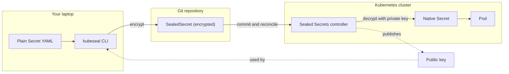
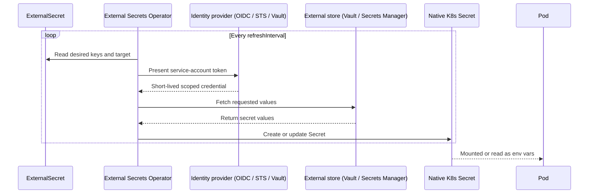

# Kubernetes External Secrets: Managing Secrets Safely with Sealed Secrets and the External Secrets Operator

## Learning Objectives
- Explain why a plain Kubernetes `Secret` is not a security boundary (base64 is encoding, not encryption) and why committing one to Git is dangerous.
- Compare two GitOps-friendly approaches: encrypting secrets so they can live safely in Git (Sealed Secrets / SOPS) versus syncing from an external store such as HashiCorp Vault or AWS Secrets Manager with the External Secrets Operator (ESO).
- Use ESO's `SecretStore`/`ClusterSecretStore` and `ExternalSecret` resources to pull values from an external store into a native cluster `Secret`, and recognize the common use cases for each pattern.

## Body

### Why the built-in Secret is not enough

A Kubernetes `Secret` looks like it protects sensitive data, but it really only *encodes* it. The values you put in a Secret are stored as **base64**, and base64 is not encryption at all — it is a reversible text encoding. Anyone who can read the manifest can decode it instantly:

```bash
echo 'cGFzc3dvcmQxMjM=' | base64 -d
# password123
```

Inside a running cluster this is acceptable, because Kubernetes stores Secrets in `etcd` (ideally with encryption-at-rest enabled) and gates access through RBAC. The real problem starts the moment you adopt **GitOps** — the practice of describing your whole cluster as YAML in a Git repository and letting a tool reconcile it. Git is excellent at versioning and reviewing manifests, but it cannot encrypt a Secret for you. If you commit a normal Secret manifest, your password is now sitting in plain text (well, base64, which is the same thing) in your repo history forever, readable by everyone with repo access and impossible to fully erase.

> base64 is encoding, not encryption. A Secret manifest in Git is effectively a plaintext password in Git. Never commit a raw `kind: Secret`.

So we have a tension: we *want* every piece of cluster state in Git, but we *can't* put raw secrets there. There are two well-established ways to resolve this, and they take opposite approaches.

### Approach 1 — Encrypt the secret so Git can hold it (Sealed Secrets / SOPS)

The first idea is simple: if the problem is that the secret is plaintext in Git, then **encrypt it before committing**. The encrypted blob is safe to store anywhere, and only the cluster holds the key to decrypt it.

**Sealed Secrets** (by Bitnami) implements this with a controller running in your cluster. The flow is as follows:

1. The controller generates a public/private key pair and keeps the private key inside the cluster.
2. On your laptop you run a CLI (`kubeseal`) that uses the **public** key to encrypt a normal Secret into a new resource of `kind: SealedSecret`.
3. You commit the `SealedSecret` to Git. It is encrypted, so it is safe — only the controller's private key can open it.
4. When the `SealedSecret` lands in the cluster, the controller decrypts it and produces a normal `Secret` that your pods consume.

The diagram below traces these four steps across the three trust boundaries — your laptop, the Git repository, and the cluster — and shows which key is used where.



```bash
# Turn a normal Secret into an encrypted SealedSecret (safe for Git)
kubectl create secret generic db-creds \
  --from-literal=password='p@ssw0rd' \
  --dry-run=client -o yaml \
  | kubeseal --format yaml > sealed-db-creds.yaml
# Commit sealed-db-creds.yaml — the controller will decrypt it in-cluster.
```

A closely related, tool-agnostic option is **SOPS + age**. Here, `age` does the actual encryption and `sops` decides *which fields* get encrypted, so the manifest stays readable while only the sensitive values are scrambled. A `.sops.yaml` rules file tells SOPS what to lock:

```yaml
# .sops.yaml — encrypt only matching keys with a given age public key
creation_rules:
  - path_regex: secrets.*\.yaml$
    encrypted_regex: '^(password|token|apiKey)$'
    age: age1ql3z7hjy54pw3hyww5ayyfg7zqgvc7w3j2elw8zmrj2kg5sfn9aqmcac8j
```

You commit the encrypted file, and at deploy time you (or your CD tool) decrypt it with the **private** key and apply it. Two non-negotiable safeguards go with this pattern: protect the private key like your life depends on it, and add a `.gitignore` so a plaintext manifest or the key file can never be committed by accident.

> With the encrypt-in-Git approach, your CI/CD must hold the decryption key. Lose that key and your sealed data is unrecoverable; leak it and everything ever committed is exposed.

### Approach 2 — Don't store the secret in Git at all (External Secrets Operator)

The second idea flips the problem around. Instead of encrypting secrets to store them in Git, you **keep them entirely out of Git** and let a dedicated secrets manager be the source of truth: **HashiCorp Vault**, **AWS Secrets Manager**, GCP Secret Manager, Azure Key Vault, and so on. Git then holds only a *pointer* — a manifest that says "fetch the value named X from store Y" — which contains no sensitive data.

The **External Secrets Operator (ESO)** makes this work. It introduces two custom resources:

- **`SecretStore`** (namespaced) or **`ClusterSecretStore`** (cluster-wide): describes *where* the external store is and *how to authenticate* to it.
- **`ExternalSecret`**: describes *which* keys to fetch from that store and what the resulting native Kubernetes `Secret` should be named.

The flow is as follows: ESO reads the `ExternalSecret`, authenticates to the backend using the `SecretStore`, fetches the requested values, and continuously reconciles them into a normal Kubernetes `Secret` that your workloads mount or read as environment variables. Because it reconciles on an interval, rotating a value in Vault propagates to the cluster automatically — no re-commit, no redeploy of the secret itself. The sequence below shows one reconcile cycle, including the short-lived credential exchange ESO uses to authenticate.



A `ClusterSecretStore` for AWS Secrets Manager looks like this:

```yaml
apiVersion: external-secrets.io/v1beta1
kind: ClusterSecretStore
metadata:
  name: aws-secrets-manager
spec:
  provider:
    aws:
      service: SecretsManager
      region: us-east-1
      auth:
        jwt:
          serviceAccountRef:
            name: external-secrets-sa
            namespace: external-secrets
```

And an `ExternalSecret` that pulls a database credential into a native Secret named `db-credentials`:

```yaml
apiVersion: external-secrets.io/v1beta1
kind: ExternalSecret
metadata:
  name: db-credentials
  namespace: app
spec:
  refreshInterval: 1h
  secretStoreRef:
    name: aws-secrets-manager
    kind: ClusterSecretStore
  target:
    name: db-credentials        # the K8s Secret ESO will create
    creationPolicy: Owner
  data:
    - secretKey: username        # key in the resulting K8s Secret
      remoteRef:
        key: prod/db-creds       # name in AWS Secrets Manager
        property: username
    - secretKey: password
      remoteRef:
        key: prod/db-creds
        property: password
```

Once applied, ESO reports `SecretSynced`, and `kubectl get secret db-credentials -n app` shows a real Secret your pods can consume exactly like any other.

### The authentication piece: how ESO proves who it is

The hard part of Approach 2 is never the YAML — it's letting the operator authenticate to the external store *without* hard-coding a long-lived credential (which would just recreate the original problem). The solution depends on the backend:

- **AWS Secrets Manager (on EKS):** use **IRSA** — *IAM Roles for Service Accounts*. You create a Kubernetes `ServiceAccount` for ESO and map it to an IAM role via the cluster's OIDC provider. When ESO's pod calls AWS, it presents the service account's projected JWT, AWS STS validates it against OIDC, and hands back short-lived temporary credentials scoped by an IAM policy (typically read-only access to the relevant secrets). No static AWS keys ever live in the cluster.
- **HashiCorp Vault:** enable Vault's Kubernetes auth method, bind a Vault **policy** (e.g. read-only) to a Kubernetes **service account** through a Vault **role**. ESO authenticates with the service account token, Vault validates it against the cluster, and returns the requested secret. Only the deployments tied to that service account and role can read it.

In both cases the principle is identical: a workload identity (the service account) is exchanged for short-lived, scoped access — so even the credential ESO uses is not a secret sitting in Git.

### Which approach should you use?

Both are valid; they fit different situations.

- **Sealed Secrets / SOPS** keeps everything self-contained in Git with no extra infrastructure to run. It is ideal for smaller teams, edge or air-gapped clusters, and "pure GitOps" setups where Git is genuinely the single source of truth. The trade-off: rotation and revocation mean re-encrypting and re-committing, and you must rigorously protect the decryption key.
- **External Secrets Operator** centralizes secrets in a purpose-built manager with auditing, dynamic/rotating secrets, and fine-grained access policies, while Git stays completely free of sensitive data. It shines in larger organizations and multi-cluster fleets that already run Vault or a cloud secrets manager. The trade-off: you operate ESO and depend on the external store's availability.

A common real-world pattern is to use ESO for application credentials backed by a central Vault or cloud store, and Sealed Secrets for the small number of bootstrap secrets the cluster needs before ESO itself is running.

## Key Takeaways
- A Kubernetes `Secret` is base64-encoded, not encrypted — committing a raw Secret to Git exposes it in plaintext, permanently.
- GitOps offers two safe patterns: **encrypt-and-commit** (Sealed Secrets, SOPS+age) where the cluster holds the decryption key, or **store-externally-and-sync** (ESO) where Git holds only a reference.
- ESO uses a `SecretStore`/`ClusterSecretStore` (where + how to authenticate) and an `ExternalSecret` (what to fetch + target Secret name) to reconcile external values into native cluster Secrets, with automatic refresh.
- The critical detail is authentication without static credentials: **IRSA/OIDC** for AWS Secrets Manager and **Kubernetes auth** for Vault both exchange a service-account identity for short-lived, scoped access.
- Choose Sealed Secrets/SOPS for self-contained simplicity; choose ESO for centralized, auditable, rotating secrets across many clusters.
