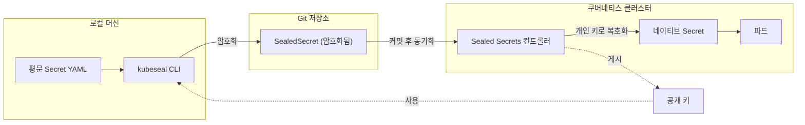
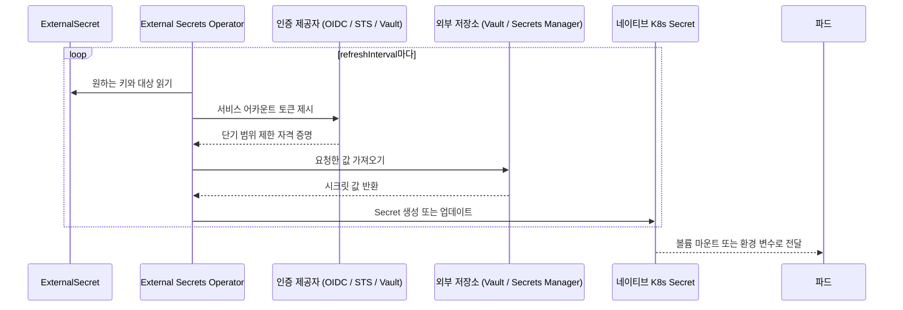

# Kubernetes External Secrets: Sealed Secrets와 External Secrets Operator로 시크릿 안전하게 관리하기

## 학습 목표
- 쿠버네티스 기본 `Secret`이 보안 경계가 되지 못하는 이유(base64는 인코딩이지 암호화가 아님)와, Secret 매니페스트를 Git에 커밋했을 때의 위험을 설명할 수 있다.
- GitOps 친화적인 두 가지 방식—시크릿을 암호화해 Git에 안전하게 보관하는 방식(Sealed Secrets / SOPS)과, HashiCorp Vault·AWS Secrets Manager 같은 외부 저장소에서 값을 가져오는 External Secrets Operator(ESO) 방식—을 비교할 수 있다.
- ESO의 `SecretStore`/`ClusterSecretStore`와 `ExternalSecret` 리소스를 활용해 외부 저장소의 값을 클러스터 네이티브 `Secret`으로 가져오는 흐름을 이해하고, 각 패턴의 대표 사용 사례를 파악할 수 있다.

## 본문

### 기본 Secret이 부족한 이유

쿠버네티스 `Secret`은 겉보기에 민감한 데이터를 보호하는 것 같지만, 실제로는 값을 *인코딩*할 뿐이다. Secret에 저장되는 값은 **base64**로 처리되는데, base64는 암호화가 아니다 — 원래 값으로 즉시 되돌릴 수 있는 텍스트 인코딩이다. 매니페스트를 읽을 수 있는 사람이라면 누구든 단 한 줄로 복호화할 수 있다.

```bash
echo 'cGFzc3dvcmQxMjM=' | base64 -d
# password123
```

실행 중인 클러스터 안에서는 이 방식으로도 충분하다. 쿠버네티스는 Secret을 `etcd`에 저장하고(이상적으로는 저장 시 암호화를 적용), RBAC으로 접근을 통제하기 때문이다. 진짜 문제는 **GitOps**를 도입하는 순간부터 시작된다. GitOps는 클러스터 전체 상태를 Git 저장소의 YAML로 관리하고, 도구가 이를 자동으로 반영하는 방식이다. Git은 매니페스트의 버전 관리와 리뷰에는 탁월하지만, Secret을 암호화해 주지는 않는다. 일반 Secret 매니페스트를 커밋하는 순간, 비밀번호는 저장소 히스토리에 평문(정확히는 base64이지만 사실상 같다)으로 영구히 남게 되고, 저장소에 접근할 수 있는 모든 사람이 볼 수 있으며, 완전히 지우는 것도 불가능하다.

> base64는 인코딩이지 암호화가 아니다. Git에 올린 Secret 매니페스트는 사실상 평문 비밀번호를 Git에 올린 것과 같다. `kind: Secret`을 그대로 커밋해서는 안 된다.

결국 딜레마가 생긴다. 클러스터의 모든 상태를 Git에 두고 싶지만, 원시 시크릿은 거기에 넣을 수 없다. 이 문제를 해결하는 검증된 방법이 두 가지 있으며, 서로 정반대의 접근 방식을 취한다.

### 방식 1 — 시크릿을 암호화해 Git에 보관하기 (Sealed Secrets / SOPS)

첫 번째 발상은 단순하다. 문제가 Git의 시크릿이 평문이라면, **커밋 전에 암호화**하면 된다. 암호화된 데이터는 어디에 저장해도 안전하고, 복호화 키는 클러스터만 가지고 있다.

**Sealed Secrets**(Bitnami)은 클러스터 안에서 실행되는 컨트롤러로 이를 구현한다. 동작 흐름은 다음과 같다.

1. 컨트롤러가 공개 키/개인 키 쌍을 생성하고, 개인 키를 클러스터 안에 보관한다.
2. 개발자 로컬 머신에서 CLI(`kubeseal`)를 실행하면, **공개 키**를 사용해 일반 Secret을 `kind: SealedSecret` 리소스로 암호화한다.
3. 암호화된 `SealedSecret`을 Git에 커밋한다. 컨트롤러의 개인 키 없이는 열 수 없으므로 안전하다.
4. `SealedSecret`이 클러스터에 적용되면 컨트롤러가 복호화해 파드가 사용할 수 있는 일반 `Secret`을 생성한다.

아래 다이어그램은 이 네 단계를 로컬 머신, Git 저장소, 클러스터라는 세 가지 신뢰 경계에 걸쳐 표현하고, 각 단계에서 어떤 키가 사용되는지 보여준다.



```bash
# 일반 Secret을 암호화된 SealedSecret으로 변환 (Git에 안전하게 보관 가능)
kubectl create secret generic db-creds \
  --from-literal=password='p@ssw0rd' \
  --dry-run=client -o yaml \
  | kubeseal --format yaml > sealed-db-creds.yaml
# sealed-db-creds.yaml을 커밋하면 컨트롤러가 클러스터 안에서 복호화한다.
```

밀접하게 연관된 도구 독립적 방식으로 **SOPS + age**도 있다. `age`가 실제 암호화를 담당하고, `sops`가 *어떤 필드*를 암호화할지 결정하므로, 매니페스트 구조는 그대로 유지하면서 민감한 값만 암호화할 수 있다. `.sops.yaml` 규칙 파일로 암호화 대상을 지정한다.

```yaml
# .sops.yaml — 지정한 age 공개 키로 특정 키를 암호화
creation_rules:
  - path_regex: secrets.*\.yaml$
    encrypted_regex: '^(password|token|apiKey)$'
    age: age1ql3z7hjy54pw3hyww5ayyfg7zqgvc7w3j2elw8zmrj2kg5sfn9aqmcac8j
```

암호화된 파일을 커밋하고, 배포 시점에 본인 또는 CD 도구가 **개인 키**로 복호화해 적용한다. 이 패턴에는 반드시 지켜야 할 두 가지 안전 장치가 따른다. 개인 키를 목숨처럼 지키고, `.gitignore`를 설정해 평문 매니페스트나 키 파일이 실수로 커밋되지 않도록 한다.

> Git 암호화 방식에서는 CI/CD가 복호화 키를 보유해야 한다. 키를 잃으면 암호화된 데이터를 영구히 복구할 수 없고, 유출되면 지금까지 커밋된 모든 것이 노출된다.

### 방식 2 — 시크릿을 Git에 저장하지 않기 (External Secrets Operator)

두 번째 방식은 문제를 뒤집는다. 시크릿을 암호화해 Git에 저장하는 대신, **Git에서 완전히 배제**하고 전용 시크릿 관리 시스템을 단일 소스로 삼는다. **HashiCorp Vault**, **AWS Secrets Manager**, GCP Secret Manager, Azure Key Vault 등이 그 역할을 한다. Git에는 민감한 데이터 없이 "Y 저장소에서 X라는 값을 가져와라"는 *포인터* 매니페스트만 남긴다.

**External Secrets Operator(ESO)**가 이 흐름을 구현한다. ESO는 두 가지 커스텀 리소스를 제공한다.

- **`SecretStore`**(네임스페이스 범위) 또는 **`ClusterSecretStore`**(클러스터 전체 범위): 외부 저장소의 *위치*와 *인증 방법*을 정의한다.
- **`ExternalSecret`**: 저장소에서 *어떤 키*를 가져올지, 생성될 쿠버네티스 `Secret`의 이름은 무엇인지를 정의한다.

동작 흐름은 다음과 같다. ESO가 `ExternalSecret`을 읽고, `SecretStore`에 정의된 방식으로 백엔드에 인증한 뒤, 요청한 값을 가져와 쿠버네티스 네이티브 `Secret`으로 지속적으로 동기화한다. 일정 주기로 동기화하기 때문에, Vault에서 값을 교체하면 자동으로 클러스터에 반영된다 — 재커밋이나 시크릿 재배포 없이. 아래 시퀀스 다이어그램은 ESO가 인증에 사용하는 단기 자격 증명 교환을 포함한 한 번의 동기화 사이클을 보여준다.



AWS Secrets Manager용 `ClusterSecretStore` 예시는 다음과 같다.

```yaml
apiVersion: external-secrets.io/v1beta1
kind: ClusterSecretStore
metadata:
  name: aws-secrets-manager
spec:
  provider:
    aws:
      service: SecretsManager
      region: us-east-1
      auth:
        jwt:
          serviceAccountRef:
            name: external-secrets-sa
            namespace: external-secrets
```

그리고 데이터베이스 자격 증명을 `db-credentials`라는 네이티브 Secret으로 가져오는 `ExternalSecret` 예시다.

```yaml
apiVersion: external-secrets.io/v1beta1
kind: ExternalSecret
metadata:
  name: db-credentials
  namespace: app
spec:
  refreshInterval: 1h
  secretStoreRef:
    name: aws-secrets-manager
    kind: ClusterSecretStore
  target:
    name: db-credentials        # ESO가 생성할 K8s Secret 이름
    creationPolicy: Owner
  data:
    - secretKey: username        # 생성될 K8s Secret의 키
      remoteRef:
        key: prod/db-creds       # AWS Secrets Manager의 시크릿 이름
        property: username
    - secretKey: password
      remoteRef:
        key: prod/db-creds
        property: password
```

적용하면 ESO가 `SecretSynced` 상태를 보고하고, `kubectl get secret db-credentials -n app`으로 파드가 일반 Secret처럼 사용할 수 있는 실제 Secret을 확인할 수 있다.

### 인증 방법: ESO는 어떻게 신원을 증명하는가

방식 2에서 어려운 부분은 YAML 작성이 아니라, 장기 자격 증명을 하드코딩하지 않고 오퍼레이터가 외부 저장소에 인증하도록 만드는 것이다(하드코딩하면 처음 문제로 되돌아간다). 해법은 백엔드에 따라 다르다.

- **AWS Secrets Manager(EKS 환경):** **IRSA**(IAM Roles for Service Accounts)를 활용한다. ESO용 쿠버네티스 `ServiceAccount`를 만들고, 클러스터의 OIDC 제공자를 통해 IAM 역할에 연결한다. ESO 파드가 AWS를 호출할 때 서비스 어카운트의 프로젝티드 JWT를 제시하면, AWS STS가 OIDC를 통해 검증하고 IAM 정책(보통 관련 시크릿에 대한 읽기 전용)으로 범위가 제한된 단기 임시 자격 증명을 반환한다. 클러스터에 정적 AWS 키가 존재하지 않는다.
- **HashiCorp Vault:** Vault의 쿠버네티스 인증 메서드를 활성화하고, Vault **역할**을 통해 Vault **정책**(예: 읽기 전용)을 쿠버네티스 **서비스 어카운트**에 바인딩한다. ESO가 서비스 어카운트 토큰으로 인증하면, Vault가 클러스터에 대해 유효성을 검사하고 요청한 시크릿을 반환한다. 해당 서비스 어카운트와 역할에 연결된 워크로드만 읽을 수 있다.

두 경우 모두 원칙은 동일하다. 워크로드 ID(서비스 어카운트)를 단기적이고 범위가 제한된 접근 권한과 교환하므로, ESO가 사용하는 자격 증명 자체도 Git에 존재하지 않는다.

### 어떤 방식을 선택해야 할까?

둘 다 유효한 방식이며, 상황에 따라 맞는 것이 다르다.

- **Sealed Secrets / SOPS**는 추가 인프라 없이 Git 안에서 모든 것을 자급자족한다. 소규모 팀, 에어갭(air-gapped) 클러스터, Git을 진정한 단일 소스로 삼는 순수 GitOps 환경에 적합하다. 단점은 키 교체와 폐기 시 재암호화와 재커밋이 필요하고, 복호화 키를 철저히 보호해야 한다는 점이다.
- **External Secrets Operator**는 감사 로그, 동적/자동 교체 시크릿, 세밀한 접근 정책을 갖춘 전용 시크릿 관리 시스템에 시크릿을 집중시키면서 Git을 민감한 데이터로부터 완전히 해방시킨다. Vault나 클라우드 시크릿 관리 서비스를 이미 운영하는 대규모 조직이나 멀티 클러스터 환경에 빛을 발한다. 단점은 ESO 자체를 운영해야 하고, 외부 저장소의 가용성에 의존한다는 점이다.

실제 현장에서 자주 쓰이는 패턴은, 애플리케이션 자격 증명은 중앙 Vault나 클라우드 저장소를 백엔드로 하는 ESO로 관리하고, ESO가 실행되기 전에 클러스터가 필요로 하는 소수의 부트스트랩 시크릿은 Sealed Secrets로 처리하는 조합이다.

## 핵심 정리
- 쿠버네티스 `Secret`은 base64 인코딩일 뿐 암호화가 아니다 — 원시 Secret을 Git에 커밋하면 평문 비밀번호가 영구히 노출된다.
- GitOps에서 안전하게 시크릿을 다루는 두 가지 패턴이 있다. 클러스터가 복호화 키를 보유하는 **암호화 후 커밋** 방식(Sealed Secrets, SOPS+age)과, Git에는 참조만 두는 **외부 저장 후 동기화** 방식(ESO)이다.
- ESO는 `SecretStore`/`ClusterSecretStore`(연결 위치와 인증 방법)와 `ExternalSecret`(가져올 값과 대상 Secret 이름)을 조합해 외부 값을 네이티브 클러스터 Secret으로 자동 동기화한다.
- 인증의 핵심은 정적 자격 증명을 사용하지 않는 것이다. AWS Secrets Manager에는 **IRSA/OIDC**를, Vault에는 **쿠버네티스 인증**을 사용해 서비스 어카운트 ID를 단기적이고 범위가 제한된 접근 권한으로 교환한다.
- 자급자족적 단순함을 원하면 Sealed Secrets/SOPS를, 여러 클러스터에 걸친 중앙화된 감사 가능한 자동 교체 시크릿이 필요하면 ESO를 선택한다.
