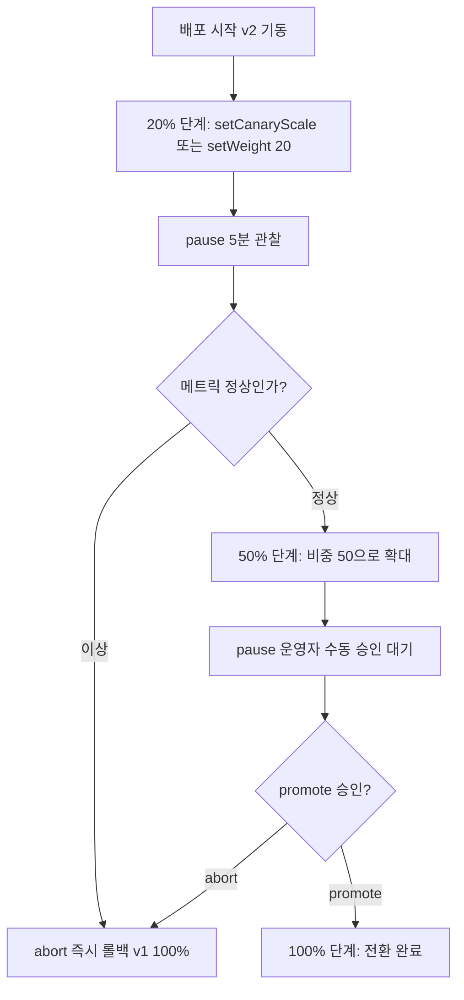

# 프로그레시브 딜리버리 — Canary·Blue-Green과 PodDisruptionBudget

## 학습 목표
- Canary·Blue-Green 등 점진적 배포 전략의 차이와 적용 상황을 이해한다
- Argo Rollouts로 트래픽을 단계적으로 분할하며 새 버전을 점진 배포할 수 있다
- PodDisruptionBudget(PDB)으로 배포·노드 드레인 중 가용성을 보장하는 방법을 설명한다

## 본문

### RollingUpdate만으로는 부족한 이유

기본 Deployment의 `RollingUpdate`는 구버전 Pod를 새 버전으로 하나씩 교체한다. 무중단이긴 하지만 한계가 있다. 일단 교체가 시작되면 **모든 사용자가 점점 새 버전을 받게** 되고, 새 버전에 버그가 있어도 트래픽을 정밀하게 제어하거나 멈출 수단이 약하다. 문제를 발견했을 땐 이미 상당수 사용자가 영향을 받은 뒤다.

**프로그레시브 딜리버리(Progressive Delivery)**는 여기에 두 가지를 더한다. 새 버전에 가는 트래픽 비율을 **세밀하게 통제**하고, 메트릭(에러율·지연)을 보며 **자동으로 진행 또는 롤백**한다. 대표 전략이 Canary와 Blue-Green이다.

- **Blue-Green** — 구버전(Blue)과 신버전(Green)을 **동시에 통째로** 띄워 두고, 검증이 끝나면 트래픽을 한 번에 Green으로 전환한다. 롤백은 다시 Blue로 스위치만 돌리면 되어 즉각적이다. 대신 잠깐 두 배의 리소스가 필요하고, 전환 순간 전체 트래픽이 한꺼번에 새 버전을 맞는다.
- **Canary** — 신버전을 소량(예: 5%)만 띄워 일부 트래픽을 흘려보내고, 문제가 없으면 10% → 25% → 50% → 100%로 점진 확대한다. 실제 사용자 일부로 안전하게 검증하므로 위험이 가장 잘 통제되지만, 단계 관리와 트래픽 분할 메커니즘이 필요하다.

> 선택 기준: **즉각적 전체 전환과 빠른 롤백**이 중요하면 Blue-Green, **위험을 잘게 쪼개 실사용자로 검증**하고 싶으면 Canary다. 스키마 마이그레이션처럼 두 버전이 공존하기 어려운 경우엔 Blue-Green이, 무상태 웹 서비스의 점진 출시엔 Canary가 잘 맞는다.

### Argo Rollouts로 Canary 구현하기

기본 Deployment는 이런 세밀한 제어를 못 한다. **Argo Rollouts**는 Deployment를 대체하는 `Rollout`이라는 CRD와 컨트롤러를 제공해, Canary/Blue-Green을 선언형으로 다룬다. Deployment를 거의 그대로 두고 `kind: Deployment`를 `kind: Rollout`으로 바꾼 뒤 `strategy`만 추가하면 된다.

그런데 Canary를 구성하기 전에 반드시 알아야 할 중요한 사실이 있다. Argo Rollouts의 Canary에는 **두 가지 모드**가 있고, 쓸 수 있는 `steps` 키워드가 다르다.

- **복제본(replica) 기반 Canary — 기본(out-of-the-box).** Istio·NGINX 같은 외부 트래픽 제공자 없이, **새 버전 Pod의 개수 비율**로 트래픽을 근사한다. 이때는 `setWeight`가 아니라 **`setCanaryScale`**로 "새 버전을 몇 %(또는 몇 개) 띄울지"를 단계적으로 늘린다. 트래픽은 Service의 기본 로드밸런싱으로 그 Pod들에 분산되므로 비율은 **근사값**이다.
- **트래픽 가중치 기반 Canary — 트래픽 제공자 필요.** `setWeight: 20`처럼 **정확한 요청 비율**을 지정하려면, Rollout이 Istio·NGINX Ingress·SMI·ALB 같은 트래픽 제공자와 연동돼 있어야 한다. `setWeight`는 그 제공자에게 "요청의 20%를 새 버전으로 보내라"고 지시하는 것이라, **연동 없이 단독으로는 동작하지 않는다.**

> 흔한 함정: `setWeight`만 적어 두고 트래픽 제공자를 연동하지 않으면, 가중치가 의도대로 적용되지 않는다. **외부 메시/인그레스가 없는 환경에서는 `setCanaryScale`로 시작**하고, 정밀한 비율 제어가 필요해지면 트래픽 제공자를 붙인 뒤 `setWeight`로 넘어가는 것이 올바른 순서다.

먼저 **기본 환경(트래픽 제공자 없음)**에서 동작하는 복제본 기반 Canary 예시다.

```yaml
apiVersion: argoproj.io/v1alpha1
kind: Rollout
metadata:
  name: web
spec:
  replicas: 5
  selector:
    matchLabels: { app: web }
  template:                       # Deployment의 Pod 템플릿과 동일
    metadata:
      labels: { app: web }
    spec:
      containers:
        - name: web
          image: our-org/web:v2
  strategy:
    canary:
      steps:
        - setCanaryScale:         # 새 버전 Pod 비중을 단계적으로 키운다
            weight: 20            # 전체의 약 20%만 v2 Pod로
        - pause: { duration: 5m } # 5분 관찰
        - setCanaryScale:
            weight: 50
        - pause: {}               # 무기한 정지 → 사람이 수동 승인(promote)
        - setCanaryScale:
            weight: 100
```

`pause: {}`(duration 없음)는 **사람의 수동 승인**을 기다리는 게이트다. 운영자가 메트릭을 확인한 뒤 진행시킨다.

정밀한 트래픽 분할이 필요해 Istio 등을 연동했다면, 같은 자리에 `setWeight`를 쓴다(다음 강의의 Istio와 함께 쓰는 형태).

```yaml
  strategy:
    canary:
      trafficRouting:             # 트래픽 제공자 연동이 전제다
        istio:
          virtualService: { name: web-vsvc }
      steps:
        - setWeight: 20           # 메시가 '정확히' 요청의 20%를 v2로 보냄
        - pause: { duration: 5m }
        - setWeight: 50
        - pause: {}
        - setWeight: 100
```

아래 흐름도는 위 `steps` 정의가 실제로 어떻게 새 버전 비중을 단계적으로 늘리고, 각 단계에서 멈추거나 롤백하는지를 보여 준다. 기본 환경에서는 `setCanaryScale`로 Pod 비율을, 트래픽 제공자를 연동했다면 `setWeight`로 정확한 요청 비율을 키운다는 점만 다를 뿐 단계 흐름은 동일하다.



```bash
# 상태 실시간 관찰 (kubectl 플러그인)
kubectl argo rollouts get rollout web --watch
# 수동 정지 단계를 통과시키기
kubectl argo rollouts promote web
# 문제가 보이면 즉시 롤백
kubectl argo rollouts abort web
```

여기서 더 나아가 `analysis`를 붙이면, 각 단계에서 Prometheus 등의 메트릭을 자동 평가해 에러율이 임계치를 넘으면 **사람 개입 없이 자동 롤백**한다. 이것이 프로그레시브 딜리버리의 완성형이다.

### 트래픽 분할 — 누가 비율을 보장하나

"20%만 새 버전으로 보낸다"를 실제로 구현하는 방식을 다시 정리하면 두 가지다.

- **Replica 비율 기반(기본, `setCanaryScale`)** — Pod 개수 비율로 근사한다. 5개 중 1개가 새 버전이면 대략 20%. 별도 인프라가 없어 간단하지만 정밀하지 않다(요청이 균등 분산된다는 가정에 의존).
- **트래픽 제공자 연동(`setWeight` + `trafficRouting`)** — Istio·NGINX Ingress·SMI 등과 연동해 **정확한 비율**로 라우팅한다. `setWeight: 20`이 진짜 요청의 20%가 되도록 메시/인그레스가 보장한다.

정밀한 Canary가 필요하면 다음 강의의 Istio 같은 서비스 메시와 함께 쓰는 것이 자연스럽다. Rollouts가 단계를 지휘하고, 메시가 정확한 트래픽 분할을 실행하는 구조다.

### PodDisruptionBudget — 자발적 중단으로부터의 안전망

배포·롤아웃과 별개로, 운영 중에는 **자발적 중단(voluntary disruption)**이 수시로 일어난다. 노드 업그레이드를 위한 `kubectl drain`, 클러스터 오토스케일러의 노드 축소, VPA의 Pod 축출 등이 그것이다. 이때 한 서비스의 Pod가 동시에 너무 많이 내려가면 순간적으로 가용성이 무너질 수 있다.

**PodDisruptionBudget(PDB)**은 "이 워크로드는 자발적 중단 중에도 최소 N개(또는 최대 M개 중단)는 보장하라"고 선언하는 안전장치다.

```yaml
apiVersion: policy/v1
kind: PodDisruptionBudget
metadata:
  name: web-pdb
spec:
  minAvailable: 3              # 항상 최소 3개는 살아 있어야 함
  # 또는 maxUnavailable: 1     # 동시에 1개까지만 내려갈 수 있음
  selector:
    matchLabels:
      app: web
```

이 PDB가 있으면, 노드를 drain할 때 쿠버네티스는 `web` Pod를 한꺼번에 비우지 않고 **최소 3개가 유지되도록** 축출을 직렬화한다. 조건을 어기게 되는 축출 요청은 일시적으로 거부된다.

> 주의: PDB는 **자발적** 중단만 막는다. 노드 하드웨어 장애 같은 **비자발적** 중단은 막지 못한다(그건 replica 수와 노드 분산으로 대비한다). 또한 PDB를 너무 빡빡하게(`minAvailable`을 replica 수와 같게) 잡으면 노드 드레인이 영영 진행되지 않아 클러스터 유지보수가 막힐 수 있으니, 항상 여유분을 남겨야 한다. 프로그레시브 딜리버리로 "배포 중 가용성"을 지키고, PDB로 "운영 중 가용성"을 지킨다 — 둘은 짝을 이룬다.

## 핵심 요약
- 프로그레시브 딜리버리는 트래픽 비율을 세밀히 통제하고 메트릭 기반으로 진행/롤백하는 배포 방식이다. RollingUpdate의 한계를 보완한다.
- Blue-Green은 통째로 띄워 한 번에 전환(즉각 롤백, 리소스 2배), Canary는 소량부터 점진 확대(위험 통제, 단계 관리 필요)한다.
- Argo Rollouts의 Canary는 두 모드다. **트래픽 제공자가 없으면 `setCanaryScale`(복제본 비율 근사)**, Istio·NGINX 등을 연동했으면 **`setWeight`(정확한 비율)**를 쓴다. `setWeight`는 트래픽 제공자 연동 없이는 동작하지 않는다.
- `promote`/`abort`로 단계를 제어하고, `analysis`로 메트릭 기반 자동 롤백까지 구현한다.
- PodDisruptionBudget은 노드 드레인·오토스케일 축소 등 자발적 중단 중 최소 가용 Pod 수를 보장한다. 비자발적 장애는 막지 못하며, 너무 빡빡하면 유지보수가 막힌다.
