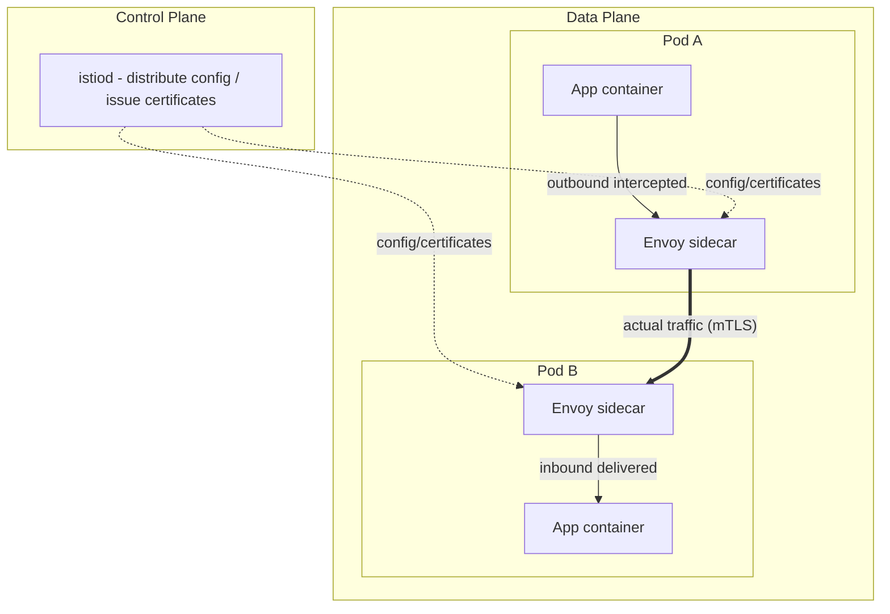

# Introduction to Service Mesh — Traffic Management, mTLS, and Observability with Istio

## Learning Objectives
- Understand the sidecar proxy-based service mesh architecture and the distinction between the data plane and control plane
- Control traffic routing with Istio VirtualService and DestinationRule, and apply automatic mTLS encryption
- Leverage the observability capabilities provided by a service mesh — distributed tracing and metrics

## Content

### Why a Service Mesh?

As a microservices architecture grows to tens of services, the same concerns arise everywhere: how do we encrypt inter-service communication? Where do retries, timeouts, and circuit breakers live? How do we implement Canary traffic splitting? How do we see which service calls which, and at what rate? Implementing this logic **in each application, in each programming language**, leads to an explosion of duplication and inconsistency.

A service mesh **extracts these cross-cutting concerns out of the application and into the infrastructure layer**. The key mechanism is the **sidecar proxy**. A lightweight proxy (Envoy, in Istio's case) is deployed alongside each Pod, and all traffic that Pod sends and receives flows through this proxy. The proxy handles encryption, routing, retries, and metric collection — and the application continues making plain HTTP calls as always. You get mTLS and traffic control without changing a single line of application code.

### Data Plane and Control Plane

The Istio architecture is divided into two layers.

- **Data Plane** — The collection of Envoy sidecar proxies injected into each Pod. This is where **actual traffic flows**. Every inter-service request is intercepted here and policies are enforced.
- **Control Plane** — A single component called `istiod`. It **distributes configuration and issues certificates** to all proxies in the data plane. Traffic itself does not pass through the control plane; it only delivers instructions: "here is how you should behave."

The diagram below shows the control plane (istiod) pushing configuration and certificates down to the sidecars, while actual traffic flows directly between the Envoy proxies in each Pod. Note that all inbound and outbound traffic from an application container passes through the Envoy sidecar in the same Pod.



Sidecars are injected automatically at Pod creation time. Add a single label to a namespace and all new Pods created there will have Envoy injected automatically.

```bash
kubectl label namespace default istio-injection=enabled
# From this point on, Pods in this namespace will have 2 containers (app + istio-proxy)
kubectl get pod my-app -o jsonpath='{.spec.containers[*].name}'
```

> The sidecar model offers language-agnostic, zero-code adoption, but it introduces a resource overhead and a slight latency increase per Pod — a trade-off worth knowing. Istio also offers **Ambient mode**, which operates at the node level without sidecars, to reduce this overhead. That said, the sidecar model is the most intuitive way to understand the underlying concepts, so this lecture uses it as the reference architecture.

### Traffic Routing — VirtualService and DestinationRule

Istio's two core traffic management resources have clearly distinct roles:

- **DestinationRule** — Defines how to treat a destination service. In particular, it uses `subsets` to group Pods by version label (v1, v2) and applies load balancing, connection pool, and circuit breaker policies.
- **VirtualService** — Defines the routing rules for incoming requests — **which subset to send them to**. Weighted traffic splitting, header/path-based routing, retries, and timeouts are all configured here.

Combining the two resources naturally implements a Canary deployment. Here is an example that sends 90% of traffic to v1 and 10% to v2:

```yaml
apiVersion: networking.istio.io/v1
kind: DestinationRule
metadata:
  name: reviews
spec:
  host: reviews          # references the Kubernetes Service named 'reviews'
  subsets:
    - name: v1
      labels: { version: v1 }
    - name: v2
      labels: { version: v2 }
---
apiVersion: networking.istio.io/v1
kind: VirtualService
metadata:
  name: reviews
spec:
  hosts: ["reviews"]     # routing target — also the Service name (or FQDN)
  http:
    - route:
        - destination: { host: reviews, subset: v1 }
          weight: 90
        - destination: { host: reviews, subset: v2 }
          weight: 10
```

One thing worth noting: the `host` and `hosts` values in VirtualService and DestinationRule typically reference a **Kubernetes Service name** (short name within the same namespace, or `reviews.<ns>.svc.cluster.local` FQDN for cross-namespace). Istio layers routing rules on top of existing Services, so the Services you already have can be used as-is.

Adjusting `weight` changes the traffic ratio precisely. (The Argo Rollouts from the previous lecture orchestrates a Canary by incrementally adjusting exactly this weight.) Header-based routing is also possible — routing only internal testers with an `x-beta: true` header to v2, for example, requires nothing more than a single declarative rule.

### mTLS — Automatic Encryption Without Code Changes

Encrypting all inter-service communication with mutual TLS (mTLS) normally involves the significant burden of certificate issuance, distribution, and rotation. Istio offloads all of this to the control plane. `istiod` automatically issues and rotates certificates for each sidecar, and the proxies communicate via mTLS, so even though the application sends plain text, the traffic is encrypted on the wire.

Enforcing mTLS across an entire namespace requires just a single `PeerAuthentication` resource:

```yaml
apiVersion: security.istio.io/v1
kind: PeerAuthentication
metadata:
  name: default
  namespace: default
spec:
  mtls:
    mode: STRICT          # reject plaintext; only mTLS is allowed
```

With `STRICT`, unencrypted requests from outside the mesh are rejected. When introducing mTLS incrementally, start with `PERMISSIVE` (which allows both plaintext and mTLS), then tighten to `STRICT` once all workloads have sidecars.

#### Identity-Based Access Control — AuthorizationPolicy

The real value of mTLS goes beyond encryption: it provides **service identity verification**. Each workload carries a SPIFFE identity — based on its ServiceAccount — embedded in its certificate, so the network can guarantee "this caller is really who it claims to be." That identity is the foundation on which **`AuthorizationPolicy`** enforces fine-grained rules for "who can call whom."

For example, the rule "only the order service may call the payment service" looks like this:

```yaml
apiVersion: security.istio.io/v1
kind: AuthorizationPolicy
metadata:
  name: payment-allow-order
  namespace: default
spec:
  selector:
    matchLabels:
      app: payment           # this policy applies to the payment workload
  action: ALLOW
  rules:
    - from:
        - source:
            # only the ServiceAccount identity of the order service is allowed
            principals: ["cluster.local/ns/default/sa/order"]
      to:
        - operation:
            methods: ["POST"]
            paths: ["/charge"]
```

`selector` targets the workload being protected (`payment`), and `from.source.principals` specifies the identities allowed to call it (here, the ServiceAccount of `order`). Once this policy is applied, the sidecar blocks any service other than `order` from reaching `payment`.

Here is an important detail about how Istio authorization actually works. **By default, with no policies in place, Istio allows all requests (allow-all).** However, the moment **any `ALLOW` policy is attached to a workload**, that workload switches to **deny-by-default — only explicitly permitted requests are allowed through, and everything else is blocked**. In other words, to protect `payment`, you do not need a separate `DENY` policy — attaching an `ALLOW` policy that permits only `order` automatically blocks all other callers. (Note: workloads with no policies at all remain allow-all. `DENY` policies are used as a supplement when you need to block a specific source explicitly.) mTLS *proves* identity, and AuthorizationPolicy *authorizes* based on that identity — together they deliver near-zero-trust service-to-service security without touching application code.

### Observability — Visibility That Comes for Free

The fact that all traffic passes through the sidecar is a decisive advantage for observability. Because Envoy sees every request, **without any application code changes** it automatically captures request rate, error rate, and latency (the so-called golden signals) as metrics. Istio visualizes these with the following tools:

- **Kiali** — Displays inter-service call relationships as a real-time topology graph. Where errors are occurring and which services are calling which becomes visible at a glance.
- **Prometheus / Grafana** — Collects and dashboards the metrics exposed by sidecars (the same monitoring stack covered in the intermediate course).
- **Distributed Tracing (Jaeger/Tempo)** — Traces the full path of a single request as it traverses multiple services.

> **Distributed tracing is the important exception to "zero code changes."** Metrics, topology, and mTLS are all delivered by the sidecar alone with no application changes — but **distributed tracing is different.** When a request flows A→B→C, for the full trace to be connected, B must take the tracing headers it received from A (e.g., B3 headers, `x-request-id`, W3C `traceparent`) and **propagate them forward** when calling C. The sidecar can append tracing information if the headers are present, but it cannot copy those headers from an incoming request to an outgoing one on the application's behalf. Therefore **the application must include minimal header propagation code** (or use a library like OpenTelemetry). Missing this causes traces to be fragmented per service, rendering distributed tracing useless. It is something to get right from the moment you introduce a mesh.

```bash
# Open the Kiali dashboard after installing Istio add-ons
istioctl dashboard kiali
```

This integration of traffic management, security (mTLS + AuthorizationPolicy), and observability in a single declarative platform is the genuine value of a service mesh. That said, adoption introduces operational complexity, so it is best adopted when the number of services and the security and observability requirements justify the overhead.

## Key Takeaways
- A service mesh extracts cross-cutting concerns — encryption, routing, retries, observability — out of applications and into sidecar proxies (Envoy). Most capabilities are added without any code changes.
- The architecture is divided into a data plane (Envoy proxies that handle traffic) and a control plane (istiod, which distributes configuration and certificates). Sidecars are auto-injected via a namespace label.
- DestinationRule defines version subsets and traffic policies; VirtualService defines routing by weight, headers, and more. Both resources reference Kubernetes Service names, and adjusting `weight` enables precise Canary deployments.
- istiod automatically issues and rotates certificates, providing mTLS without code changes. `PeerAuthentication` controls the STRICT/PERMISSIVE enforcement level. AuthorizationPolicy leverages the mTLS identity to enforce "who can call whom." Attaching any `ALLOW` policy to a workload flips it to deny-by-default — calls not matching the allow rules are automatically blocked without needing a separate `DENY` policy (workloads with no policy remain allow-all).
- Metrics and service topology (Kiali) are obtained almost automatically. **Distributed tracing is the exception** — the application must propagate tracing headers between service calls, or traces will be fragmented and unusable.
