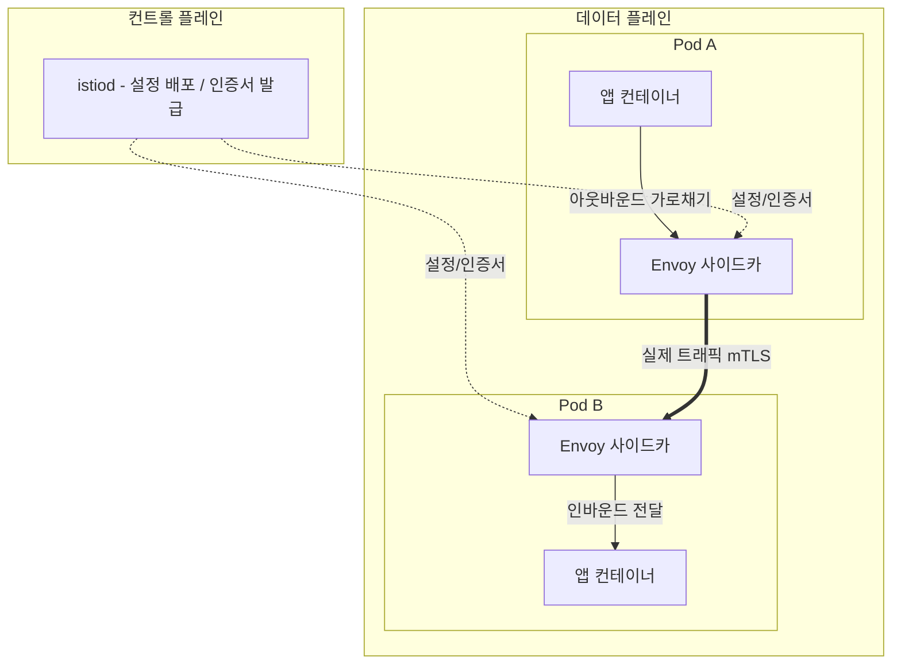

# 서비스 메시 입문 — Istio로 트래픽 관리·mTLS·관측성

## 학습 목표
- 사이드카 프록시 기반 서비스 메시 아키텍처와 데이터/컨트롤 플레인을 이해한다
- Istio VirtualService·DestinationRule로 트래픽 라우팅을 제어하고 mTLS 자동 암호화를 적용할 수 있다
- 분산 추적·메트릭 등 서비스 메시가 제공하는 관측성(observability)을 활용할 수 있다

## 본문

### 왜 서비스 메시인가

마이크로서비스가 수십 개로 늘어나면 공통 고민이 반복된다. 서비스 간 통신을 어떻게 암호화하지? 재시도·타임아웃·서킷 브레이커는? Canary 트래픽 분할은? 어느 서비스가 어느 서비스를 얼마나 호출하는지 어떻게 보지? 이 로직을 **애플리케이션 코드마다 각 언어로 구현**하면 중복·불일치가 폭발한다.

서비스 메시는 이 횡단 관심사를 **애플리케이션 밖, 인프라 계층으로 들어낸다**. 핵심 메커니즘이 **사이드카 프록시**다. 각 Pod 옆에 경량 프록시(Istio의 경우 Envoy)를 함께 띄우고, 그 Pod가 주고받는 모든 트래픽이 이 프록시를 거치게 한다. 그러면 암호화·라우팅·재시도·메트릭 수집을 전부 프록시가 처리하고, 애플리케이션은 평소처럼 평문 HTTP를 호출하기만 하면 된다. 코드 한 줄 안 바꾸고도 mTLS와 트래픽 제어가 생기는 것이다.

### 데이터 플레인과 컨트롤 플레인

Istio 아키텍처는 두 층으로 나뉜다.

- **데이터 플레인(Data Plane)** — 각 Pod에 주입된 Envoy 사이드카들의 집합. **실제 트래픽이 흐르는** 곳이다. 모든 서비스 간 요청을 가로채 정책을 집행한다.
- **컨트롤 플레인(Control Plane)** — `istiod`라는 단일 컴포넌트. 데이터 플레인의 모든 프록시에 **설정을 배포하고 인증서를 발급**한다. 트래픽 자체는 여기를 지나지 않고, 오직 "어떻게 동작하라"는 지시만 내린다.

아래 구성도는 컨트롤 플레인(istiod)이 설정·인증서를 내려보내고, 실제 트래픽은 각 Pod의 Envoy 사이드카끼리 흐르는 구조를 보여 준다. 앱 컨테이너의 모든 인바운드·아웃바운드 트래픽이 같은 Pod의 Envoy를 통과(가로채기)한다는 점에 주목하자.



사이드카는 Pod 생성 시점에 자동 주입된다. 네임스페이스에 라벨 하나만 붙이면 그 안의 새 Pod들에 Envoy가 자동으로 추가된다.

```bash
kubectl label namespace default istio-injection=enabled
# 이후 이 네임스페이스에 뜨는 Pod는 컨테이너가 2개(앱 + istio-proxy)가 된다
kubectl get pod my-app -o jsonpath='{.spec.containers[*].name}'
```

> 사이드카 모델의 장점은 언어 중립성과 무코드 도입이지만, Pod마다 프록시가 붙어 리소스 오버헤드와 약간의 지연이 생긴다는 트레이드오프가 있다. 그래서 Istio는 사이드카 없이 노드 단위로 동작하는 **Ambient 모드**도 도입했다. 다만 개념을 이해하는 데는 사이드카 모델이 가장 직관적이므로 여기서는 이를 기준으로 설명한다.

### 트래픽 라우팅 — VirtualService와 DestinationRule

Istio 트래픽 관리의 두 핵심 리소스는 역할이 또렷이 나뉜다.

- **DestinationRule** — 목적지 서비스를 어떻게 다룰지 정의한다. 특히 `subsets`으로 버전별 그룹(v1, v2)을 라벨로 묶고, 로드밸런싱·커넥션 풀·서킷 브레이커 정책을 건다.
- **VirtualService** — 들어온 요청을 **어느 subset으로 보낼지** 라우팅 규칙을 정의한다. 가중치 분할, 헤더/경로 기반 라우팅, 재시도·타임아웃 등이 여기 들어간다.

두 리소스를 합치면 Canary가 자연스럽게 구현된다. v1에 90%, v2에 10%를 보내는 예시는 다음과 같다.

```yaml
apiVersion: networking.istio.io/v1
kind: DestinationRule
metadata:
  name: reviews
spec:
  host: reviews          # 쿠버네티스 Service 이름 'reviews'를 가리킨다
  subsets:
    - name: v1
      labels: { version: v1 }
    - name: v2
      labels: { version: v2 }
---
apiVersion: networking.istio.io/v1
kind: VirtualService
metadata:
  name: reviews
spec:
  hosts: ["reviews"]     # 라우팅 대상 — 역시 Service 이름(또는 FQDN)
  http:
    - route:
        - destination: { host: reviews, subset: v1 }
          weight: 90
        - destination: { host: reviews, subset: v2 }
          weight: 10
```

여기서 한 가지 짚어 둘 점은, VirtualService/DestinationRule의 `host`와 `hosts` 값이 보통 **쿠버네티스 Service 이름**(같은 네임스페이스면 짧은 이름, 아니면 `reviews.<ns>.svc.cluster.local` FQDN)을 가리킨다는 것이다. 즉 Istio는 기존 Service 위에 라우팅 규칙을 얹는 구조라, 여러분이 이미 만든 Service를 그대로 활용한다.

`weight`만 조정하면 트래픽 비율이 정확히 바뀐다(앞 강의의 Argo Rollouts가 바로 이 weight를 단계적으로 조정하며 Canary를 지휘한다). 헤더 기반 라우팅도 가능해, 예를 들어 `x-beta: true` 헤더를 가진 내부 테스터만 v2로 보내는 정밀한 출시도 선언 한 번으로 구현된다.

### mTLS — 코드 변경 없는 자동 암호화

서비스 간 통신을 모두 상호 TLS(mTLS)로 암호화하는 일은 보통 인증서 발급·배포·갱신이라는 큰 부담을 동반한다. Istio는 이를 컨트롤 플레인이 전담한다. `istiod`가 각 사이드카에 인증서를 자동 발급·로테이션하고, 프록시끼리 mTLS로 통신하므로 애플리케이션은 평문을 보내도 네트워크 상에서는 암호화된다.

네임스페이스 전체에 mTLS를 강제(STRICT)하려면 `PeerAuthentication` 한 장이면 된다.

```yaml
apiVersion: security.istio.io/v1
kind: PeerAuthentication
metadata:
  name: default
  namespace: default
spec:
  mtls:
    mode: STRICT          # 평문 트래픽 거부, mTLS만 허용
```

`STRICT`로 두면 메시 외부에서 들어오는 비암호화 요청은 거부된다. 점진 도입 시에는 평문과 mTLS를 모두 허용하는 `PERMISSIVE`로 시작해, 모든 워크로드가 사이드카를 갖춘 뒤 `STRICT`로 조이는 것이 안전하다.

#### 신원 기반 접근 제어 — AuthorizationPolicy

mTLS의 진짜 가치는 단순한 암호화를 넘어 **서비스 신원(identity) 인증**에 있다. 각 워크로드는 ServiceAccount에 기반한 SPIFFE 신원을 인증서에 담아 증명하므로, "이 호출자가 정말 그 서비스인가"를 네트워크가 보장한다. 이 신원을 근거로 **`AuthorizationPolicy`**가 "누가 누구를 호출할 수 있는가"를 세밀하게 통제한다.

예를 들어 "주문 서비스(`order`)만 결제 서비스(`payment`)를 호출할 수 있다"는 규칙은 다음과 같다.

```yaml
apiVersion: security.istio.io/v1
kind: AuthorizationPolicy
metadata:
  name: payment-allow-order
  namespace: default
spec:
  selector:
    matchLabels:
      app: payment           # 이 정책은 payment 워크로드에 적용
  action: ALLOW
  rules:
    - from:
        - source:
            # order 서비스의 ServiceAccount 신원만 허용
            principals: ["cluster.local/ns/default/sa/order"]
      to:
        - operation:
            methods: ["POST"]
            paths: ["/charge"]
```

`selector`로 보호 대상(`payment`)을 고르고, `from.source.principals`로 호출이 허용되는 신원(여기서는 `order`의 ServiceAccount)을 지정한다. 이 정책이 적용되면 `order` 외의 어떤 서비스가 `payment`를 호출해도 사이드카가 차단한다.

여기서 Istio 인가의 동작 원리를 정확히 짚어야 한다. **정책이 하나도 없는 기본 상태에서 Istio는 모든 요청을 허용한다(allow-all).** 그런데 위처럼 어떤 워크로드(`payment`)에 `ALLOW` 정책이 **하나라도 붙는 순간, 그 워크로드는 "명시적으로 허용된 요청만 통과시키고 나머지는 전부 거부"하는 deny-by-default로 전환**된다. 즉 `payment`를 보호하려고 별도의 `DENY` 정책을 쓸 필요가 없다 — `order`만 허용하는 `ALLOW` 정책을 붙이는 것만으로 그 외의 호출은 자동으로 막힌다. (반대로 아무 정책도 붙지 않은 다른 워크로드는 여전히 allow-all로 열려 있다는 점에 주의하자. `DENY`는 특정 출처를 콕 집어 차단할 때 보조적으로 쓴다.) mTLS가 신원을 *증명*하고, AuthorizationPolicy가 그 신원으로 *인가*하는 것 — 이 둘이 합쳐져 "제로 트러스트"에 가까운 서비스 간 보안이 코드 변경 없이 완성된다.

### 관측성 — 공짜로 따라오는 가시성

모든 트래픽이 사이드카를 통과한다는 사실은 관측성에 결정적 이점을 준다. Envoy가 모든 요청을 보므로, **애플리케이션 코드 수정 없이** 요청 수·에러율·지연(이른바 골든 시그널)을 자동으로 메트릭화한다. Istio는 이를 다음과 함께 시각화한다.

- **Kiali** — 서비스 간 호출 관계를 실시간 토폴로지 그래프로 보여 준다. 어느 서비스가 어디를 호출하고, 어디서 에러가 나는지 한눈에 파악된다.
- **Prometheus / Grafana** — 사이드카가 노출하는 메트릭을 수집·대시보드화한다(중급 과정에서 다룬 모니터링 스택을 그대로 활용).
- **분산 추적(Jaeger/Tempo)** — 하나의 요청이 여러 서비스를 거치는 전체 경로를 추적한다.

> **분산 추적은 "무코드"의 중요한 예외다.** 메트릭·토폴로지·mTLS는 코드 변경 없이 사이드카만으로 얻어지지만, **분산 추적만은 다르다.** 하나의 요청이 A→B→C로 흐를 때, B가 A에게 받은 추적 헤더(예: B3 헤더, `x-request-id`, W3C `traceparent`)를 C로 호출할 때 **그대로 이어 붙여 전파(propagate)** 해 줘야 한 요청의 전체 트레이스가 연결된다. 사이드카는 헤더가 있으면 추적 정보를 보태 주지만, 서비스가 들어온 헤더를 자기 하위 호출로 복사하는 일은 대신 해 줄 수 없다. 따라서 **애플리케이션에 최소한의 헤더 전파 코드(또는 OpenTelemetry 같은 라이브러리)가 필요하다.** 이 점을 놓치면 트레이스가 서비스마다 토막 나 분산 추적이 무용지물이 되므로, 메시 도입 시 반드시 챙겨야 한다.

```bash
# Istio 애드온 설치 후 Kiali 대시보드 열기
istioctl dashboard kiali
```

이렇게 트래픽 관리·보안(mTLS·AuthorizationPolicy)·관측성이 한 플랫폼에서 선언형으로 통합된다는 점이 서비스 메시의 진짜 가치다. 다만 도입엔 운영 복잡도가 따르므로, 서비스 수와 보안·관측 요구가 메시의 오버헤드를 정당화할 때 채택하는 것이 바람직하다.

## 핵심 요약
- 서비스 메시는 암호화·라우팅·재시도·관측 같은 횡단 관심사를 애플리케이션 밖 사이드카 프록시(Envoy)로 들어낸다. 대부분 코드 변경 없이 기능이 추가된다.
- 데이터 플레인(트래픽을 처리하는 Envoy들) / 컨트롤 플레인(istiod, 설정·인증서 배포)으로 나뉜다. 사이드카는 네임스페이스 라벨로 자동 주입된다.
- DestinationRule이 버전 subset과 정책을, VirtualService가 weight·헤더 등으로 라우팅을 정의한다. 두 리소스의 `host`는 쿠버네티스 Service 이름을 가리키며, weight 조정으로 정밀 Canary가 구현된다.
- istiod가 인증서를 자동 발급·로테이션해 mTLS를 코드 변경 없이 제공하고, 그 신원을 근거로 AuthorizationPolicy가 "누가 누구를 호출 가능한가"를 인가한다. 워크로드에 `ALLOW` 정책이 하나라도 붙으면 그 워크로드는 deny-by-default로 바뀌어, 허용 규칙에 맞지 않는 호출은 별도 `DENY` 없이도 자동 차단된다(정책이 없는 워크로드는 allow-all 유지).
- 메트릭·토폴로지(Kiali)는 거의 자동으로 얻어지지만, **분산 추적만은 앱이 추적 헤더를 전파해야 하는 무코드의 예외**다. 이를 챙기지 않으면 트레이스가 끊긴다.
