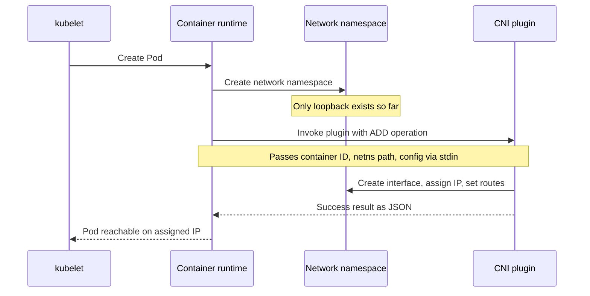
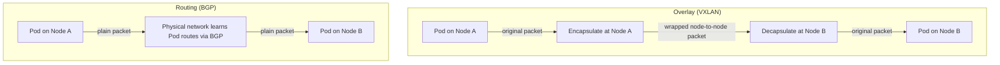

# Kubernetes Networking and CNI: How a Pod Gets Its Network

## Learning Objectives
- Explain the four requirements of the Kubernetes flat networking model, in which every Pod gets a unique IP and communicates without NAT.
- Describe the role of CNI (Container Network Interface) and the flow by which the kubelet calls a CNI plugin to wire up networking when a Pod is created.
- Distinguish the overlay approach (VXLAN encapsulation) from the routing approach (BGP), and compare Flannel, Calico, and Cilium so you can choose the right one.

## Body

### Why this matters

If you have worked with Kubernetes for even a short while, you have noticed something almost magical: you launch two Pods, each one gets its own IP address, and they can talk to each other immediately, no firewall rules, no port mappings, no fuss. Delete a Pod and its replacement comes back with a brand-new IP, yet a Service still finds it. This "it just works" experience is not an accident. It rests on a deliberate networking model and on a small but crucial piece of plumbing called CNI.

Kubernetes itself does not actually implement Pod networking. It defines the *rules*, then hands the real work to a pluggable component. Understanding that boundary, what Kubernetes guarantees versus what the plugin delivers, is the single most useful mental model for debugging cluster networking. Let's build it from the ground up.

### The flat networking model and its four requirements

Kubernetes deliberately rejects the messy world of port-mapping and NAT (Network Address Translation, where IPs get rewritten as traffic crosses boundaries) that traditional container setups suffer from. Instead it mandates a **flat network**: every Pod lives on one big, shared IP space and can reach every other Pod directly by its real IP address.

To call a network "Kubernetes-compliant," a networking implementation must satisfy four requirements:

1. **Every Pod gets its own unique, cluster-wide IP address.** No two Pods share an IP, and that IP is unique across the *entire* cluster, not just one node.
2. **Pods can communicate with all other Pods without NAT.** The IP a Pod *sees* as its own is the same IP other Pods use to reach it. Traffic is not translated along the way.
3. **Nodes can communicate with all Pods without NAT**, and vice versa. The agents running on each node (the kubelet, monitoring, health checks) can reach Pods directly.
4. **The IP a Pod sees itself as is the same IP others see it as.** There is no hidden remapping; a Pod's self-view and the cluster's view of it agree.

> The point of these rules is conceptual simplicity: a Pod behaves like a virtual machine on a flat LAN. Any application that works on a normal network works on Kubernetes without being rewritten to discover its own translated address.

In practice this is why you can `curl` one Pod's IP directly from another Pod and immediately get a response, and why deleting a Deployment's Pods only changes their IPs, never their reachability. The downside is that Kubernetes by default allows *all* Pod-to-Pod traffic, which is convenient but insecure; restricting it is the job of **NetworkPolicy** objects, which a capable CNI plugin enforces.

### What CNI actually is

**CNI (Container Network Interface)** is the standard that makes the flat model achievable across many different networking technologies. A common misconception is that CNI is "a Kubernetes thing." It is not, it is an independent specification hosted by the Cloud Native Computing Foundation (CNCF), and it is used by other container runtimes and orchestrators too. Kubernetes just happens to be its most famous consumer.

CNI defines a clean contract between two parties:

- The **container runtime** (the software that actually starts containers on a node), and
- One or more **plugins** (small executables that configure networking).

The runtime says, in effect, "I just created this container's network namespace; please give it a network." The plugin does the concrete work: create a network interface inside the container, link it to the host, assign an IP address, set the default gateway, populate the routing table, and add any required iptables rules on the host. When it finishes, it reports back, in a strictly defined JSON format, exactly which interfaces it created, which IPs it assigned, and which routes it configured.

The CNI project ships three things: the **specification** (how runtimes and plugins talk), a set of **reference plugins** (basic building blocks like `bridge`, `host-local` IPAM, and `loopback`), and supporting **libraries**. The reference plugins are intentionally minimal, they wire up networking *within a single node*. They do not, on their own, handle cluster-wide communication between nodes. That is why real clusters install a more powerful third-party plugin instead.

### How the kubelet triggers CNI when a Pod is created

Here is the flow that turns an abstract Pod spec into a Pod with a working IP. The sequence is as follows:

1. You submit a Pod (often via a Deployment). The scheduler assigns it to a node.
2. On that node, the **kubelet** (the agent that manages Pods) notices it must run a new Pod and asks the **container runtime** (such as containerd) to create it.
3. The runtime first creates the Pod's **network namespace**, an isolated network sandbox, but at this point the namespace has no usable network beyond loopback.
4. The runtime reads the CNI network configuration (a JSON file on the node, typically under `/etc/cni/net.d/`) and **invokes the configured CNI plugin** with the `ADD` operation. It passes the plugin the container ID, the path to the network namespace, the target interface name, and the network config on standard input.
5. The plugin does its work, creates the interface, assigns an IP from the cluster's Pod CIDR range, sets routes, and returns a `Success` result describing what it did.
6. The runtime relays that result back to the kubelet, and the Pod is now reachable on its assigned IP.

The diagram below traces this same ADD sequence as a conversation between the kubelet, the runtime, and the CNI plugin.

When the Pod is deleted, the same plugin is called with the `DEL` operation to tear the interface down and release the IP. (CNI 1.0 defines four operations in total: `ADD`, `DEL`, `CHECK`, and `VERSION`.) A configuration can also chain *multiple* plugins, called in order, where each later plugin receives the previous one's result, so one plugin can create the interface while another tunes it or adds firewall rules.

### Two ways to connect nodes: overlay vs routing

The reference plugins handle a single node. The hard part, and where third-party CNI plugins compete, is making Pods on *different* nodes reach each other across the physical network the nodes sit on. There are two dominant strategies.

**Overlay networking (VXLAN encapsulation).** An overlay builds a virtual Pod network *on top of* the existing physical network. When a Pod on Node A sends a packet to a Pod on Node B, the plugin wraps (encapsulates) the original packet inside another packet addressed node-to-node, ships it across the real network, then unwraps it on the far side. **VXLAN** (Virtual Extensible LAN) is the most common encapsulation. The big advantage is that the underlying network does not need to know anything about Pod IPs at all, it just moves node-to-node traffic, so overlays work almost anywhere with minimal configuration. The cost is a small performance overhead from wrapping/unwrapping each packet and the extra header bytes (which slightly reduce usable MTU).

**Routing (BGP).** The routing approach skips encapsulation entirely. Instead, each node *advertises* the Pod IP ranges it hosts to the network using **BGP** (Border Gateway Protocol, the same protocol that routes the internet), so routers and other nodes learn "to reach these Pod IPs, send traffic to that node." Packets travel as plain, unencapsulated traffic. This is faster and easier to inspect, since a Pod packet on the wire is just a normal packet, but it requires that the surrounding network (or the nodes themselves) participate in the routing, which is not always possible in restrictive or cloud-managed environments.

As the diagram below contrasts, an overlay wraps the Pod packet for transit while routing sends it across the physical network unchanged.

> Rule of thumb: choose overlay (VXLAN) when you want it to "just work" anywhere with minimal network cooperation, and choose native routing (BGP) when you control the network and want maximum performance and observability.

Cloud providers add a third option worth knowing: a **native CNI** like the Amazon VPC CNI hands each Pod a *real* IP address from the cloud network (the VPC) itself, no overlay, no separate routing protocol, because the cloud network already knows how to route those IPs. The trade-off there is IP exhaustion: every Pod consumes a real subnet address, so capacity planning (and features like prefix delegation) becomes a real concern.

### Comparing Flannel, Calico, and Cilium

Three plugins dominate the conversation. They differ mainly in performance, security features, and complexity.

- **Flannel** is the simplest. It is an overlay-first plugin (VXLAN by default) whose only goal is to give Pods a flat network that works. It is easy to install and reason about, which makes it a great starting point. The catch: classic Flannel does **not** enforce NetworkPolicy on its own, so it offers connectivity but not network security.

- **Calico** is the popular "production" choice. It can run as a high-performance **routing** plugin using BGP (no encapsulation), and it can also do overlay when the network demands it. Critically, Calico has strong **NetworkPolicy** enforcement, including capabilities beyond the standard Kubernetes policy spec. If you need both performance and security policy, Calico is the common answer.

- **Cilium** is the modern, feature-rich option built on **eBPF**, a Linux kernel technology that lets it process packets and enforce policy very efficiently inside the kernel. Cilium offers identity-based security policies, deep observability (it can show you flows between services), and even Layer-7 awareness (HTTP-level rules). It is the most powerful of the three and the most actively evolving, at the cost of being more complex to operate.

A simple way to choose: **Flannel** for learning and simple clusters where you don't need policy; **Calico** when you want proven performance plus solid network security; **Cilium** when you want cutting-edge observability, eBPF performance, and fine-grained identity-aware policy.

## Key Takeaways
- Kubernetes defines a **flat networking model** with four requirements: every Pod has a unique cluster-wide IP, Pods reach Pods without NAT, nodes reach Pods (and vice versa) without NAT, and a Pod's self-IP equals the IP others use, so a Pod behaves like a host on a flat LAN.
- Kubernetes does not implement Pod networking itself; it delegates to a **CNI plugin**. CNI is a CNCF specification, not a Kubernetes-only feature, defining how a container runtime invokes plugins to wire up networking.
- When a Pod is created, the kubelet asks the container runtime to build the network namespace, then the runtime invokes the CNI plugin with an `ADD` operation (and `DEL` on teardown) to assign the IP, interfaces, and routes.
- Cross-node connectivity comes in two flavors: **overlay (VXLAN)** encapsulates packets and works anywhere with little network cooperation, while **routing (BGP)** advertises Pod routes for faster, unencapsulated traffic where you control the network.
- **Flannel** = simple overlay, no policy; **Calico** = BGP routing plus strong NetworkPolicy; **Cilium** = eBPF-powered performance, observability, and identity-aware (even L7) policy. Choose based on the balance of simplicity, performance, and security you need.
