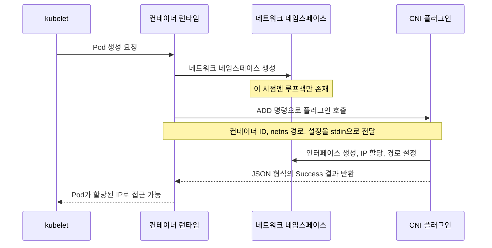
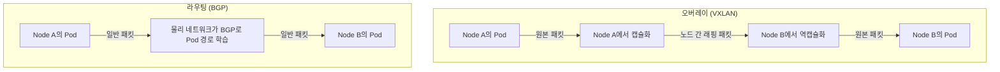

# 쿠버네티스 네트워킹 모델과 CNI: Pod는 어떻게 네트워크를 얻는가

## 학습 목표
- 모든 Pod가 NAT 없이 고유한 IP로 통신하는 쿠버네티스 평면(flat) 네트워킹 모델의 4가지 요구사항을 설명한다.
- CNI(Container Network Interface)의 역할과, Pod 생성 시 kubelet이 CNI 플러그인을 호출해 네트워크를 부여하는 흐름을 이해한다.
- 오버레이(VXLAN 캡슐화) 방식과 라우팅(BGP) 방식의 차이를 구분하고, Flannel·Calico·Cilium을 비교해 상황에 맞게 선택할 수 있다.

## 본문

### 왜 이게 중요한가

쿠버네티스를 조금이라도 써봤다면, 뭔가 마법 같은 일이 벌어진다는 걸 느꼈을 것이다. Pod 두 개를 띄우면 각각 고유한 IP가 붙고, 방화벽 규칙도, 포트 매핑도 없이 바로 통신된다. Pod를 삭제하고 다시 생성하면 새로운 IP가 부여되지만, Service는 여전히 그 Pod를 찾아낸다. 이 "그냥 되는" 경험은 우연이 아니다. 의도적으로 설계된 네트워킹 모델과 CNI라는 작지만 핵심적인 컴포넌트가 받쳐주기 때문이다.

쿠버네티스 자체는 Pod 네트워킹을 직접 구현하지 않는다. *규칙*을 정의하고 실제 구현은 플러그인에 맡긴다. "쿠버네티스가 보장하는 것"과 "플러그인이 실제로 처리하는 것" 사이의 경계를 이해하는 것이 클러스터 네트워킹 문제를 디버깅할 때 가장 핵심적인 사고 모델이다. 밑바닥부터 쌓아 올려보자.

### 평면 네트워킹 모델과 4가지 요구사항

쿠버네티스는 기존 컨테이너 환경이 겪던 포트 매핑·NAT(Network Address Translation, 트래픽이 경계를 넘을 때 IP 주소가 변환되는 방식)의 복잡성을 의도적으로 거부한다. 대신 **평면 네트워크**를 요구한다. 모든 Pod가 하나의 공유된 IP 공간에 존재하고, 각자의 실제 IP로 직접 통신할 수 있어야 한다.

"쿠버네티스 호환" 네트워크라고 부르려면 다음 4가지 요구사항을 모두 충족해야 한다.

1. **모든 Pod는 클러스터 전체에서 고유한 IP를 가진다.** 같은 IP를 공유하는 Pod는 없으며, 이 IP는 특정 노드가 아니라 *클러스터 전체*에서 유일하다.
2. **Pod는 NAT 없이 다른 모든 Pod와 통신할 수 있다.** Pod가 자신의 IP로 인식하는 주소와 다른 Pod가 해당 Pod에 접근할 때 사용하는 주소가 동일해야 한다. 경로 중간에 주소 변환이 일어나지 않는다.
3. **노드는 NAT 없이 모든 Pod에 접근할 수 있고, 그 반대도 성립한다.** 각 노드에서 실행되는 에이전트(kubelet, 모니터링, 헬스체크 등)는 Pod에 직접 접근할 수 있어야 한다.
4. **Pod가 자신의 IP라고 인식하는 주소와 외부에서 그 Pod에 접근할 때 사용하는 주소가 동일해야 한다.** 주소 재매핑 같은 것은 없다. Pod의 자기 인식과 클러스터의 인식이 일치해야 한다.

> 이 규칙들의 핵심은 개념적 단순함이다. Pod는 평면 LAN 위의 가상 머신처럼 동작한다. 일반 네트워크에서 잘 작동하는 애플리케이션은 쿠버네티스에서도 자신의 변환된 주소를 알아내는 코드 없이 그대로 동작한다.

실제로 이 덕분에 한 Pod에서 다른 Pod의 IP로 `curl`을 날리면 즉시 응답이 온다. Deployment의 Pod를 삭제해도 IP만 바뀔 뿐 접근성은 그대로다. 다만 쿠버네티스는 기본적으로 Pod 간 트래픽을 모두 허용하는데, 이는 편리하지만 보안상 취약하다. 이를 제한하는 것이 **NetworkPolicy** 오브젝트이며, 이를 실제로 집행하는 것은 CNI 플러그인이다.

### CNI란 무엇인가

**CNI(Container Network Interface)**는 평면 네트워킹 모델을 다양한 네트워킹 기술 위에서 실현할 수 있게 해주는 표준이다. 흔한 오해 중 하나는 CNI가 "쿠버네티스 전용 기술"이라는 것이다. 그렇지 않다. CNI는 CNCF(Cloud Native Computing Foundation)가 관리하는 독립적인 명세(spec)로, 다른 컨테이너 런타임과 오케스트레이터도 사용한다. 쿠버네티스가 그중 가장 유명한 사용자일 뿐이다.

CNI는 두 주체 사이의 명확한 계약을 정의한다.

- **컨테이너 런타임** (노드에서 실제로 컨테이너를 시작하는 소프트웨어), 그리고
- **플러그인** (네트워크를 설정하는 작은 실행 파일들).

런타임은 사실상 이렇게 말한다. "이 컨테이너의 네트워크 네임스페이스를 방금 만들었으니, 여기에 네트워크를 붙여줘." 플러그인은 실제 작업을 수행한다. 컨테이너 안에 네트워크 인터페이스를 만들고, 호스트와 연결하고, IP 주소를 부여하고, 기본 게이트웨이를 설정하고, 라우팅 테이블을 채우고, 호스트에 필요한 iptables 규칙을 추가한다. 작업이 끝나면 정해진 JSON 형식으로 결과를 보고한다. 어떤 인터페이스를 만들었는지, 어떤 IP를 할당했는지, 어떤 경로를 설정했는지를 담아서.

CNI 프로젝트는 세 가지를 제공한다. **명세**(런타임과 플러그인이 통신하는 방식), **참조 플러그인** 모음(`bridge`, `host-local` IPAM, `loopback` 같은 기본 구성 요소), 그리고 **라이브러리**. 참조 플러그인은 의도적으로 최소한의 기능만 담고 있어, *단일 노드 안에서의* 네트워크 연결만 처리한다. 노드 간 클러스터 전체 통신은 처리하지 않는다. 실제 클러스터에서 더 강력한 서드파티 플러그인을 설치하는 이유가 바로 이 때문이다.

### Pod 생성 시 kubelet이 CNI를 호출하는 흐름

추상적인 Pod 명세가 실제 IP를 가진 Pod로 변환되는 흐름은 다음과 같다.

1. Pod를 제출한다(보통 Deployment를 통해). 스케줄러가 이를 특정 노드에 배치한다.
2. 해당 노드의 **kubelet**(Pod를 관리하는 에이전트)이 새 Pod를 실행해야 함을 인지하고, **컨테이너 런타임**(예: containerd)에 Pod 생성을 요청한다.
3. 런타임은 먼저 Pod의 **네트워크 네임스페이스**를 생성한다. 격리된 네트워크 샌드박스가 만들어지지만, 이 시점에는 루프백 외에 사용 가능한 네트워크가 없다.
4. 런타임은 CNI 네트워크 설정 파일(노드의 `/etc/cni/net.d/` 아래에 있는 JSON 파일)을 읽고, 설정된 CNI 플러그인을 `ADD` 명령으로 **호출**한다. 컨테이너 ID, 네트워크 네임스페이스 경로, 목표 인터페이스 이름, 네트워크 설정을 표준 입력으로 전달한다.
5. 플러그인이 작업을 수행한다. 인터페이스를 생성하고, 클러스터의 Pod CIDR 범위에서 IP를 할당하고, 경로를 설정한 뒤 수행한 내용을 담은 `Success` 결과를 반환한다.
6. 런타임이 그 결과를 kubelet에 전달하면 Pod는 할당된 IP로 접근 가능한 상태가 된다.

아래 다이어그램은 이 `ADD` 흐름을 kubelet, 런타임, CNI 플러그인 간의 대화로 나타낸 것이다.

Pod가 삭제될 때는 같은 플러그인이 `DEL` 명령으로 호출되어 인터페이스를 제거하고 IP를 반환한다. (CNI 1.0 기준 전체 명령은 `ADD`, `DEL`, `CHECK`, `VERSION` 네 가지다.) 설정에서 여러 플러그인을 *체이닝*할 수도 있다. 플러그인이 순서대로 호출되며, 뒤에 오는 플러그인이 앞 플러그인의 결과를 입력으로 받는 방식이다. 예를 들어 한 플러그인은 인터페이스를 만들고, 다음 플러그인은 이를 튜닝하거나 방화벽 규칙을 추가하는 식으로 역할을 나눌 수 있다.

### 노드 간 연결의 두 가지 방식: 오버레이 vs 라우팅

참조 플러그인은 단일 노드 내 처리만 담당한다. 핵심 과제는, 그리고 서드파티 CNI 플러그인들이 경쟁하는 지점은, 서로 다른 노드에 있는 Pod들이 물리 네트워크를 넘어 통신하게 만드는 것이다. 두 가지 주요 전략이 있다.

**오버레이 네트워킹(VXLAN 캡슐화).** 오버레이는 기존 물리 네트워크 *위에* 가상의 Pod 네트워크를 구축한다. Node A의 Pod가 Node B의 Pod로 패킷을 보낼 때, 플러그인이 원본 패킷을 노드 간 주소로 발신되는 다른 패킷 안에 감싸(캡슐화) 실제 네트워크로 전송하고, 반대편에서 감싼 것을 푼다. **VXLAN**(Virtual Extensible LAN)이 가장 많이 쓰이는 캡슐화 방식이다. 가장 큰 장점은 하위 네트워크가 Pod IP를 전혀 알 필요가 없다는 것이다. 노드 간 트래픽만 처리하면 되므로, 최소한의 설정으로 거의 어디서나 동작한다. 단점은 패킷을 감쌌다 푸는 과정에서 발생하는 약간의 성능 오버헤드와 추가 헤더 바이트(사용 가능한 MTU가 약간 줄어든다)다.

**라우팅(BGP).** 라우팅 방식은 캡슐화를 완전히 생략한다. 대신 각 노드가 자신이 호스팅하는 Pod IP 범위를 **BGP**(Border Gateway Protocol, 인터넷 라우팅에도 쓰이는 바로 그 프로토콜)로 네트워크에 광고하여, 라우터와 다른 노드들이 "이 Pod IP들에 접근하려면 저 노드로 보내라"는 것을 알 수 있게 한다. 패킷은 캡슐화 없이 일반 트래픽으로 전달된다. 더 빠르고 검사하기도 쉬운 반면, 주변 네트워크(또는 노드 자체)가 라우팅에 참여해야 한다는 조건이 있어, 제약이 많거나 클라우드가 관리하는 환경에서는 적용하기 어렵다.

아래 다이어그램처럼, 오버레이는 Pod 패킷을 감싸서 전달하는 반면, 라우팅은 물리 네트워크를 통해 그대로 보낸다.

> 선택 기준: 네트워크 협조 없이 어디서나 동작하길 원한다면 오버레이(VXLAN), 네트워크를 직접 제어할 수 있고 최대 성능과 가시성을 원한다면 네이티브 라우팅(BGP)을 선택한다.

알아두면 좋은 세 번째 옵션도 있다. Amazon VPC CNI 같은 **네이티브 클라우드 CNI**는 각 Pod에 클라우드 네트워크(VPC) 자체에서 *실제* IP 주소를 부여한다. 오버레이도 없고 별도의 라우팅 프로토콜도 필요 없다. 클라우드 네트워크가 이미 그 IP를 라우팅할 줄 알기 때문이다. 단, 모든 Pod가 실제 서브넷 주소를 소비하므로 IP 고갈이 실제 문제가 될 수 있어, 프리픽스 위임(prefix delegation) 같은 기능을 포함한 용량 계획이 중요해진다.

### Flannel, Calico, Cilium 비교

세 가지 플러그인이 시장을 주도한다. 성능, 보안 기능, 복잡도에서 차이가 있다.

- **Flannel**은 가장 단순하다. 기본이 오버레이(VXLAN)인 플러그인으로, Pod에 동작하는 평면 네트워크를 제공하는 것이 유일한 목표다. 설치와 이해가 쉬워 학습 첫 걸음으로 좋다. 단점은 클래식 Flannel이 NetworkPolicy를 자체적으로 집행하지 않는다는 것이다. 연결성은 제공하지만 네트워크 보안은 없다.

- **Calico**는 "프로덕션" 선택지로 널리 쓰인다. BGP 라우팅 방식(캡슐화 없음)으로 고성능을 낼 수 있고, 네트워크 조건에 따라 오버레이도 지원한다. 핵심은 강력한 **NetworkPolicy** 집행 기능으로, 쿠버네티스 표준 정책 명세를 넘어서는 기능도 있다. 성능과 보안 정책 모두가 필요하다면 Calico가 일반적인 답이다.

- **Cilium**은 **eBPF**를 기반으로 구축된 현대적이고 기능이 풍부한 옵션이다. eBPF는 커널 안에서 패킷 처리와 정책 집행을 매우 효율적으로 수행하게 해주는 리눅스 커널 기술이다. Cilium은 ID 기반 보안 정책, 깊은 가시성(서비스 간 흐름을 시각화할 수 있다), Layer-7 인식(HTTP 수준의 규칙)까지 제공한다. 세 플러그인 중 가장 강력하고 가장 활발히 발전하고 있지만, 운영 복잡도도 가장 높다.

선택 기준을 간단히 정리하면 이렇다. 정책이 필요 없는 학습용·단순 클러스터라면 **Flannel**, 검증된 성능과 탄탄한 네트워크 보안이 필요하다면 **Calico**, 최첨단 가시성·eBPF 성능·세밀한 ID 기반 정책이 필요하다면 **Cilium**.

## 핵심 정리
- 쿠버네티스는 4가지 요구사항을 가진 **평면 네트워킹 모델**을 정의한다. 모든 Pod는 클러스터 전체에서 고유한 IP를 가지며, Pod 간·노드-Pod 간 통신은 NAT 없이 이루어지고, Pod가 자신의 IP로 인식하는 주소와 외부에서 접근하는 주소가 동일하다. Pod는 평면 LAN 위의 호스트처럼 동작한다.
- 쿠버네티스는 Pod 네트워킹을 직접 구현하지 않고 **CNI 플러그인**에 위임한다. CNI는 쿠버네티스 전용이 아닌 CNCF 명세로, 컨테이너 런타임이 플러그인을 호출해 네트워킹을 연결하는 방식을 정의한다.
- Pod가 생성될 때 kubelet이 컨테이너 런타임에 요청하면, 런타임이 네트워크 네임스페이스를 만들고 CNI 플러그인을 `ADD` 명령으로 호출해 IP·인터페이스·경로를 설정한다. Pod 삭제 시에는 `DEL`로 정리한다.
- 노드 간 연결 방식은 두 가지다. **오버레이(VXLAN)**는 패킷을 캡슐화해 어디서나 동작하고, **라우팅(BGP)**는 캡슐화 없이 Pod 경로를 광고해 네트워크를 제어할 수 있을 때 더 빠르고 검사하기 쉽다.
- **Flannel** = 단순 오버레이, 정책 없음. **Calico** = BGP 라우팅 + 강력한 NetworkPolicy. **Cilium** = eBPF 기반 성능·가시성·ID 인식(L7 포함) 정책. 단순함·성능·보안의 균형에 맞게 선택한다.
