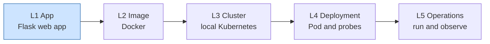
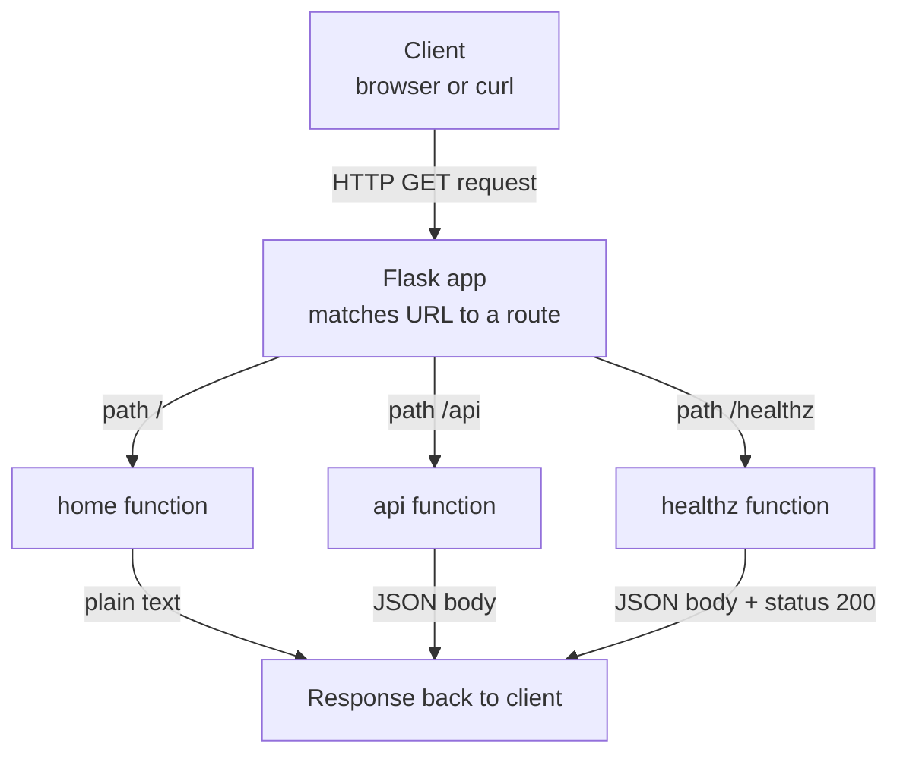

# Building a Simple Flask Web App

## Learning Objectives
- Build a minimal web and REST application in Flask with a couple of endpoints (`/` and `/api`) and run it locally.
- Add a dedicated health-check route (`/healthz`) that returns HTTP 200, so the app is ready for Kubernetes probes later.
- Declare dependencies in a `requirements.txt` file and start the app with either `flask run` or `python app.py`.

## Body

### Why we start here

Welcome to the first lecture of our five-part capstone. Across this course you will take a single Python web app all the way to a running deployment on a local Kubernetes cluster. The journey is **app → image → cluster → deployment → operations**, and every later step depends on the small choices we make right now. The five stages of that journey, and where this lecture sits, are shown below.



So before we touch Docker, manifests, or `kubectl`, we need a real application to deploy. In this lecture we build that application with **Flask**, a lightweight ("micro") web framework for Python. Flask is popular precisely because it is small and explicit: a working web server is only a handful of lines, yet the same framework powers real production systems. That makes it a perfect starting point for learning the deployment pipeline without getting lost in application complexity.

> Keep one detail in mind throughout this lecture: the `/healthz` endpoint we add is not just a nice extra. In Kubernetes, the platform repeatedly calls a URL like this to decide whether your container is alive and ready to receive traffic. The app we build today is shaped specifically so that Kubernetes can supervise it later.

### Step 1 — Set up your environment

You need Python 3 installed and a terminal. It is good practice to isolate each project's dependencies in a **virtual environment** so they don't collide with other Python projects on your machine. Create and activate one, then install Flask:

```bash
# Create an isolated environment in a folder named .venv
python -m venv .venv

# Activate it
# macOS / Linux:
source .venv/bin/activate
# Windows (PowerShell):
.venv\Scripts\Activate.ps1

# Install Flask into the active environment
pip install flask
```

If `pip` is not found, try `pip3`. Once Flask installs cleanly, you are ready to write code.

### Step 2 — Understand what an API endpoint is

An **API** (Application Programming Interface) is simply a set of rules that lets different software systems talk to each other over the network. A client sends a **request** to a URL; the server processes it and sends back a **response**, often containing data. In Flask, each URL your app responds to is called a **route**, and you attach a route to a normal Python function using a **decorator** — the `@app.route(...)` line that sits directly above the function.

When you build APIs you also work with **HTTP methods**, which describe the *intent* of a request: `GET` retrieves data, `POST` creates something new, `PUT` updates existing data, and `DELETE` removes it. For this lecture a couple of simple `GET` routes are all we need.

### Step 3 — Write the application

Create a file called `app.py`. Here is the complete, working application — type or paste it in, then we'll walk through each part:

```python
from flask import Flask, jsonify

app = Flask(__name__)


@app.route("/")
def home():
    # A plain web page response: just text in the browser.
    return "Hello from the Capstone Flask app!"


@app.route("/api")
def api():
    # A REST-style response: structured JSON data.
    return jsonify({
        "message": "Hello, API!",
        "service": "capstone-flask",
        "version": "1.0.0"
    })


@app.route("/healthz")
def healthz():
    # Health-check endpoint for Kubernetes probes.
    # Returning a 200 status code tells the platform the app is healthy.
    return jsonify({"status": "ok"}), 200


if __name__ == "__main__":
    # host="0.0.0.0" makes the app reachable from outside the container later.
    app.run(host="0.0.0.0", port=5000)
```

Let's unpack the important pieces.

**Creating the app.** `app = Flask(__name__)` builds the Flask application object. The special `__name__` value tells Flask where to find resources relative to this file. Every route and every run command refers back to this `app` variable.

**The `/` route.** The `home()` function returns a plain string, which the browser renders as a simple web page. This is the bare-minimum "it works" endpoint.

**The `/api` route.** Here we return **JSON** (JavaScript Object Notation), the standard format for REST APIs — essentially a collection of key/value pairs, very similar to a Python dictionary. We build a normal Python `dict` and pass it to `jsonify(...)`, which converts it to a proper JSON response with the correct content type. This is how real REST APIs hand structured data back to clients.

**The `/healthz` route.** This is the route that matters most for the rest of the course. It returns a tiny JSON body **and an explicit `200` status code**. The pattern `return body, 200` lets you set the HTTP status alongside the response. `200` means "success." A health check should be cheap and self-contained: it must not query a database or call other services, because Kubernetes will hit it frequently and expects a fast, reliable answer.

> `/healthz` is a widely used naming convention for liveness/readiness endpoints (the trailing `z` is a long-standing convention to avoid clashing with a real `/health` page). In Lecture 4 you will point Kubernetes liveness and readiness probes directly at this path.

**The run block.** The `if __name__ == "__main__":` guard runs the development server only when you execute the file directly. We bind to `host="0.0.0.0"` instead of the default `127.0.0.1`. This is a deliberate, forward-looking choice: `0.0.0.0` means "listen on all network interfaces," which is required once the app runs inside a Docker container (Lecture 2) and inside a Pod (Lecture 4). With the default localhost-only binding, traffic from outside the container could never reach it.

Putting the three routes together, the diagram below shows how one Flask app dispatches an incoming request: it matches the request URL to the right decorated function and returns either plain text or JSON.



### Step 4 — Declare dependencies with requirements.txt

Right now Flask is installed only on your machine. For the app to be reproducible — and especially for Docker to install the same packages inside the image in Lecture 2 — you must record the dependencies in a file named `requirements.txt`:

```text
Flask==3.0.3
```

Pinning an exact version (`==3.0.3`) means everyone who builds this project — including the Docker image — gets the identical Flask release, avoiding "works on my machine" surprises. You can generate this file automatically from your active environment with `pip freeze`, but for a one-dependency app it's clearer to write it by hand. Anyone (or any build step) can then reinstall everything in one command:

```bash
pip install -r requirements.txt
```

> This `requirements.txt` is exactly what the `Dockerfile` will copy and install in the next lecture. Keeping it accurate now saves you a broken build later.

### Step 5 — Run the app and verify every endpoint

You can start the app two equivalent ways. The simplest is to run the file directly:

```bash
python app.py
```

Alternatively, use Flask's own CLI, which is handy because it offers options like auto-reload:

```bash
# Tell Flask which file holds the app, then run it
# macOS / Linux:
export FLASK_APP=app.py
# Windows (PowerShell):
$env:FLASK_APP = "app.py"

flask run --host=0.0.0.0 --port=5000
```

Either way, the development server starts and listens on port 5000. You'll see a warning that this is a development server and not for production use — that is expected and perfectly fine for local development and for this course.

Now verify all three endpoints. Open a browser, or use `curl` from a second terminal:

```bash
curl http://localhost:5000/
# -> Hello from the Capstone Flask app!

curl http://localhost:5000/api
# -> {"message":"Hello, API!","service":"capstone-flask","version":"1.0.0"}

curl -i http://localhost:5000/healthz
# -> HTTP/1.1 200 OK
#    {"status":"ok"}
```

The `-i` flag on the last command prints the response headers, so you can confirm the status line reads `200 OK`. That `200` is precisely what a Kubernetes probe will look for when it decides whether to keep your container running and route traffic to it.

If you can reach all three routes, the request/response flow is now: a client sends an HTTP request to a route, Flask matches the URL to the decorated function, the function returns either text or JSON, and Flask sends the response back. That same flow will hold whether the app runs on your laptop, inside a container, or inside a Pod.

### Where this leads

What you built is intentionally minimal, but it is structured for the road ahead:

- The `0.0.0.0` binding and port 5000 will let the container and Pod expose the app.
- `requirements.txt` becomes the dependency layer of your Docker image in **Lecture 2**.
- `/healthz` becomes the target of Kubernetes liveness and readiness probes in **Lecture 4**.

In the next lecture we'll wrap this exact app in a `Dockerfile`, build an image, and run it as a container — the first step in turning your code into something a cluster can schedule.

## Key Takeaways
- Flask turns a few lines of Python into a working web server; `@app.route(...)` maps a URL to a function, and `jsonify(...)` returns structured JSON for REST endpoints.
- The `/healthz` endpoint must be cheap and return HTTP **200**; it is the hook Kubernetes probes will use in Lecture 4, so design for it from day one.
- Binding to `host="0.0.0.0"` (not localhost) is what allows the app to be reached from outside a container and Pod later.
- `requirements.txt` with a pinned version makes the app reproducible and feeds directly into the Docker build in Lecture 2.
- Run the app with `python app.py` or `flask run`, then verify `/`, `/api`, and `/healthz` before moving on.
