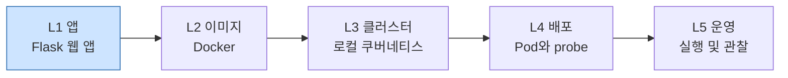
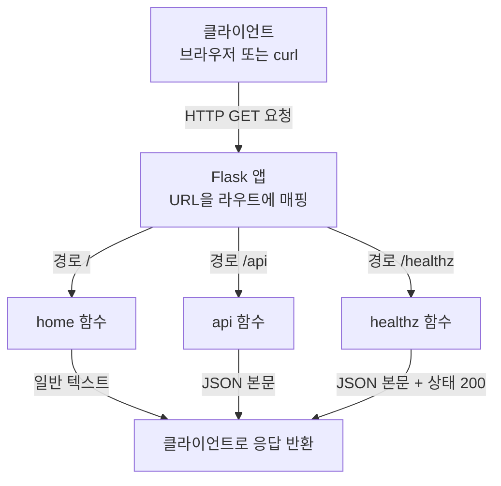

# 간단한 Flask 웹 앱 만들기

## 학습 목표
- Flask로 최소한의 웹/REST 엔드포인트(`/`와 `/api`)를 만들고 로컬에서 실행한다.
- 쿠버네티스 probe에 대비해 헬스체크 경로(`/healthz`)를 추가하고 HTTP 200 응답을 반환한다.
- `requirements.txt`로 의존성을 명시하고, `flask run` 또는 `python app.py`로 앱을 띄워 동작을 확인한다.

## 본문

### 왜 여기서 시작하는가

5강으로 구성된 캡스톤 강좌에 오신 걸 환영한다. 이 강좌를 통해 단일 파이썬 웹 앱을 로컬 쿠버네티스 클러스터에서 실행되는 배포 상태까지 직접 끌어올린다. 전체 여정은 **앱 → 이미지 → 클러스터 → 배포 → 운영**이며, 이후의 모든 단계는 지금 여기서 내리는 작은 결정들에 달려 있다. 이 여정의 다섯 단계와 현재 강의의 위치는 아래 다이어그램에 나타나 있다.



Docker도, 매니페스트도, `kubectl`도 아직 건드리지 않는다. 먼저 실제로 배포할 수 있는 애플리케이션이 있어야 한다. 이번 강의에서는 파이썬용 경량("마이크로") 웹 프레임워크인 **Flask**로 그 애플리케이션을 만든다. Flask는 코드 몇 줄만으로 웹 서버를 동작시킬 수 있을 만큼 작고 명시적인 것으로 유명하면서도, 같은 프레임워크가 실제 프로덕션 시스템을 떠받치고 있다. 배포 파이프라인을 배우는 출발점으로 안성맞춤인 이유다.

> 이번 강의 전반에 걸쳐 한 가지를 꼭 기억해두자. `/healthz` 엔드포인트는 단순한 추가 기능이 아니다. 쿠버네티스는 이 URL을 주기적으로 호출해 컨테이너가 살아 있는지, 트래픽을 받을 준비가 됐는지를 판단한다. 오늘 만드는 앱은 쿠버네티스가 나중에 감시할 수 있는 구조로 처음부터 설계된다.

### 1단계 — 개발 환경 구성

파이썬 3와 터미널이 필요하다. 각 프로젝트의 의존성을 **가상 환경(virtual environment)**으로 격리해두면, 다른 파이썬 프로젝트와 패키지가 충돌하지 않아 좋다. 가상 환경을 만들고 활성화한 뒤 Flask를 설치한다.

```bash
# .venv 폴더에 격리된 환경 생성
python -m venv .venv

# 활성화
# macOS / Linux:
source .venv/bin/activate
# Windows (PowerShell):
.venv\Scripts\Activate.ps1

# 활성화된 환경에 Flask 설치
pip install flask
```

`pip`을 찾지 못하면 `pip3`를 시도한다. Flask가 정상적으로 설치되면 코드 작성 준비가 된 것이다.

### 2단계 — API 엔드포인트란 무엇인가

**API**(Application Programming Interface)는 서로 다른 소프트웨어 시스템이 네트워크를 통해 통신하는 규칙의 집합이다. 클라이언트가 특정 URL로 **요청(request)**을 보내면, 서버는 이를 처리해 데이터가 담긴 **응답(response)**을 돌려준다. Flask에서는 앱이 응답하는 각 URL을 **라우트(route)**라 부르며, 함수 바로 위에 `@app.route(...)` **데코레이터**를 붙여 라우트와 함수를 연결한다.

API를 만들 때는 **HTTP 메서드**도 함께 다루게 된다. HTTP 메서드는 요청의 *의도*를 나타낸다. `GET`은 데이터 조회, `POST`는 생성, `PUT`은 수정, `DELETE`는 삭제를 뜻한다. 이번 강의에서는 간단한 `GET` 라우트 두 개면 충분하다.

### 3단계 — 애플리케이션 작성

`app.py` 파일을 만든다. 아래는 완전히 동작하는 전체 애플리케이션 코드다. 직접 타이핑하거나 붙여넣기 한 뒤, 각 부분을 함께 살펴보자.

```python
from flask import Flask, jsonify

app = Flask(__name__)


@app.route("/")
def home():
    # 브라우저에 일반 텍스트를 반환하는 웹 페이지 응답.
    return "Hello from the Capstone Flask app!"


@app.route("/api")
def api():
    # REST 방식의 응답: 구조화된 JSON 데이터.
    return jsonify({
        "message": "Hello, API!",
        "service": "capstone-flask",
        "version": "1.0.0"
    })


@app.route("/healthz")
def healthz():
    # 쿠버네티스 probe용 헬스체크 엔드포인트.
    # 200 상태 코드를 반환하면 플랫폼에 앱이 정상임을 알린다.
    return jsonify({"status": "ok"}), 200


if __name__ == "__main__":
    # host="0.0.0.0"은 나중에 컨테이너 외부에서도 앱에 접근할 수 있게 한다.
    app.run(host="0.0.0.0", port=5000)
```

각 핵심 부분을 짚어보자.

**앱 객체 생성.** `app = Flask(__name__)`으로 Flask 애플리케이션 객체를 만든다. `__name__`이라는 특수 값은 이 파일의 위치를 기준으로 리소스를 찾도록 Flask에게 알려준다. 모든 라우트와 실행 명령은 이 `app` 변수를 참조한다.

**`/` 라우트.** `home()` 함수는 문자열을 반환하고, 브라우저는 이를 간단한 웹 페이지로 표시한다. "작동하는지" 확인하는 최소한의 엔드포인트다.

**`/api` 라우트.** 여기서는 REST API의 표준 데이터 형식인 **JSON**(JavaScript Object Notation)을 반환한다. JSON은 파이썬 딕셔너리와 매우 유사한 키/값 쌍의 집합이다. 일반 파이썬 `dict`를 만들어 `jsonify(...)`에 넘기면, 올바른 콘텐츠 타입이 설정된 JSON 응답으로 변환된다. 실제 REST API가 클라이언트에 구조화된 데이터를 전달하는 방식이 바로 이것이다.

**`/healthz` 라우트.** 이 강좌의 나머지 내용에서 가장 중요한 라우트다. 작은 JSON 본문과 함께 **명시적인 `200` 상태 코드**를 반환한다. `return body, 200` 패턴으로 응답 본문과 HTTP 상태를 함께 지정한다. `200`은 "성공"을 의미한다. 헬스체크는 단순하고 독립적이어야 한다. 데이터베이스 조회나 다른 서비스 호출을 해서는 안 된다. 쿠버네티스가 자주 호출하므로 빠르고 안정적인 응답이 필수다.

> `/healthz`는 활성(liveness)/준비성(readiness) 엔드포인트에 널리 쓰이는 이름 규칙이다(끝의 `z`는 실제 `/health` 페이지와의 충돌을 피하기 위한 오래된 관례다). 4강에서 쿠버네티스 liveness·readiness probe가 이 경로를 직접 가리키게 된다.

**실행 블록.** `if __name__ == "__main__":` 가드는 파일을 직접 실행할 때만 개발 서버를 구동한다. 기본값인 `127.0.0.1` 대신 `host="0.0.0.0"`에 바인딩하는 것은 의도적인 선택이다. `0.0.0.0`은 "모든 네트워크 인터페이스에서 수신"을 의미한다. 2강(Docker 컨테이너)과 4강(Pod) 내부에서 앱이 실행될 때 외부 트래픽이 들어오려면 이 설정이 반드시 필요하다. 기본값인 로컬호스트 전용 바인딩으로는 컨테이너 외부 트래픽이 절대 도달할 수 없다.

세 라우트가 어떻게 연결되는지, 아래 다이어그램에서 Flask 앱이 들어온 요청을 어떻게 처리하는지 확인해보자.



### 4단계 — requirements.txt로 의존성 선언

지금은 Flask가 내 로컬 환경에만 설치되어 있다. 앱을 재현 가능하게 만들려면 — 특히 2강에서 Docker가 이미지 안에 동일한 패키지를 설치하려면 — `requirements.txt` 파일에 의존성을 기록해야 한다.

```text
Flask==3.0.3
```

정확한 버전을 고정하면(`==3.0.3`) 이 프로젝트를 빌드하는 모든 사람이 — Docker 이미지 빌드 포함 — 동일한 Flask 릴리스를 받아 "내 컴퓨터에서만 되는" 문제를 방지한다. 활성 환경에서 `pip freeze`로 자동 생성할 수도 있지만, 의존성이 하나뿐인 앱이라면 직접 작성하는 게 더 명확하다. 누구든(그리고 어떤 빌드 단계든) 다음 한 줄로 전부 재설치할 수 있다.

```bash
pip install -r requirements.txt
```

> 이 `requirements.txt`는 다음 강의의 `Dockerfile`이 복사해 설치하는 파일 그대로다. 지금 정확하게 유지해두면 나중에 빌드 실패를 막을 수 있다.

### 5단계 — 앱 실행 및 모든 엔드포인트 검증

앱을 시작하는 방법은 두 가지로 동일하다. 가장 간단한 방법은 파일을 직접 실행하는 것이다.

```bash
python app.py
```

또는 Flask CLI를 쓰는 방법도 있다. 자동 재시작 등 유용한 옵션이 있어 개발 중에 편리하다.

```bash
# Flask가 앱을 찾을 파일을 지정한 뒤 실행
# macOS / Linux:
export FLASK_APP=app.py
# Windows (PowerShell):
$env:FLASK_APP = "app.py"

flask run --host=0.0.0.0 --port=5000
```

어느 방법이든 개발 서버가 포트 5000에서 시작된다. 이 서버는 개발용이며 프로덕션에 쓰지 말라는 경고가 뜨는데, 로컬 개발과 이 강좌에서는 완전히 정상이다.

이제 세 엔드포인트를 모두 확인해보자. 브라우저에서 열거나, 다른 터미널에서 `curl`을 사용한다.

```bash
curl http://localhost:5000/
# -> Hello from the Capstone Flask app!

curl http://localhost:5000/api
# -> {"message":"Hello, API!","service":"capstone-flask","version":"1.0.0"}

curl -i http://localhost:5000/healthz
# -> HTTP/1.1 200 OK
#    {"status":"ok"}
```

마지막 명령의 `-i` 플래그는 응답 헤더를 출력해 상태 줄이 `200 OK`임을 확인하게 해준다. 이 `200`이 바로 쿠버네티스 probe가 컨테이너를 계속 실행하고 트래픽을 보낼지 결정할 때 찾는 값이다.

세 라우트에 모두 접근할 수 있다면, 전체 흐름이 완성된 것이다. 클라이언트가 HTTP 요청을 라우트로 보내면 Flask가 URL을 데코레이터가 붙은 함수에 매핑하고, 함수는 텍스트 또는 JSON을 반환하며, Flask가 응답을 돌려보낸다. 이 흐름은 앱이 노트북에서 실행되든, 컨테이너 안에서 실행되든, Pod 안에서 실행되든 동일하게 유지된다.

### 다음 단계로

이번에 만든 앱은 의도적으로 최소한으로 구성됐지만, 앞으로의 여정을 위한 구조가 갖춰져 있다.

- `0.0.0.0` 바인딩과 포트 5000은 컨테이너와 Pod가 앱을 외부에 노출하는 데 쓰인다.
- `requirements.txt`는 **2강**에서 Docker 이미지의 의존성 레이어가 된다.
- `/healthz`는 **4강**에서 쿠버네티스 liveness·readiness probe의 대상이 된다.

다음 강의에서는 이 앱 그대로를 `Dockerfile`로 감싸 이미지를 빌드하고 컨테이너로 실행한다. 코드를 클러스터가 스케줄링할 수 있는 형태로 만드는 첫 번째 단계다.

## 핵심 정리
- Flask는 파이썬 코드 몇 줄로 동작하는 웹 서버를 만들어준다. `@app.route(...)`로 URL과 함수를 연결하고, `jsonify(...)`로 REST 엔드포인트에 구조화된 JSON을 반환한다.
- `/healthz` 엔드포인트는 가볍게 설계하고 HTTP **200**을 반환해야 한다. 4강에서 쿠버네티스 probe가 이 경로를 사용하므로, 처음부터 이를 염두에 두고 만든다.
- `host="0.0.0.0"`으로 바인딩해야(로컬호스트 아님) 나중에 컨테이너와 Pod 외부에서 앱에 접근할 수 있다.
- 버전을 고정한 `requirements.txt`가 있어야 앱을 재현 가능하게 만들고, 2강의 Docker 빌드에 직접 활용된다.
- `python app.py` 또는 `flask run`으로 앱을 실행한 뒤 `/`, `/api`, `/healthz`를 모두 확인하고 다음 단계로 넘어간다.
