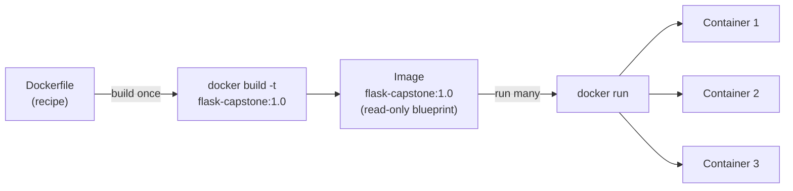
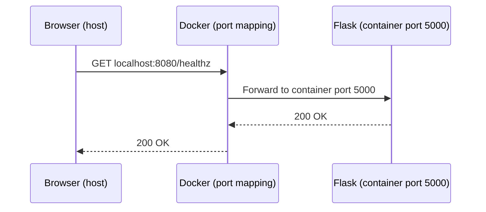

# Containerizing the App with Docker

## Learning Objectives
- Write a complete, working `Dockerfile` for the Flask app from Lecture 1 — choosing a base image, installing dependencies, and declaring the startup command.
- Build the image with `docker build` and run it with `docker run`, then confirm the app is reachable by publishing its port (`EXPOSE` / `-p`).
- Tag the image with a meaningful `name:version` (for example, `flask-capstone:1.0`) so it is ready for the Kubernetes deployment in the lectures that follow.

## Body

### Where we are in the capstone

In Lecture 1 you built a small Flask app from scratch. You now have three files sitting in a project folder: `app.py` (which serves `/`, an `/api` endpoint, and a `/healthz` health check that returns `200`), `requirements.txt` (which lists `flask` as a dependency), and you confirmed the whole thing runs locally with `python app.py`.

That app works on *your* machine. But "works on my machine" is exactly the problem we are about to solve. The version of Python you have installed, the exact Flask version `pip` happened to grab, the system libraries your OS ships with — all of these quietly shape how the app behaves. Hand the same code to a teammate on a different OS, or to a Kubernetes node in a cluster, and small differences can turn into broken builds and mysterious runtime errors.

Docker fixes this by packaging the app **together with its entire environment** into a single, portable artifact called an **image**. In this lecture we turn the Flask app into an image, run it as a container, and tag it so the next lectures can load it into a local Kubernetes cluster. This is the bridge step: app → image → cluster.

> Kubernetes does not run your source code directly. It runs *container images*. Everything you do in this lecture is the prerequisite for everything Kubernetes does in Lectures 3 through 5.

### Two concepts you must keep straight: image vs. container

These two words get used interchangeably in casual conversation, but they are not the same thing, and the distinction matters for Kubernetes.

- An **image** is a read-only, packaged blueprint: your code plus a base operating system layer, the Python runtime, and your installed dependencies, frozen into an immutable bundle. You cannot edit an image after it is built — you build a new one instead. Think of it as the recipe, or the blueprint for a house.
- A **container** is a *running instance* of an image. It is a live, isolated process on your machine that shares the host's CPU and memory but behaves as if it has its own little sandboxed operating system. If the image is the blueprint, the container is the actual house. You can start many containers from the same image, and you can stop and delete them freely.

The mental model is simple: **you build an image once, then run as many containers from it as you like.** In Kubernetes, a Deployment will run several identical containers (replicas) from the one image you build here. The diagram below traces that whole pipeline, from the Dockerfile recipe to the running containers.



Before going further, make sure Docker Desktop (or the Docker Engine) is installed and running. On Docker Desktop you should see a green "running" indicator. You can verify from the terminal with `docker version`.

### Anatomy of a Dockerfile

An image is built from a plain text file of instructions called a **Dockerfile** (capital D, no file extension). Each instruction is read top to bottom, and Docker executes them in order to assemble the image layer by layer. Here is a complete Dockerfile for our Flask app. Create it in the same folder as `app.py`:

```dockerfile
# 1. Base image: a slim Python runtime to keep the image small
FROM python:3.12-slim

# 2. Set the working directory inside the container
WORKDIR /app

# 3. Copy only the dependency list first (better build caching)
COPY requirements.txt .

# 4. Install the Python dependencies
RUN pip install --no-cache-dir -r requirements.txt

# 5. Copy the rest of the application code
COPY . .

# 6. Document the port the app listens on
EXPOSE 5000

# 7. The command that runs when a container starts
CMD ["python", "app.py"]
```

Let's walk through *why* each line is written this way, because every choice has a reason.

**`FROM python:3.12-slim`** — Every image is built on top of a **base image**, an existing image that already contains an OS layer and, here, a working Python install. We pick `python:3.12-slim` rather than the full `python:3.12` because the `slim` variant drops build tools and docs we don't need, producing a much smaller image. (There is an even smaller `alpine` variant, but it occasionally trips up Python packages that expect standard Linux libraries, so `slim` is the safer default for beginners.)

**`WORKDIR /app`** — This sets the directory inside the container where subsequent commands run and where your code will live. From here on, relative paths are relative to `/app`.

**`COPY requirements.txt .` then `RUN pip install ...`** — Notice we copy *only* `requirements.txt` first, install dependencies, and *then* copy the rest of the code. This ordering is deliberate. Docker caches each layer, and rebuilds only the layers that changed. Because your dependencies change far less often than your code, putting the `pip install` step before the `COPY . .` means that editing `app.py` won't force Docker to reinstall Flask on every rebuild. This single trick can turn a 60-second rebuild into a 2-second one. The `--no-cache-dir` flag tells `pip` not to keep its download cache, shaving more weight off the final image.

**`COPY . .`** — Now we copy everything else in the project folder (including `app.py`) into `/app`.

**`EXPOSE 5000`** — This *documents* that the app listens on port 5000 inside the container. Important caveat: `EXPOSE` by itself does **not** open the port to the outside world — it is metadata that tells humans and tools which port the container expects to use. The actual publishing happens at run time with `-p`. (Make sure 5000 matches whatever port your Flask app binds to in `app.py`.)

**`CMD ["python", "app.py"]`** — This is the **default command** that runs when a container starts from the image. When Kubernetes launches your container later, this is what it executes. The bracket form (called *exec form*) is preferred because it runs the process directly without an extra shell wrapper.

### One small but important detail: a .dockerignore file

When `COPY . .` runs, it copies *everything* in the folder — including things you don't want inside the image, like a local virtual environment, `.git` history, or `__pycache__` folders. These bloat the image and can even leak secrets. The fix is a `.dockerignore` file (sibling to the Dockerfile), which works just like `.gitignore`:

```
__pycache__/
*.pyc
.venv/
venv/
.git/
.env
```

> Always add a `.dockerignore`. A leaner build context means smaller, faster, safer images — and it prevents your local virtual environment from accidentally overriding the clean dependencies installed inside the container.

### Building the image

With the Dockerfile in place, build the image from the project folder (the `.` at the end is the *build context* — the folder Docker reads from):

```bash
docker build -t flask-capstone:1.0 .
```

The `-t` flag *tags* the image with a name and version in `name:tag` format. We are using `flask-capstone:1.0` and will keep this exact name throughout the rest of the capstone, so the Kubernetes manifests in Lecture 4 reference the same image. As the build runs, you'll see Docker work through each Dockerfile instruction as a numbered step. When it finishes, confirm the image exists:

```bash
docker images
```

You should see `flask-capstone` with tag `1.0` in the list.

### Running the container and publishing the port

Now start a container from the image:

```bash
docker run -p 8080:5000 flask-capstone:1.0
```

The `-p 8080:5000` flag is the crucial part. It **publishes** the container's port to your host machine, and the format is `host_port:container_port`. So this maps port `8080` on your computer to port `5000` inside the container.

Why does this matter? A container is an isolated process. By default, nothing on your machine can reach inside it — that isolation is the whole point. The `-p` flag opens a controlled doorway: traffic arriving at `localhost:8080` is forwarded into the container's port `5000`, where Flask is listening. (Without `-p`, you'd get a connection-refused error even though the app is running fine inside the container — a very common beginner gotcha.)

Open a browser and visit `http://localhost:8080/`, then check the health endpoint at `http://localhost:8080/healthz` — it should return `200`. That same `/healthz` path becomes the readiness and liveness probe in Lecture 4, so it's worth confirming it works through the container now.

The flow, end to end, is as follows: your browser hits `localhost:8080` on the host → Docker forwards it to port `5000` inside the container → Flask handles the request and responds back out through the same mapping. The diagram below shows that request crossing the container boundary opened by `-p`.



A couple of practical run-time tips:

- Run it in the background with the `-d` (detached) flag so your terminal stays free: `docker run -d -p 8080:5000 flask-capstone:1.0`.
- List running containers with `docker ps`, and stop one with `docker stop <container_id>`.

### Tagging for what comes next

You've already given the image a meaningful tag with `-t flask-capstone:1.0`. But you can also **re-tag** an existing image at any time with `docker tag`, which is useful when you want to point the same image at a new name or version:

```bash
docker tag flask-capstone:1.0 flask-capstone:latest
```

This doesn't copy or rebuild anything — it just adds a second label pointing at the same image.

Why do we care about clean, versioned tags in a Kubernetes course? Because **tags are how Kubernetes identifies which image to run.** A Deployment manifest will literally name `flask-capstone:1.0`. When you ship a new version of the app, you build `flask-capstone:2.0` and tell Kubernetes to roll over to it — which is exactly the rolling-update workflow you'll perform in Lecture 5. A vague tag like `latest` makes that impossible to reason about, because "latest" can silently mean different things at different times. Explicit version tags (`1.0`, `2.0`, ...) are a best practice that pays off the moment you start operating the app.

> Pin a real version like `1.0` for anything you deploy to Kubernetes. Relying on `latest` makes rollouts and rollbacks ambiguous, because the cluster can't tell one "latest" from another.

### What about Docker Hub?

You may have seen tutorials push images to **Docker Hub** (a public registry) with `docker push`, so other machines can `docker pull` them. That's the normal way clusters in the cloud get their images. For this capstone, though, we're running a **local** Kubernetes cluster (minikube or kind), and in Lecture 3 you'll load the image directly into the cluster with `minikube image load` or `kind load docker-image` — no registry required. So you don't need a Docker Hub account here. Just keep the image built and tagged locally, and the next lecture picks it up from there.

## Key Takeaways
- A **Dockerfile** is the recipe for an **image**; a **container** is a running instance of that image. You build once and run many.
- A solid Flask Dockerfile uses a `slim` base image, copies `requirements.txt` and installs dependencies *before* copying the code (for build caching), declares the port with `EXPOSE`, and sets the startup `CMD`.
- `docker build -t flask-capstone:1.0 .` builds the image; `docker run -p 8080:5000 flask-capstone:1.0` runs it and publishes the port. `EXPOSE` only documents the port — `-p` actually opens it.
- Add a `.dockerignore` to keep builds lean and avoid leaking local files into the image.
- Tag images with explicit versions (`flask-capstone:1.0`, not just `latest`); these tags are exactly what your Kubernetes manifests will reference for deployments, rolling updates, and rollbacks.
- **Next up (Lecture 3):** stand up a local Kubernetes cluster and load this image into it — no registry needed.
