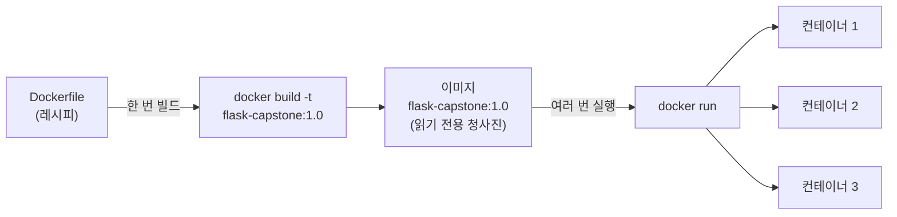
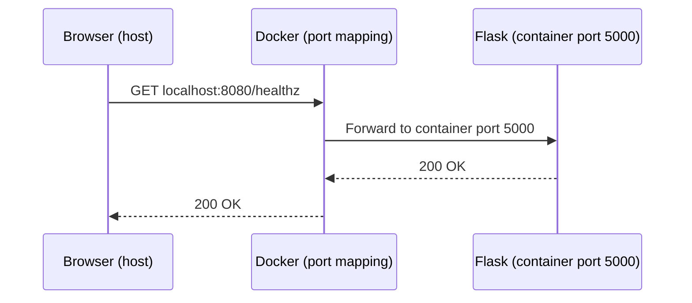

# Docker로 앱 컨테이너화하기

## 학습 목표
- 1강에서 만든 Flask 앱을 위한 완전한 `Dockerfile`을 작성한다 — 베이스 이미지 선택, 의존성 설치, 시작 명령 선언까지.
- `docker build`로 이미지를 빌드하고 `docker run`으로 실행한 뒤, 포트를 게시(`EXPOSE` / `-p`)해 앱에 접근할 수 있음을 확인한다.
- 이후 Kubernetes 배포에서 참조할 수 있도록 이미지에 의미 있는 `이름:버전` 태그(예: `flask-capstone:1.0`)를 붙인다.

## 본문

### 캡스톤의 현재 위치

1강에서 간단한 Flask 앱을 직접 만들었다. 프로젝트 폴더에는 세 파일이 있다. `app.py`(루트 `/`, API 엔드포인트 `/api`, `200`을 반환하는 헬스 체크 `/healthz` 제공), `requirements.txt`(`flask` 의존성 선언), 그리고 `python app.py`로 로컬 실행을 확인한 상태다.

앱은 *내 컴퓨터*에서는 잘 돌아간다. 그런데 "내 컴퓨터에서는 되는데"가 바로 우리가 풀려는 문제다. 설치된 Python 버전, `pip`이 가져온 Flask 버전, OS가 제공하는 시스템 라이브러리 — 이런 것들이 앱 동작에 조용히 영향을 미친다. 같은 코드를 다른 OS의 팀원에게 넘기거나, 클러스터의 Kubernetes 노드에 올리면 사소한 차이가 빌드 실패나 알 수 없는 런타임 오류로 번진다.

Docker는 앱과 **실행 환경 전체**를 하나의 이식 가능한 묶음, 즉 **이미지(image)**로 패키징해 이 문제를 해결한다. 이번 강의에서는 Flask 앱을 이미지로 만들고 컨테이너로 실행한 뒤, 다음 강의에서 로컬 Kubernetes 클러스터에 올릴 수 있도록 태그를 붙인다. 이 강의는 앱 → 이미지 → 클러스터로 이어지는 가교 역할을 한다.

> Kubernetes는 소스 코드를 직접 실행하지 않는다. *컨테이너 이미지*를 실행한다. 이번 강의에서 하는 모든 작업이 3~5강의 Kubernetes 실습을 위한 전제 조건이다.

### 반드시 구분해야 할 두 개념: 이미지 vs. 컨테이너

일상적인 대화에서는 두 단어를 혼용하기도 하지만, 실제로는 다른 개념이며 Kubernetes에서 이 구분이 중요하다.

- **이미지(image)**는 읽기 전용의 패키징된 청사진이다. 코드, 베이스 OS 레이어, Python 런타임, 설치된 의존성이 모두 불변의 묶음으로 고정된다. 빌드한 이미지를 수정할 수 없다 — 새로 빌드해야 한다. 레시피, 혹은 집의 설계도라고 생각하면 된다.
- **컨테이너(container)**는 이미지의 *실행 중인 인스턴스*다. 호스트의 CPU와 메모리를 공유하지만 자체 샌드박스 OS를 가진 것처럼 동작하는 격리된 프로세스다. 이미지가 설계도라면 컨테이너는 실제로 지은 집이다. 같은 이미지에서 컨테이너를 여러 개 시작하고, 자유롭게 멈추고 삭제할 수 있다.

핵심 모델은 간단하다. **이미지는 한 번 빌드하고, 그 이미지에서 원하는 만큼 컨테이너를 실행한다.** Kubernetes에서 Deployment는 여기서 빌드한 이미지 하나로 동일한 컨테이너(레플리카)를 여러 개 실행한다. 아래 다이어그램은 Dockerfile 레시피부터 실행 중인 컨테이너까지 전체 파이프라인을 보여준다.



계속 진행하기 전에 Docker Desktop(또는 Docker Engine)이 설치되어 실행 중인지 확인한다. Docker Desktop에서는 녹색 "running" 표시가 보여야 한다. 터미널에서 `docker version`으로도 확인할 수 있다.

### Dockerfile 구조 해부

이미지는 **Dockerfile**(대문자 D, 확장자 없음)이라는 일반 텍스트 명령 파일로 빌드한다. 각 명령은 위에서 아래로 읽히고, Docker는 이를 순서대로 실행해 레이어를 쌓아 이미지를 조립한다. 아래는 Flask 앱을 위한 완전한 Dockerfile이다. `app.py`와 같은 폴더에 생성한다.

```dockerfile
# 1. 베이스 이미지: 이미지를 작게 유지하기 위해 slim Python 런타임 사용
FROM python:3.12-slim

# 2. 컨테이너 내부 작업 디렉터리 설정
WORKDIR /app

# 3. 레이어 캐시 효율을 위해 의존성 목록만 먼저 복사
COPY requirements.txt .

# 4. Python 의존성 설치
RUN pip install --no-cache-dir -r requirements.txt

# 5. 나머지 애플리케이션 코드 복사
COPY . .

# 6. 앱이 사용하는 포트 문서화
EXPOSE 5000

# 7. 컨테이너 시작 시 실행할 명령
CMD ["python", "app.py"]
```

각 줄을 *왜* 이렇게 작성하는지 살펴보자. 모든 선택에는 이유가 있다.

**`FROM python:3.12-slim`** — 모든 이미지는 **베이스 이미지** 위에 빌드된다. 베이스 이미지에는 OS 레이어와 Python 설치가 이미 포함되어 있다. 전체 버전인 `python:3.12` 대신 `python:3.12-slim`을 쓰는 이유는, `slim` 변형이 불필요한 빌드 도구와 문서를 제거해 이미지 크기를 크게 줄이기 때문이다. (더 작은 `alpine` 변형도 있지만, 표준 Linux 라이브러리를 기대하는 Python 패키지에서 간헐적으로 문제가 생길 수 있어 입문자에게는 `slim`이 더 안전한 선택이다.)

**`WORKDIR /app`** — 이후 명령들이 실행되고 코드가 위치할 컨테이너 내부 디렉터리를 설정한다. 이후의 상대 경로는 모두 `/app` 기준이다.

**`COPY requirements.txt .` 다음 `RUN pip install ...`** — `requirements.txt`만 먼저 복사하고, 의존성을 설치한 뒤, 그 다음에 나머지 코드를 복사하는 순서가 의도적이다. Docker는 각 레이어를 캐시하고 변경된 레이어부터만 다시 빌드한다. 코드보다 의존성이 훨씬 드물게 바뀌므로, `pip install`을 `COPY . .`보다 먼저 두면 `app.py`를 수정해도 Flask를 다시 설치하지 않는다. 이 하나의 트릭으로 60초짜리 재빌드가 2초로 줄어든다. `--no-cache-dir` 플래그는 `pip`의 다운로드 캐시를 이미지에 남기지 않아 최종 이미지 크기를 더 줄인다.

**`COPY . .`** — 프로젝트 폴더의 나머지 파일(`app.py` 포함)을 `/app`에 복사한다.

**`EXPOSE 5000`** — 앱이 컨테이너 내부 포트 5000을 사용한다고 *문서화*한다. 중요한 점: `EXPOSE`만으로는 외부에 포트가 열리지 않는다. 사람과 도구에게 어떤 포트를 쓰는지 알려주는 메타데이터일 뿐이다. 실제 게시는 실행 시 `-p`로 한다. (`app.py`에서 Flask가 바인딩하는 포트와 5000이 일치하는지 확인한다.)

**`CMD ["python", "app.py"]`** — 이미지에서 컨테이너가 시작될 때 실행되는 **기본 명령**이다. 나중에 Kubernetes가 컨테이너를 실행할 때도 이 명령이 실행된다. 괄호 형식(exec form)은 별도 쉘 래퍼 없이 프로세스를 직접 실행하므로 권장된다.

### 작지만 중요한 세부 사항: .dockerignore 파일

`COPY . .`가 실행되면 폴더의 *모든 것*이 복사된다 — 로컬 가상 환경, `.git` 기록, `__pycache__` 폴더처럼 이미지에 들어가면 안 되는 것들까지. 이는 이미지를 비대하게 만들고 경우에 따라 시크릿을 누출시킬 수 있다. Dockerfile과 같은 위치에 `.dockerignore` 파일을 두면 해결된다. `.gitignore`와 동일한 방식으로 동작한다.

```
__pycache__/
*.pyc
.venv/
venv/
.git/
.env
```

> `.dockerignore`는 항상 추가하라. 빌드 컨텍스트가 가벼워지면 이미지가 작아지고 빌드가 빨라지며 보안이 강화된다. 또한 로컬 가상 환경이 컨테이너 내부에 설치된 깨끗한 의존성을 덮어쓰는 사고도 막을 수 있다.

### 이미지 빌드

Dockerfile이 준비됐으면 프로젝트 폴더에서 이미지를 빌드한다. (끝의 `.`은 *빌드 컨텍스트* — Docker가 읽어들일 폴더다.)

```bash
docker build -t flask-capstone:1.0 .
```

`-t` 플래그는 이미지에 `이름:태그` 형식으로 태그를 붙인다. 여기서는 `flask-capstone:1.0`을 사용하며, 이 이름은 캡스톤 전체에서 그대로 유지한다. 4강의 Kubernetes 매니페스트가 같은 이름으로 이 이미지를 참조하기 때문이다. 빌드가 진행되면 Dockerfile의 각 명령이 번호가 붙은 단계로 순서대로 실행되는 것을 볼 수 있다. 완료 후 이미지가 존재하는지 확인한다.

```bash
docker images
```

목록에 태그 `1.0`의 `flask-capstone`이 보여야 한다.

### 컨테이너 실행과 포트 게시

이제 이미지에서 컨테이너를 시작한다.

```bash
docker run -p 8080:5000 flask-capstone:1.0
```

`-p 8080:5000` 플래그가 핵심이다. 컨테이너의 포트를 호스트 머신에 **게시**하며, 형식은 `호스트_포트:컨테이너_포트`다. 즉, 컴퓨터의 포트 `8080`을 컨테이너 내부 포트 `5000`에 매핑한다.

왜 이게 필요할까? 컨테이너는 격리된 프로세스다. 기본적으로 외부에서 컨테이너 내부에 접근할 방법이 없다 — 그것이 격리의 목적이다. `-p` 플래그는 제어된 통로를 열어준다. `localhost:8080`으로 들어오는 트래픽이 Flask가 수신 중인 컨테이너 내부 포트 `5000`으로 전달된다. (`-p` 없이 실행하면 앱이 컨테이너 안에서 정상 작동 중임에도 connection refused 오류가 발생한다 — 입문자들이 자주 만나는 함정이다.)

브라우저에서 `http://localhost:8080/`에 접속하고, `http://localhost:8080/healthz`로 헬스 체크도 확인한다 — `200`이 반환되어야 한다. 이 `/healthz` 경로는 4강에서 readiness·liveness 프로브로 사용되므로, 지금 컨테이너를 통해 동작을 확인해 두는 것이 좋다.

전체 흐름은 다음과 같다. 브라우저가 호스트의 `localhost:8080`을 요청 → Docker가 컨테이너 내부 포트 `5000`으로 전달 → Flask가 요청을 처리하고 같은 매핑을 통해 응답. 아래 다이어그램은 `-p`로 열린 컨테이너 경계를 가로지르는 요청 흐름을 보여준다.



실용적인 실행 팁 두 가지:

- `-d`(detached) 플래그로 백그라운드에서 실행하면 터미널을 자유롭게 쓸 수 있다: `docker run -d -p 8080:5000 flask-capstone:1.0`.
- `docker ps`로 실행 중인 컨테이너를 확인하고, `docker stop <container_id>`로 중지한다.

### 다음 단계를 위한 태깅

`-t flask-capstone:1.0`으로 이미 의미 있는 태그를 붙였다. 기존 이미지에 새 이름이나 버전을 가리키는 태그를 추가하고 싶을 때는 `docker tag`로 **재태깅**할 수 있다.

```bash
docker tag flask-capstone:1.0 flask-capstone:latest
```

이 명령은 아무것도 복사하거나 다시 빌드하지 않는다 — 같은 이미지를 가리키는 두 번째 레이블을 추가할 뿐이다.

Kubernetes 강좌에서 왜 명확하고 버전화된 태그가 중요할까? **태그는 Kubernetes가 어떤 이미지를 실행할지 식별하는 수단**이기 때문이다. Deployment 매니페스트에 `flask-capstone:1.0`이 명시된다. 앱의 새 버전을 내보낼 때는 `flask-capstone:2.0`을 빌드하고 Kubernetes에 롤오버를 지시한다 — 이것이 5강에서 수행할 롤링 업데이트 워크플로다. `latest` 같은 모호한 태그로는 그 추적이 불가능하다. "latest"는 시점에 따라 조용히 다른 것을 가리킬 수 있기 때문이다. 명시적 버전 태그(`1.0`, `2.0`, ...)는 앱을 운영하기 시작하는 순간부터 빛을 발하는 모범 사례다.

> Kubernetes에 배포하는 모든 것에는 `1.0`처럼 실제 버전을 고정하라. `latest`에 의존하면 롤아웃과 롤백이 모호해진다 — 클러스터가 어떤 "latest"인지 구분할 방법이 없기 때문이다.

### Docker Hub는 어떻게?

튜토리얼에서 `docker push`로 이미지를 **Docker Hub**(공개 레지스트리)에 올리고, 다른 머신에서 `docker pull`로 받아오는 방식을 본 적이 있을 것이다. 클라우드 클러스터가 이미지를 가져오는 일반적인 방법이다. 하지만 이 캡스톤에서는 **로컬** Kubernetes 클러스터(minikube 또는 kind)를 사용하므로, 3강에서 `minikube image load`나 `kind load docker-image`로 이미지를 클러스터에 직접 로드한다 — 레지스트리가 필요 없다. Docker Hub 계정은 없어도 된다. 이미지를 로컬에 빌드하고 태그해 두면 다음 강의에서 그대로 사용한다.

## 핵심 정리
- **Dockerfile**은 **이미지**를 만드는 레시피, **컨테이너**는 그 이미지의 실행 인스턴스다. 한 번 빌드하고 여러 번 실행한다.
- 탄탄한 Flask Dockerfile은 `slim` 베이스 이미지를 쓰고, `requirements.txt` 복사 및 의존성 설치를 코드 복사보다 먼저(빌드 캐시 활용), `EXPOSE`로 포트 선언, `CMD`로 시작 명령을 설정한다.
- `docker build -t flask-capstone:1.0 .`으로 이미지를 빌드하고, `docker run -p 8080:5000 flask-capstone:1.0`으로 실행해 포트를 게시한다. `EXPOSE`는 포트를 문서화할 뿐이고, 실제로 여는 것은 `-p`다.
- `.dockerignore`를 추가해 빌드를 가볍게 유지하고 로컬 파일이 이미지에 누출되지 않도록 한다.
- 이미지에는 명시적 버전 태그(`flask-capstone:1.0`, `latest` 금지)를 붙인다. 이 태그가 Kubernetes 매니페스트에서 배포, 롤링 업데이트, 롤백에 그대로 사용된다.
- **다음 강의(3강):** 로컬 Kubernetes 클러스터를 구성하고 이 이미지를 로드한다 — 레지스트리 불필요.
