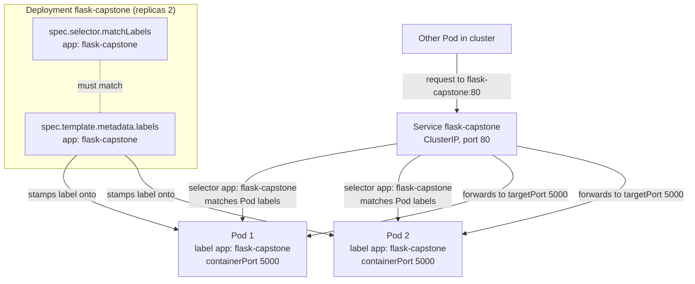

# Flask 앱용 쿠버네티스 매니페스트 작성

## 학습 목표
- `flask-capstone:1.0` 이미지를 실행하는 Deployment, Service, ConfigMap YAML 매니페스트를 작성한다.
- 레이블과 셀렉터(`matchLabels`)가 올바르게 연결되도록 하고, `replicas`, 컨테이너 이미지, `containerPort`를 설정한다.
- `/healthz` 엔드포인트를 대상으로 가벼운 readiness·liveness 프로브를 연결하고, 런타임 설정을 이미지 밖으로 꺼내 ConfigMap에 저장한다.

## 본문

### 지금까지의 흐름

이 캡스톤은 지금까지 세 단계를 거쳤다. 1강에서 `/healthz` 헬스체크 엔드포인트(HTTP 200 반환)를 포함한 소형 Flask 앱을 만들었다. 2강에서 그 앱을 Docker 이미지로 패키징하고 `flask-capstone:1.0`으로 태그를 달았다. 3강에서 로컬 클러스터(minikube 또는 kind)를 기동한 뒤 외부 레지스트리 없이도 사용할 수 있도록 그 이미지를 클러스터에 직접 로드했다.

현재 이미지는 클러스터 안에 들어가 있지만 실제로 실행되는 것은 아무것도 없다. 쿠버네티스는 이미지를 "그냥 실행"하지 않는다 — 원하는 상태를 *기술*해야 하고, 쿠버네티스는 실제 상태를 그 기술에 맞게 유지한다. 이 기술 파일이 바로 **매니페스트**다. 오브젝트의 원하는 상태를 선언하는 YAML 파일이다. 이번 강의에서 세 개를 작성한다. 아직 클러스터에 적용하지는 않는다(그건 5강에서). 지금 목표는 올바르고 잘 구조화된 YAML을 작성하고 각 필드의 의미를 이해하는 것이다.

> 매니페스트는 선언적이다. 앱을 어떻게 시작하라고 단계별로 지시하는 게 아니라, 무엇이 존재하길 원하는지 말하면 클러스터가 그 상태를 계속 유지한다.

작성할 오브젝트 세 가지와 각각의 역할은 다음과 같다.

- **Deployment** — Flask Pod의 복제본(레플리카)을 실행하고 감시한다. Pod가 죽으면 Deployment가 다시 만든다.
- **Service** — 개별 Pod가 생겼다 사라져도 외부에서 접근할 수 있는 안정적인 네트워크 주소 하나를 제공한다.
- **ConfigMap** — 환경 이름 같은 설정 값을 이미지 밖에 저장해, 이미지를 다시 빌드하지 않고도 설정을 바꿀 수 있게 한다.

하나씩 만들어보자.

### ConfigMap: 설정을 이미지 밖으로

출처 자료에서 반복해서 강조하는 핵심 원칙이 있다. **설정을 이미지 안에 집어넣지 말라.** 데이터베이스 URL이나 환경 이름이 컨테이너 이미지 속에 박혀 있으면, 그 값을 바꿀 때마다 이미지를 새로 빌드하고 다시 배포해야 한다. ConfigMap은 그 값들을 별도로 저장하고 Pod 실행 시점에 주입한다 — Pod가 읽을 수 있는 작은 설정 사전이라고 생각하면 된다.

여기서는 간단하게 환경 이름과 인사 메시지 두 값만 저장한다.

```yaml
# configmap.yaml
apiVersion: v1
kind: ConfigMap
metadata:
  name: flask-config
  labels:
    app: flask-capstone
data:
  APP_ENV: "production"
  APP_GREETING: "Hello from Kubernetes!"
```

`data`는 단순한 키/값 쌍이다. 다음 절에서 이 값들을 컨테이너의 환경 변수로 주입한다. 그러면 실행 중인 앱 안에서 `os.environ["APP_ENV"]`가 `"production"`을 반환한다. 이렇게 해두면 나중에 `APP_ENV`를 `staging`으로 바꾸고 싶을 때 이 파일 하나만 수정하고 Pod를 재시작하면 된다 — 이미지는 전혀 건드릴 필요가 없다.

### Deployment: 앱 실행

Deployment는 이번 강의의 핵심이다. 한마디로, 몇 개의 Pod가 실행되어야 하는지 선언하고 그 상태를 유지하는 역할을 한다. 전체 매니페스트를 먼저 보고, 이후 하나씩 살펴본다.

```yaml
# deployment.yaml
apiVersion: apps/v1
kind: Deployment
metadata:
  name: flask-capstone
  labels:
    app: flask-capstone
spec:
  replicas: 2
  selector:
    matchLabels:
      app: flask-capstone
  template:
    metadata:
      labels:
        app: flask-capstone
    spec:
      containers:
        - name: flask
          image: flask-capstone:1.0
          imagePullPolicy: IfNotPresent
          ports:
            - containerPort: 5000
          envFrom:
            - configMapRef:
                name: flask-config
          readinessProbe:
            httpGet:
              path: /healthz
              port: 5000
            initialDelaySeconds: 3
            periodSeconds: 5
          livenessProbe:
            httpGet:
              path: /healthz
              port: 5000
            initialDelaySeconds: 10
            periodSeconds: 10
```

중요한 필드를 하나씩 짚어보자.

**`replicas: 2`** — 동일한 Pod 두 개를 요청한다. 복제본을 여러 개 두는 것은 다운타임을 막는 기본 방법이다. Pod 하나(또는 그 아래 노드)가 죽어도 나머지 하나가 계속 요청을 받는 동안 쿠버네티스가 잃어버린 Pod를 복구한다.

**`image: flask-capstone:1.0`** — 2강에서 빌드한 이미지 이름과 태그를 그대로 쓴다. `docker.io/...` 같은 레지스트리 접두사가 없는 것은 의도적이다. 이미지가 클러스터 로컬에만 존재하기 때문이다.

**`imagePullPolicy: IfNotPresent`** — 이 설정이 없으면 작동하지 않는다. kubelet에게 "노드에 이미 있으면 그걸 쓰고, 없을 때만 레지스트리에서 당겨와라"라고 지시한다. 3강에서 이미지를 직접 로드했으므로 가져올 레지스트리가 없다. 이 설정을 빼두면(`:latest` 스타일 이미지의 기본값은 항상 풀) 쿠버네티스가 레지스트리에서 `flask-capstone:1.0`을 가져오려다 실패하고 Pod가 `ImagePullBackOff` 상태로 멈춘다.

> `imagePullPolicy: IfNotPresent`는 로컬에 로드한 이미지를 동작하게 해주는 핵심 설정이다. 이 줄을 빠뜨리면 Pod가 `ImagePullBackOff` 상태에 빠져, 이미지가 없는 레지스트리를 계속 찾게 된다.

**`containerPort: 5000`** — 컨테이너 안에서 Flask 프로세스가 리슨하는 포트를 문서화한다(Flask 개발 서버의 기본값은 5000). 이 설정은 정보 제공 목적이다 — 직접 포트를 열어주지는 않지만, Service와 프로브 모두 이 포트를 대상으로 한다.

**`envFrom` / `configMapRef`** — `flask-config` ConfigMap의 모든 키를 컨테이너의 환경 변수로 노출한다. 덕분에 `APP_ENV`와 `APP_GREETING`이 런타임에 앱에서 바로 사용 가능하며, 매니페스트 어디에도 값이 하드코딩되지 않는다.

### 레이블과 셀렉터의 연결 구조

초보자가 가장 자주 실수하는 부분이라 꼼꼼히 살펴볼 필요가 있다. Deployment 안에는 레이블 관련 블록이 세 개 등장하는데, 중복이 아니라 각자 다른 역할을 한다.

1. `metadata.labels` (최상위) — **Deployment 오브젝트 자체**에 붙는 레이블. Deployment를 정리하고 조회할 때 유용하다. 어떤 Pod를 관리할지와는 무관하다.
2. `spec.selector.matchLabels` — "이 Deployment는 이 레이블을 가진 Pod를 소유한다"는 규칙.
3. `spec.template.metadata.labels` — Deployment가 만드는 **각 Pod에 찍히는 레이블**.

핵심 요건: **`spec.selector.matchLabels`는 반드시 `spec.template.metadata.labels`와 일치해야 한다.** 위 파일에서는 둘 다 `app: flask-capstone`이므로 Deployment의 셀렉터가 직접 만든 Pod를 정확히 인식하고 관리할 수 있다. 이 둘이 다르면 API 서버가 매니페스트를 거부한다 — Deployment가 자신이 방금 만든 Pod를 알아보지 못하기 때문이다. 소유권의 흐름은 이렇다. Deployment의 셀렉터가 Pod 템플릿의 레이블을 가리키고, 그 레이블이 나중에 Service가 Pod를 찾는 데도 쓰인다.

### Service: Pod에 안정적인 주소 부여

Pod는 수명이 짧다. 각 Pod는 고유한 IP를 받지만, Pod가 재생성될 때마다 IP가 바뀐다. 그래서 Pod에 직접 접근하지 않고, 그룹 앞에 **Service**를 둔다. Service는 안정적인 이름과 IP를 갖고, 현재 셀렉터에 매칭되는 Pod들로 트래픽을 전달한다.

```yaml
# service.yaml
apiVersion: v1
kind: Service
metadata:
  name: flask-capstone
  labels:
    app: flask-capstone
spec:
  type: ClusterIP
  selector:
    app: flask-capstone
  ports:
    - port: 80
      targetPort: 5000
      protocol: TCP
```

핵심 연결 고리는 **`selector: app: flask-capstone`**이다. Service는 이 레이블로 Pod를 찾는데, 바로 Deployment가 각 Pod에 찍는 레이블(`spec.template.metadata.labels`)과 같다. Service와 Deployment가 이름으로 서로를 참조하는 게 아니라 레이블 합의로 연결되는 이유가 여기에 있다. 또한 readiness 프로브가 중요한 것도 이 때문이다 — *준비* 상태로 보고된 Pod만 Service의 엔드포인트 풀에 추가된다.

두 포트는 역할이 다르다. **`port: 80`**은 Service가 클러스터 내부에 노출하는 포트다 — 다른 Pod들은 `flask-capstone:80`으로 앱에 접근한다. **`targetPort: 5000`**은 트래픽이 전달되는 컨테이너 포트로, Flask 앱이 리슨하는 `containerPort`와 정확히 일치한다. `type: ClusterIP`(기본값)를 선택했으므로 Service는 클러스터 내부에서만 접근 가능하다. 외부에서 접근하는 것은 5강에서 다룬다.

세 오브젝트를 나란히 놓으면, 아래 다이어그램이 보여주듯 `app: flask-capstone` 레이블이 Deployment, Pod, Service를 하나로 묶는 단일 접착제 역할을 한다. 클라이언트 요청이 ClusterIP를 통해 각 컨테이너의 5000 포트로 전달되는 흐름도 확인할 수 있다.



### `/healthz`와 프로브 연결

1강에서 200을 반환하는 `/healthz` 라우트를 추가했다. 이제 그 엔드포인트가 진가를 발휘한다. 쿠버네티스는 두 종류의 헬스체크를 사용하는데, 역할이 진짜 다르다.

- **Readiness 프로브** — *"이 Pod가 아직 트래픽을 받을 준비가 됐나?"* 프로브가 실패해도 Pod를 **종료하지 않는다**. 대신 Service의 엔드포인트에서 Pod를 제거해, 준비가 될 때까지 요청이 해당 Pod로 가지 않게 한다. 아직 워밍업 중인 Pod에 트래픽이 들어가는 것을 막는 장치다.
- **Liveness 프로브** — *"이 Pod가 아직 정상인가, 아니면 멈춰 있나?"* 프로브가 연속으로 실패하면 쿠버네티스가 컨테이너를 **재시작**한다. 데드락이 걸리거나 응답 없이 멈춘 앱을 자동으로 복구하는 장치다.

두 프로브 모두 `port: 5000`의 `path: /healthz`에 대해 `httpGet`을 사용한다 — 쿠버네티스가 단순 HTTP GET을 날리고 200이 오면 정상으로 본다. 타이밍 설정은 프로브를 부드럽게 유지한다. `initialDelaySeconds`는 첫 번째 체크 전에 앱이 뜰 시간을 주고, `periodSeconds`는 이후 재확인 주기를 설정한다. liveness 체크는 readiness보다 늦게 시작하고 덜 자주 확인한다 — 느린 Pod의 트래픽은 빨리 빼내되, 잠깐의 지연으로 Pod를 섣불리 재시작하고 싶지 않기 때문이다.

> Readiness는 *트래픽*을 제어하고, liveness는 *재시작*을 제어한다. 단순히 200을 반환하는 가벼운 `/healthz`를 두 프로브에 모두 연결하는 것은 안전하고 널리 쓰이는 패턴이다. liveness 프로브 뒤에 무거운 작업(데이터베이스 깊은 조회 등)을 두지 말라 — 느린 체크가 불필요한 재시작을 유발할 수 있다.

### 다음 단계

이제 폴더에 `configmap.yaml`, `deployment.yaml`, `service.yaml` 세 파일이 있어야 한다. 이 파일들이 Flask 앱의 완전한 배포를 기술한다 — 레플리카 2개, ConfigMap에서 주입된 설정, Service가 앞단에서 트래픽을 받고, `/healthz` 프로브가 상태를 지킨다. 5강에서는 `kubectl apply`로 이 파일들을 실제로 적용하고, `kubectl get`·`kubectl describe`로 Pod 기동을 확인하고, 노트북에서 앱에 접근한 뒤 롤링 업데이트와 롤백을 실습한다.

## 핵심 정리
- 매니페스트는 **원하는 상태**를 선언한다. 세 핵심 오브젝트는 **Deployment**(레플리카 실행), **Service**(안정적 주소), **ConfigMap**(외부화된 설정)이다.
- `spec.selector.matchLabels`는 반드시 `spec.template.metadata.labels`와 **같아야** 하고, Service의 `selector`도 그 Pod 레이블과 일치해야 한다 — 연결의 수단은 이름 참조가 아니라 레이블이다.
- `image: flask-capstone:1.0`에는 반드시 `imagePullPolicy: IfNotPresent`를 함께 쓴다. 그래야 클러스터에 로컬로 로드한 이미지를 쓰고, 레지스트리에서 당기려다 실패하는 상황을 막을 수 있다.
- Pod의 `containerPort: 5000`과 Service의 `targetPort: 5000`은 일치해야 한다. Service의 `port: 80`은 클러스터 내부 클라이언트가 사용하는 포트다.
- Readiness 프로브는 **트래픽**을 제어하고, liveness 프로브는 **재시작**을 유발한다 — 둘 다 가벼운 `/healthz` 엔드포인트에 적절한 딜레이와 함께 연결한다.
- 설정은 `envFrom`으로 주입되는 ConfigMap에 보관한다. 설정을 바꿀 때 이미지를 다시 빌드하지 않아도 된다.
