# Deploy, Expose, Verify, and Roll Out

## Learning Objectives
- Apply your manifests with `kubectl apply`, then verify Pod and Service health using `get`, `describe`, and `logs`.
- Reach your running app from outside the cluster with `kubectl port-forward` (or a NodePort / `minikube service`).
- Ship a new version with a zero-downtime rolling update using `kubectl set image` and `kubectl rollout`, and roll back instantly with `kubectl rollout undo`.

## Body

This is the final lecture of the capstone, and it's where everything you've built comes alive. So far you wrote a Flask app (Lecture 1), packaged it into the image `flask-capstone:1.0` (Lecture 2), spun up a local cluster and loaded the image into it (Lecture 3), and authored `deployment.yaml` and `service.yaml` (Lecture 4). Right now those manifests are just files sitting on disk. In this lecture we hand them to Kubernetes, watch it bring your app to life, open a door to it from your laptop, and then practice the single most valuable day-2 skill an operator has: upgrading a live app without downtime — and undoing that upgrade in seconds when something goes wrong.

### Step 1 — Apply the manifests

A manifest describes the *desired state* — "I want 3 replicas of `flask-capstone:1.0` exposed on port 5000." Kubernetes is a control loop that constantly works to make reality match that description. You hand it the desired state with `apply`:

```bash
kubectl apply -f deployment.yaml
kubectl apply -f service.yaml
```

You can also point `apply` at a whole folder, which is the habit I'd recommend once you have several files:

```bash
kubectl apply -f .
```

`apply` is *declarative*: run it again after editing a file and Kubernetes computes the difference and changes only what's needed. That's why we prefer it over imperative one-off commands — your YAML is the single source of truth.

> Use `kubectl apply` rather than `kubectl create`. `apply` is idempotent — running it repeatedly is safe and is exactly how you'll push updates later in this lecture.

### Step 2 — Verify that it's actually healthy

Applying a manifest only means Kubernetes *accepted* your request. It does not mean your app is running. Always verify. Start with a quick inventory:

```bash
kubectl get pods
kubectl get svc
```

You're looking for Pods with status `Running` and a `READY` column that reads `1/1` (the container is up *and* its readiness probe is passing). To watch the rollout happen live, append `-w` (watch):

```bash
kubectl get pods -w
```

If a Pod is *not* healthy, `describe` is your microscope. It prints the Pod's events at the bottom — the single most useful debugging output in Kubernetes:

```bash
kubectl describe pod <pod-name>
```

And to see what your app itself is saying, read its logs (its stdout/stderr):

```bash
kubectl logs <pod-name>
kubectl logs -f <pod-name>   # -f follows the stream, like tail -f
```

The mental model is a simple triage flow: `get` tells you *which* Pod is unhappy, `describe` tells you *why Kubernetes* is unhappy with it, and `logs` tells you what *the application* is doing. The flow is as follows: list with `get`, drill into the suspect with `describe`, then confirm with `logs`, as the diagram below shows.

```mermaid Verification and triage flow: get to describe to logs
flowchart TD
    A["kubectl get pods"] --> B{"READY 1/1 and Running?"}
    B -->|Yes| OK["App is healthy - move on"]
    B -->|No| C["kubectl describe pod &lt;name&gt;<br/>read the Events at the bottom"]
    C --> D{"Which layer is unhappy?"}
    D -->|Kubernetes cannot schedule or pull| E["Fix infra: image load,<br/>imagePullPolicy, resources"]
    D -->|Container starts then dies| F["kubectl logs &lt;name&gt;<br/>add --previous after a crash"]
    F --> G["Fix the app, then re-apply"]
    E --> A
    G --> A
```



> Two failures you will almost certainly meet:
> **`ImagePullBackOff`** — Kubernetes can't fetch the image. On minikube/kind this usually means you forgot to load the image (`minikube image load flask-capstone:1.0`) or your manifest must set `imagePullPolicy: IfNotPresent` so the cluster uses the locally loaded copy instead of trying to download it.
> **`CrashLoopBackOff`** — the image was pulled, but the container starts and immediately dies, so Kubernetes keeps restarting it with increasing delay. The cause is inside the app — run `kubectl logs <pod>` (add `--previous` to see the log from the crash before the last restart).

### Step 3 — Expose the app and reach it

Your Pods are running, but they live on a private cluster network you can't touch directly from your laptop. The quickest way to open a temporary tunnel for testing is `port-forward`:

```bash
kubectl port-forward svc/flask-capstone 8080:5000
```

This wires `localhost:8080` on your machine straight to port 5000 on the Service. Open another terminal and hit it:

```bash
curl http://localhost:8080/
curl http://localhost:8080/healthz
```

You should see your Flask responses. `port-forward` is perfect for a quick check, but it only lives as long as the command runs (Ctrl-C ends it). For something more durable, expose the Service as a **NodePort**, which opens a fixed port on the cluster node itself. On minikube the friendliest way is:

```bash
minikube service flask-capstone --url
```

This prints a URL you can open in a browser. (Under the hood it maps the NodePort to a reachable address — handy because on some platforms the node IP isn't directly routable.) Either way, the moment you get a `200` back from `/healthz`, you have a genuinely deployed app.

### Step 4 — Roll out a new version with zero downtime

Now the part operators care about most. You've fixed a bug or added a feature, rebuilt the image, and tagged it `flask-capstone:2.0`. (Remember to load the new tag into the cluster too: `minikube image load flask-capstone:2.0`.) You want to ship it *without* a single failed request.

By default a Deployment uses the **rolling update** strategy: Kubernetes brings up new-version Pods a few at a time and tears down old ones only as the new ones become ready, so there is always a healthy set serving traffic. Two knobs govern the pace, and their defaults are `25%` each:

- **`maxUnavailable`** — how many Pods may be down at once during the update (with 3 replicas, default lets 1 be unavailable).
- **`maxSurge`** — how many *extra* Pods may be created above your desired count (so you briefly run up to 125% of replicas).

You can trigger the update in two equivalent ways. The clean, repeatable way is to bump the image tag in `deployment.yaml` and re-apply:

```bash
# edit image: flask-capstone:2.0 in deployment.yaml, then
kubectl apply -f deployment.yaml
```

The quick imperative way — great for demos — is `set image`:

```bash
kubectl set image deployment/flask-capstone flask-capstone=flask-capstone:2.0
```

(The pattern is `deployment/<name> <container-name>=<new-image>`.) Either command kicks off the same rolling replacement. Watch it progress in a human-readable form:

```bash
kubectl rollout status deployment/flask-capstone
```

It blocks until the rollout finishes and prints `successfully rolled out`. While it runs, a parallel `kubectl get pods -w` shows old Pods terminating and new ones appearing — never all at once. If you kept that `curl` loop from Step 3 running, you'll see responses flip from v1 to v2 with no errors in between. That's zero-downtime deployment in action. The diagram below traces how the Deployment shifts replicas from the old ReplicaSet to the new one, one Pod at a time.

```mermaid Rolling update: gradual Pod swap from old to new ReplicaSet (3 replicas)
flowchart TD
    subgraph S0["Start - v1 steady state"]
        A1["old RS: 3 Pods v1.0 Ready"]
    end
    subgraph S1["maxSurge adds one new Pod"]
        B1["old RS: 3 Pods v1.0"]
        B2["new RS: 1 Pod v2.0 starting"]
    end
    subgraph S2["New Pod Ready, one old Pod terminates"]
        C1["old RS: 2 Pods v1.0"]
        C2["new RS: 1 Pod v2.0 Ready + 1 starting"]
    end
    subgraph S3["Repeat until all replaced"]
        D1["old RS: 0 Pods"]
        D2["new RS: 3 Pods v2.0 Ready"]
    end
    S0 --> S1 --> S2 --> S3
    note["maxUnavailable caps how many can be down;<br/>maxSurge caps the extra Pods - traffic never drops to zero"]
    S2 -.governed by.- note
```

The `rollout` subcommand has more to offer. You can pause mid-upgrade to inspect things, then resume, and you can review what's happened:

```bash
kubectl rollout pause deployment/flask-capstone
kubectl rollout resume deployment/flask-capstone
kubectl rollout history deployment/flask-capstone
```

Each apply or `set image` creates a numbered *revision*, which is exactly what makes the next step possible.

### Step 5 — Roll back when 2.0 misbehaves

Suppose `flask-capstone:2.0` ships a bug, or — a classic — you fat-finger a tag that doesn't exist. With a bad tag the new Pods land in `ImagePullBackOff`, but here's the reassuring part: **Kubernetes will not kill the old, working Pods until the new ones are healthy.** Your app keeps serving v1 while the rollout simply hangs (`rollout status` waits forever). That's the safety net doing its job. When you've confirmed the new version is bad, undo it:

```bash
kubectl rollout undo deployment/flask-capstone
```

Kubernetes rolls you straight back to the previous revision — the same gradual, zero-downtime mechanism, just in reverse. You can also target a specific past revision from the history:

```bash
kubectl rollout undo deployment/flask-capstone --to-revision=2
```

A few seconds and one command turns a bad release into a non-event. This is precisely why teams trust Kubernetes for production: every deploy is reversible.

### The whole journey, in one breath

Step back and look at what you just did across five lectures. You started with a few lines of Python. You wrote a Dockerfile and built **an image** (`flask-capstone:1.0`). You stood up **a cluster** and loaded the image into it. You described your intent in **manifests** — a Deployment for "keep N copies of this image running" and a Service for "give them one stable address." Then, in this lecture, you **deployed** those manifests, **verified** health with `get`/`describe`/`logs`, **exposed** the app to the outside world, and **operated** it through a real upgrade and rollback. App → image → cluster → manifest → deploy → operate: that loop is the entire shape of running software on Kubernetes, and you've now done it end to end with your own hands.

The deployment strategies covered in the source videos go further — recreate, blue-green, and canary releases let larger teams trade speed for safety in different ways — but rolling updates with `rollout undo` are the everyday default, and they're now part of your toolkit.

## Key Takeaways
- `kubectl apply -f` declaratively sends your desired state to the cluster; re-applying is safe and is how you push updates.
- Always verify after applying: `get` to find the unhealthy Pod, `describe` to read its events, `logs` to read the app's own output.
- `ImagePullBackOff` means Kubernetes can't get the image (load it locally and set `imagePullPolicy: IfNotPresent`); `CrashLoopBackOff` means the app starts and dies (check `kubectl logs --previous`).
- `port-forward` opens a quick temporary tunnel for testing; a NodePort (or `minikube service --url`) gives a more durable external entry point.
- The default rolling update (`maxUnavailable`/`maxSurge` ≈ 25%) replaces Pods gradually so there's no downtime; trigger it with `kubectl set image` or by re-applying an edited manifest, and watch it with `kubectl rollout status`.
- Every release is a numbered revision, so `kubectl rollout undo` rolls back to the last good version in seconds — and bad images never take down the old, working Pods.
