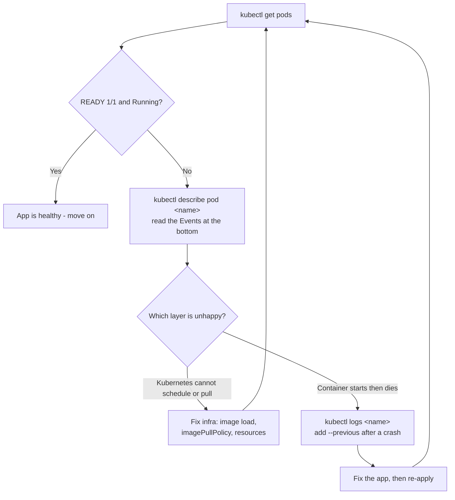
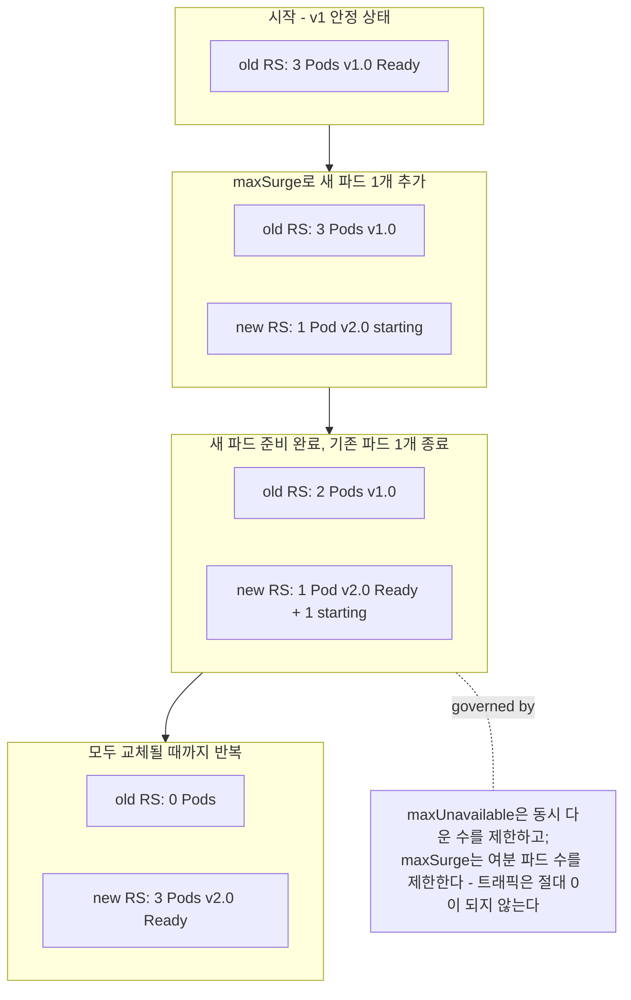

# 배포, 노출, 검증, 그리고 롤아웃

## 학습 목표
- `kubectl apply`로 매니페스트를 적용한 뒤, `get` · `describe` · `logs`로 파드와 서비스 상태를 검증한다.
- `kubectl port-forward`(또는 NodePort / `minikube service`)로 클러스터 외부에서 실행 중인 앱에 접근한다.
- `kubectl set image`와 `kubectl rollout`으로 무중단 롤링 업데이트를 수행하고, `kubectl rollout undo`로 즉시 롤백한다.

## 본문

캡스톤의 마지막 강의다. 지금까지 쌓아온 모든 것이 실제로 살아 움직이는 순간이다. 1강에서 Flask 앱을 작성하고, 2강에서 `flask-capstone:1.0` 이미지로 패키징했으며, 3강에서 로컬 클러스터를 구성해 이미지를 로드했고, 4강에서 `deployment.yaml`과 `service.yaml`을 작성했다. 지금 이 매니페스트들은 디스크에 저장된 파일일 뿐이다. 이번 강의에서는 그 파일을 쿠버네티스에 넘기고, 앱이 살아나는 과정을 지켜보고, 노트북에서 앱에 접근하는 문을 열고, 그다음 운영자가 갖춰야 할 가장 가치 있는 기술인 무중단 업그레이드와 즉각적인 롤백을 직접 경험한다.

### 1단계 — 매니페스트 적용

매니페스트는 *원하는 상태(desired state)*를 표현한다. "포트 5000에서 `flask-capstone:1.0` 레플리카 3개를 실행한다"는 식이다. 쿠버네티스는 현실이 이 선언과 일치하도록 끊임없이 동작하는 제어 루프다. `apply`로 원하는 상태를 전달한다.

```bash
kubectl apply -f deployment.yaml
kubectl apply -f service.yaml
```

파일이 여러 개라면 폴더 전체를 한 번에 지정하는 편이 낫다. 파일이 늘어날수록 이 방식을 습관으로 들이길 권한다.

```bash
kubectl apply -f .
```

`apply`는 *선언적(declarative)*이다. 파일을 수정한 뒤 다시 실행하면 쿠버네티스가 차이를 계산해 필요한 부분만 변경한다. 일회성 명령형 커맨드보다 선호하는 이유가 바로 이것이다. YAML이 유일한 진실의 원천(source of truth)이 된다.

> `kubectl create` 대신 `kubectl apply`를 쓴다. `apply`는 멱등(idempotent)하다. 반복해서 실행해도 안전하며, 이 강의 후반부에서 업데이트를 배포할 때도 같은 방식을 쓴다.

### 2단계 — 실제로 정상인지 검증

매니페스트를 적용했다는 것은 쿠버네티스가 요청을 *수락*했다는 뜻일 뿐, 앱이 실행 중임을 보장하지 않는다. 반드시 확인해야 한다. 먼저 전체 상태를 훑어본다.

```bash
kubectl get pods
kubectl get svc
```

확인할 항목은 파드 상태가 `Running`이고 `READY` 열이 `1/1`인지다(`1/1`은 컨테이너가 실행 중이면서 레디니스 프로브도 통과했다는 의미다). 롤아웃이 진행되는 모습을 실시간으로 보려면 `-w` 옵션을 붙인다.

```bash
kubectl get pods -w
```

파드가 정상이 아니라면 `describe`가 현미경 역할을 한다. 하단에 파드 이벤트가 출력되는데, 쿠버네티스에서 가장 유용한 디버깅 정보다.

```bash
kubectl describe pod <pod-name>
```

앱 자체가 무슨 말을 하는지 보려면 로그(stdout/stderr)를 읽는다.

```bash
kubectl logs <pod-name>
kubectl logs -f <pod-name>   # -f는 스트림을 따라가며 출력한다 (tail -f와 같다)
```

트리아지 흐름은 단순하다. `get`으로 *어떤* 파드가 문제인지 찾고, `describe`로 *쿠버네티스가* 왜 그 파드를 문제 삼는지 확인하고, `logs`로 *앱 자체*가 어떤 상태인지 파악한다. 아래 다이어그램처럼 `get`으로 목록을 보고, 의심되는 파드를 `describe`로 파고들고, `logs`로 최종 확인하면 된다.



> 거의 반드시 마주치게 될 두 가지 오류가 있다.
> **`ImagePullBackOff`** — 쿠버네티스가 이미지를 가져오지 못한 것이다. minikube/kind 환경에서는 대부분 이미지 로드를 빠뜨렸거나(`minikube image load flask-capstone:1.0`), 매니페스트에 `imagePullPolicy: IfNotPresent`가 없어서 클러스터가 다운로드를 시도하는 경우다.
> **`CrashLoopBackOff`** — 이미지는 받아왔지만 컨테이너가 시작하자마자 죽어 쿠버네티스가 점점 간격을 늘려가며 재시작하는 것이다. 원인은 앱 내부에 있다. `kubectl logs <pod>`를 실행하고(마지막 재시작 이전 로그를 보려면 `--previous`를 붙인다), 앱 코드를 확인한다.

### 3단계 — 앱을 외부에 노출하고 접근하기

파드는 실행 중이지만, 노트북에서 직접 접근할 수 없는 프라이빗 클러스터 네트워크 안에 있다. 테스트용으로 임시 터널을 여는 가장 빠른 방법은 `port-forward`다.

```bash
kubectl port-forward svc/flask-capstone 8080:5000
```

이 명령은 로컬 머신의 `localhost:8080`을 서비스의 포트 5000에 직접 연결한다. 다른 터미널을 열고 요청을 보내본다.

```bash
curl http://localhost:8080/
curl http://localhost:8080/healthz
```

Flask 응답이 돌아오면 성공이다. `port-forward`는 빠른 확인에 딱 맞지만, 명령이 실행 중인 동안만 유지된다(Ctrl-C로 끊기면 사라진다). 더 오래 지속되는 접근이 필요하다면 **NodePort**로 서비스를 노출한다. minikube에서는 다음이 가장 편리하다.

```bash
minikube service flask-capstone --url
```

브라우저에서 열 수 있는 URL이 출력된다(내부적으로 NodePort를 라우팅 가능한 주소로 매핑한다. 일부 플랫폼에서는 노드 IP에 직접 접근하기 어렵기 때문에 유용하다). 어느 방법을 쓰든 `/healthz`에서 `200`이 돌아오는 순간, 앱이 진짜로 배포된 것이다.

### 4단계 — 무중단으로 새 버전 롤아웃

운영자가 가장 관심 갖는 부분이다. 버그를 고치거나 기능을 추가해 이미지를 새로 빌드하고 `flask-capstone:2.0`으로 태깅했다. (새 태그도 클러스터에 로드하는 것을 잊지 않는다. `minikube image load flask-capstone:2.0`) 요청 하나도 실패하지 않고 배포하고 싶다.

디플로이먼트는 기본적으로 **롤링 업데이트** 전략을 사용한다. 쿠버네티스가 새 버전 파드를 소량씩 올리고, 새 파드가 준비되면 그제서야 기존 파드를 내린다. 항상 정상 파드 집합이 트래픽을 처리하는 구조다. 속도를 조절하는 두 가지 파라미터는 기본값이 각각 `25%`다.

- **`maxUnavailable`** — 업데이트 중에 동시에 다운될 수 있는 파드 수(레플리카 3개 기준으로 기본값은 1개).
- **`maxSurge`** — 원하는 수보다 추가로 생성할 수 있는 *여분* 파드 수(즉, 최대 125%의 레플리카가 잠시 동시에 실행된다).

업데이트를 트리거하는 방법은 두 가지다. 깔끔하고 재현 가능한 방법은 `deployment.yaml`에서 이미지 태그를 변경한 뒤 재적용하는 것이다.

```bash
# deployment.yaml에서 이미지를 flask-capstone:2.0으로 수정한 뒤
kubectl apply -f deployment.yaml
```

데모용으로 빠르게 쓸 수 있는 명령형 방법은 `set image`다.

```bash
kubectl set image deployment/flask-capstone flask-capstone=flask-capstone:2.0
```

(패턴은 `deployment/<이름> <컨테이너명>=<새이미지>`다.) 어느 방법을 쓰든 동일한 롤링 교체가 시작된다. 진행 상황을 사람이 읽기 좋은 형태로 확인한다.

```bash
kubectl rollout status deployment/flask-capstone
```

롤아웃이 완료되면 `successfully rolled out`이 출력되면서 블로킹이 풀린다. 이와 동시에 `kubectl get pods -w`를 실행하면 기존 파드가 종료되고 새 파드가 올라오는 과정을 볼 수 있다. 한꺼번에 교체되지 않는다. 3단계에서 `curl` 루프를 돌리고 있었다면, 오류 없이 v1에서 v2로 응답이 바뀌는 것을 확인할 수 있다. 무중단 배포가 실제로 동작하는 모습이다. 아래 다이어그램은 디플로이먼트가 기존 레플리카셋에서 새 레플리카셋으로 파드를 한 개씩 전환하는 과정을 보여준다.



`rollout` 서브커맨드에는 더 많은 기능이 있다. 업그레이드 도중에 일시 정지해 상태를 점검하고 다시 재개하거나, 이력을 확인할 수 있다.

```bash
kubectl rollout pause deployment/flask-capstone
kubectl rollout resume deployment/flask-capstone
kubectl rollout history deployment/flask-capstone
```

`apply`나 `set image`를 실행할 때마다 번호가 매겨진 *리비전(revision)*이 생성된다. 이것이 다음 단계를 가능하게 하는 열쇠다.

### 5단계 — 2.0이 문제를 일으킬 때 롤백

`flask-capstone:2.0`에 버그가 있거나, 흔한 실수로 존재하지 않는 태그를 잘못 입력했다고 가정하자. 잘못된 태그라면 새 파드가 `ImagePullBackOff` 상태에 빠지지만, 안심이 되는 부분이 있다. **쿠버네티스는 새 파드가 정상이 될 때까지 기존에 잘 작동하던 파드를 죽이지 않는다.** 롤아웃이 멈춘 상태(`rollout status`는 무한 대기)에서도 앱은 v1으로 트래픽을 계속 처리한다. 안전망이 제 역할을 하는 것이다. 새 버전이 문제라는 것을 확인했다면 되돌린다.

```bash
kubectl rollout undo deployment/flask-capstone
```

쿠버네티스가 이전 리비전으로 즉시 롤백한다. 동일한 점진적·무중단 메커니즘이지만 방향이 반대다. 이력에서 특정 과거 리비전을 지정할 수도 있다.

```bash
kubectl rollout undo deployment/flask-capstone --to-revision=2
```

몇 초와 명령어 하나로 잘못된 릴리스를 없었던 일로 만들 수 있다. 모든 배포가 되돌릴 수 있기 때문에 팀이 쿠버네티스를 프로덕션에서 신뢰하는 이유가 바로 이것이다.

### 전체 여정, 한 번에 돌아보기

다섯 강의를 통해 무엇을 했는지 되짚어보자. 파이썬 코드 몇 줄로 시작했다. Dockerfile을 작성해 **이미지**(`flask-capstone:1.0`)를 빌드했다. **클러스터**를 구성하고 이미지를 로드했다. **매니페스트**로 의도를 선언했다. 디플로이먼트는 "이 이미지의 N개 복사본을 실행한다", 서비스는 "하나의 안정적인 주소를 부여한다"는 뜻이다. 그리고 이번 강의에서 매니페스트를 **배포**하고, `get`/`describe`/`logs`로 상태를 **검증**하고, 앱을 외부에 **노출**하고, 실제 업그레이드와 롤백을 통해 **운영**했다. 앱 → 이미지 → 클러스터 → 매니페스트 → 배포 → 운영. 이것이 쿠버네티스에서 소프트웨어를 실행하는 전체 흐름이며, 이제 직접 처음부터 끝까지 해본 것이다.

소스 영상에서 다루는 배포 전략은 더 깊다. Recreate, 블루-그린, 카나리 릴리스 같은 방식은 팀 규모에 따라 속도와 안전성을 다르게 조율한다. 하지만 `rollout undo`와 함께 쓰는 롤링 업데이트가 일상적인 기본값이며, 이제 그것이 여러분의 도구 상자 안에 있다.

## 핵심 요약
- `kubectl apply -f`는 원하는 상태를 클러스터에 선언적으로 전달한다. 재실행해도 안전하며, 업데이트를 배포하는 방법도 동일하다.
- 적용 후에는 반드시 검증한다. `get`으로 문제 파드를 찾고, `describe`로 이벤트를 읽고, `logs`로 앱 출력을 확인한다.
- `ImagePullBackOff`는 이미지를 가져오지 못한 것이다(로컬 로드 후 `imagePullPolicy: IfNotPresent` 설정). `CrashLoopBackOff`는 앱이 시작 후 죽는 것이다(`kubectl logs --previous` 확인).
- `port-forward`는 빠른 임시 테스트용 터널이고, NodePort(`minikube service --url`)는 더 오래 지속되는 외부 접근점이다.
- 기본 롤링 업데이트(`maxUnavailable`/`maxSurge` ≈ 25%)는 파드를 점진적으로 교체해 다운타임이 없다. `kubectl set image`나 수정된 매니페스트 재적용으로 트리거하고, `kubectl rollout status`로 진행 상황을 확인한다.
- 모든 릴리스는 번호 매겨진 리비전으로 저장되므로, `kubectl rollout undo`로 몇 초 안에 이전 정상 버전으로 돌아갈 수 있다. 잘못된 이미지가 기존에 작동하던 파드를 죽이는 일은 절대 없다.
