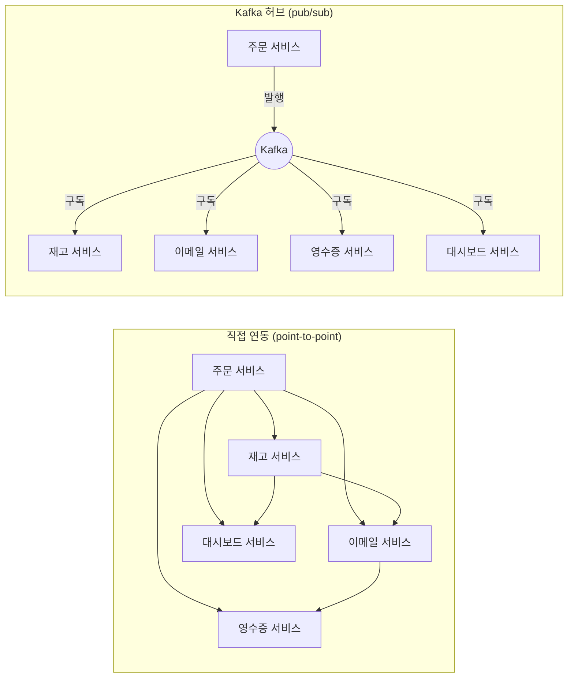

# Kafka란 무엇인가 - 메시징과 이벤트 스트리밍이 필요한 이유

## 학습 목표
- 시스템 간 직접 연동(point-to-point)의 한계와 비동기 메시징의 필요성을 이해한다
- 메시지 큐와 이벤트 스트리밍의 차이, Kafka가 등장한 배경을 설명할 수 있다
- Kafka가 어떤 문제를 해결하는지 실제 사용 사례로 파악한다

## 본문

### 왜 이 주제를 배우는가
요즘 우리가 쓰는 거의 모든 서비스는 "실시간"으로 동작합니다. 주문하면 곧바로 알림이 오고, 배달 기사의 위치가 지도 위에서 계속 움직이며, 카드 결제가 일어나는 순간 이상거래가 탐지됩니다. 이런 경험의 뒤편에는 **수많은 시스템이 서로 데이터를 끊임없이 주고받는** 구조가 있습니다. Kafka는 바로 이 "데이터를 안전하고 빠르게 흘려보내는 일"을 전문으로 하는 도구입니다. Kafka가 왜 태어났는지를 이해하면, 이후 배울 모든 개념이 자연스럽게 연결됩니다.

### 직접 연동(point-to-point)의 한계
온라인 쇼핑몰을 예로 들어 봅시다. 고객이 주문을 하면 여러 일이 연쇄적으로 일어나야 합니다. 재고를 차감하고, 확인 이메일을 보내고, 영수증을 발행하고, 매출 대시보드를 갱신합니다.

가장 단순한 방법은 **주문 서비스가 다른 서비스들을 직접 호출**하는 것입니다. "재고야 차감해", "이메일아 보내" 하고 일일이 부르는 방식이죠. 작을 때는 잘 동작합니다. 하지만 트래픽이 폭증하거나 서비스가 늘어나면 문제가 드러납니다.

- **강한 결합(tight coupling):** 한 서비스가 다른 서비스를 직접 부르므로 서로 깊게 얽힙니다. 새 기능 하나 추가하려면 연결선을 또 그어야 합니다.
- **동기 통신의 도미노:** 호출한 쪽이 응답을 기다립니다. 결제 서비스가 느려지면 주문 전체가 멈추고, 사용자는 로딩 화면만 바라봅니다.
- **단일 장애점(single point of failure):** 재고 서비스가 10분 멈추면, 그동안 들어온 주문이 모두 밀려 더 큰 장애로 번집니다.
- **데이터 유실:** 분석 서비스가 잠시 죽으면 그 사이의 중요한 데이터가 그냥 사라집니다.

> 직접 연동은 서비스가 적을 때만 깔끔합니다. 서비스가 늘면 연결선이 거미줄처럼 폭증하고, 한 곳의 장애가 전체로 번지는 구조가 됩니다.

아래 그림처럼, 직접 연동(왼쪽)은 서비스가 늘수록 연결선이 거미줄처럼 얽히지만, Kafka를 중간 허브로 두면(오른쪽) 각 서비스는 Kafka하고만 연결됩니다.

### 비동기 메시징이라는 해법: 중간에 "우체국"을 둔다
이 문제를 푸는 핵심 아이디어는 서비스들 사이에 **중간 다리 역할을 하는 도구**를 두는 것입니다. 좋은 비유가 우체국입니다. 우리는 택배를 보낼 때 받는 사람 집까지 직접 날아가지 않습니다. 우체국에 맡기고 내 일을 하러 갑니다. 우체국이 알아서 배달해 줄 것을 믿기 때문이죠.

Kafka가 바로 이 우체국 역할을 합니다. 주문 서비스는 "주문이 발생했다"는 사실을 **이벤트(event)** 라는 작은 꾸러미로 만들어 Kafka에 던져두고 곧바로 자기 일을 계속합니다. 응답을 기다리지 않습니다. 이렇게 보내는 쪽과 받는 쪽이 서로 기다리지 않는 통신을 **비동기 메시징(asynchronous messaging)** 이라 합니다. 이벤트를 만들어 보내는 쪽을 **프로듀서(Producer, 생산자)**, 그 이벤트를 받아 처리하는 쪽을 **컨슈머(Consumer, 소비자)** 라고 부릅니다.

이렇게 중간에 우체국을 두면 결합이 느슨해집니다(이를 **디커플링/decoupling**, 즉 의존성 분리라고 합니다). 주문 서비스는 누가 그 이벤트를 받는지 신경 쓰지 않고, 받는 서비스는 필요할 때 골라서 가져갑니다. 새 서비스를 추가해도 기존 서비스를 고칠 필요가 없습니다.

### 메시지 큐 vs 이벤트 스트리밍
중간 다리 역할을 하는 도구는 예전에도 있었습니다. RabbitMQ 같은 **전통적인 메시지 큐(message queue)** 가 대표적입니다. 그렇다면 Kafka는 무엇이 다를까요?

가장 큰 차이는 **메시지를 소비한 뒤에 어떻게 되는가**입니다.

- **전통적 메시지 큐:** 컨슈머가 메시지를 꺼내 처리하면, 그 메시지는 큐에서 사라집니다. 한 번 쓰고 버리는 일회용에 가깝습니다.
- **Kafka(이벤트 스트리밍):** 이벤트를 읽어가도 **사라지지 않고 그대로 저장**됩니다. 설정한 보관 기간(retention) 동안 디스크에 남아 있어, 다른 서비스가 나중에 다시 읽거나 여러 번 읽을 수 있습니다.

쉽게 말해 전통적 큐가 "실시간 TV 방송"이라면, Kafka는 "넷플릭스"입니다. TV는 정해진 시간에 봐야 하고 놓치면 끝이지만, 넷플릭스는 원하는 때에, 원하는 속도로, 처음부터 다시 볼 수 있습니다. 이렇게 **연속적으로 흘러드는 데이터를 저장하면서 동시에 실시간으로 흘려보내는 방식**을 이벤트 스트리밍(event streaming)이라고 부릅니다.

> Kafka의 메시지는 "읽으면 사라지는 우편물"이 아니라 "보관 기간 동안 남아 있는 기록"입니다. 이 점이 단순 메시지 큐와 Kafka를 가르는 결정적 차이입니다.

### Kafka가 등장한 배경
Kafka는 2010년경 **LinkedIn**에서 만들어졌습니다. 사용자가 폭발적으로 늘면서 매초 막대한 양의 활동 데이터가 쏟아졌고, 기존 도구로는 이 규모를 감당할 수 없었습니다. LinkedIn 엔지니어들은 여러 서버에 데이터를 나눠 저장하고 처리하는 **분산(distributed) 스트리밍 플랫폼**을 새로 설계했고, 2011년 이를 오픈소스로 공개했습니다. 오늘날 Kafka는 대규모 실시간 데이터를 다루는 사실상의 표준이 되었습니다.

### 실제 사용 사례
Kafka가 어떤 문제를 푸는지는 사례로 보면 분명합니다.

- **시스템 간 결합 분리:** 결제·배송·재고·알림 서비스를 직접 잇는 대신, 각 서비스가 이벤트를 발행/구독하게 해 서로 독립적으로 개발·운영합니다.
- **실시간 위치 추적:** 차량 호출 서비스에서 기사의 위치를 매초 이벤트로 보내, 사용자 지도를 갱신하거나 수요·공급에 따른 요금을 계산합니다.
- **실시간 분석:** 사용자가 듣는 노래, 클릭하는 상품 같은 활동을 모아 추천이나 매출 대시보드를 즉시 갱신합니다.
- **이상거래 탐지:** 카드 결제 이벤트를 실시간으로 흘려보내 부정 거래를 그 즉시 잡아냅니다.

이때 한 개의 이벤트를 하나씩 처리하는 것이 기본 컨슈머의 역할이고, 끊임없이 흐르는 데이터를 모아 집계·분석하는 더 고급 처리(스트림 처리)도 가능합니다. 다만 이런 심화 기능은 이 강좌의 범위를 넘어가므로 **Kafka 중급 트랙**에서 다룹니다.

## 핵심 요약
- 서비스를 직접 잇는 point-to-point 방식은 강한 결합·동기 대기·단일 장애점 때문에 규모가 커지면 무너진다.
- Kafka는 중간에서 메시지를 받아 전달하는 "우체국" 역할을 해 비동기·느슨한 결합을 가능하게 한다.
- 전통적 메시지 큐는 읽으면 메시지가 사라지지만, Kafka는 이벤트를 보관 기간 동안 저장해 여러 컨슈머가 반복해 읽을 수 있다(이벤트 스트리밍).
- Kafka는 LinkedIn이 대규모 실시간 데이터를 다루기 위해 만든 분산 스트리밍 플랫폼이며, 결합 분리·위치 추적·실시간 분석·이상 탐지 등에 쓰인다.
