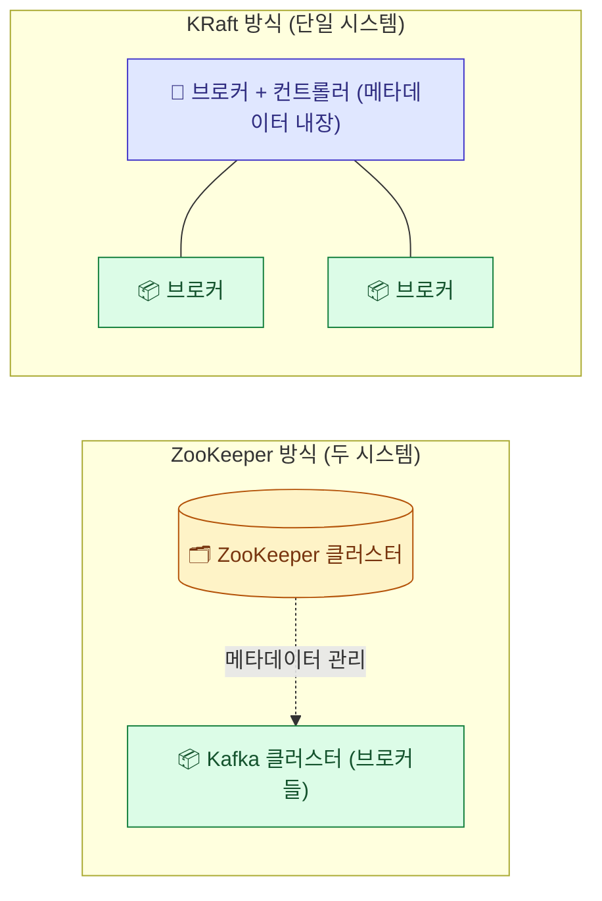
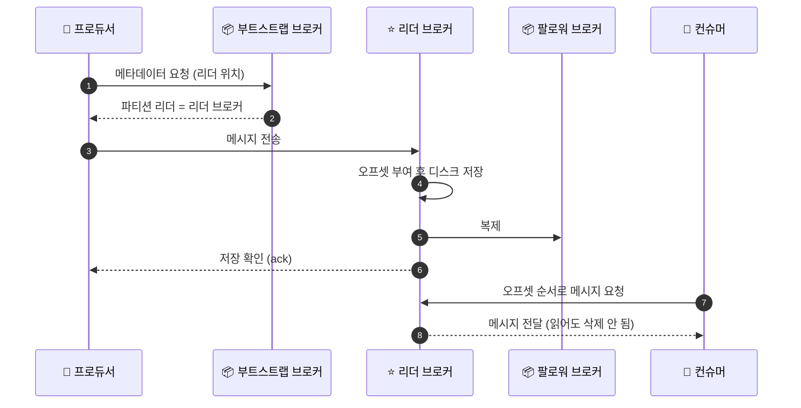

# Kafka 아키텍처 - 클러스터, 브로커, ZooKeeper vs KRaft

## 학습 목표
- 여러 브로커가 모여 클러스터를 이루는 구조와 역할 분담을 이해한다
- 메타데이터 관리에서 ZooKeeper 방식과 KRaft 방식의 차이를 구분한다
- Producer/Consumer가 클러스터와 통신하는 전체 흐름을 그릴 수 있다

## 본문

### 왜 이 주제를 배우는가
2강에서 토픽·파티션·오프셋·브로커라는 부품을 하나씩 살펴봤습니다. 이번에는 이 부품들이 **여러 대의 서버 위에서 어떻게 협력하는지**, 그리고 프로듀서와 컨슈머가 그 시스템과 **어떻게 통신하는지** 전체 그림을 그려 봅니다. Kafka는 한 대로도 돌아가지만, 진짜 가치는 여러 서버가 함께 동작하며 안정성과 확장성을 제공하는 데 있습니다.

### 클러스터와 브로커 - 여러 서버의 협력
**Broker(브로커)** 는 Kafka 서버 한 대입니다. 그리고 이런 브로커 여러 대가 함께 묶여 동작하는 것을 **클러스터(cluster)** 라고 부릅니다. 클러스터는 여러 서버, 심지어 여러 데이터센터에 걸쳐 펼쳐질 수 있습니다.

왜 굳이 여러 대를 둘까요? 두 가지 이유입니다.

- **확장성:** 한 토픽의 파티션들을 여러 브로커에 나눠 두면, 한 서버의 입출력 한계에 묶이지 않습니다. 처리량이 부족하면 브로커와 파티션을 늘리면 됩니다.
- **고가용성(high availability):** 브로커 한 대가 죽어도 다른 브로커가 일을 이어받아 서비스가 멈추지 않습니다.

### 복제 - 데이터를 잃지 않는 장치 (개념만)
고가용성의 핵심은 **복제(replication)** 입니다. 같은 파티션을 여러 브로커에 복사본으로 둡니다. 이 중 하나가 **리더(leader, 대표)** 가 되어 실제 읽기와 쓰기를 담당하고, 나머지는 **팔로워(follower)** 로서 리더의 내용을 따라 복사합니다.

프로듀서와 컨슈머는 기본적으로 **리더 파티션과만 통신**합니다. 그러다 리더가 있던 브로커가 죽으면, 팔로워 중 하나가 자동으로 새 리더로 뽑혀(leader election) 읽기·쓰기를 이어받습니다. 사용자는 데이터 손실 없이 계속 쓰고 읽을 수 있습니다.

> 이 강의에서는 복제를 "데이터를 여러 브로커에 복사해 한 대가 죽어도 견디는 장치" 정도로만 이해하면 충분합니다. 복제 인수(replication factor)나 ISR 같은 세부 운영 개념은 Kafka 중급 트랙에서 다룹니다.

### 클러스터를 누가 조율하는가 - 컨트롤러와 메타데이터
여러 브로커가 함께 일하려면 누군가는 전체 상태를 관리해야 합니다. "지금 어떤 브로커가 살아 있는지", "각 파티션의 리더는 누구인지", "토픽 설정은 어떤지" 같은 정보를 **메타데이터(metadata)** 라고 합니다. 이 메타데이터를 관리하고 리더를 정하는 등의 조율 역할을 **컨트롤러(controller)** 가 맡습니다. 클러스터에는 활성 컨트롤러가 한 개만 있습니다.

문제는 "이 컨트롤러와 메타데이터를 어떻게 관리하느냐"인데, 여기서 두 가지 방식이 등장합니다. 바로 ZooKeeper 방식과 KRaft 방식입니다.

### ZooKeeper 방식 (전통적인 방식)
초창기 Kafka는 **ZooKeeper(주키퍼)** 라는 외부 도구에 의존했습니다. ZooKeeper는 컨트롤러를 뽑고, 브로커 멤버십을 관리하고, 토픽 설정을 보관하는 일을 대신해 주는 별도의 분산 시스템입니다.

하지만 ZooKeeper 자체도 분산 시스템이라, 운영 환경에서는 보통 3대나 5대로 별도 클러스터를 띄워 관리해야 했습니다. 즉 Kafka를 쓰려면 Kafka 클러스터 + ZooKeeper 클러스터, **두 시스템을 함께 운영**해야 했고 그만큼 복잡했습니다.

### KRaft 방식 (최신 방식)
이 복잡함을 없애기 위해 Kafka는 **KRaft(케이래프트, Kafka Raft)** 모드를 도입했습니다. KRaft는 외부 ZooKeeper를 없애고, **메타데이터 관리와 컨트롤러 선출을 Kafka 브로커 안에 직접 내장**합니다. 이름의 "Raft"는 분산 시스템에서 합의(누가 리더인지 등)를 이루는 표준 알고리즘 이름입니다.

KRaft 모드는 Kafka 3.3 버전부터 운영 환경에 사용할 수 있고, 그 뒤 버전에서는 기본 방향이 되었습니다. 장점은 분명합니다.

- 별도로 운영하던 ZooKeeper가 사라져 구조가 단순해진다.
- 메타데이터 처리 효율이 좋아지고 지연(latency)이 줄어든다.

> Kafka를 새로 시작하고 ZooKeeper에 의존하는 기존 시스템이 없다면, KRaft 모드로 시작하는 것이 권장됩니다.

| 구분 | ZooKeeper 방식 | KRaft 방식 |
|------|----------------|------------|
| 메타데이터 관리 | 외부 ZooKeeper가 담당 | Kafka 브로커 내부에서 담당 |
| 운영 부담 | Kafka + ZooKeeper 두 시스템 | Kafka 단일 시스템 |
| 권장 | 레거시 호환이 필요할 때 | 신규 구축 시 권장 |

아래 구성도처럼, ZooKeeper 방식은 메타데이터를 외부 클러스터에 맡기는 반면 KRaft 방식은 브로커 안에 컨트롤러를 내장해 단일 시스템으로 동작합니다.

### Producer/Consumer와 클러스터의 통신 흐름
이제 전체 흐름을 한 줄기로 그려 봅시다.

1. **프로듀서**는 처음에 클러스터의 한 브로커(부트스트랩 서버) 주소를 알고 접속해 메타데이터를 받아옵니다. "내가 쓰려는 토픽의 파티션 리더가 어느 브로커인지"를 알게 됩니다.
2. 프로듀서는 메시지를 **해당 파티션의 리더 브로커**로 직접 보냅니다. 리더는 메시지에 오프셋을 매겨 디스크에 저장하고, 팔로워들이 그 내용을 복제합니다.
3. **컨슈머**도 같은 방식으로 자신이 읽을 파티션의 리더 브로커에 접속해, 오프셋 순서대로 메시지를 가져갑니다(읽어가도 데이터는 사라지지 않습니다).
4. 도중에 어떤 브로커가 죽으면, 컨트롤러가 새 리더를 뽑고 프로듀서·컨슈머를 새 브로커로 자동 연결해 줍니다.

아래 시퀀스처럼, 프로듀서·컨슈머는 먼저 메타데이터로 리더 위치를 알아낸 뒤 해당 리더 브로커와 직접 메시지를 주고받습니다.

이 모든 조율은 자동으로 일어나며, 개발자가 직접 신경 쓸 일은 거의 없습니다. 프로듀서·컨슈머가 어떻게 메시지를 보내고 받는지는 4강과 5강에서 손으로 따라 하며 익힙니다.

## 핵심 요약
- 여러 브로커가 모여 클러스터를 이루며, 파티션을 여러 브로커에 나눠 확장성과 고가용성을 얻는다.
- 파티션은 리더/팔로워로 복제되어 한 브로커가 죽어도 자동으로 새 리더가 선출돼 서비스가 이어진다.
- 메타데이터 관리는 전통적으로 외부 ZooKeeper가 맡았으나, 최신 Kafka는 ZooKeeper 없이 동작하는 KRaft 모드를 쓴다.
- 프로듀서·컨슈머는 메타데이터를 받아 해당 파티션의 리더 브로커와 직접 통신하며, 장애 시 클러스터가 알아서 재연결한다.
