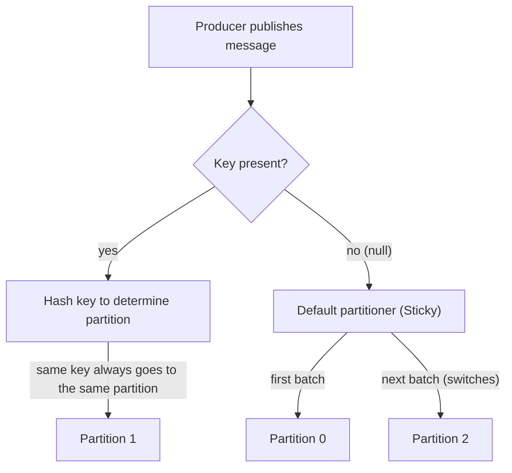

# Producer Basics — Publishing Messages, acks, and the Role of Keys

## Learning Objectives
- Understand which Topic and Partition a Producer sends a message to
- Explain how a message key influences partition assignment
- Understand the basic meaning of the acks setting (0/1/all) and publish a simple message

## Content

### Why This Topic Matters
So far we have been drawing Kafka's architecture in our heads. Now it is time to focus on the side that **actually puts data in** — the **Producer**. A producer is the client application that publishes messages to Kafka. Knowing where a producer sends messages, how it uses keys, and how it confirms safe delivery means you have learned half of what it takes to work with Kafka.

### What a Message (Event) Looks Like
A single message sent by a producer typically consists of:

- **Key:** An identifier that groups messages. It is optional (can be null).
- **Value:** The actual content — e.g., `"John added an iPhone to the cart"`. Any format works: JSON, string, number, and so on.
- **Timestamp** and optional **headers**.

The producer specifies **which Topic** to send the message to. Which partition within that topic the message goes to is decided by the key, as explained next.

### How the Key Affects Partition Assignment
In Lecture 2 we learned that a topic is divided into multiple partitions. So which partition does a given message go to? The answer depends on **whether or not a key is present**.

- **Key present:** The key is hashed to determine the partition. The default partitioner divides the hash value (using the murmur2 algorithm by default) by the number of partitions and takes the remainder. As a result, **as long as the partition count stays the same and the same partitioner is in use, messages with the same key always go to the same partition**. There is, however, one important caveat: this mapping **depends on the partition count**. If you **add partitions** to a topic that is already in use, the hash-to-partition calculation changes, and new messages with the same key may be routed to a **different partition than before**. This means past and future messages for the same key can end up on different partitions, breaking ordering guarantees. For topics where ordering matters, it is safest to avoid changing the partition count after the topic is in production.
- **No key (null):** Kafka's default partitioner selects the partition automatically. A common misconception is that messages are distributed one by one in strict round-robin fashion, but **that has not been the default behavior since Kafka 2.4**. The current default is the **Sticky Partitioner**, which accumulates messages into a **batch for the current partition, sends that batch, and then switches** to the next partition. Batching improves network efficiency. Over a short window you may see messages concentrated on one partition, but over time they spread evenly across all partitions.

The bottom line: **without a key, there is no guarantee which partition any given message will land in.** This is why a key is required whenever ordering matters.

Why does this matter? In Lecture 2 we learned that **ordering is only guaranteed within a partition**. For example, if an order's status must be processed in the sequence `created → shipped → delivered`, and those messages land on different partitions, the processing order can be scrambled. By using the **order ID as the key**, all status events for the same order end up in one partition and are read in the exact order they were sent.

> If ordering matters, assign the same key (e.g., order ID, customer ID) to all messages in the same logical group. If ordering does not matter, leaving the key null and letting Kafka distribute load automatically is the simpler choice. One caveat: if a single key attracts a disproportionate volume of messages, that partition can become a hotspot. Also keep in mind that adding partitions to a live topic changes the key-to-partition mapping.

The diagram below shows how the producer decides which partition a message goes to based on whether a key is present. With a key, hashing pins the message to a fixed partition (as long as the partition count does not change). Without a key, the Sticky Partitioner (Kafka 2.4+) batches messages per partition and rotates over time.



### acks — Confirming Safe Delivery
The **acks (acknowledgment)** setting controls whether the producer waits for confirmation that a message was successfully stored. There are three values:

- **acks=0:** No confirmation is awaited. The producer sends and immediately moves on. This is the fastest option (lowest latency) but provides no visibility into whether the message was actually stored, so messages can be lost.
- **acks=1:** The **leader broker** sends an acknowledgment after writing the message to its own disk — a middle-ground trade-off between speed and reliability. In the rare case where the leader crashes immediately after responding, data loss is still possible.
- **acks=all:** An acknowledgment is sent only after the leader **and** all in-sync replicas (followers) have received and stored the message. The safest option — very little chance of data loss — but slower because of the extra round-trips.

A simple analogy: acks is the choice of "how far do I need to track my shipment?" — send and forget (0), confirm the post office received it (1), or confirm it is in the recipient's hands (all).

There is one more prerequisite for `acks=all` to be truly safe. The topic must have **multiple replicas**, and the `min.insync.replicas` setting (minimum number of in-sync replicas required for a write to succeed) must be configured to match. If `min.insync.replicas` is 1, only the leader needs to store the message for it to be counted as a success — making `acks=all` effectively equivalent to `acks=1`. In practice, a common setup is 3 replicas with `min.insync.replicas=2` to get meaningful durability guarantees. (Replication and this setting are covered in depth in the intermediate track.)

> `acks=all` alone does not guarantee zero data loss. You need **replica count** and **`min.insync.replicas`** configured together to achieve the strongest durability guarantee.

### Hands-On — Publishing Messages with the Console Producer
Let's publish some messages. The examples below use Kafka's CLI with Kafka running locally. CLI (command-line interface) simply means controlling a program by typing commands in a terminal.

> If Kafka is not installed yet, these commands will not run right now. Installation and a full end-to-end setup are covered from scratch in Lecture 6. The goal here is to **get familiar with the shape of each command and what its options mean** — you can run these exact examples again after completing Lecture 6.

First, create a topic to hold the messages. We create an `orders` topic with 3 partitions.

```
kafka-topics.sh --create \
  --topic orders \
  --bootstrap-server localhost:9092 \
  --partitions 3 \
  --replication-factor 1
```

- `--topic orders`: the name of the topic to create
- `--bootstrap-server localhost:9092`: the Kafka broker address to connect to (default port 9092)
- `--partitions 3`: number of partitions
- `--replication-factor 1`: number of replicas (1 for a local single-broker setup)

Now start the console producer and enter messages. This is the simplest form — no key.

```
kafka-console-producer.sh \
  --topic orders \
  --bootstrap-server localhost:9092
```

When the command runs, a prompt (`>`) appears waiting for input. Every time you type a line and press Enter, one message is published.

```
> order-1001 created
> order-1002 created
```

Now let's send messages **with a key**. Add options to separate key and value using a colon (`:`).

```
kafka-console-producer.sh \
  --topic orders \
  --bootstrap-server localhost:9092 \
  --property "parse.key=true" \
  --property "key.separator=:"
```

```
> 1001:order created
> 1001:order shipped
> 1002:order created
```

The two messages with key `1001` (`order created` and `order shipped`) both go to the **same partition** (as long as the partition count does not change) and will be read in the order they were sent. The message with key `1002` may go to a different partition.

Finally, let's **explicitly set the acks level**. With the console producer you can pass producer configuration via `--producer-property`. The example below publishes with `acks=all` — the safest setting.

```
kafka-console-producer.sh \
  --topic orders \
  --bootstrap-server localhost:9092 \
  --producer-property acks=all
```

- `--producer-property acks=all`: the publish is not counted as successful until the leader and all in-sync replicas have stored the message. Try changing the value to `0` or `1` and think through the difference. (On a local single-broker setup with one replica, all three settings behave almost identically — the real difference only shows up when multiple replicas are in play.)

How to read back these published messages using a consumer is covered in the next lecture, Lecture 5.

## Key Takeaways
- A producer publishes messages to a specific Topic; which Partition within that topic the message goes to is determined by the key.
- With a key, the default partitioner (murmur2 hash) routes messages with the same key to the same partition, preserving order — as long as the same partitioner is in use and the partition count has not changed. Adding partitions to a live topic changes the key-to-partition mapping. Without a key, the default Sticky Partitioner (Kafka 2.4+) batches messages per partition and rotates across partitions over time.
- acks=0 is the fastest but risks data loss; acks=1 confirms the leader has stored the message (a middle-ground trade-off); acks=all confirms all in-sync replicas have stored the message — the safest option, but its guarantee depends on replica count and the `min.insync.replicas` setting working together.
- `kafka-console-producer.sh` can publish messages with or without a key from the terminal, and `--producer-property acks=...` lets you set the acknowledgment level directly.
