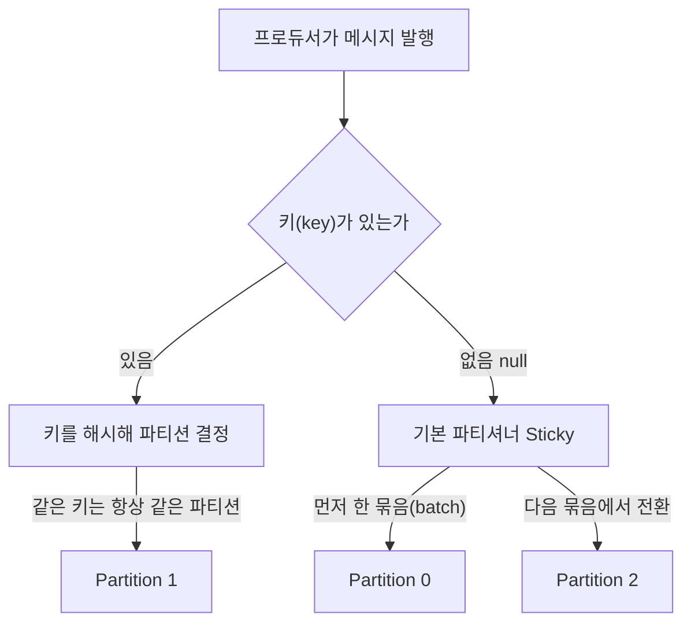

# Producer 기초 - 메시지 발행과 ack, 키의 역할

## 학습 목표
- Producer가 메시지를 어떤 Topic/Partition으로 보내는지 이해한다
- 메시지 키(key)가 파티션 분배에 어떤 영향을 주는지 설명한다
- acks 설정의 기본 의미(0/1/all)를 이해하고 간단히 메시지를 발행해본다

## 본문

### 왜 이 주제를 배우는가
지금까지는 Kafka의 구조를 머리로 그렸습니다. 이제 데이터를 **실제로 집어넣는 쪽**, 즉 **프로듀서(Producer)** 를 다룹니다. 프로듀서는 Kafka에 메시지를 발행(publish)하는 클라이언트 애플리케이션입니다. 프로듀서가 메시지를 어디로 보내고, 키를 어떻게 활용하며, 안전하게 보냈는지를 어떻게 확인하는지를 알면 Kafka 사용의 절반을 익힌 셈입니다.

### 메시지(이벤트)의 생김새
프로듀서가 보내는 한 건의 메시지는 보통 다음으로 이루어집니다.

- **Key(키):** 메시지를 묶는 식별자. 있어도 되고 없어도(null) 됩니다.
- **Value(값):** 실제 내용. 예: `"John이 iPhone을 장바구니에 담았다"`. JSON, 문자열, 숫자 등 어떤 형식이든 됩니다.
- **Timestamp(타임스탬프)** 와 선택적 헤더(headers).

프로듀서는 이 메시지를 **어떤 토픽(topic)** 으로 보낼지 지정합니다. 토픽 안에서 어느 파티션으로 갈지는 다음에 설명할 키가 결정합니다.

### 키(key)가 파티션 분배에 주는 영향
2강에서 토픽은 여러 파티션으로 나뉜다고 했습니다. 그렇다면 메시지는 그중 어느 파티션으로 갈까요? 답은 **키가 있느냐 없느냐**에 달려 있습니다.

- **키가 있을 때:** 키를 해시(hash)해 파티션을 정합니다. 기본 파티셔너는 키의 해시값(기본 알고리즘은 murmur2)을 파티션 개수로 나눈 나머지로 파티션을 고릅니다. 따라서 **파티션 개수가 그대로이고 같은 파티셔너를 쓰는 한, 같은 키를 가진 메시지는 항상 같은 파티션**으로 갑니다. 다만 한 가지 함정이 있습니다. 이 매핑은 **파티션 개수에 의존**하므로, 운영 중 토픽에 **파티션을 추가하면** 키→파티션 계산 결과가 달라져, 같은 키의 새 메시지가 이전과 **다른 파티션으로 갈 수 있습니다.** 이렇게 되면 같은 키의 과거 메시지와 새 메시지가 서로 다른 파티션에 흩어져 순서 보장이 깨질 수 있으니, 순서가 중요한 토픽은 파티션 수를 함부로 바꾸지 않는 편이 안전합니다.
- **키가 없을 때(null):** Kafka의 기본 파티셔너(partitioner)가 파티션을 알아서 고릅니다. 여기서 한 가지 흔한 오해를 짚어야 합니다. 흔히 "한 건씩 번갈아 가며 모든 파티션에 골고루 뿌린다(라운드 로빈)"고 생각하기 쉽지만, **Kafka 2.4부터 기본 동작은 그렇지 않습니다.** 현재 기본값은 **Sticky Partitioner(스티키 파티셔너)** 로, 잠깐 동안은 **한 파티션에 메시지를 모아 한 묶음(batch)으로 보낸 뒤** 다음 묶음에서 다른 파티션으로 옮겨 갑니다. 메시지를 묶어 보내면 네트워크 효율이 좋아지기 때문입니다. 따라서 짧은 순간만 보면 한 파티션에 몰리지만, 시간이 지나면 여러 파티션에 **고르게 퍼지는** 결과가 됩니다.

핵심은, **키가 없으면 특정 메시지가 어느 파티션으로 갈지 보장되지 않는다**는 점입니다. 그래서 순서가 중요할 때는 키가 필수입니다.

이것이 왜 중요할까요? 2강에서 **순서는 파티션 안에서만 보장**된다고 배웠습니다. 예를 들어 주문 상태가 `준비됨 → 배송됨 → 도착됨` 순서로 처리되어야 한다면, 이 메시지들이 서로 다른 파티션에 흩어지면 순서가 뒤섞일 수 있습니다. 이때 **주문 ID를 키로** 쓰면 같은 주문의 상태들이 모두 한 파티션에 모여, 보낸 순서대로 읽힙니다.

> 순서가 중요하면 같은 그룹의 메시지에 같은 키(예: 주문 ID, 고객 ID)를 부여하세요. 순서가 중요하지 않으면 키를 비워(null) 부하를 자동으로 분산시키는 편이 단순합니다. 단, 특정 키에 데이터가 쏠리면 그 파티션이 병목이 될 수 있고, 운영 중 파티션 수를 늘리면 키→파티션 매핑이 달라질 수 있다는 점도 기억해 둡니다.

아래 분배 흐름처럼, 프로듀서는 키 유무에 따라 메시지가 어느 파티션으로 갈지를 결정합니다. 키가 있으면 해시로 한 파티션에 고정되고(파티션 수가 같은 한), 키가 없으면 기본 파티셔너(Sticky)가 묶음 단위로 파티션을 정해 시간이 지나며 여러 파티션으로 퍼집니다.



### acks - 메시지가 안전히 도착했는지 확인하기
프로듀서가 메시지를 보낸 뒤 "잘 저장됐다"는 확인 응답을 받을지 여부를 정하는 설정이 **acks(acknowledgment, 확인 응답)** 입니다. 세 가지 값이 있습니다.

- **acks=0:** 확인을 기다리지 않습니다. 보내고 곧장 다음 일을 합니다. 가장 빠르지만(낮은 지연), 브로커에 실제로 저장됐는지 알 수 없어 일부 메시지가 유실될 수 있습니다.
- **acks=1:** **리더 브로커**가 자신의 디스크에 메시지를 쓴 뒤 확인 응답을 보냅니다. 속도와 안정성의 중간 절충입니다. 리더가 응답 직후 죽으면 드물게 유실 가능성이 있습니다.
- **acks=all:** 리더뿐 아니라 복제본(팔로워)들까지 메시지를 받아 저장한 것을 확인한 뒤 응답합니다. 가장 안전해 데이터 유실이 거의 없지만, 그만큼 응답이 느립니다.

쉽게 말해 acks는 "택배를 보내고 배송 완료 문자를 어디까지 기다릴 것인가"의 선택입니다. 빠르게 보내고 잊을지(0), 일단 우체국이 받았다는 확인까지 볼지(1), 받는 사람 손에 들어간 것까지 확인할지(all)의 차이입니다.

여기에 한 가지 전제가 더 있습니다. `acks=all`이 "가장 안전"하려면 토픽에 **복제본이 여러 개** 있어야 하고, 그중 **최소 몇 개가 메시지를 받아야 성공으로 칠지**를 정하는 `min.insync.replicas`(최소 동기 복제본 수) 설정이 함께 받쳐 줘야 합니다. 만약 이 값이 1이면 사실상 리더 하나만 저장하면 성공으로 처리되어, `acks=all`이라도 `acks=1`과 다를 바 없어집니다. 그래서 실무에서는 보통 복제본 3개에 `min.insync.replicas=2`를 함께 쓰는 식으로 안전성을 확보합니다. (복제와 이 설정의 자세한 동작은 후속 중급 트랙에서 다룹니다.)

> `acks=all` 하나만으로 무손실이 보장되지는 않습니다. "복제본 수"와 "`min.insync.replicas`"가 함께 갖춰져야 비로소 가장 안전한 보증이 됩니다.

### 손으로 해보기 - console producer로 메시지 발행
이제 직접 메시지를 발행해 봅니다. 아래는 Kafka가 로컬에서 실행 중일 때 CLI로 따라 하는 예시입니다. CLI(명령줄 도구)란 터미널에 명령어를 입력해 프로그램을 다루는 방식을 말합니다.

> 아직 Kafka를 설치하지 않았다면 지금 당장 실행되지는 않습니다. 설치와 전체 실행은 6강에서 처음부터 직접 합니다. 여기서는 **명령어 모양과 옵션의 의미를 눈에 익히는 것**이 목표이며, 6강을 마친 뒤 이 예제를 그대로 돌려 볼 수 있습니다.

먼저 메시지를 담을 토픽을 만듭니다. 파티션 3개로 `orders` 토픽을 생성합니다.

```
kafka-topics.sh --create \
  --topic orders \
  --bootstrap-server localhost:9092 \
  --partitions 3 \
  --replication-factor 1
```

- `--topic orders`: 만들 토픽 이름
- `--bootstrap-server localhost:9092`: 접속할 Kafka 브로커 주소(기본 포트 9092)
- `--partitions 3`: 파티션 개수
- `--replication-factor 1`: 복제본 수(로컬 단일 브로커이므로 1)

이제 콘솔 프로듀서를 켜서 메시지를 입력합니다. 키 없이 보내는 가장 단순한 형태입니다.

```
kafka-console-producer.sh \
  --topic orders \
  --bootstrap-server localhost:9092
```

명령을 실행하면 입력을 기다리는 프롬프트(`>`)가 나타납니다. 한 줄 입력하고 Enter를 칠 때마다 메시지 한 건이 발행됩니다.

```
> order-1001 created
> order-1002 created
```

이번에는 **키와 함께** 보내 봅시다. 키와 값을 콜론(`:`)으로 구분하도록 옵션을 줍니다.

```
kafka-console-producer.sh \
  --topic orders \
  --bootstrap-server localhost:9092 \
  --property "parse.key=true" \
  --property "key.separator=:"
```

```
> 1001:order created
> 1001:order shipped
> 1002:order created
```

여기서 키 `1001`을 가진 두 메시지(`order created`, `order shipped`)는 (파티션 개수가 그대로인 한) **같은 파티션**으로 들어가 보낸 순서대로 읽힙니다. 키 `1002`의 메시지는 다른 파티션으로 갈 수도 있습니다.

마지막으로, 앞서 배운 **acks를 실제로 지정**해 봅니다. 콘솔 프로듀서에서는 `--producer-property` 옵션으로 프로듀서 설정을 줄 수 있습니다. 아래는 가장 안전한 `acks=all`로 발행하는 예시입니다.

```
kafka-console-producer.sh \
  --topic orders \
  --bootstrap-server localhost:9092 \
  --producer-property acks=all
```

- `--producer-property acks=all`: 리더와 동기 복제본까지 저장을 확인한 뒤에야 발행이 성공으로 처리됩니다. 값을 `0` 또는 `1`로 바꿔 가며 차이를 떠올려 보세요. (단일 브로커·복제본 1인 로컬 환경에서는 셋 다 사실상 비슷하게 동작하므로, acks의 진짜 차이는 복제본이 여러 개일 때 드러납니다.)

직접 발행한 이 메시지들을 어떻게 읽어 오는지는 다음 5강의 컨슈머에서 이어집니다.

## 핵심 요약
- 프로듀서는 메시지를 특정 Topic으로 발행하며, 토픽 안에서 어느 Partition으로 갈지는 키가 결정한다.
- 키가 있으면 해시(기본 murmur2)로 파티션을 정하므로, 파티션 개수가 같고 같은 파티셔너를 쓰는 한 같은 키는 항상 같은 파티션에 가 순서가 보장된다. 단 파티션 수를 늘리면 키→파티션 매핑이 달라질 수 있다. 키가 없으면 기본 파티셔너(Kafka 2.4+의 Sticky Partitioner)가 묶음 단위로 파티션을 골라, 시간이 지나며 여러 파티션에 고르게 퍼진다.
- acks=0은 가장 빠르나 유실 위험, acks=1은 리더 저장 확인(중간 절충), acks=all은 복제본까지 확인해 가장 안전하다. 단 acks=all의 보증은 복제본 수와 `min.insync.replicas` 설정에 함께 의존한다.
- `kafka-console-producer.sh`로 키 없는/있는 메시지를 발행할 수 있고, `--producer-property acks=...`로 ack 수준을 직접 지정할 수 있다.
