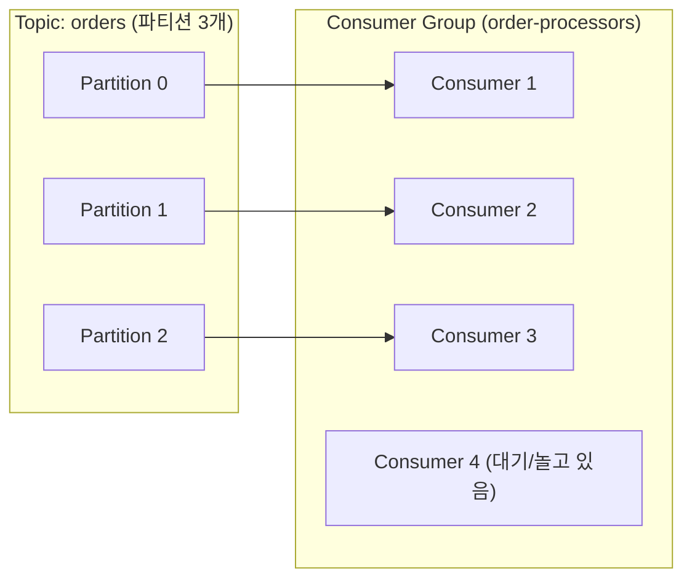

# Consumer와 Consumer Group - 구독, 오프셋, 병렬 소비

## 학습 목표
- Consumer가 Topic을 구독해 메시지를 읽고 오프셋을 커밋하는 흐름을 이해한다
- Consumer Group으로 여러 컨슈머가 파티션을 나눠 병렬 소비하는 원리를 파악한다
- 그룹 내 컨슈머 추가/제거 시 리밸런싱이 일어나는 개념을 이해한다

## 본문

### 왜 이 주제를 배우는가
4강에서 프로듀서가 메시지를 Kafka에 넣었습니다. 이제 그 메시지를 **읽어가는 쪽**, 즉 **컨슈머(Consumer)** 차례입니다. Kafka는 "데이터를 저장하는 일"과 "데이터를 처리하는 일"을 분리해 두었는데, 처리는 대부분 컨슈머 애플리케이션이 맡습니다. 컨슈머가 어떻게 구독하고, 어디까지 읽었는지 기억하며, 여러 대가 어떻게 일을 나눠 하는지를 익히면 Kafka 읽기 흐름이 완성됩니다.

### 구독과 읽기 - 컨슈머의 기본 동작
컨슈머는 먼저 읽고 싶은 토픽을 **구독(subscribe)** 합니다. 하나만이 아니라 여러 토픽을 한꺼번에 구독할 수도 있습니다. 구독한 뒤에는 보통 **무한 루프**를 돌며 새 메시지가 있는지 계속 묻고(poll), 도착한 메시지를 처리합니다.

여기서 Kafka의 중요한 특성이 나옵니다. 컨슈머는 메시지를 읽어가도 **메시지를 지우지 않습니다.** 1강에서 비유한 넷플릭스처럼, 데이터는 보관 기간 동안 그대로 남아 있어 다른 컨슈머가 같은 데이터를 다시 읽을 수 있습니다. 그래서 같은 토픽을 0개, 1개, 또는 여러 컨슈머가 각자 다른 진도로 읽는 일이 자연스럽게 가능합니다.

### 오프셋 커밋 - "어디까지 읽었는지" 기억하기
컨슈머는 각 파티션을 오프셋 순서대로 읽습니다(2강 복습: 오프셋은 파티션 내 위치 번호). 그런데 컨슈머가 잠시 멈췄다 다시 켜지면, 어디서부터 다시 읽어야 할까요? 이를 위해 컨슈머는 "이 파티션을 오프셋 N까지 처리했다"는 책갈피를 기록하는데, 이 동작을 **오프셋 커밋(offset commit)** 이라고 합니다.

커밋된 오프셋은 Kafka 내부의 특별한 토픽(`__consumer_offsets`)에 저장됩니다. 그래서 컨슈머가 재시작해도, 가장 마지막으로 커밋한 오프셋을 조회해 그 다음부터 이어 읽습니다. 만약 처음 시작하는 컨슈머라 저장된 위치가 없다면, 토픽의 **맨 처음(earliest)** 부터 읽을지 **맨 끝(latest, 새 메시지부터)** 부터 읽을지 설정으로 정합니다.

> 오프셋 커밋 덕분에 컨슈머는 멈췄다 다시 켜져도 자기 자리를 잃지 않습니다. "어디까지 읽었는가"를 컨슈머가 직접 관리한다는 점이, 메시지를 읽으면 바로 지워 버리는 전통적 큐와의 큰 차이입니다.

### Consumer Group - 여러 컨슈머가 일을 나눈다
데이터가 폭증하면 컨슈머 한 대로는 처리 속도가 부족합니다. 이때 같은 일을 하는 컨슈머를 여러 개 띄워 **일을 나눠 처리**하게 만드는 것이 **컨슈머 그룹(Consumer Group)** 입니다.

그룹을 묶는 기준은 단순합니다. 컨슈머가 Kafka에 등록할 때 지정하는 **group.id** 가 같으면 같은 그룹입니다. 같은 애플리케이션의 여러 복제본(replica)은 같은 group.id를 가지므로 자동으로 한 그룹이 됩니다.

핵심 규칙은 이것입니다. **하나의 파티션은 같은 그룹 안에서 단 한 컨슈머에게만 배정됩니다.** Kafka가 그룹 내 컨슈머들에게 파티션을 자동으로 나눠 주며, 각자 맡은 파티션을 병렬로 처리합니다.

예를 들어 파티션이 3개인 토픽을 컨슈머 그룹이 처리한다고 합시다.

- 컨슈머가 1대면: 1대가 파티션 3개를 모두 읽습니다.
- 컨슈머가 3대면: 각 컨슈머가 파티션 1개씩 맡아 3배 빠르게 처리합니다.
- 컨슈머가 4대면: 파티션이 3개뿐이라 3대만 일하고 1대는 놀게 됩니다.

여기서 중요한 점은 **그룹 내 병렬 처리 가능 수는 파티션 개수가 상한**이라는 것입니다. 더 많이 병렬화하려면 파티션을 먼저 늘려야 합니다.

아래 매핑도처럼, 파티션 3개를 컨슈머 3대가 1개씩 나눠 맡고, 4번째 컨슈머는 배정받을 파티션이 없어 놀게 됩니다.



> 한 토픽을 여러 그룹이 동시에 구독할 수도 있습니다. 이 경우 각 그룹은 서로 독립적으로 모든 메시지를 받습니다. 예를 들어 `주문` 토픽을 "알림 그룹"과 "정산 그룹"이 각각 구독하면, 두 그룹 모두 모든 주문 이벤트를 받아 각자의 목적대로 처리합니다.

### 리밸런싱 - 멤버가 바뀌면 일을 다시 나눈다
운영 중에는 컨슈머가 늘거나 줄 수 있습니다. 부하가 커져 컨슈머를 추가하거나, 한 컨슈머가 장애로 죽거나, 새 파티션이 추가되는 경우입니다. 이렇게 그룹 구성이 바뀌면, Kafka는 파티션을 그룹 멤버들에게 **다시 자동으로 배분**합니다. 이 과정을 **리밸런싱(rebalancing)** 이라고 합니다.

리밸런싱은 그룹을 조율하는 **그룹 코디네이터(group coordinator, 브로커 측 역할)** 가 주도합니다. 예를 들어 컨슈머가 죽으면 그 컨슈머가 맡던 파티션을 살아 있는 다른 컨슈머에게 넘겨, 처리가 끊기지 않게 합니다. 반대로 컨슈머를 추가하면 일부 파티션을 새 컨슈머에게 떼어 줍니다.

리밸런싱은 자동으로 일어나며 개발자가 직접 파티션을 배정할 필요가 없습니다. 리밸런싱 중에는 잠시 처리가 멈출 수 있는데, 이 멈춤을 줄이는 정교한 전략들도 있지만 그 세부는 Kafka 중급 트랙에서 다룹니다.

### 손으로 해보기 - console consumer로 메시지 소비
4강에서 `orders` 토픽에 메시지를 발행했습니다. 이제 그 메시지를 읽어 봅니다. (Kafka 실행과 설치는 6강에서 처음부터 다룹니다.)

가장 단순하게, 토픽의 처음부터 모든 메시지를 읽습니다.

```
kafka-console-consumer.sh \
  --topic orders \
  --bootstrap-server localhost:9092 \
  --from-beginning
```

- `--from-beginning`: 저장된 첫 메시지(가장 오래된 오프셋)부터 읽습니다. 이 옵션을 빼면 명령 실행 이후 새로 들어오는 메시지만 읽습니다.

키와 값을 함께 보고 싶다면 옵션을 추가합니다.

```
kafka-console-consumer.sh \
  --topic orders \
  --bootstrap-server localhost:9092 \
  --from-beginning \
  --property "print.key=true" \
  --property "key.separator=:"
```

컨슈머 그룹을 지정해 실행하면, 오프셋이 그 그룹 이름으로 커밋되어 다음에 같은 그룹으로 켤 때 이어 읽습니다.

```
kafka-console-consumer.sh \
  --topic orders \
  --bootstrap-server localhost:9092 \
  --group order-processors
```

이제 터미널을 하나 더 열어 같은 명령(같은 `--group order-processors`)을 실행하면, 두 컨슈머가 한 그룹이 되어 파티션을 나눠 가집니다. 4강의 프로듀서로 메시지를 더 보내 보면, 메시지가 두 컨슈머에 나뉘어 도착하는 병렬 소비를 직접 확인할 수 있습니다.

## 핵심 요약
- 컨슈머는 토픽을 구독해 오프셋 순서로 메시지를 읽으며, 읽어도 메시지는 지워지지 않는다.
- 오프셋 커밋은 "어디까지 읽었는지"를 기록해, 컨슈머가 재시작해도 그 다음부터 이어 읽게 한다.
- 같은 group.id를 가진 컨슈머들은 한 그룹이 되어 파티션을 나눠 병렬 소비하며, 한 파티션은 그룹 내 한 컨슈머에게만 배정된다(병렬도 상한 = 파티션 수).
- 그룹 멤버가 늘거나 줄면 Kafka가 파티션을 다시 배분하는 리밸런싱이 자동으로 일어난다.
