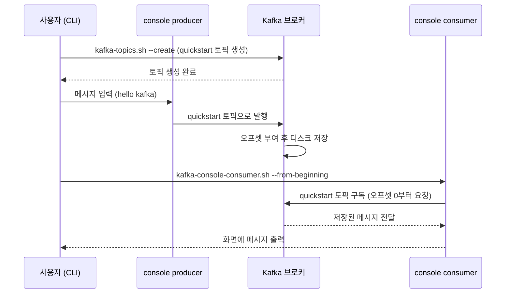

# 로컬에 Kafka 설치하고 end-to-end 실습 - CLI로 produce/consume

## 학습 목표
- Docker 또는 바이너리로 로컬에 Kafka를 설치하고 실행한다
- CLI로 Topic을 생성하고 console producer로 메시지를 발행한다
- console consumer로 메시지를 소비하며 produce→consume 전체 흐름을 직접 확인한다

## 본문

### 왜 이 주제를 배우는가
앞선 다섯 강의에서 Kafka의 개념과 명령어를 살펴봤습니다. 이번에는 **내 컴퓨터에서 Kafka를 직접 띄우고**, 토픽을 만들고, 메시지를 보내고 받는 처음부터 끝까지(end-to-end)의 흐름을 손으로 완성합니다. 한 번 직접 해보면 그동안 머리로 그렸던 개념들이 손끝에서 연결됩니다.

전체 흐름은 다음과 같습니다. **Kafka 실행 → 토픽 생성 → 프로듀서로 발행 → 컨슈머로 소비.** 이 한 줄기를 그대로 따라가 봅니다.

### 설치 방법 고르기
로컬에 Kafka를 띄우는 방법은 크게 두 가지입니다.

- **Docker(권장):** 컨테이너로 Kafka를 띄우므로 내 PC를 더럽히지 않고, 한 번에 깔끔하게 시작·정리할 수 있습니다. (Docker란 애플리케이션을 격리된 상자(컨테이너)에 담아 실행하는 도구입니다.)
- **바이너리:** Apache Kafka 공식 배포판을 내려받아 직접 실행합니다. Java가 필요합니다.

여기서는 **Docker 방식을 권장**하며, 바이너리 방식도 함께 안내합니다. 둘 다 결국 `kafka-topics`, `kafka-console-producer`, `kafka-console-consumer` 같은 같은 CLI를 사용합니다.

### 방법 A: Docker로 Kafka 띄우기
먼저 Docker Desktop이 설치되어 있어야 합니다(공식 사이트에서 무료로 내려받습니다). 작업할 폴더에 `docker-compose.yml` 파일을 아래처럼 만듭니다. 이 예시는 KRaft 모드(3강 참고: ZooKeeper가 필요 없는 최신 방식)로 단일 브로커를 띄웁니다.

```
services:
  kafka:
    image: apache/kafka:latest
    container_name: kafka
    ports:
      - "9092:9092"
```

같은 폴더에서 터미널을 열고 다음을 실행하면 Kafka가 백그라운드로 실행됩니다.

```
docker compose up -d
```

`-d`는 백그라운드 실행을 뜻합니다. 컨테이너가 잘 떴는지 확인합니다.

```
docker ps
```

목록에 `kafka` 컨테이너가 보이면 성공입니다. 이후 CLI 명령은 컨테이너 안에서 실행합니다. 컨테이너 안으로 들어가려면 다음을 씁니다.

```
docker exec -it kafka /bin/bash
```

> `docker exec -it ... /bin/bash`는 실행 중인 컨테이너 안에 터미널을 여는 명령입니다. 이제부터의 `kafka-topics.sh` 등은 이 컨테이너 셸 안에서 실행한다고 보면 됩니다. Apache 공식 이미지에서는 스크립트가 `/opt/kafka/bin`에 있고 이 경로가 PATH에 없을 수 있으니, 셸에 들어간 직후 `cd /opt/kafka/bin` 으로 이동해 두면 아래 명령을 그대로 실행할 수 있습니다(`command not found`가 나면 경로 이동을 빠뜨린 것입니다).

### 방법 B: 바이너리로 Kafka 띄우기 (대안)
Docker 대신 직접 실행하려면, Apache Kafka 배포판을 내려받아 압축을 풉니다. 최신 Kafka는 KRaft 모드로 다음과 같이 시작합니다(배포판 폴더에서 실행).

```
# 1) 클러스터 ID 생성
KAFKA_CLUSTER_ID="$(bin/kafka-storage.sh random-uuid)"

# 2) 저장소 포맷
bin/kafka-storage.sh format -t $KAFKA_CLUSTER_ID -c config/kraft/server.properties

# 3) 브로커 실행
bin/kafka-server-start.sh config/kraft/server.properties
```

브로커가 9092 포트에서 실행되면, 새 터미널을 열어 아래 CLI 실습을 그대로 진행하면 됩니다.

### 1단계: 토픽 만들기
실습용 토픽 `quickstart`를 파티션 1개로 만듭니다.

```
kafka-topics.sh --create \
  --topic quickstart \
  --bootstrap-server localhost:9092 \
  --partitions 1 \
  --replication-factor 1
```

잘 만들어졌는지 토픽 목록과 상세를 확인합니다.

```
kafka-topics.sh --list --bootstrap-server localhost:9092

kafka-topics.sh --describe \
  --topic quickstart \
  --bootstrap-server localhost:9092
```

`--describe`는 파티션 수, 리더 브로커 등 토픽의 상세 정보를 보여 줍니다.

### 2단계: 프로듀서로 메시지 발행
콘솔 프로듀서를 켭니다. 프롬프트(`>`)가 뜨면 한 줄씩 입력할 때마다 메시지가 발행됩니다.

```
kafka-console-producer.sh \
  --topic quickstart \
  --bootstrap-server localhost:9092
```

```
> hello kafka
> my first message
> end-to-end test
```

이 터미널은 메시지를 계속 보낼 수 있도록 켜 둡니다.

### 3단계: 컨슈머로 메시지 소비
**새 터미널을 하나 더 엽니다**(Docker라면 다시 `docker exec -it kafka /bin/bash`로 컨테이너에 들어갑니다). 그리고 처음부터 모든 메시지를 읽습니다.

```
kafka-console-consumer.sh \
  --topic quickstart \
  --bootstrap-server localhost:9092 \
  --from-beginning
```

조금 전에 발행한 세 줄이 그대로 출력되면, **produce → consume** 전체 흐름이 동작한 것입니다.

```
hello kafka
my first message
end-to-end test
```

지금까지 따라온 과정을 한 줄기로 정리하면, 토픽 생성부터 발행·저장·소비까지 다음 순서로 이어집니다.



### 4단계: 실시간으로 확인하기
이제 두 터미널을 나란히 둡니다. 컨슈머는 그대로 켜 둔 채, 프로듀서 터미널에서 새 메시지를 입력해 보세요.

```
> live message 1
> live message 2
```

입력하는 즉시 컨슈머 화면에 해당 메시지가 나타납니다. 이것이 1강에서 말한 "실시간 데이터 스트리밍"이 눈앞에서 일어나는 순간입니다. 한쪽에서 보내면 다른 쪽에서 곧바로 받습니다.

### 5단계: 정리하기
실습을 마쳤으면 토픽과 컨테이너를 정리합니다.

```
# 토픽 삭제
kafka-topics.sh --delete \
  --topic quickstart \
  --bootstrap-server localhost:9092
```

Docker로 띄웠다면 컨테이너를 셸에서 나온 뒤 종료합니다.

```
exit
docker compose down
```

`docker compose down`은 컨테이너를 멈추고 제거해 환경을 깨끗이 되돌립니다.

> 실습에서 막힌다면 대개 두 가지가 원인입니다. (1) 브로커가 아직 완전히 안 떴을 때 → 잠시 기다렸다 재시도, (2) `--bootstrap-server` 주소·포트 오타 → 9092가 맞는지 확인. CLI 스크립트 이름은 배포판에 따라 `.sh`가 붙기도(`kafka-topics.sh`) 안 붙기도 합니다.

## 핵심 요약
- Docker(권장) 또는 바이너리로 로컬에 단일 브로커 Kafka를 띄울 수 있으며, 최신 Kafka는 KRaft 모드로 ZooKeeper 없이 실행한다.
- `kafka-topics.sh --create`로 토픽을 만들고 `--list`/`--describe`로 확인한다.
- `kafka-console-producer.sh`로 메시지를 발행하고 `kafka-console-consumer.sh --from-beginning`으로 소비해 end-to-end 흐름을 확인한다.
- 프로듀서와 컨슈머 터미널을 나란히 두면 메시지가 실시간으로 전달되는 것을 직접 볼 수 있다.
