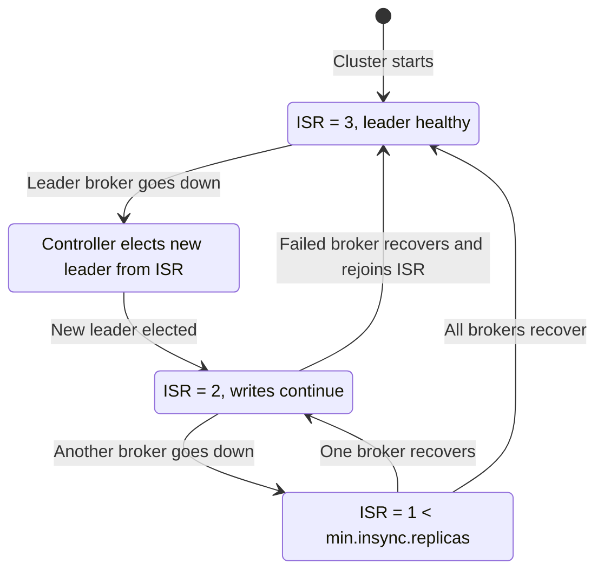

# Replication and ISR - The Foundation of High Availability and Durability

## Learning Objectives
- Understand how the leader-follower replication model and ISR (In-Sync Replicas) guarantee data durability
- Explain how the combination of `replication.factor`, `min.insync.replicas`, and `acks` affects availability and durability
- Create a topic with a higher replication factor, force-stop a broker, and directly observe leader election and failure recovery

## Content

### Why Replication Matters
In the beginner course, we learned that topics are split into partitions and each partition is stored as a log on a broker's disk. But what if a partition lives on just one broker? The moment that broker's disk fails or the server goes down, all the data in that partition is gone. Whether you're on cloud or bare metal, systems must be designed with the assumption that hardware will eventually fail.

Kafka's answer is **replication**. By keeping copies of each partition on multiple brokers, the cluster can continue serving data from another broker's copy even when one goes down. This is why Kafka is called a cornerstone of reliability for mission-critical systems.

### Leaders and Followers
When you create a topic, you specify a **replication factor**, and each partition gets that many copies. With a replication factor of N, you get N copies — and the cluster can generally tolerate **up to N-1 broker failures**.

Among those copies, one is elected as the **leader** and the rest are **followers**.

- Both producer writes and consumer reads go to the **leader** by default.
- Followers continuously send **fetch requests** to the leader to pull new data into their own logs. In effect, a follower behaves like "another consumer that mirrors the leader."

> Producers always write to the leader only. Followers never receive writes directly — they pull data from the leader to stay in sync.

**Reads have an exception, however.** Since Kafka 2.4 (KIP-392), consumers can read from the **nearest follower** — one in the same data center or rack — rather than always going to the leader. By setting `client.rack` on the consumer and enabling rack-aware replica selection on the broker, clients can reduce **latency and cross-datacenter traffic costs** by reading from a geographically close follower. The accurate picture is: "writes always go to the leader; reads go to the leader by default but can be optimized to read from followers." Note that since a follower may lag slightly behind the leader, it only exposes data up to its High Watermark to consumers.

### ISR and High Watermark — What Does "Safe" Data Mean?
**ISR (In-Sync Replicas)** is the set of replicas that have sufficiently caught up with the leader. The leader is always in the ISR; a follower is included only when it is not falling behind. If a follower becomes too slow and fails to catch up within a configured window (`replica.lag.time.max.ms`), the leader removes it from the ISR. Having fewer than the full set of replicas in the ISR is called being **under-replicated**.

A record is considered "safe" only when **all replicas in the ISR have received it**. At that point the record is **committed**, and only then is it exposed to consumers. The marker indicating the committed point is the **High Watermark**. Consumers can only read up to the High Watermark — if uncommitted data were exposed and then lost due to a failure, consumers would have seen data that no longer exists, which would be a contradiction.

The sequence diagram below shows how replication and the High Watermark work, from a producer write all the way through to a consumer read.

```mermaid Producer write → follower replication → High Watermark commit flow
sequenceDiagram
    participant P as Producer
    participant L as Leader Broker
    participant F1 as Follower 1
    participant F2 as Follower 2
    participant C as Consumer

    P->>L: write message (acks=all)
    L->>L: append to local log
    F1->>L: fetch request
    L-->>F1: deliver new message
    F2->>L: fetch request
    L-->>F2: deliver new message
    Note over L,F2: All ISR members have replicated
    L->>L: advance High Watermark (commit)
    L-->>P: ack response (write success)
    C->>L: poll request
    L-->>C: deliver data up to High Watermark
```

### The Triangle of Three Settings: replication.factor, min.insync.replicas, and acks
The combination of three settings determines how durable and available your cluster is.

- **replication.factor**: how many copies of each partition to keep (e.g., 3).
- **acks** (producer setting): how many acknowledgments the producer requires before considering a write successful.
  - `acks=0`: no acknowledgment (fire-and-forget). Fastest, but data can be lost.
  - `acks=1`: the leader alone must acknowledge. Data can be lost if the leader crashes before replication completes.
  - `acks=all`: every ISR replica must acknowledge. The safest option.
- **min.insync.replicas** (topic/broker setting): the minimum number of ISR replicas that must be present for a write to succeed — a hard lower bound enforced on every write.

The critical insight is exactly how `acks=all` and `min.insync.replicas` interact. They operate at two distinct stages:

1. **Pre-write ISR check (min.insync.replicas).** When a producer sends a message with `acks=all`, the leader broker checks — **before accepting any data** — whether the current number of ISR members meets or exceeds `min.insync.replicas`. If the ISR count falls below that threshold, the broker **immediately rejects the write with a `NotEnoughReplicasException` (or `NotEnoughReplicasAfterAppendException`)** without writing anything. This is the safety gate that prevents a write from landing on too few copies.
2. **Write success confirmation (acks=all).** Once the pre-write check passes and the request is accepted, the leader writes the data to its own log and then **waits for every current ISR member to replicate it** before sending a success response to the producer.

In other words, `min.insync.replicas` sets the minimum ISR size required for a write to even begin, while `acks=all` makes full replication across that ISR the condition for success. The two settings only make sense when used together.

> An important trap: if `min.insync.replicas=1`, setting `acks=all` is effectively the same as `acks=1`. The pre-write check passes as long as even a single ISR member (the leader itself) is present, and the leader receiving the write is enough to call it successful. This is why the standard recommended combination is **replication.factor=3 + min.insync.replicas=2 + acks=all**.

For example, with `replication.factor=3`, `min.insync.replicas=2`, and `acks=all`:

- Under normal conditions, all three replicas receive writes. If one broker dies and the ISR shrinks to two, the pre-write check still passes because `min.insync.replicas=2` is satisfied, so writes continue uninterrupted. This is the **golden combination: tolerating one failure while preserving durability**.
- If two brokers die and the ISR drops to one, the pre-write check fails before any data is written — the producer receives a `NotEnoughReplicasException`. This is a deliberate **durability-first** decision: "if data cannot be replicated safely, stop accepting writes."

> A common pitfall: setting `replication.factor` and `min.insync.replicas` to the same value (e.g., both 3) means a single broker failure causes the pre-write check to fail and shuts down all writes entirely. Keep `min.insync.replicas` at `replication.factor - 1`.

This is where the availability-durability trade-off becomes clear. Raising `min.insync.replicas` means data is stored more safely across more copies (higher durability), but it also means more brokers must be alive for writes to succeed (lower availability).

### Leader Failure and Recovery
What happens when the leader broker dies? Because all ISR members are guaranteed to hold every committed record, the controller elects one of them as the new leader — with no data loss, and service resumes immediately. When the failed broker comes back, it catches up with the new leader and rejoins the ISR, returning the cluster to full replication.

To handle this cleanly, each leader carries a **leader epoch** — a generation number that increments every time leadership changes. Why is this needed? During a network partition, an old leader might not realize it has been demoted and briefly continue accepting writes — a situation called a **zombie leader**. Without leader epochs, data written by the old leader and data written by the new leader can become interleaved, causing a **log divergence** between replicas. Followers and recovering brokers compare their leader epoch with the current one and **truncate** any data written under an older epoch to align with the true current leader's log. In short, the leader epoch is the mechanism that identifies who the real current leader is and keeps data consistent.

Kafka also distributes leaders evenly across brokers by designating each partition's first replica as the **preferred replica**, preventing any single broker from becoming a hotspot.

The state diagram below shows how a partition's replication state transitions through failures and recoveries.



The full flow is: producer writes to the leader → followers replicate via fetch → once all ISR members have received the record it is committed (High Watermark advances) → the record becomes visible to consumers → if the leader fails, a new leader is elected from the ISR → the recovered broker catches up and rejoins the ISR.

### Hands-On: Create a Replicated Topic and Simulate a Failure
Assume a three-broker cluster (or a 3-broker environment started with `docker-compose`).

Create a topic with a replication factor of 3 and `min.insync.replicas` of 2.

```bash
kafka-topics.sh --create \
  --topic orders \
  --bootstrap-server localhost:9092 \
  --partitions 3 \
  --replication-factor 3 \
  --config min.insync.replicas=2
```

Inspect the leader and ISR configuration.

```bash
kafka-topics.sh --describe \
  --topic orders \
  --bootstrap-server localhost:9092
```

The output shows, for each partition, the `Leader` (the current leader broker ID), `Replicas` (all replica broker IDs), and `Isr` (the currently in-sync replicas). Initially all three brokers appear in `Isr`.

Send messages with `acks=all`.

```bash
kafka-console-producer.sh \
  --topic orders \
  --bootstrap-server localhost:9092 \
  --producer-property acks=all
```

Now force-stop one of the leader brokers (e.g., `docker stop` or kill the process), then run `--describe` again. You will see that the **Leader has changed to a different broker ID and Isr has shrunk to two replicas**. Producers and consumers still work normally because two ISR replicas still satisfy `min.insync.replicas=2`. Restart the broker and, after a moment, `Isr` returns to all three. Try stopping one more broker to bring the ISR down to one — at that point the pre-write ISR check fails and producer writes are rejected with a `NotEnoughReplicasException`.

## Key Takeaways
- Replication keeps copies of each partition on multiple brokers, forming the reliability foundation of Kafka. With `replication.factor=N`, the cluster tolerates up to N-1 broker failures.
- The leader accepts writes; followers replicate via fetch. Reads default to the leader, but since KIP-392, setting `client.rack` allows consumers to read from the nearest follower to reduce latency and cross-datacenter traffic. Only records received by all ISR members are committed and visible to consumers up to the High Watermark.
- `acks=all` operates in two stages: before accepting any data, the broker checks that the current ISR size meets `min.insync.replicas` (if not, the write is immediately rejected with `NotEnoughReplicasException`); if the check passes, the broker waits for every ISR member to replicate the data before acknowledging success. Setting `min.insync.replicas=1` therefore makes `acks=all` behave like `acks=1` in practice. The standard recommended combination is replication.factor=3 + min.insync.replicas=2 + acks=all. Setting both values equal causes writes to halt on a single broker failure.
- When a leader fails, a new leader is elected from the ISR with no data loss. The leader epoch prevents log divergence caused by zombie leaders. Recovered brokers catch up and rejoin the ISR. You can observe all of this directly using `kafka-topics --describe` and watching the `Leader` and `Isr` fields.
