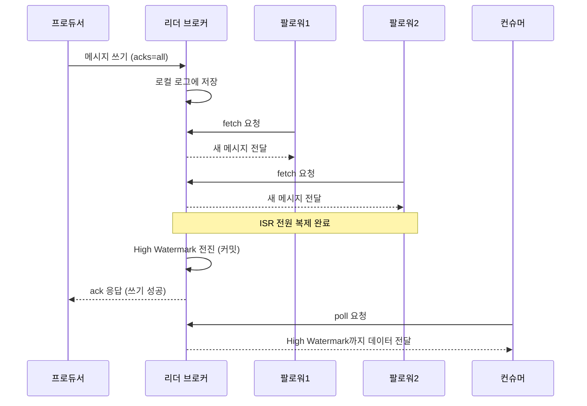
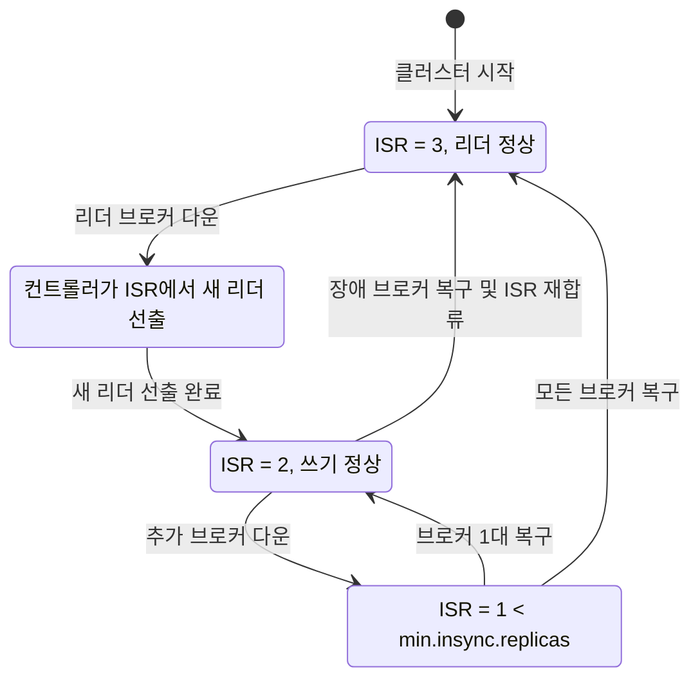

# 복제(Replication)와 ISR - 고가용성·내구성의 토대

## 학습 목표
- 리더·팔로워 복제 구조와 ISR(In-Sync Replicas)이 데이터 내구성을 보장하는 원리를 이해한다
- replication.factor, min.insync.replicas, acks의 조합이 가용성과 내구성에 미치는 영향을 설명한다
- 복제 팩터를 높인 토픽을 만들고 브로커를 강제 중단시켜 리더 선출과 장애 복구를 직접 관찰한다

## 본문

### 왜 복제가 필요한가
초급에서 우리는 토픽을 파티션으로 나누고, 각 파티션이 브로커의 디스크에 로그로 쌓인다는 것을 배웠다. 그런데 만약 파티션이 단 한 대의 브로커에만 저장되어 있다면? 그 브로커의 디스크가 망가지거나 서버가 다운되는 순간 해당 파티션의 데이터는 통째로 사라진다. 클라우드든 베어메탈이든 하드웨어는 언젠가 고장 난다는 것을 전제로 시스템을 설계해야 한다.

Kafka의 답은 **복제(Replication)** 다. 같은 파티션의 복사본을 여러 브로커에 두어, 한 대가 죽어도 다른 브로커의 복사본으로 서비스를 이어간다. 이것이 Kafka가 "미션 크리티컬" 시스템의 신뢰성 기반(cornerstone)으로 불리는 이유다.

### 리더와 팔로워
토픽을 만들 때 **replication factor**(복제 팩터)를 지정하면, 각 파티션이 그 수만큼 복사본을 갖는다. 복제 팩터가 N이면 복사본도 N개이고, 일반적으로 **N-1대의 브로커 장애까지 견딜 수 있다**.

이 복사본 중 하나가 **리더(leader)**, 나머지는 **팔로워(follower)** 가 된다.

- 프로듀서의 쓰기와 컨슈머의 읽기는 **기본적으로** 모두 **리더**를 향한다.
- 팔로워는 끊임없이 리더에게 **fetch 요청**을 보내 새 데이터를 가져와 자기 로그에 복사한다. 즉 팔로워는 "리더를 베껴 쓰는 또 다른 컨슈머"처럼 동작한다.

> 프로듀서는 항상 리더에게만 쓴다. 팔로워는 직접 쓰기를 받지 않고, 리더로부터 데이터를 끌어와 동기화한다.

다만 **읽기는 예외가 있다.** Kafka 2.4(KIP-392)부터는 컨슈머가 리더가 아닌, 자신과 같은 데이터센터·랙(rack)에 있는 **가장 가까운 팔로워에서 읽는 것(follower fetching)** 이 가능하다. 컨슈머에 `client.rack`을 설정하고 브로커에 랙 인지(rack-aware) 복제본 선택기를 켜면, 클라이언트는 지리적으로 가까운 팔로워에서 읽어 **지연 시간과 데이터센터 간 트래픽 비용**을 줄일 수 있다. 즉 "쓰기는 항상 리더, 읽기는 기본은 리더지만 최적화를 위해 팔로워에서 읽을 수도 있다"가 정확한 그림이다. 단 팔로워는 리더보다 조금 뒤처질 수 있으므로, 팔로워는 자신이 따라잡은(High Watermark까지의) 데이터만 컨슈머에게 보여준다.

### ISR과 High Watermark - 무엇이 "안전한" 데이터인가
**ISR(In-Sync Replicas, 동기화된 복제본)** 는 리더를 충분히 따라잡은 복사본들의 집합이다. 리더는 항상 ISR에 포함되며, 팔로워는 리더에 뒤처지지 않을 때만 ISR에 든다. 어떤 팔로워가 너무 느려 일정 시간(`replica.lag.time.max.ms`) 이상 따라오지 못하면 리더가 그 팔로워를 ISR에서 빼버린다. 이렇게 일부 복사본이 빠진 상태를 **under-replicated**(복제 부족) 상태라 한다.

기록이 "안전하다"고 판정되는 기준은 **ISR에 속한 모든 복사본이 그 기록을 받았을 때**다. 이때 그 기록은 **커밋(committed)** 되었다고 하며, 그제서야 컨슈머에게 노출된다. 커밋된 지점을 가리키는 표식이 **High Watermark**다. 컨슈머는 High Watermark까지의 데이터만 읽을 수 있다 — 아직 모든 ISR에 복제되지 않은 데이터를 컨슈머에게 보여주면, 그 데이터가 장애로 유실될 경우 컨슈머가 본 적 있는 데이터가 사라지는 모순이 생기기 때문이다.

아래 시퀀스 다이어그램은 프로듀서의 쓰기부터 컨슈머의 읽기까지 복제와 High Watermark가 어떻게 작동하는지를 보여준다.



### 세 가지 설정의 삼각관계: replication.factor, min.insync.replicas, acks
내구성과 가용성을 결정하는 핵심은 세 설정의 조합이다.

- **replication.factor**: 복사본을 몇 개 둘 것인가 (예: 3).
- **acks** (프로듀서 설정): 프로듀서가 어디까지 확인받고 성공으로 간주할지.
  - `acks=0`: 확인 안 받음(fire-and-forget). 가장 빠르지만 유실 가능.
  - `acks=1`: 리더만 받으면 성공. 리더가 복제 전에 죽으면 유실 가능.
  - `acks=all`: ISR의 **모든** 복사본이 받아야 성공. 가장 안전.
- **min.insync.replicas** (토픽/브로커 설정): 쓰기가 성립하기 위해 ISR에 최소 몇 개의 복사본이 살아 있어야 하는지를 **강제하는 하한선**.

여기서 `acks=all`과 `min.insync.replicas`가 정확히 어떻게 맞물리는지가 핵심이다. 둘은 서로 다른 두 단계에서 작동한다.

1. **쓰기 수락 전 사전 검사 (min.insync.replicas).** 프로듀서가 `acks=all`로 메시지를 보내면, 리더 브로커는 데이터를 받기 **전에** 먼저 현재 ISR 멤버 수가 `min.insync.replicas` 값 이상인지 확인한다. ISR 수가 그 값보다 **작으면 쓰기 요청을 아예 처리하지 않고 즉시 `NotEnoughReplicasException`(또는 `NotEnoughReplicasAfterAppendException`)으로 거부**한다. 이것이 "데이터를 위험하게 1곳에만 쓰고 마는" 사태를 사전에 막는 안전장치다.
2. **쓰기 성공 판정 (acks=all).** 사전 검사를 통과해 요청이 수락되면, 그제서야 리더는 데이터를 자기 로그에 쓰고 **현재 ISR에 속한 모든 복사본**이 그 데이터를 복제할 때까지 기다린 뒤 프로듀서에 성공 응답을 보낸다.

즉 `min.insync.replicas`는 "쓰기가 시작될 수 있는 최소 ISR 크기"를 정하고, `acks=all`은 "그 ISR 전원이 받았음"을 성공 조건으로 삼는다. 둘이 함께여야 의미가 있다.

> 중요한 함정: `min.insync.replicas=1`이면 `acks=all`을 줘도 사실상 `acks=1`과 같아진다. ISR이 리더 1개만 있어도 검사를 통과하고, 그 1개(리더)만 받으면 성공으로 처리되기 때문이다. 그래서 표준 권장 조합은 **replication.factor=3 + min.insync.replicas=2 + acks=all**이다.

예를 들어 replication.factor=3, min.insync.replicas=2, acks=all로 설정하면:

- 평소엔 3개 복사본 모두에 쓰이지만, 1대가 죽어 ISR이 2개로 줄어도 `min.insync.replicas=2`를 만족하므로 사전 검사를 통과해 쓰기가 계속된다. **장애 1대를 견디면서도 내구성을 유지**하는 황금 조합이다.
- 만약 2대가 죽어 ISR이 1개가 되면, 프로듀서 쓰기는 ISR에 복제되기도 전에 사전 검사에서 `min.insync.replicas=2`를 못 채워 `NotEnoughReplicasException`으로 거부된다. 이는 "데이터가 충분히 복제되지 못할 바에는 차라리 쓰기를 멈춘다"는 **내구성 우선** 선택이다.

> 흔한 함정: replication.factor와 min.insync.replicas를 같은 값(예: 둘 다 3)으로 두면, 단 1대만 죽어도 사전 검사가 실패해 쓰기가 전면 중단된다. min.insync.replicas는 보통 (replication.factor - 1)로 둔다.

여기서 가용성과 내구성의 트레이드오프가 드러난다. min.insync.replicas를 높이면 더 많은 복사본에 안전하게 저장되지만(내구성↑), 그만큼 살아있어야 할 브로커 수도 늘어 쓰기가 멈출 위험도 커진다(가용성↓).

### 리더 장애와 복구의 흐름
리더 브로커가 죽으면 무슨 일이 벌어질까? ISR에 속한 복사본들은 **커밋된 기록을 모두 갖고 있음이 보장**되므로, 컨트롤러가 ISR 중 하나를 새 리더로 선출한다. 데이터 유실 없이 곧바로 서비스가 이어진다. 죽었던 브로커가 돌아오면 새 리더를 따라잡아(catch-up) 다시 ISR에 합류하고, 클러스터는 완전 복제 상태로 복귀한다.

이 과정을 깔끔하게 하기 위해 각 리더는 **`leader epoch`(리더 세대 번호)** 를 갖는다. 리더가 바뀔 때마다 이 번호가 1씩 올라간다. 왜 필요할까? 네트워크 단절(파티션) 등으로 옛 리더가 자신이 강등된 줄 모르고 잠깐 더 쓰기를 받는 **좀비 리더(zombie leader)** 가 생길 수 있기 때문이다. leader epoch이 없으면 옛 리더가 쓴 데이터와 새 리더가 쓴 데이터가 뒤섞여 **복제본 간 데이터 불일치(divergence)** 가 발생한다. 팔로워와 복구된 브로커는 leader epoch을 비교해, 자신보다 낮은 세대(옛 리더)가 쓴 데이터를 잘라내고(truncate) 진짜 최신 리더의 로그에 맞춘다. 즉 leader epoch은 "누가 진짜 현재 리더인가"를 가려 데이터 정합성을 지키는 장치다.

또한 Kafka는 평소 리더가 특정 브로커에 몰리지 않도록, 각 파티션의 첫 복사본을 **preferred replica**로 지정해 리더를 브로커들에 고르게 분산시킨다(부하 분산).

아래 상태 다이어그램은 파티션의 복제 상태가 장애와 복구에 따라 어떻게 전이하는지를 보여준다.



전체 흐름은 다음과 같다: 프로듀서가 리더에 쓰면 → 팔로워가 fetch로 복제 → ISR 전원이 받으면 커밋(High Watermark 전진) → 컨슈머에 노출 → 리더 장애 시 ISR에서 새 리더 선출 → 복구된 브로커가 재합류.

### 실습: 복제 토픽 만들고 장애 일으켜보기
세 브로커가 있는 클러스터(또는 docker-compose로 띄운 3-broker 환경)를 가정한다.

복제 팩터 3, min.insync.replicas 2로 토픽을 만든다.

```bash
kafka-topics.sh --create \
  --topic orders \
  --bootstrap-server localhost:9092 \
  --partitions 3 \
  --replication-factor 3 \
  --config min.insync.replicas=2
```

리더와 ISR 구성을 확인한다.

```bash
kafka-topics.sh --describe \
  --topic orders \
  --bootstrap-server localhost:9092
```

출력에서 각 파티션마다 `Leader`(현재 리더 브로커 ID), `Replicas`(전체 복사본 목록), `Isr`(현재 동기화된 복사본 목록)을 볼 수 있다. 처음엔 Isr에 세 브로커가 모두 들어 있다.

프로듀서는 `acks=all`로 메시지를 보낸다.

```bash
kafka-console-producer.sh \
  --topic orders \
  --bootstrap-server localhost:9092 \
  --producer-property acks=all
```

이제 리더 브로커 하나를 강제로 중단시킨 뒤(예: `docker stop` 또는 프로세스 kill) 다시 `--describe`를 실행하면, **Leader가 다른 브로커 ID로 바뀌고 Isr이 2개로 줄어든** 것을 관찰할 수 있다. 그래도 프로듀서/컨슈머는 정상 동작한다 — ISR 2개가 `min.insync.replicas=2`를 만족하기 때문이다. 브로커를 다시 켜면 잠시 후 Isr이 다시 3개로 복구된다. 한 대를 더 멈춰 ISR이 1개가 되면, 프로듀서 쓰기가 사전 검사 단계에서 `NotEnoughReplicasException`으로 거부되는 것도 확인해 보자.

## 핵심 요약
- 복제는 파티션 복사본을 여러 브로커에 두어 장애를 견디는 Kafka 신뢰성의 토대다. replication.factor=N이면 N-1대 장애까지 견딘다.
- 리더가 쓰기를 받고 팔로워는 fetch로 복제한다. 읽기는 기본적으로 리더에서 일어나지만, KIP-392 이후 `client.rack` 설정으로 가까운 팔로워에서 읽어 지연·트래픽 비용을 줄일 수도 있다. ISR(동기화된 복사본) 전원이 받은 기록만 커밋되어 High Watermark까지 컨슈머에 노출된다.
- `acks=all`은 두 단계로 작동한다: 쓰기 수락 **전에** ISR 수가 `min.insync.replicas` 이상인지 검사(미달이면 `NotEnoughReplicasException`으로 거부)하고, 통과하면 ISR 전원의 복제를 기다려 성공 처리한다. 따라서 `min.insync.replicas=1`이면 `acks=all`도 사실상 `acks=1`이며, 표준 권장은 replication.factor=3 + min.insync.replicas=2 + acks=all이다. 두 값을 같게 두면 1대 장애에도 쓰기가 멈추는 함정에 빠진다.
- 리더 장애 시 ISR에서 새 리더가 무손실로 선출되며, leader epoch이 좀비 리더로 인한 데이터 불일치를 막는다. 복구된 브로커는 따라잡은 뒤 ISR에 재합류한다. `kafka-topics --describe`의 Leader/Isr로 이를 직접 관찰할 수 있다.
