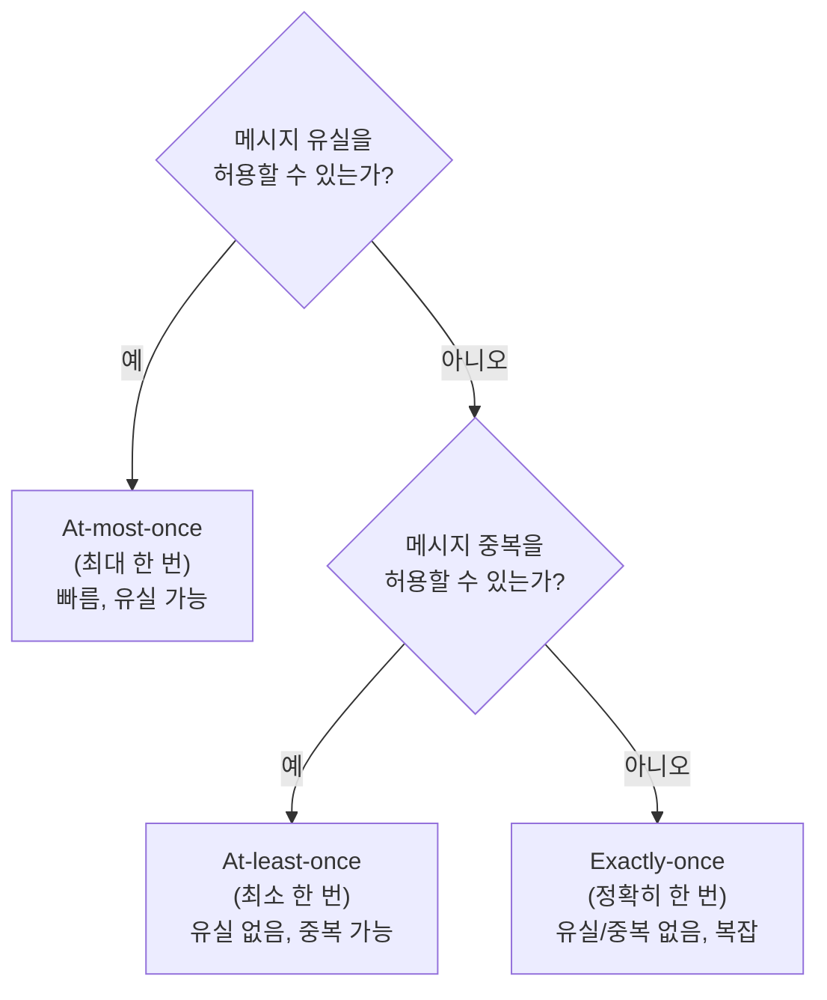
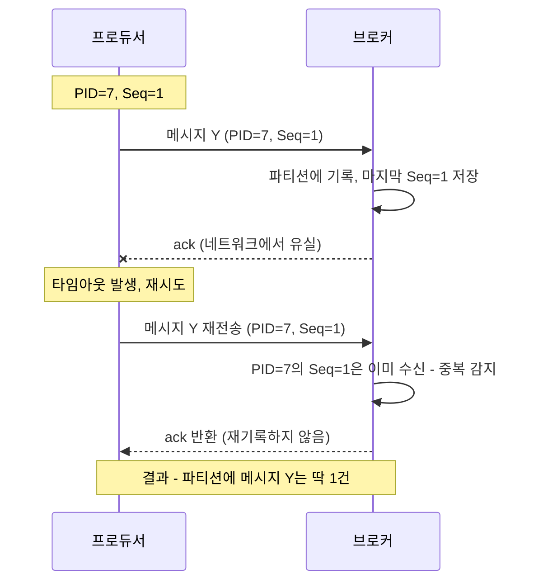
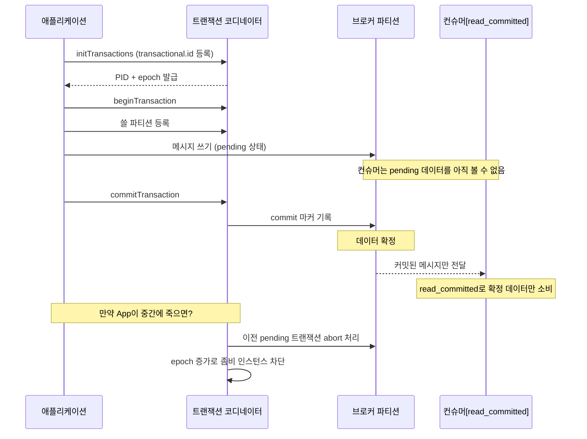

# Delivery Semantics and Idempotent Producers

## Learning Objectives
- Distinguish the three delivery guarantees — at-most-once, at-least-once, and exactly-once — and understand their respective trade-offs
- Understand how retries produce duplicate messages and how idempotent producers eliminate that problem
- Explain the end-to-end flow of exactly-once processing using transactions and `read_committed`

## Content

### Why Delivery Semantics Matter
In the beginner course, we learned that producers use `acks` to control the level of write acknowledgment. But networks aren't perfect. When a producer sends a message and doesn't receive an acknowledgment (ack), there's no way to tell whether the message was never written to the broker, or whether it was written successfully but the ack was lost in transit. How you handle this ambiguity determines whether **messages get lost or duplicated**. In systems where processing the same event twice is catastrophic — payments, inventory, billing — you need to understand and consciously choose your delivery semantics.

Kafka offers three delivery guarantees.

### 1) At-most-once
A message is delivered **at most once**. Data loss is tolerated, but **duplicates never occur**. The producer fires the message and moves on without waiting for a response (fire-and-forget). `acks=0` falls into this category.

- Advantage: No waiting for a response means **the highest throughput**.
- Disadvantage: If a message disappears en route, there's no retry, so **data loss is possible**.
- Best suited for: Metrics collection, log sampling, and other workloads where occasional data loss is acceptable.

### 2) At-least-once
A message is delivered **at least once**. **Data loss never occurs, but duplicates can happen**. The producer waits for an acknowledgment and retries if one doesn't arrive. However, in the case where the message was written successfully but the ack was lost, the retry causes the same message to be written a second time.

- Advantage: **No data loss**. This is Kafka's de-facto default behavior and the most widely used guarantee.
- Disadvantage: **Duplicates are possible**. Consumer logic must be designed to tolerate duplicates (idempotent consumer).
- Throughput: Middle ground — lower than at-most-once because of the wait for acknowledgment.

The flowchart below captures the decision: choosing a delivery guarantee comes down to two questions — "Can I tolerate data loss?" and "Can I tolerate duplicates?"

### 3) Exactly-once
A message is processed **exactly once** — no loss, no duplicates. This is the ideal, but it is also **the most complex to configure and carries the lowest throughput**. It requires cooperation between the producer, broker, and consumer, and should only be used when truly necessary.

> Exactly-once is not always the right answer. Most systems are well-served by at-least-once combined with idempotent consumer logic. Choose exactly-once only when the cost — reduced throughput and added complexity — is clearly justified.

### Idempotent Producers: Eliminating Retry-Induced Duplicates
The **idempotent producer** solves the duplicate problem of at-least-once at the producer level. "Idempotent" means that performing the same operation multiple times produces the same result as doing it once.

The mechanism is straightforward. An idempotent producer attaches a **Producer ID (PID)** and a **sequence number** to each write request. The broker tracks the last successfully processed sequence number per PID. The sequence diagram below shows how this prevents duplicates when an ack is lost.

This cleanly eliminates retry-induced duplicates. Enabling it requires just one line: `enable.idempotence=true`. Compatible settings — `acks=all`, `retries > 0`, and `max.in.flight.requests.per.connection <= 5` — are enforced automatically (if you explicitly set conflicting values, an exception is thrown). In recent versions of Kafka, idempotence is enabled by default.

### Completing Exactly-once: Transactions and read_committed
The idempotent producer handles "retry duplicates on a single partition." Real-world requirements are often more complex. Imagine reading a fund-transfer event from an input topic, writing both a debit event and a credit event to output topics, and then committing the input offset — all as an **all-or-nothing** operation. If the application crashes midway and restarts, the debit event could be written twice. This is the same requirement as a database transaction.

Kafka **transactions** solve this. The sequence diagram below shows the full transaction flow.

1. The application using transactions carries a unique `transactional.id` and locates a **transaction coordinator** (a dedicated broker) on startup.
2. The coordinator issues a PID and epoch to the application.
3. Before writing to output topics, the application registers which partitions it will write to with the coordinator, then writes the data. At this point the data is still **pending** — not yet visible to consumers.
4. Once all writes are done, the application issues a **commit**. The coordinator writes a commit marker, which finalizes and exposes the data.
5. If the application crashes mid-transaction and restarts, the coordinator **aborts** the previous pending transaction and increments the epoch, blocking any writes from the "zombie" old instance (a technique called fencing).

On the consumption side, when a consumer sets `isolation.level=read_committed`, it reads **only committed transaction data** and skips any aborted records (the broker uses the Last Stable Offset and abort metadata to guide this). In Kafka Streams, setting `processing.guarantee=exactly_once_v2` automatically enables both transactions and idempotence with a single configuration line.

> Important: Kafka transactions apply **only to operations within Kafka topics**. Two-phase commit spanning an external database is not supported. To bridge external systems, the standard pattern is: write to an output topic idempotently, then read from that topic and apply the changes to the external system idempotently — two independent single-system transactions chained together.

## Key Takeaways
- The three delivery guarantees: at-most-once (data loss possible, no duplicates, highest throughput), at-least-once (no data loss, duplicates possible, the practical default), exactly-once (neither loss nor duplicates, complex, lowest throughput).
- Duplicates in at-least-once arise when an ack is lost and the producer retries. Idempotent producers attach a PID and sequence number so the broker can detect and discard duplicate writes (`enable.idempotence=true`).
- Exactly-once builds on idempotent producers by adding transactions, making multiple writes and offset commits all-or-nothing. Consumers complete the picture by reading with `read_committed`, which exposes only fully committed data.
- At-least-once with idempotent consumer logic is sufficient for most use cases. Reserve exactly-once for situations where the added cost is clearly worth it.
