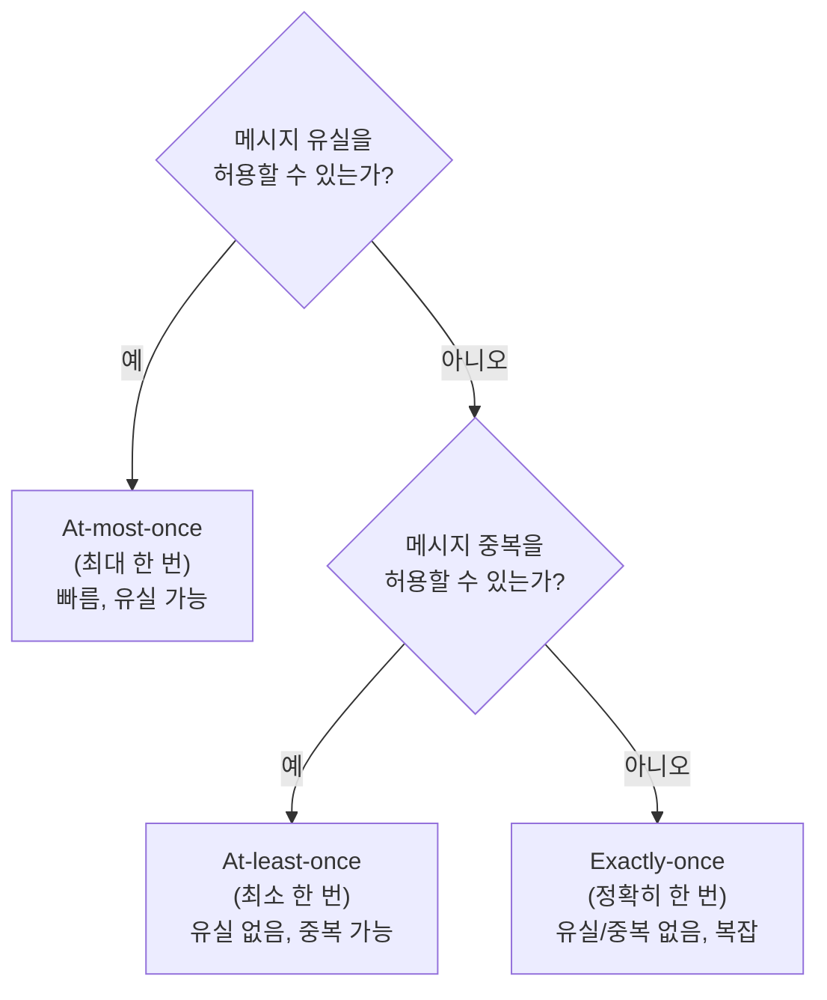
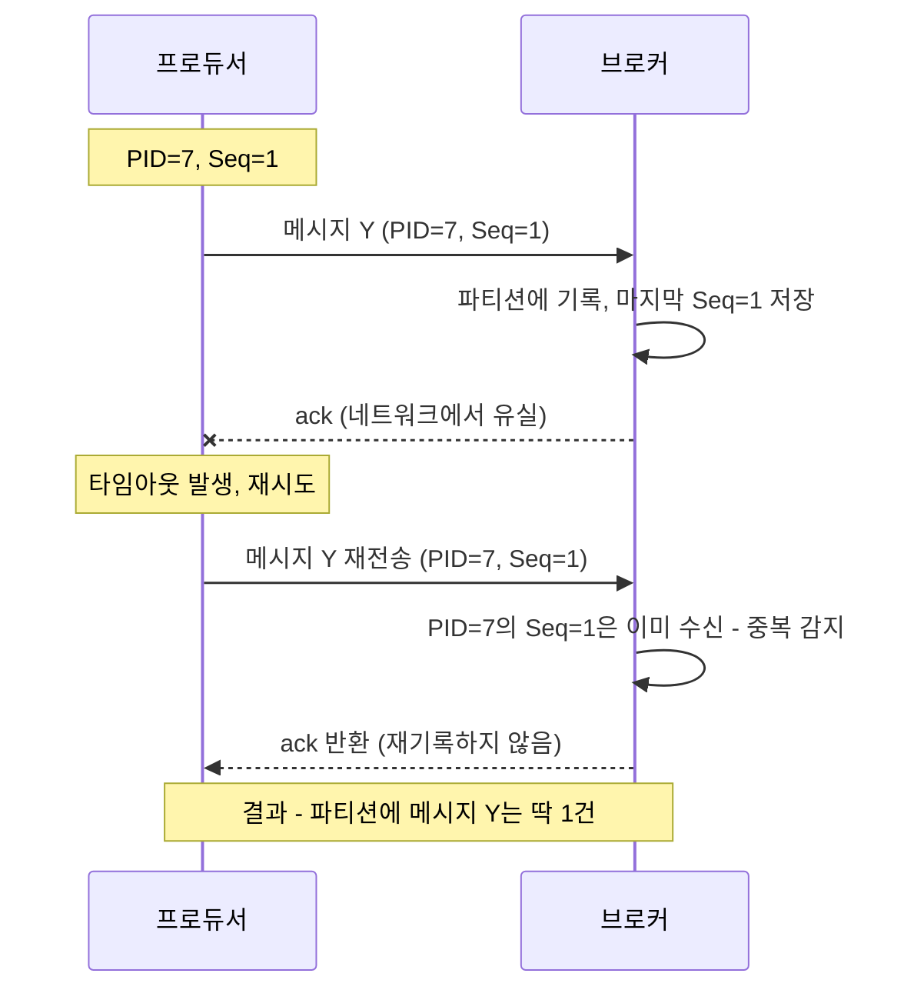
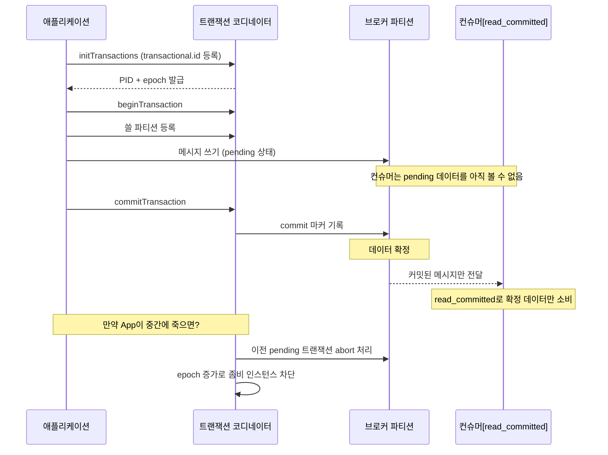

# 전달 보장(Delivery Semantics)과 멱등 프로듀서

## 학습 목표
- at-most-once / at-least-once / exactly-once 세 가지 전달 보장의 차이와 트레이드오프를 구분한다
- 재시도가 만드는 중복 메시지 문제와 멱등(idempotent) 프로듀서가 이를 막는 원리를 이해한다
- 트랜잭션과 read_committed를 통한 exactly-once 처리의 전체 흐름을 설명한다

## 본문

### 왜 "전달 보장"을 따져야 하는가
초급에서 우리는 프로듀서가 `acks`로 쓰기 확인 수준을 정한다는 것을 배웠다. 그런데 네트워크는 완벽하지 않다. 프로듀서가 메시지를 보냈는데 응답(ack)이 안 오면, 메시지가 정말 안 들어간 건지 아니면 들어갔는데 응답만 유실된 건지 알 수 없다. 이 모호함을 어떻게 다루느냐에 따라 **메시지가 유실될 수도, 중복될 수도** 있다. 결제·재고·정산처럼 한 건이 두 번 처리되면 큰일 나는 시스템에서는 이 "전달 보장(delivery semantics)"을 정확히 이해하고 골라야 한다.

Kafka는 세 가지 전달 보장을 제공한다.

### 1) At-most-once (최대 한 번)
메시지는 **최대 한 번** 전달된다. 즉 유실은 허용하되, **중복은 절대 없다**. 프로듀서는 메시지를 보내고 응답을 기다리지 않은 채(fire-and-forget) 다음으로 넘어간다. `acks=0`이 여기에 해당한다.

- 장점: 응답을 기다리지 않으니 **가장 빠르고 처리량이 높다**.
- 단점: 중간에 메시지가 사라져도 재시도하지 않으므로 **유실 가능**.
- 적합한 곳: 약간의 데이터 손실이 문제되지 않는 메트릭 수집, 로그 샘플링 등.

### 2) At-least-once (최소 한 번)
메시지는 **최소 한 번** 전달된다. 즉 **유실은 절대 없지만, 중복은 발생할 수 있다**. 프로듀서는 응답이 올 때까지 기다리고, 응답이 안 오면 같은 메시지를 다시 보낸다. 그런데 앞서 말한 "메시지는 들어갔는데 응답만 유실된" 경우, 재시도로 인해 같은 메시지가 두 번 기록된다.

- 장점: **유실이 없다**. Kafka의 기본값에 가깝고 가장 널리 쓰인다.
- 단점: **중복 가능**. 컨슈머 쪽에서 중복을 견디도록(idempotent consumer) 설계해야 한다.
- 처리량: 응답을 기다리므로 at-most-once보다는 낮은, 중간 수준의 처리량.

아래 흐름도처럼, 전달 보장의 선택은 "유실을 견딜 수 있는가"와 "중복을 견딜 수 있는가" 두 질문으로 결정된다.

### 3) Exactly-once (정확히 한 번)
메시지는 **정확히 한 번** 처리된다. 유실도 중복도 없다. 가장 이상적이지만 **설정이 가장 복잡하고 처리량은 가장 낮다**. 프로듀서·브로커·컨슈머가 협력해야 하며, 정말 필요한 곳에만 써야 한다.

> 무조건 exactly-once가 정답이 아니다. 대부분의 시스템은 "at-least-once + 컨슈머가 중복을 멱등하게 처리"로 충분하다. exactly-once는 비용(처리량 저하·복잡성)을 감수할 가치가 있을 때만 선택한다.

### 멱등 프로듀서: 중복을 만드는 재시도를 막는다
at-least-once의 중복 문제를 프로듀서 단에서 해결하는 것이 **멱등(idempotent) 프로듀서**다. "멱등"이란 같은 연산을 여러 번 해도 결과가 한 번 한 것과 같다는 뜻이다.

원리는 간단하다. 멱등 프로듀서는 각 쓰기 요청에 **프로듀서 ID(PID)** 와 **시퀀스 번호(sequence number)** 를 붙인다. 브로커는 PID별로 마지막에 받은 시퀀스 번호를 기억한다. 아래 시퀀스 다이어그램은 ack가 유실되었을 때 멱등 프로듀서가 중복을 어떻게 방지하는지 보여준다.

이로써 재시도로 인한 중복이 깔끔히 제거된다. 활성화는 `enable.idempotence=true` 한 줄이면 된다. 이때 호환을 위해 `acks=all`, `retries > 0`, `max.in.flight.requests.per.connection <= 5`가 자동으로 맞춰진다(직접 충돌나게 설정하면 예외 발생). 최신 Kafka에서는 멱등성이 기본으로 켜져 있다.

### Exactly-once의 완성: 트랜잭션과 read_committed
멱등 프로듀서는 "단일 파티션에 대한 재시도 중복"을 막는다. 하지만 실무에서는 더 복잡한 요구가 있다. 예를 들어 "입력 토픽에서 송금 이벤트를 읽어 → 출금/입금 두 이벤트를 출력 토픽에 쓰고 → 입력 오프셋을 커밋"하는 작업을, **전부 성공하거나 전부 실패(all-or-nothing)** 로 처리하고 싶다. 중간에 앱이 죽었다 재시작하면 출금이 두 번 기록되는 사고가 날 수 있기 때문이다. 이것이 데이터베이스 트랜잭션과 똑같은 요구다.

Kafka **트랜잭션**이 이를 해결한다. 아래 시퀀스 다이어그램은 트랜잭션의 전체 흐름을 보여준다.

1. 트랜잭션을 쓰는 애플리케이션은 고유한 `transactional.id`를 갖고, 시작 시 **트랜잭션 코디네이터**(전용 브로커)를 찾는다.
2. 코디네이터는 이 앱에 PID와 epoch를 발급한다.
3. 앱은 출력 토픽에 쓰기 전, 어떤 파티션에 쓸지 코디네이터에 알리고 → 데이터를 쓴다(이 시점엔 아직 컨슈머에 안 보임, pending 상태).
4. 모두 쓰면 **commit** 요청 → 코디네이터가 commit 마커를 기록하면 그때 데이터가 확정·노출된다.
5. 중간에 앱이 죽고 재시작하면, 코디네이터가 이전 인스턴스의 pending 트랜잭션을 **abort**(취소) 처리하고 epoch를 올려, 좀비처럼 살아 돌아온 옛 인스턴스의 쓰기를 차단(fencing)한다.

소비 측에서는 컨슈머가 `isolation.level=read_committed`로 설정하면, **커밋된 트랜잭션 데이터만** 읽고 abort된 데이터는 건너뛴다(브로커가 Last Stable Offset과 abort 메타데이터로 이를 안내한다). Kafka Streams에서는 `processing.guarantee=exactly_once_v2` 한 줄로 트랜잭션과 멱등성이 자동으로 함께 켜진다.

> 주의: Kafka 트랜잭션은 **Kafka 내부 토픽 간 작업**에만 적용된다. 외부 DB까지 묶는 2-phase commit은 지원하지 않는다. 외부 시스템과는 "출력 토픽을 멱등하게 만들고 → 그것을 읽어 외부에 멱등하게 적용"하는 식으로 두 개의 단일 트랜잭션으로 다리를 놓는다.

## 핵심 요약
- 세 가지 전달 보장: at-most-once(유실 가능·중복 없음·최고 처리량), at-least-once(유실 없음·중복 가능·기본 선택), exactly-once(유실·중복 모두 없음·복잡·낮은 처리량).
- at-least-once의 중복은 ack 유실 후 재시도에서 생긴다. 멱등 프로듀서는 PID+시퀀스 번호로 브로커가 중복을 식별·제거하게 한다(`enable.idempotence=true`).
- exactly-once는 멱등 프로듀서 위에 트랜잭션을 얹어 "여러 쓰기+오프셋 커밋"을 all-or-nothing으로 처리하고, 컨슈머는 `read_committed`로 커밋된 데이터만 읽어 완성된다.
- 대부분은 at-least-once + 멱등 처리로 충분하다. exactly-once는 비용을 감수할 가치가 있을 때만 쓴다.
