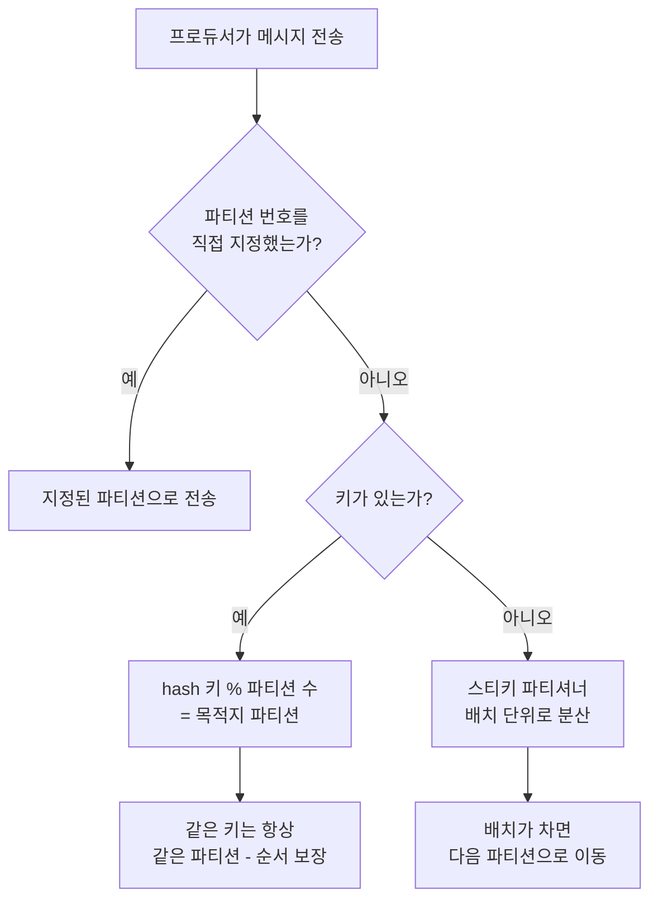
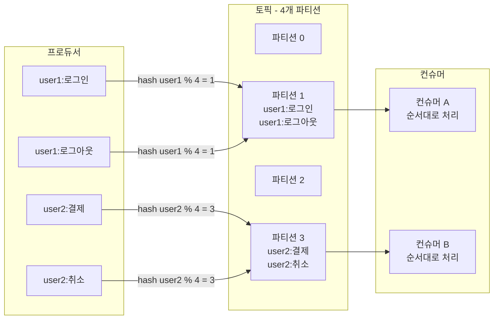

# Partitioning Strategies and Keys - Order Guarantees and Load Distribution

## Learning Objectives
- Understand how key-based hash partitioning guarantees ordering for messages with the same key
- Analyze the default partitioner (key hash and sticky), hot partitions, and data skew
- Implement a custom `Partitioner` to take direct control of routing logic

## Content

### Partitions Govern Both Parallelism and Ordering
In the beginner course, we learned that a topic is divided into multiple partitions and that consumers can work in parallel — one consumer per partition. But the rule that decides **which partition a message goes to** is the **partitioner**, and this decision has two important consequences: **ordering guarantees** and **load distribution**. Because these two goals often pull in opposite directions, choosing a partitioning strategy is one of the most important design decisions in intermediate Kafka operations.

### How the Default Partitioner Makes Its Decision
When a producer sends a message, the default partitioner determines the target partition using the following priority order.

1. **Is an explicit partition number specified?** If the code specifies a partition directly, that partition is used. This is essentially "micromanaging" and is generally discouraged, but it can be useful for special routing requirements.
2. **Is there a key?** If a key is present, the partition is determined by **the key's hash value modulo the partition count**. The crucial property is that **the same key always maps to the same partition**.
3. **No key either?** Kafka distributes the message efficiently on its own (see the sticky partitioner below).

The flowchart below illustrates the three-step decision process of the default partitioner.



### Key Hashing and Ordering Guarantees
Kafka guarantees ordering **only within a partition**. So how do you satisfy requirements like "events for a specific user must be processed in the order they occurred"? The answer is to **use that user's ID as the message key**. Because the same key always goes to the same partition, all events for that user accumulate in order on a single partition's log, and a single consumer reads them in sequence.

The formula is commonly simplified as `hash(key) % partition_count`, but Kafka's default partitioner does not use a plain `hashCode()`. It uses the **murmur2 hash algorithm** and applies a bitmask (`& 0x7fffffff`) to ensure the result is always non-negative, then takes the modulo. This produces a more uniform distribution of keys across partitions. The core principle — same key always goes to the same partition — is unchanged, but it is good to know these details are in place to improve distribution uniformity.

> For data where order matters, use the "ordering unit" as the key. For example: use an account number as the key for account transactions, and an order ID for order lifecycle events.

The diagram below shows how key hashing routes messages with the same key to a single partition, preserving their order.



There is one hidden trap in the `hash(key) % N` formula. **If you later increase the partition count (N), the modulo results change, and the same key can land on a different partition.** Past messages for that key remain in the old partition while new ones go to a new partition, breaking the ordering guarantee. This is why **you should never casually increase the partition count on a topic that uses keys** — plan ahead and start with enough partitions from the beginning.

### The Sticky Partitioner and Hot Partitions
Without a key, the old default (before Kafka 2.4) was **round-robin**: each message was sent to a different partition in sequence, achieving even distribution. However, since producers batch messages for performance, round-robin caused many small batches to form across multiple partitions, reducing network efficiency.

Starting from Kafka 2.4, the default is the **sticky partitioner**. It "sticks" to one partition until the batch is full (or `linger.ms` elapses), then switches to the next. Over time this distributes messages evenly, while keeping batches large — resulting in roughly **50% lower latency and reduced CPU usage** compared to round-robin. You can tune its behavior with `linger.ms` (default 0, often bumped up slightly to grow batches) and `batch.size`.

When using keys, watch out for **hot partitions and data skew**. If a particular key is disproportionately common — a single huge customer account, a device ID appearing in a massive volume of events — all that traffic concentrates on the one partition that key maps to. The broker and consumer handling that partition get overloaded while all others sit idle, eliminating the parallelism benefits of partitioning. The fix is either to redesign the key (e.g., a composite key like `userId-bucketNumber` to spread the load) or to write a custom partitioner with explicit distribution logic.

### Custom Partitioners
When the default key-hash or sticky behavior doesn't fit — for example, when you can't use a key but still want to route by a specific field in the record value, or when you need to combine multiple fields for routing — you can implement the `Partitioner` interface to **take full control of routing logic**.

The `partition()` method is called for every message, and the integer it returns is the destination partition number. One critical rule: **because the partitioner is invoked on every code path through the producer, it must never throw an exception under any input.** Handle edge cases defensively — a topic with only one partition, or a null key.

The example below implements the rule "VIP traffic goes to dedicated partition 0; everything else is distributed evenly across partitions 1 and above."

```java
public class RegionPartitioner implements Partitioner {
    @Override
    public int partition(String topic, Object key, byte[] keyBytes,
                         Object value, byte[] valueBytes, Cluster cluster) {
        int numPartitions = cluster.partitionsForTopic(topic).size();

        // Guard 1) If there is only one partition, there is nowhere to distribute — always return 0.
        //          Without this guard, the modulo below would cause an ArithmeticException (% 0).
        if (numPartitions <= 1) {
            return 0;
        }

        // VIP traffic goes to dedicated partition 0
        if ("VIP".equals(key)) {
            return 0;
        }

        // Regular traffic is hash-distributed across partitions 1 .. (numPartitions-1).
        // Number of eligible partitions = numPartitions - 1 (excluding partition 0)
        int targetCount = numPartitions - 1;

        // Guard 2) If the key is null, use a random/round-robin-style value instead of a hash
        //          to avoid always landing on the same partition.
        int hash = (key == null) ? ThreadLocalRandom.current().nextInt()
                                 : key.hashCode();

        // floorMod ensures the result is in 0 .. targetCount-1 even for negative hashes,
        // then +1 to skip partition 0.
        return 1 + Math.floorMod(hash, targetCount);
    }

    @Override public void configure(Map<String, ?> configs) {}
    @Override public void close() {}
}
```

Two points are critical here. First, **check `numPartitions <= 1` before anything else** to prevent a divide-by-zero (`% 0`) exception. Second, when distributing regular traffic, divide by **`numPartitions - 1`** (the actual number of eligible partitions, excluding partition 0) so messages spread evenly across partitions 1 and above. If you mistakenly use `1` as the divisor, `1 + floorMod(hash, 1)` always equals 1, funneling all traffic to partition 1 — exactly the hot-partition problem this lecture warns against, now introduced by the code itself.

Register the class in the producer configuration to activate it.

```properties
partitioner.class=com.example.RegionPartitioner
```

This lets you enforce business rules — like isolating VIP customers to a dedicated partition while distributing everyone else evenly — at the infrastructure level. Even with a custom partitioner, always keep in mind the balance between **ordering guarantees (same key → same partition)** and **preventing skew**.

### Lab: Observing Distribution With and Without Keys
Create a topic with four partitions.

```bash
kafka-topics.sh --create --topic events \
  --bootstrap-server localhost:9092 \
  --partitions 4 --replication-factor 1
```

First, send several messages **without a key**. The sticky partitioner will fill a batch on one partition before moving to the next.

```bash
kafka-console-producer.sh --topic events \
  --bootstrap-server localhost:9092
```

Next, send messages **with keys**. The console producer accepts keys in `key:value` format.

```bash
kafka-console-producer.sh --topic events \
  --bootstrap-server localhost:9092 \
  --property parse.key=true --property key.separator=:
```

Send messages like `user1:login`, `user2:login`, `user1:logout`, `user2:order` — alternating the same keys — then read each partition individually with `kafka-console-consumer.sh --partition`.

```bash
kafka-console-consumer.sh --topic events \
  --bootstrap-server localhost:9092 \
  --partition 1 --from-beginning \
  --property print.key=true --property key.separator=:
```

Without a key (sticky mode), messages cluster into one partition per batch before moving on. With keys, **all messages for the same key (e.g., user1) are always grouped together on the same partition, in order**. This contrast makes the ordering guarantee of key hashing concrete and visible.

## Key Takeaways
- The partitioner determines a message's target partition in this priority order: explicit partition number → key hash (murmur2, bitmask-normalized, then `% N`) → sticky distribution (when no key).
- The same key always goes to the same partition, making the **key the unit of ordering**. However, increasing the partition count later changes the hash mapping and breaks ordering for keys already in flight — start with enough partitions from the outset.
- The default sticky partitioner builds larger batches for better performance. When certain keys dominate traffic, hot partitions and skew occur; fix this through key redesign or a custom partitioner.
- Implement the `Partitioner` interface and register it via `partitioner.class` to take direct control of routing. The partitioner must never throw an exception — guard against a single partition and null keys. Use the correct divisor (`numPartitions - 1` when excluding one partition) to avoid inadvertently creating the very hot partition you are trying to prevent.
