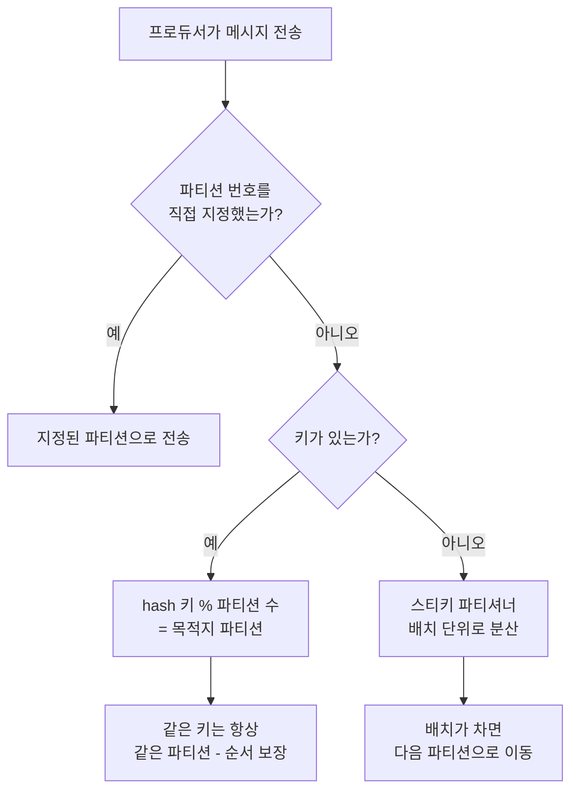
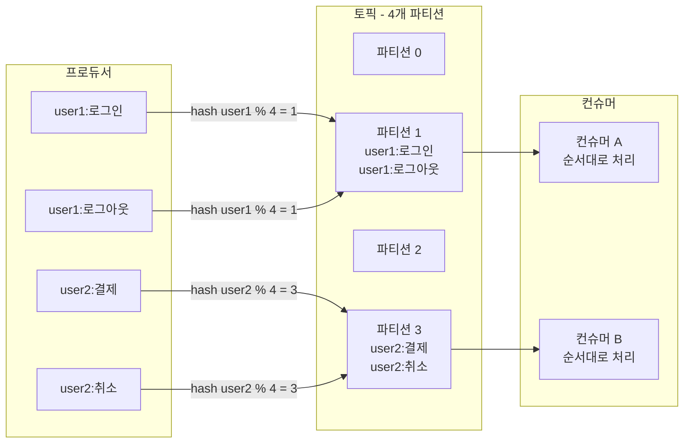

# 파티셔닝 전략과 키 - 순서 보장과 부하 분산

## 학습 목표
- 키 해시 기반 파티션 배정으로 같은 키 메시지의 순서가 보장되는 원리를 이해한다
- 기본 파티셔너(키 해시·스티키)와 핫 파티션·데이터 쏠림 문제를 분석한다
- Partitioner 인터페이스로 커스텀 파티셔너를 구현해 라우팅 규칙을 직접 제어한다

## 본문

### 파티션은 병렬성과 순서를 동시에 결정한다
초급에서 우리는 토픽이 여러 파티션으로 나뉘고, 파티션 수만큼 컨슈머가 병렬로 일할 수 있다는 것을 배웠다. 그런데 메시지를 **어느 파티션에 넣을지** 결정하는 규칙이 바로 **파티셔너(partitioner)** 이고, 이 결정이 두 가지 중요한 결과 — **순서 보장**과 **부하 분산** — 를 좌우한다. 이 둘은 종종 서로 충돌하기 때문에, 파티셔닝 전략은 중급 운영의 핵심 설계 포인트다.

### 기본 파티셔너의 3단계 판단
프로듀서가 메시지를 보낼 때, 기본 파티셔너는 다음 순서로 파티션을 정한다.

1. **명시적 파티션 번호가 있는가?** 코드에서 파티션을 직접 지정하면 그대로 따른다. "마이크로매니징"에 해당해 보통은 권장하지 않지만, 특수한 라우팅이 필요할 때 쓸 수 있다.
2. **키(key)가 있는가?** 키가 있으면 **키의 해시값을 파티션 수로 나눈 나머지**로 파티션을 정한다. 핵심은 **같은 키는 항상 같은 파티션**으로 간다는 것이다.
3. **키도 없는가?** 그러면 Kafka가 알아서 효율적으로 분산한다(아래 스티키 파티셔너).

아래 흐름도는 기본 파티셔너가 파티션을 결정하는 3단계 판단 과정을 보여준다.



### 키 해시와 순서 보장
Kafka는 **파티션 내에서만 순서를 보장**한다. 그렇다면 "특정 사용자의 이벤트는 발생 순서대로 처리되어야 한다" 같은 요구는 어떻게 만족시킬까? 답은 **그 사용자 ID를 키로 쓰는 것**이다. 같은 키는 항상 같은 파티션으로 가므로, 같은 사용자의 모든 이벤트가 한 파티션의 로그에 순서대로 쌓이고, 한 컨슈머가 순서대로 읽는다.

키로 파티션을 정하는 공식을 흔히 `hash(key) % partition_count`로 단순화해 설명하지만, 실제 Kafka 기본 파티셔너는 단순 `hashCode()`가 아니라 **murmur2 해시**를 쓴다. 또 음수가 나오지 않도록 비트 마스킹(`& 0x7fffffff`)으로 양수화한 뒤 나머지를 구해, 키들이 파티션에 더 고르게 흩어지도록 설계되어 있다. 원리(같은 키 → 같은 파티션)는 동일하지만, 분산 균일성을 위한 이런 장치가 들어 있다는 점은 알아 두면 좋다.

> 순서가 중요한 데이터는 그 "순서 단위"를 키로 삼아라. 예: 계좌 거래는 계좌번호를, 주문 이벤트는 주문 ID를 키로.

아래 구성도는 키 해시로 같은 키의 메시지가 하나의 파티션에 모여 순서가 보장되는 원리를 보여준다.



이 해시 % N 방식에는 함정이 하나 숨어 있다. **나중에 파티션 수(N)를 늘리면 나머지 계산이 바뀌어, 같은 키가 다른 파티션으로 갈 수 있다.** 그러면 그 키의 과거 메시지는 옛 파티션에, 새 메시지는 새 파티션에 흩어져 순서 보장이 깨진다. 그래서 **키를 쓰는 토픽은 파티션 수를 함부로 늘리면 안 된다** — 처음부터 넉넉히 잡는 것이 정석이다.

### 스티키 파티셔너와 핫 파티션
키가 없을 때, 예전(Kafka 2.4 이전) 기본값은 **라운드 로빈**이었다. 메시지를 파티션에 하나씩 돌아가며 뿌려 고르게 분산했다. 그런데 프로듀서는 성능을 위해 메시지를 **배치(batch)** 로 모아 보낸다. 라운드 로빈은 메시지마다 파티션을 바꾸므로, 작은 배치가 여러 개 만들어져 네트워크 효율이 떨어졌다.

그래서 Kafka 2.4부터 기본값은 **스티키 파티셔너(sticky partitioner)** 다. 하나의 파티션을 "끈끈하게" 골라 배치가 찰 때까지(또는 `linger.ms` 시간이 지날 때까지) 거기에 몰아 보내고, 배치를 보낸 뒤 다음 파티션으로 옮긴다. 시간이 지나면 전체적으로는 고르게 분산되면서도, 배치가 커져 **지연 약 50% 감소, CPU 사용률 절감**이라는 이득을 얻는다. `linger.ms`(기본 0, 보통 약간 높여 배치를 키움)와 `batch.size`로 동작을 조절한다.

키를 쓸 때 주의할 문제가 **핫 파티션(hot partition)·데이터 쏠림**이다. 특정 키가 압도적으로 많으면(예: 거대 고객 한 명, null이 아닌 동일 디바이스 ID), 그 키가 매핑된 파티션 하나에만 트래픽이 몰린다. 그 파티션을 담당하는 브로커·컨슈머만 과부하가 걸리고 나머지는 놀게 되어, 파티션을 나눈 병렬성의 이점이 사라진다. 이럴 땐 키 설계를 바꾸거나(예: `userId-구간번호` 같은 복합 키로 쪼갬), 커스텀 파티셔너로 직접 분산 규칙을 정해야 한다.

### 커스텀 파티셔너
기본 파티셔너의 키 해시·스티키 방식이 맞지 않을 때 — 예를 들어 키를 쓸 수 없지만 레코드의 특정 필드로 분산하고 싶거나, 여러 필드를 조합해 라우팅하고 싶을 때 — `Partitioner` 인터페이스를 구현해 **라우팅 규칙을 직접 제어**할 수 있다.

`partition()` 메서드가 메시지마다 호출되며, 반환한 정수가 곧 목적지 파티션 번호다. 한 가지 명심할 점: **파티셔너는 프로듀서의 모든 전송 경로에서 호출되므로, 어떤 입력에서도 절대 예외를 던져선 안 된다.** 파티션 수가 1개뿐이거나 키가 null인 경계 상황까지 방어적으로 처리해야 한다.

아래 예시는 "VIP 트래픽은 전용 파티션 0번으로 격리하고, 나머지는 1번 이후 파티션에 고르게 분산"하는 규칙을 구현한다.

```java
public class RegionPartitioner implements Partitioner {
    @Override
    public int partition(String topic, Object key, byte[] keyBytes,
                         Object value, byte[] valueBytes, Cluster cluster) {
        int numPartitions = cluster.partitionsForTopic(topic).size();

        // 방어 1) 파티션이 1개뿐이면 분산할 여지가 없다 -> 무조건 0번
        //         (이 가드가 없으면 아래 나눗셈에서 % 0 으로 ArithmeticException 발생)
        if (numPartitions <= 1) {
            return 0;
        }

        // VIP 트래픽은 전용 파티션 0번으로 격리
        if ("VIP".equals(key)) {
            return 0;
        }

        // 일반 트래픽은 1 .. (numPartitions-1) 범위에 해시로 분산.
        // 분산 대상 파티션 개수 = numPartitions - 1 (0번 제외)
        int targetCount = numPartitions - 1;

        // 방어 2) 키가 null이면 해시 대신 난수/라운드로빈성 값을 써서 골고루 흩는다
        int hash = (key == null) ? ThreadLocalRandom.current().nextInt()
                                 : key.hashCode();

        // floorMod 로 음수 해시도 안전하게 0 .. targetCount-1 로 만든 뒤, 0번을 건너뛰려고 +1
        return 1 + Math.floorMod(hash, targetCount);
    }

    @Override public void configure(Map<String, ?> configs) {}
    @Override public void close() {}
}
```

핵심은 두 가지다. 첫째, **`numPartitions <= 1`을 가장 먼저 막아** `% 0`으로 인한 예외를 원천 차단한다. 둘째, 일반 트래픽을 나눌 때 나누는 수를 **`numPartitions - 1`(0번을 뺀 실제 분산 대상 개수)** 로 잡아야 1번 이후 파티션에 **고르게** 흩어진다. 만약 이 값을 1처럼 잘못 잡으면 `1 + floorMod(hash, 1)`이 항상 1이 되어 모든 트래픽이 파티션 1번에만 쏠리는 — 이 강의가 경고한 바로 그 핫 파티션 — 을 코드가 스스로 만들어 버린다.

프로듀서 설정에 이 클래스를 등록하면 적용된다.

```properties
partitioner.class=com.example.RegionPartitioner
```

이렇게 하면 "VIP 고객은 전용 파티션으로 격리하고 나머지는 고르게 분산" 같은 비즈니스 규칙을 인프라 수준에서 강제할 수 있다. 다만 커스텀 파티셔너를 쓸 때도 **순서 보장(같은 키 → 같은 파티션)** 과 **쏠림 방지** 사이의 균형을 항상 염두에 둬야 한다.

### 실습: 키 유무에 따른 분산 관찰
파티션 4개짜리 토픽을 만든다.

```bash
kafka-topics.sh --create --topic events \
  --bootstrap-server localhost:9092 \
  --partitions 4 --replication-factor 1
```

먼저 **키 없이** 메시지를 여러 개 보내 본다. 스티키 파티셔너가 작동해 한 배치가 한 파티션에 몰려 들어간다.

```bash
kafka-console-producer.sh --topic events \
  --bootstrap-server localhost:9092
```

다음으로 **키를 붙여** 보낸다. 콘솔 프로듀서에서 `key:value` 형식으로 키를 줄 수 있다.

```bash
kafka-console-producer.sh --topic events \
  --bootstrap-server localhost:9092 \
  --property parse.key=true --property key.separator=:
```

`user1:login`, `user2:login`, `user1:logout`, `user2:order`처럼 **같은 키를 번갈아 반복**해 넣은 뒤, `kafka-console-consumer.sh --partition`으로 각 파티션을 따로 읽어 보자.

```bash
kafka-console-consumer.sh --topic events \
  --bootstrap-server localhost:9092 \
  --partition 1 --from-beginning \
  --property print.key=true --property key.separator=:
```

키가 없을 때(스티키)는 배치 단위로 한 파티션에 몰렸다가 다른 파티션으로 옮겨 가는 반면, 키가 있을 때는 **같은 키(user1)의 메시지가 늘 같은 파티션에 순서대로 모여 있음**을 비교 관찰할 수 있다. 이것이 키 해싱이 만들어 내는 순서 보장의 실체다.

## 핵심 요약
- 파티셔너가 메시지의 목적지 파티션을 정한다: 명시적 번호 → 키 해시(murmur2 기반, 양수화 후 % N) → (키 없으면) 스티키 분산 순으로 판단한다.
- 같은 키는 항상 같은 파티션으로 가므로 **키 = 순서 단위**다. 단 키를 쓰는 토픽은 파티션 수를 나중에 늘리면 매핑이 바뀌어 순서가 깨지므로 처음부터 넉넉히 잡는다.
- 기본 스티키 파티셔너는 배치를 키워 성능을 높인다. 특정 키 편중은 핫 파티션·쏠림을 일으키므로 키 설계나 커스텀 파티셔너로 분산해야 한다.
- `Partitioner` 인터페이스를 구현하고 `partitioner.class`로 등록하면 라우팅 규칙을 직접 제어할 수 있다. 파티셔너는 어떤 입력에서도 예외를 던지지 않도록 경계(파티션 1개·키 null)를 방어하고, 분산 대상 파티션 개수로 정확히 나눠 쏠림을 막아야 한다.
```