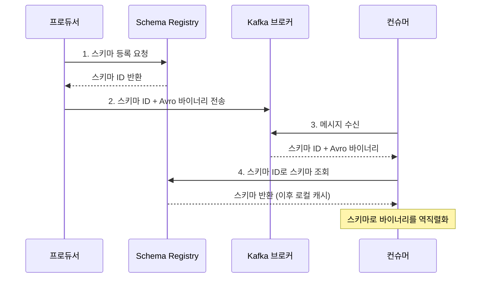
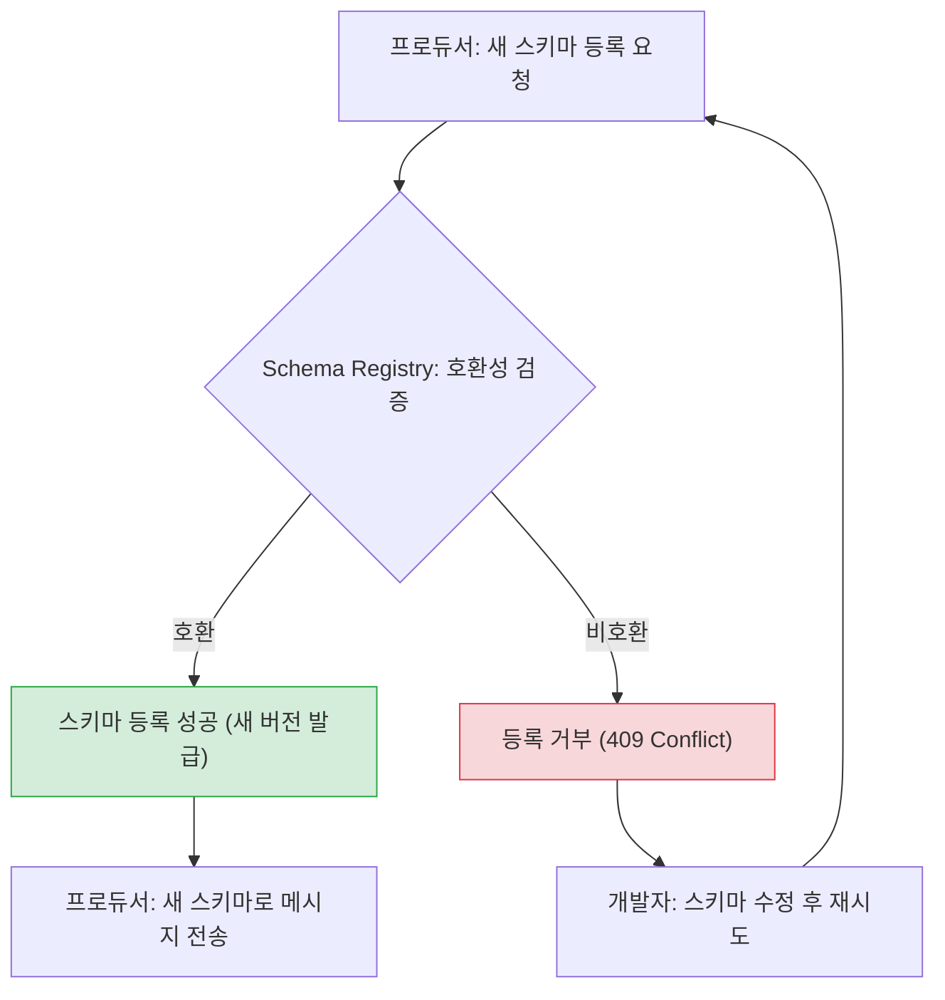

# Serialization and Schema Registry - Avro and Schema Evolution

## Learning Objectives
- Understand why message serialization matters and how schema-based formats like Avro outperform JSON
- Explain how Schema Registry centrally manages schemas and enforces compatibility rules
- Register an Avro schema, evolve it by adding a field, and verify compatibility behavior hands-on

## Content

### Kafka Only Speaks Bytes
In the beginner course, we configured `key.serializer` and `value.serializer`. The truth is that Kafka has **no idea** what your data means. To a broker, every message is just a **byte array**. The process of turning an object into bytes is called **serialization**; turning bytes back into an object is **deserialization**.

This creates a problem. Producers and consumers are **loosely coupled** through Kafka — they never talk directly to each other. For a consumer to correctly interpret the bytes it receives, it needs to know "what structure did the producer use?" But Kafka performs no data validation whatsoever. If a producer accidentally sends `age` as a string, Kafka happily stores it, and the consumer that tries to parse it as a number will crash. In other words, **the contract between the two applications is entirely implicit, with nothing to enforce it.**

### The Limits of JSON and the Advantages of Avro
The simplest serialization option is JSON. It is human-readable and universally supported, but its drawbacks are significant.

- **Field names are repeated in every message**, wasting network bandwidth and storage.
- **The schema is embedded nowhere explicit.** When the structure changes, there is no mechanism to detect it — consumers can break silently.

**Avro** (along with Protobuf and JSON Schema) is a **schema-based format**. You define the structure of your data (field names and types) in a separate schema, and data is serialized into a **compact binary** representation conforming to that schema.

- Field names are not repeated per message, so **payloads are small**.
- The **schema acts as an explicit contract**, catching malformed data at serialization time before it ever reaches the broker.
- Schemas can be versioned and **evolved safely** over time (more on this below).

An Avro schema is written as a simple `.avsc` JSON file.

```json
{
  "type": "record",
  "name": "User",
  "namespace": "com.example",
  "fields": [
    { "name": "id", "type": "int" },
    { "name": "name", "type": "string" }
  ]
}
```

### Schema Registry: A Central Hub for Schemas
Embedding the full schema in every message would add unacceptable overhead. That is why **Schema Registry** exists. Schema Registry is an independent server that runs alongside (but separately from) the Kafka brokers. It **stores and versions all schemas in one place** and exposes a REST API for registering and retrieving them. (Schemas themselves are stored in an internal Kafka topic.)

The sequence diagram below shows how Schema Registry is involved when a producer sends a message and a consumer reads it.



The key insight is that each message carries only a **small integer ID**, not the full schema. Once a consumer fetches the schema by that ID, it caches it locally, avoiding repeated REST round-trips.

### Compatibility Enforcement and Schema Evolution
The real value of Schema Registry is **compatibility validation**. As business requirements change, so do message structures — fields get added, renamed, or have their types changed. This is called **schema evolution**. The challenge is that producers and consumers **are not updated simultaneously**. At any given moment, some are writing with the new schema while others are still reading with the old one.

When you attempt to register a new schema, Schema Registry checks it against the compatibility rules configured for that topic's subject and **rejects the registration** if the rules are violated. This means breaking changes are caught **before deployment**. Read the modes carefully — the allowed changes are not symmetric between BACKWARD and FORWARD:

- **BACKWARD** (the most common default): **The new schema (i.e., the new consumer) must be able to read data written with the old schema.** This is a "consumers first" upgrade strategy. Two changes are safe: (1) **adding a field with a default value** — old data lacks that field, but the default fills it in, so deserialization succeeds; adding a field *without* a default is rejected because old data has no value to supply. (2) **deleting a field** — the new schema simply ignores that field when reading old data.
- **FORWARD**: **The old schema (i.e., the old consumer) must be able to read data written with the new schema.** This is a "producers first" upgrade strategy. The question is whether the old schema can cope with the changes. (1) **Adding a field is always allowed** — the old consumer simply ignores fields it doesn't recognize. (2) **Deleting a field is allowed only if that field had a default value in the old schema** — the new data omits that field, so the old consumer must be able to fall back to its default; if the field had no default, the old consumer cannot fill in the missing value and the registration is rejected.
- **FULL**: Both BACKWARD and FORWARD must be satisfied simultaneously. Because the rules intersect, only **adding or removing fields that carry a default value** is safely allowed under FULL.
- **NONE**: No validation (not recommended).

> One-line memory aid: **In BACKWARD mode, the risky operation is adding a field; in FORWARD mode, the risky operation is deleting a field.** The safest habit in any mode is: **always provide a default value when adding a field.**

The flowchart below illustrates how Schema Registry validates compatibility when a new schema is submitted and how the outcome branches.



### Hands-On: Registering a Schema and Evolving It
Assume Schema Registry is running at `http://localhost:8081` (e.g., in a local docker-compose environment).

First, set the compatibility mode for the topic's subject to BACKWARD via the REST API. The subject name conventionally follows the `<topic>-value` pattern.

```bash
curl -X PUT http://localhost:8081/config/users-value \
  -H "Content-Type: application/vnd.schemaregistry.v1+json" \
  -d '{"compatibility": "BACKWARD"}'
```

Register the v1 schema with two fields: `id` (int) and `name` (string). The Avro schema JSON must be escaped as a string inside the outer JSON body.

```bash
curl -X POST http://localhost:8081/subjects/users-value/versions \
  -H "Content-Type: application/vnd.schemaregistry.v1+json" \
  -d '{"schema": "{\"type\":\"record\",\"name\":\"User\",\"fields\":[{\"name\":\"id\",\"type\":\"int\"},{\"name\":\"name\",\"type\":\"string\"}]}"}'
```

Now **add the `email` field with a default value** to evolve the schema to v2. Because this satisfies BACKWARD compatibility (old data gets the default value for the missing field), the registration succeeds.

```bash
curl -X POST http://localhost:8081/subjects/users-value/versions \
  -H "Content-Type: application/vnd.schemaregistry.v1+json" \
  -d '{"schema": "{\"type\":\"record\",\"name\":\"User\",\"fields\":[{\"name\":\"id\",\"type\":\"int\"},{\"name\":\"name\",\"type\":\"string\"},{\"name\":\"email\",\"type\":\"string\",\"default\":\"\"}]}"}'
```

By contrast, **adding a required field without a default** violates BACKWARD compatibility and returns a `409 Conflict`. To check compatibility before actually registering — a dry run — POST the schema to `/compatibility/subjects/users-value/versions/latest` and inspect the `is_compatible` field in the response. This "catch breaking changes before deployment" capability is the core value proposition of Schema Registry.

## Key Takeaways
- Kafka deals only in bytes, so something must enforce the structural contract between producers and consumers. JSON is bulky and carries no explicit schema, while Avro provides compact binary encoding with a well-defined, separately managed schema.
- Schema Registry centrally versions all schemas and reduces message payload by embedding only a schema ID. Consumers fetch the schema by ID and cache it locally for deserialization.
- Compatibility rules are not symmetric: BACKWARD (new schema reads old data) allows adding fields with defaults and deleting fields; FORWARD (old schema reads new data) allows adding any field and deleting fields that had defaults. FULL requires both simultaneously. Breaking changes are caught at registration time, before any code is deployed.
- The safest rule of thumb: always provide a default value when adding a field. In BACKWARD mode, adding a field is the risky operation; in FORWARD mode, deleting a field is the risk. All compatibility settings and schema registrations can be managed through the Schema Registry REST API.
