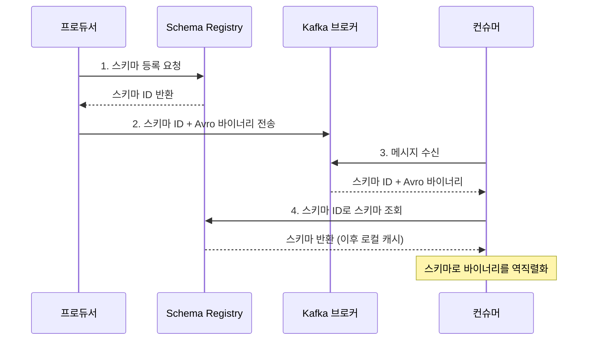
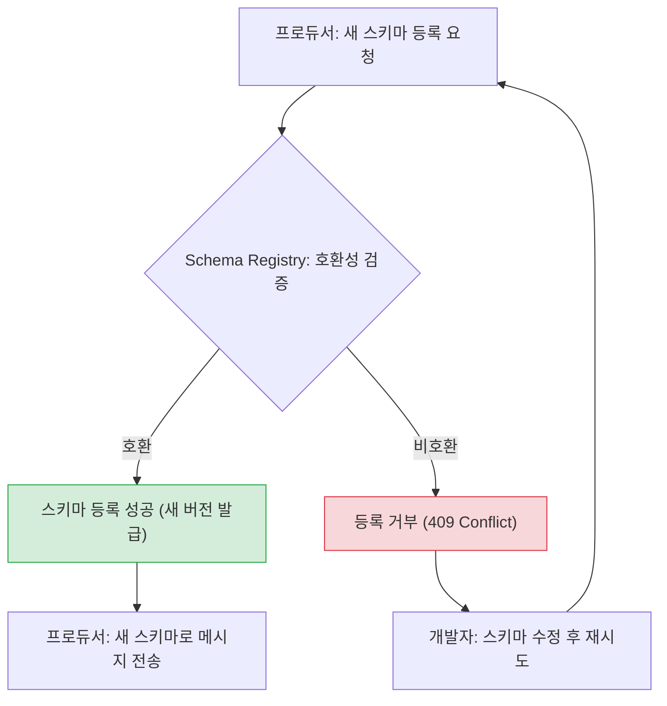

# 직렬화와 Schema Registry - Avro와 스키마 진화

## 학습 목표
- 메시지 직렬화의 필요성과 JSON 대비 Avro 같은 스키마 기반 포맷의 장점을 이해한다
- Schema Registry가 스키마를 중앙 관리하고 호환성(compatibility)을 검증하는 구조를 설명한다
- Avro 스키마를 등록하고 필드를 추가하는 스키마 진화(evolution)를 실습하며 호환성 규칙을 확인한다

## 본문

### Kafka는 바이트만 안다
초급에서 우리는 `key.serializer`, `value.serializer`를 설정했다. Kafka는 사실 데이터의 **의미를 전혀 모른다.** 브로커에게 메시지는 그냥 **바이트 배열**일 뿐이다. 프로듀서가 객체를 바이트로 바꾸는 것이 **직렬화(serialization)**, 컨슈머가 바이트를 다시 객체로 되돌리는 것이 **역직렬화(deserialization)** 다.

여기서 문제가 생긴다. 프로듀서와 컨슈머는 Kafka를 통해 **느슨하게 연결**되어 서로 직접 통신하지 않는다. 컨슈머가 바이트를 올바르게 해석하려면 "프로듀서가 어떤 구조로 보냈는지"를 알아야 한다. 그런데 Kafka는 데이터 검증을 전혀 하지 않으므로, 프로듀서가 `age`를 실수로 문자열로 보내도 그대로 저장되고, 컨슈머가 그걸 숫자로 처리하려다 터진다. 즉 **두 애플리케이션 사이에 암묵적 계약만 있고, 그것을 강제할 장치가 없다.**

### JSON의 한계와 Avro의 장점
가장 쉬운 직렬화는 JSON이다. 사람이 읽기 쉽고 어디서나 쓸 수 있다. 하지만 단점이 크다.

- **필드 이름이 모든 메시지에 반복**되어 용량이 크다(네트워크·디스크 낭비).
- **스키마가 데이터에 박혀 있지 않다.** 구조가 바뀌어도 알아챌 방법이 없어, 어느 순간 컨슈머가 조용히 깨진다.

**Avro**(및 Protobuf, JSON Schema)는 **스키마 기반 포맷**이다. 데이터의 구조(필드 이름·타입)를 별도 스키마로 정의하고, 데이터는 그 스키마에 맞춰 **압축된 바이너리**로 직렬화한다.

- 필드 이름이 매 메시지에 반복되지 않아 **payload가 작다**.
- **스키마가 명시적 계약**이 되어, 잘못된 구조의 데이터를 직렬화 단계에서 거를 수 있다.
- 스키마를 버전 관리하며 **안전하게 진화**시킬 수 있다(뒤에서 설명).

Avro 스키마는 `.avsc`라는 간단한 JSON 파일로 작성한다.

```json
{
  "type": "record",
  "name": "User",
  "namespace": "com.example",
  "fields": [
    { "name": "id", "type": "int" },
    { "name": "name", "type": "string" }
  ]
}
```

### Schema Registry: 스키마의 중앙 관리자
그런데 모든 메시지에 스키마 전체를 같이 보내면 또 무거워진다. 그래서 등장하는 것이 **Schema Registry(스키마 레지스트리)** 다. Schema Registry는 브로커와 별개로 도는 독립 서버로, 시스템에서 쓰이는 **모든 스키마를 중앙에서 저장·버전 관리**하고 REST API를 제공한다(스키마 자체는 내부 Kafka 토픽에 저장된다).

아래 시퀀스 다이어그램은 프로듀서가 메시지를 보내고 컨슈머가 읽을 때 Schema Registry가 어떻게 개입하는지를 보여준다.



핵심은 메시지 자체에 스키마 전체가 아닌 **작은 정수 ID만** 실린다는 점이다. 한 번 조회한 스키마는 로컬 캐시되므로 매번 REST 왕복이 발생하지 않는다.

### 호환성 검증과 스키마 진화
Schema Registry의 진짜 가치는 **호환성(compatibility) 검증**이다. 비즈니스가 바뀌면 메시지 구조도 바뀐다(필드 추가, 이름 변경, 타입 변경 등). 이것을 **스키마 진화(schema evolution)** 라 한다. 문제는 프로듀서와 컨슈머가 **동시에 업데이트되지 않는다**는 점이다. 누군가는 옛 스키마로 읽고, 누군가는 새 스키마로 쓴다.

Schema Registry는 새 스키마를 등록하려 할 때, 토픽에 설정된 호환성 규칙을 어기면 **등록을 거부**한다. 즉 "배포 전에" 깨지는 변경을 잡아낸다. 주요 호환성 모드는 다음과 같다. 두 모드의 허용 규칙이 정확히 대칭이 아니라는 점에 주의해서 읽자.

- **BACKWARD**(가장 흔한 기본값): **새 스키마(=새 컨슈머)로 옛 데이터를 읽을 수 있어야** 한다. 컨슈머를 먼저 업데이트하는 시나리오다. 이때 안전한 변경은 두 가지다. (1) **기본값(default)이 있는 필드 추가** — 옛 데이터엔 그 필드가 없지만 default로 채워 읽으므로 OK. default 없는 필드를 추가하면 옛 데이터를 읽을 때 채울 값이 없어 거부된다. (2) **필드 삭제** — 새 스키마는 그 필드를 더 이상 요구하지 않으므로, 옛 데이터에 그 필드가 있어도 그냥 무시하면 되어 OK.
- **FORWARD**: **옛 스키마(=옛 컨슈머)로 새 데이터를 읽을 수 있어야** 한다. 프로듀서를 먼저 업데이트하는 시나리오다. 핵심은 "변경 사항을 옛 스키마가 감당할 수 있는가"다. (1) **필드 추가는 언제나 허용** — 옛 컨슈머는 자신이 모르는 새 필드를 그냥 **무시**하면 되기 때문이다(default 유무와 무관). (2) **필드 삭제는 그 필드가 *옛 스키마에서* default 값을 갖고 있었을 때만 허용** — 새 데이터엔 그 필드가 빠져 있는데, 옛 스키마가 그것을 default로 채워 읽을 수 있어야 하기 때문이다. default가 없던 필드를 지우면 옛 컨슈머가 빈 자리를 채우지 못해 거부된다.
- **FULL**: BACKWARD와 FORWARD를 **모두** 만족해야 한다(양방향). 두 규칙의 교집합이라, 사실상 "default가 있는 필드의 추가/삭제"만 안전하게 허용된다.
- **NONE**: 검증하지 않음(권장하지 않음).

> 헷갈리는 핵심 한 줄: **BACKWARD에서 위험한 것은 '필드 추가', FORWARD에서 위험한 것은 '필드 삭제'다.** 그래서 어느 모드든 안전하게 가는 가장 무난한 습관은 "필드는 항상 default와 함께 추가한다"이다.

아래 흐름도는 새 스키마를 등록할 때 Schema Registry가 호환성을 검증하는 과정과, 결과에 따른 분기를 보여준다.



### 실습: 스키마 등록과 진화
Schema Registry가 `http://localhost:8081`에서 돈다고 가정한다(로컬 docker-compose 환경 등).

먼저 토픽의 호환성 모드를 BACKWARD로 설정(REST API). subject 이름은 보통 `<topic>-value` 형식이다.

```bash
curl -X PUT http://localhost:8081/config/users-value \
  -H "Content-Type: application/vnd.schemaregistry.v1+json" \
  -d '{"compatibility": "BACKWARD"}'
```

v1 스키마(id, name)를 등록한다. Avro 스키마 문자열은 JSON 안에 문자열로 escape해 넣는다.

```bash
curl -X POST http://localhost:8081/subjects/users-value/versions \
  -H "Content-Type: application/vnd.schemaregistry.v1+json" \
  -d '{"schema": "{\"type\":\"record\",\"name\":\"User\",\"fields\":[{\"name\":\"id\",\"type\":\"int\"},{\"name\":\"name\",\"type\":\"string\"}]}"}'
```

이제 **default가 있는 필드 `email`을 추가**해 v2로 진화시킨다. BACKWARD 호환을 만족하므로 등록에 성공한다.

```bash
curl -X POST http://localhost:8081/subjects/users-value/versions \
  -H "Content-Type: application/vnd.schemaregistry.v1+json" \
  -d '{"schema": "{\"type\":\"record\",\"name\":\"User\",\"fields\":[{\"name\":\"id\",\"type\":\"int\"},{\"name\":\"name\",\"type\":\"string\"},{\"name\":\"email\",\"type\":\"string\",\"default\":\"\"}]}"}'
```

반대로 **default 없이 필수 필드를 추가**하려 하면, BACKWARD 위반으로 `409 Conflict`와 함께 거부된다. 등록 전에 호환 여부만 미리 확인하려면 `/compatibility/subjects/users-value/versions/latest` 엔드포인트에 같은 스키마를 POST해 `is_compatible` 결과를 받아 볼 수 있다. 이것이 "배포 전에 깨지는 변경을 잡는다"는 Schema Registry의 핵심 가치다.

## 핵심 요약
- Kafka는 바이트만 다루므로 프로듀서·컨슈머 사이 데이터 구조 계약을 강제할 장치가 필요하다. JSON은 용량이 크고 스키마가 박혀 있지 않은 반면, Avro는 작은 바이너리 + 명시적 스키마를 제공한다.
- Schema Registry는 스키마를 중앙에서 버전 관리하고, 메시지엔 스키마 ID만 실어 payload를 줄인다. 컨슈머는 ID로 스키마를 조회·캐시해 역직렬화한다.
- 호환성 규칙은 대칭이 아니다. BACKWARD(새 스키마로 옛 데이터 읽기)는 'default 있는 필드 추가'와 '필드 삭제'를, FORWARD(옛 스키마로 새 데이터 읽기)는 '필드 추가(언제나)'와 'default 있던 필드의 삭제'를 허용한다. FULL은 양쪽 모두를 만족해야 한다.
- 위험 포인트를 외우자: BACKWARD는 필드 추가가, FORWARD는 필드 삭제가 위험하다. 그래서 '필드는 항상 default와 함께 추가'가 안전한 습관이다. REST API로 호환성 설정·스키마 등록·호환 검사를 직접 수행할 수 있다.
```