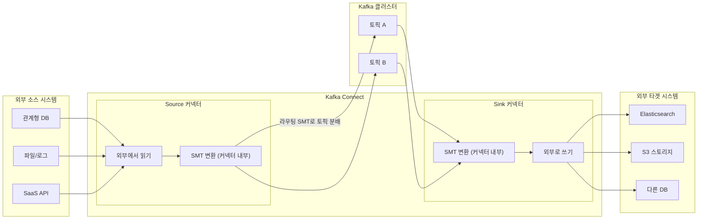
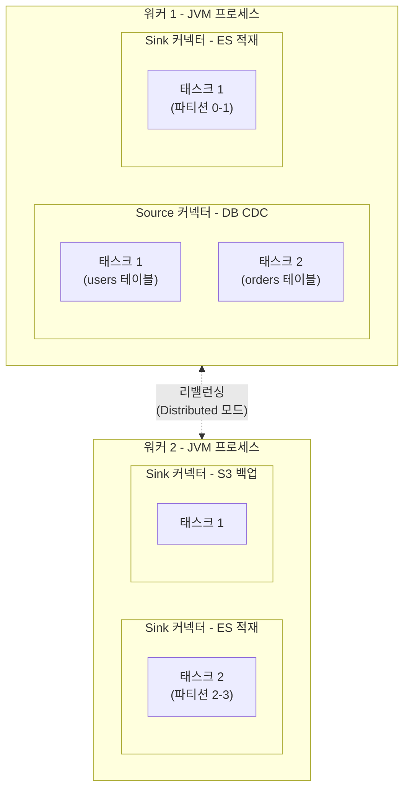

# Kafka Connect - Integrating External Systems Without Writing Code

## Learning Objectives
- Understand how Kafka Connect uses Source and Sink connectors to build data pipelines without custom code
- Explain the relationship between Standalone and Distributed modes, and between connectors, tasks, and workers
- Configure and register connectors via the REST API to establish data flows between Kafka and external systems

## Content

### The World Does Not Run on Kafka Alone
Real-world data lives across many systems that are not Kafka — relational databases, NoSQL stores, Elasticsearch, object storage like S3, SaaS APIs, and more. Data needs to flow from these systems into Kafka topics (ingestion) and from Kafka topics back out to other systems (egress).

You could certainly write a custom Producer or Consumer to do this. But doing it properly means implementing error handling, restart logic, logging, scale-out/in, multi-node distribution, serialization, and offset management — all from scratch. By the time you finish, **you have essentially reinvented Kafka Connect** — but without years of testing and community hardening. Integrating external systems is a solved problem.

**Kafka Connect** is Kafka's official integration subsystem. Its defining characteristic is that **you do not need to write code**. You declare what system to connect to, which topics to read or write, and other settings in a **JSON configuration** — that is it. Even non-developers can build data pipelines with it.

### Source Connectors and Sink Connectors
Connect connectors move data in one of two directions.

- **Source connector**: External system → Kafka topic. For example, it reads changes from a database and **produces** them to a topic. The classic use case is **CDC (Change Data Capture)**, which reads the database's transaction log and turns every insert, update, and delete into an event — capturing changes in near real time with minimal load on the source database.
- **Sink connector**: Kafka topic → External system. It **consumes** from a topic and writes the data to Elasticsearch, a database, S3, and so on.

The architecture diagram below shows the full data flow, with Source and Sink connectors connecting external systems through Kafka. The SMT transform boxes appear inside each connector's subgraph to show that they run as a stage within the connector's internal pipeline — not as a separate independent step.



The end-to-end flow is: External DB → (Source connector) → Kafka topic → (Sink connector) → Elasticsearch / another DB. Having Kafka in the middle brings **loose coupling** (source and target systems can be replaced independently), **buffering** (absorbs back-pressure), and **reusability** (data ingested once can be consumed by many downstream systems).

In-flight data can be lightly transformed using **SMT (Single Message Transform)** — adding or removing fields, renaming them, masking values, extracting a key from the value, and so on. One important point to understand clearly: **SMT is not a standalone step — it is declared as part of a connector's configuration and runs as a stage inside that connector's internal pipeline**. The "SMT transform" boxes in the diagram above are conceptually *inside* the Source or Sink connector. The Source connector flow is `external system → (SMT applied inside the connector) → topic`; the Sink connector flow is `topic → (SMT applied inside the connector) → external system`. Routing SMTs such as `RegexRouter` or `TimestampRouter` can even let **a single Source connector dynamically distribute records across multiple topics** based on record content.

However, SMT is limited to **stateless** transformations — it can only inspect and modify a single message at a time, not accumulate state across multiple messages. Anything that requires state — such as aggregations — must be handled by **Kafka Streams or Flink** instead.

Thousands of connectors already exist (browse them on Confluent Hub). For the most common integrations — databases, cloud storage, message queues — there is almost certainly a well-tested connector ready to use.

### Connectors, Tasks, and Workers
The Connect runtime has three layers.

- **Connector**: The **logical configuration** that says "read from this source" or "write to this target." This is the unit you register as a JSON document (SMT settings are also declared here).
- **Task**: The **execution thread** that does the connector's actual work. If the connector supports it, its work is split into multiple tasks for **parallelism** (for example, a Source connector might handle several database tables simultaneously, while a Sink connector processes multiple topic partitions concurrently).
- **Worker**: The **JVM process** that runs the tasks. When you ask "is Connect up?" or "where are the logs?", you are asking about the worker. A single worker can run multiple connectors and tasks at the same time.

The diagram below shows the hierarchical relationship: connectors (configuration) inside a worker are split into tasks (threads).



To summarize: **connectors (configuration) are split into tasks (threads) that execute inside workers (processes).**

### Standalone vs. Distributed Mode
Workers can run in one of two modes.

- **Standalone mode**: A single worker that stores connector configuration and state in **local files**. Connectors are created from local configuration files. There is no clustering, so it offers **no scalability or fault tolerance**. It is best suited for workloads that are inherently tied to a specific machine — for example, reading files on a particular server or collecting data arriving on a fixed port.
- **Distributed mode** (recommended): Multiple workers form a cluster. Configuration, state, and offsets are stored in **internal Kafka topics (compacted)**, and connectors are registered and managed via the **REST API**. Adding a worker automatically **rebalances** tasks to distribute load; if a worker dies, tasks are rebalanced to the surviving workers. At least two workers are recommended for fault tolerance.

> Even in development, you can run Distributed mode on a single worker and still get the convenience of the REST API plus the durability of Kafka-backed state storage. In practice, Distributed mode is the de facto standard.

### Hands-On: Registering Connectors via the REST API
Assume a Distributed mode worker is running at `http://localhost:8083`. The core skill is registering connectors through the REST API.

First, check the currently registered connectors and available connector plugins.

```bash
curl http://localhost:8083/connectors
curl http://localhost:8083/connector-plugins
```

Register a simple **Source connector** that reads a file line by line and produces each line to a topic. The `FileStreamSource` and `FileStreamSink` classes used here are bundled with Kafka **for learning and demo purposes only**. They operate on a single file, have no fault tolerance, and no scalability — **never use them in production**. In real workloads, replace them with production-grade connectors such as JDBC, Debezium, or the S3 connector.

```bash
curl -X POST http://localhost:8083/connectors \
  -H "Content-Type: application/json" \
  -d '{
    "name": "file-source",
    "config": {
      "connector.class": "FileStreamSource",
      "tasks.max": "1",
      "file": "/tmp/input.txt",
      "topic": "connect-file-topic"
    }
  }'
```

Register a **Sink connector** that reads from the topic and writes back to a file.

```bash
curl -X POST http://localhost:8083/connectors \
  -H "Content-Type: application/json" \
  -d '{
    "name": "file-sink",
    "config": {
      "connector.class": "FileStreamSink",
      "tasks.max": "1",
      "topics": "connect-file-topic",
      "file": "/tmp/output.txt"
    }
  }'
```

Append a line to `/tmp/input.txt` and the Source connector produces it to the topic; the Sink connector consumes it and writes it to `/tmp/output.txt` — a file → Kafka → file pipeline **with zero lines of application code**. To check connector status and delete a connector:

```bash
curl http://localhost:8083/connectors/file-source/status
curl -X DELETE http://localhost:8083/connectors/file-source
```

In production, simply change `connector.class` to JDBC, Debezium, Elasticsearch, or any other connector and fill in the connection details — the rest of the workflow is identical.

## Key Takeaways
- Kafka Connect is Kafka's built-in integration subsystem that connects external systems through configuration alone, with no custom code. Source connectors move data from external systems into Kafka; Sink connectors move data from Kafka to external systems.
- SMT (Single Message Transform) performs lightweight, stateless per-message transformations. It is not a standalone stage — it is declared inside a connector's configuration and runs within that connector's internal pipeline. For stateful processing such as aggregations, use Kafka Streams or Flink.
- The runtime is structured as connectors (logical configuration) split into tasks (execution threads) running inside workers (JVM processes).
- Standalone mode uses a single worker with file-based state and no scaling capability. Distributed mode uses multiple workers, stores state in internal Kafka topics, exposes a REST API, and automatically rebalances tasks — making it the production standard. Connectors are created, queried, and deleted via POST/GET/DELETE on the REST API; swap out `connector.class` to integrate a different system using the exact same workflow.
