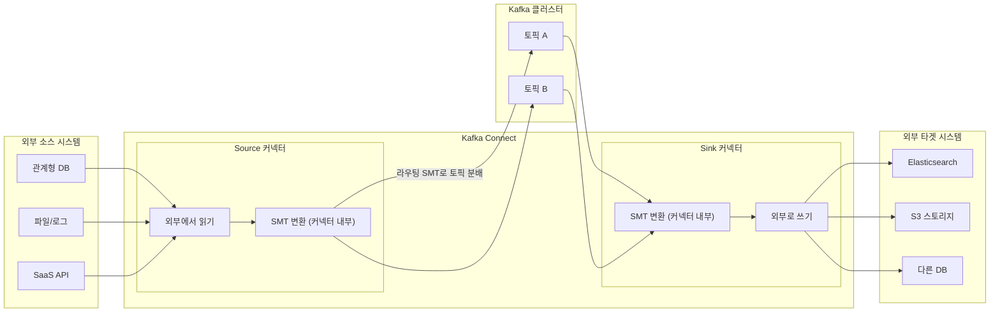
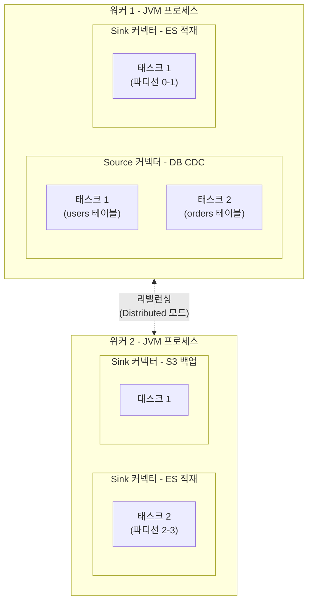

# Kafka Connect - 코드 없이 외부 시스템 연동

## 학습 목표
- Source·Sink 커넥터로 코드 없이 데이터 파이프라인을 구성하는 Kafka Connect의 역할을 이해한다
- Standalone과 Distributed 모드, 커넥터·태스크·워커의 관계를 설명한다
- 커넥터를 REST API로 등록·설정해 외부 시스템과 Kafka 간 데이터 흐름을 직접 구성한다

## 본문

### 세상은 Kafka로만 이루어져 있지 않다
현실의 데이터는 관계형 DB, NoSQL, Elasticsearch, S3 같은 오브젝트 스토리지, SaaS API 등 **Kafka가 아닌 시스템**에 흩어져 있다. 이런 시스템에서 데이터를 Kafka 토픽으로 들여오고(ingest), 또 토픽의 데이터를 다른 시스템으로 내보내야(egress) 한다.

물론 Producer/Consumer API로 직접 짤 수도 있다. 하지만 제대로 하려면 장애 처리, 재시작, 로깅, 스케일 아웃/인, 다중 노드 분산, 직렬화, 오프셋 관리까지 전부 직접 구현해야 한다. 그렇게 다 만들고 나면 결국 **Kafka Connect를 다시 발명한 셈**이 된다 — 단, 수년간의 테스트와 커뮤니티 검증 없이. 외부 시스템 연동은 이미 풀린 문제다.

**Kafka Connect**는 Kafka의 공식 통합 서브시스템이다. 가장 큰 특징은 **코드를 짤 필요가 없다는 것**이다. 어떤 시스템에 연결할지, 어떤 토픽을 읽고 쓸지 등을 **설정(JSON)** 으로 선언하면 끝이다. 개발자가 아닌 사람도 데이터 파이프라인을 구성할 수 있다.

### Source 커넥터와 Sink 커넥터
Connect의 커넥터는 두 방향이 있다.

- **Source 커넥터**: 외부 시스템 → Kafka 토픽. 예를 들어 DB의 변경분을 읽어 토픽에 **produce**한다. 대표적으로 DB 트랜잭션 로그를 읽어 모든 insert/update/delete를 이벤트로 만드는 **CDC(Change Data Capture)** 가 여기에 해당하며, 원본 DB에 거의 부하를 주지 않고 거의 실시간으로 변경을 잡아낸다.
- **Sink 커넥터**: Kafka 토픽 → 외부 시스템. 토픽에서 **consume**해 Elasticsearch, DB, S3 등에 적재한다.

아래 구성도는 Source와 Sink 커넥터가 Kafka를 중심으로 외부 시스템을 연결하는 전체 데이터 흐름을 보여준다. SMT 변환은 각 커넥터 박스 안에 그려져, 커넥터 내부 파이프라인의 한 단계로 실행됨을 나타낸다.



전체 흐름은 다음과 같다: 외부 DB → (Source 커넥터) Kafka 토픽 → (Sink 커넥터) Elasticsearch/다른 DB. Kafka가 가운데 끼면 **느슨한 결합**(source/target을 서로 영향 없이 교체 가능), **버퍼링**(백프레셔 흡수), **재사용**(한 번 들여온 데이터를 여러 다운스트림이 소비)이라는 이점이 따라온다.

데이터가 흐르는 중에 **SMT(Single Message Transform, 단일 메시지 변환)** 로 가벼운 가공을 할 수 있다 — 필드 추가/제거/이름 변경, 마스킹, 값에서 키 추출 등. 한 가지 분명히 짚을 점은, **SMT는 별도의 독립 단계가 아니라 커넥터 설정의 일부로 선언되어 커넥터 내부 파이프라인의 한 단계로 실행된다**는 것이다. 즉 위 구성도의 "SMT 변환" 박스는 개념상 Source/Sink 커넥터 *안*에 들어 있는 처리 단계로 이해해야 한다. Source 커넥터는 `외부 → (커넥터 안에서 SMT 적용) → 토픽`, Sink 커넥터는 `토픽 → (커넥터 안에서 SMT 적용) → 외부` 순으로 동작한다. 또한 `RegexRouter`·`TimestampRouter` 같은 라우팅용 SMT를 쓰면, **하나의 Source 커넥터가 레코드 내용에 따라 여러 토픽으로 동적으로 분배**할 수도 있다. 단 SMT는 **상태가 없는(stateless)** 변환만 가능하다 — 한 메시지를 보고 그 메시지만 바꿀 뿐, 여러 메시지를 모아 계산하지 못한다. 그래서 집계처럼 상태가 필요한 처리는 SMT가 아니라 **Kafka Streams나 Flink**로 넘겨야 한다.

수천 개의 커넥터가 이미 존재한다(Confluent Hub에서 탐색 가능). DB, 클라우드 스토리지, 메시지 큐 등 흔히 쓰는 연동은 잘 검증된 커넥터가 대부분 준비돼 있다.

### 커넥터 · 태스크 · 워커의 관계
Connect의 실행 구조는 세 층으로 이해한다.

- **커넥터(Connector)**: "어디서 무엇을 읽거나 쓸지"의 **논리적 설정**. 우리가 JSON으로 등록하는 단위(앞서 본 SMT 설정도 이 안에 포함된다).
- **태스크(Task)**: 커넥터의 일을 실제로 수행하는 **실행 스레드**. 커넥터가 지원하면 여러 태스크로 **병렬화**된다(예: Source는 여러 테이블을 동시에, Sink는 토픽의 여러 파티션을 동시에 처리).
- **워커(Worker)**: 태스크를 실제로 돌리는 **JVM 프로세스**. "Connect가 실행 중인가, 로그가 어디 있나"를 볼 때 보는 대상이 바로 워커다. 한 워커가 여러 커넥터/태스크를 실행할 수 있다.

아래 구조도는 워커 안에서 커넥터가 태스크로 분할되어 실행되는 계층 관계를 나타낸다.



요약하면 **워커(프로세스) 안에서 커넥터(설정)가 태스크(스레드)로 쪼개져 실행**된다.

### Standalone vs Distributed 모드
워커는 두 가지 모드로 띄울 수 있다.

- **Standalone 모드**: 단일 워커. 커넥터 설정과 상태를 **로컬 파일**에 저장하고, 커넥터를 로컬 설정 파일로 만든다. 클러스터링이 안 되므로 **확장성·내결함성이 없다.** 대신 특정 머신에 묶인 작업(예: 특정 서버의 파일 읽기, 고정 포트로 들어오는 데이터 수집)에 적합하다.
- **Distributed 모드**(권장): 여러 워커가 클러스터를 이룬다. 설정·상태·오프셋을 **Kafka 내부 토픽(compacted)** 에 저장하고, 커넥터를 **REST API**로 등록·관리한다. 워커를 추가하면 태스크가 자동 **리밸런싱**되어 부하가 분산되고, 워커가 죽으면 다시 리밸런싱해 태스크를 살린다. 내결함성을 위해 최소 워커 2대를 권장한다.

> 개발 환경에서도 단일 워커로 Distributed 모드를 쓸 수 있다. 그러면 REST API의 편리함과 Kafka 토픽 기반 상태 저장의 이점을 그대로 누리므로, 실무에서는 사실상 Distributed가 기본이다.

### 실습: REST API로 커넥터 등록하기
Distributed 모드 워커가 `http://localhost:8083`에서 돈다고 가정한다. REST API로 커넥터를 등록하는 것이 핵심이다.

먼저 현재 등록된 커넥터 목록과 사용 가능한 커넥터 플러그인을 확인한다.

```bash
curl http://localhost:8083/connectors
curl http://localhost:8083/connector-plugins
```

파일 한 줄씩 읽어 토픽에 넣는 간단한 **Source 커넥터**를 등록한다. 여기서 쓰는 `FileStreamSource`/`FileStreamSink`는 **개념 학습·데모 전용**으로 Kafka에 기본 포함된 커넥터다. 단일 파일에만 동작하고 내결함성·확장성이 없으므로 **운영 환경에서는 절대 쓰지 말고**, 실무에선 JDBC·Debezium·S3 같은 검증된 커넥터로 대체해야 한다.

```bash
curl -X POST http://localhost:8083/connectors \
  -H "Content-Type: application/json" \
  -d '{
    "name": "file-source",
    "config": {
      "connector.class": "FileStreamSource",
      "tasks.max": "1",
      "file": "/tmp/input.txt",
      "topic": "connect-file-topic"
    }
  }'
```

토픽의 내용을 다시 파일로 내보내는 **Sink 커넥터**를 등록한다.

```bash
curl -X POST http://localhost:8083/connectors \
  -H "Content-Type: application/json" \
  -d '{
    "name": "file-sink",
    "config": {
      "connector.class": "FileStreamSink",
      "tasks.max": "1",
      "topics": "connect-file-topic",
      "file": "/tmp/output.txt"
    }
  }'
```

`/tmp/input.txt`에 줄을 추가하면 Source가 토픽으로 보내고, Sink가 그 토픽을 읽어 `/tmp/output.txt`에 적는다 — **코드 한 줄 없이** 파일→Kafka→파일 파이프라인이 완성된다. 상태 확인과 삭제는 다음과 같다.

```bash
curl http://localhost:8083/connectors/file-source/status
curl -X DELETE http://localhost:8083/connectors/file-source
```

실무에서는 `connector.class`만 JDBC, Debezium, Elasticsearch 등으로 바꾸고 접속 정보를 채우면, 같은 방식으로 DB·검색엔진과 연동할 수 있다.

## 핵심 요약
- Kafka Connect는 코드 없이 설정만으로 외부 시스템과 Kafka를 잇는 통합 서브시스템이다. Source는 외부→Kafka, Sink는 Kafka→외부로 데이터를 흘린다.
- 데이터가 흐르는 중 SMT(단일 메시지 변환)로 가벼운 stateless 가공을 할 수 있다. SMT는 별도 단계가 아니라 커넥터 설정의 일부로 커넥터 내부에서 실행되며, 집계 같은 상태 있는 가공은 SMT가 아닌 Kafka Streams/Flink로 처리한다.
- 실행 구조는 워커(JVM 프로세스) 안에서 커넥터(논리 설정)가 태스크(실행 스레드)로 병렬 분할되는 형태다.
- Standalone은 단일 워커·파일 기반·확장 불가, Distributed는 다중 워커·Kafka 토픽에 상태 저장·REST API 관리·자동 리밸런싱으로 실무 표준이다. REST API로 커넥터를 POST/GET/DELETE해 등록·조회·삭제하며, `connector.class`만 바꾸면 다양한 시스템에 동일 방식으로 연동된다.
