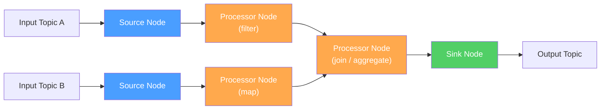
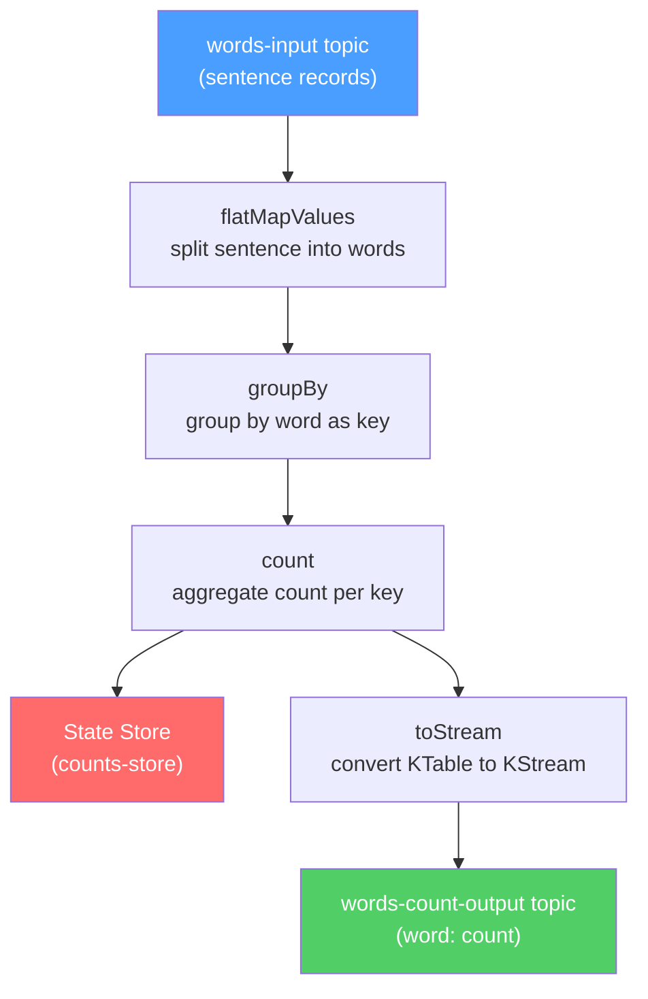

# Kafka Streams Basics - Stream Processing and Stateful Aggregation

## Learning Objectives
- Understand the stream processing model that Kafka Streams provides, compared to writing direct Consumer logic
- Distinguish between KStream and KTable, and between stream operations such as map, filter, groupBy, and count
- Write and run a simple Streams application that performs stateful aggregation

## Content

### The Limits of Rolling Your Own Consumer Logic
In the beginner course, we consumed messages by reading them directly through a Consumer. It is entirely possible to wire up a "read from topic A, transform the data, then write to topic B" pipeline using a Consumer and a Producer together. However, the moment you layer in **aggregations, transformations, and joins across multiple topics**, you end up having to handle offset management, state storage, failure recovery, and scaling entirely by hand.

**Kafka Streams** is a **library** designed exactly for this kind of stream processing — you add it as a dependency to your own application, no separate cluster required. Internally it uses Consumer and Producer clients, but it builds on top of them to provide transformations, aggregations, state storage, and fault tolerance. It lets you process an unbounded, continuously flowing stream of events in a declarative style.

Defining a Kafka Streams application means defining a **processor topology**. A topology is a directed acyclic graph (DAG) composed of **source nodes** (data enters from a topic) → **processor nodes** (your business logic) → **sink nodes** (results are written to a topic). The diagram below illustrates this basic topology structure.



### KStream vs KTable
At the heart of Kafka Streams are two complementary ways to view the same data.

- **KStream (event stream)**: Every record is an **independent fact (event)**. Records sharing the same key do not overwrite each other — each is treated as a distinct occurrence. For example, if key A arrives twice and key B arrives twice, you have **4 independent events**. This abstraction is ideal for representing **a log of things that happened** — payments processed, clicks recorded, and so on.
- **KTable (update stream)**: A new record for the same key **overwrites (updates)** the previous value. So even if key A and key B each arrive twice, you end up with only **the latest value for A and the latest value for B**. This abstraction suits **a current snapshot of state** — current balance, current inventory, latest profile, and so on.

Even with identical underlying data, viewing it as a KStream gives you "a history of changes," while viewing it as a KTable gives you "the current state" — this is known as the stream-table duality. Because a KTable must know the most recent value, it persists values to a disk-backed **state store**, and by default it does not emit every change immediately but rather flushes its cache at each commit interval.

### Stateless Operations: map and filter
The most fundamental operations are **stateless** ones. Each record is processed independently, with no need to remember previous values.

- **mapValues / map**: Transforms the value. `mapValues` changes only the value; `map` can change both key and value. **Prefer `mapValues`** whenever possible — changing the key with `map` triggers repartitioning, which carries an additional cost.
- **filter**: Retains only records for which the predicate returns true. For example: only allow events with a value greater than 1000.

An important principle: these operations do not **modify** the existing stream — they **create a new stream**.

```java
StreamsBuilder builder = new StreamsBuilder();
KStream<String, String> source = builder.stream("input-topic");
KStream<String, String> result = source
    .filter((key, value) -> value.length() > 5)      // keep only values longer than 5 characters
    .mapValues(value -> value.toUpperCase());         // convert to uppercase
result.to("output-topic");
```

### Stateful Operations: groupBy, count, reduce, aggregate
Sometimes you need processing that **requires memory of the past** — "how many times has this key appeared so far?" or "what is the running total?" These are **stateful** operations.

All stateful operations begin with **`groupByKey()` (or `groupBy`)**. Internally this triggers repartitioning to co-locate events with the same key on the same partition, but this is handled automatically in most cases — the only thing you need to remember is "group by key before aggregating." From there:

- **count**: Counts how many times a key has appeared.
- **reduce**: Combines values of the same type (e.g., a running sum). The input and output types must match.
- **aggregate**: An extension of reduce that allows aggregation **into a different type** (you provide an initial value and an aggregator function).

Because the aggregation result represents "the current value per key," it naturally becomes a **KTable** and is persisted in a state store. The diagram below shows how data is transformed through each operation stage in a WordCount example.



The classic word count example looks like this:

```java
StreamsBuilder builder = new StreamsBuilder();
KStream<String, String> textLines = builder.stream("words-input");

KTable<String, Long> wordCounts = textLines
    .flatMapValues(line -> Arrays.asList(line.toLowerCase().split("\\W+")))
    .groupBy((key, word) -> word)   // group by the word as the new key
    .count(Materialized.as("counts-store"));   // persist counts in the state store

wordCounts.toStream().to("words-count-output",
    Produced.with(Serdes.String(), Serdes.Long()));
```

> Note: stateful operations **do not emit results immediately.** Output is buffered and flushed based on an internal cache (default 10 MB) and a commit interval (default 30 seconds). During development and debugging, if you want every update to appear right away, set the cache size and commit interval both to 0.

### Lab: Running a Streams Application
To run the WordCount application above, configure the `application.id` (which also acts as the consumer group identifier) and the bootstrap server, then start `KafkaStreams`.

```java
Properties props = new Properties();
props.put(StreamsConfig.APPLICATION_ID_CONFIG, "wordcount-app");
props.put(StreamsConfig.BOOTSTRAP_SERVERS_CONFIG, "localhost:9092");
props.put(StreamsConfig.DEFAULT_KEY_SERDE_CLASS_CONFIG, Serdes.String().getClass());
props.put(StreamsConfig.DEFAULT_VALUE_SERDE_CLASS_CONFIG, Serdes.String().getClass());

KafkaStreams streams = new KafkaStreams(builder.build(), props);
streams.start();
Runtime.getRuntime().addShutdownHook(new Thread(streams::close));
```

Send sentences to the `words-input` topic with a console producer, then read from `words-count-output` with a console consumer (specify `LongDeserializer` because the value type is `Long`) — you will see the per-word count update in real time.

```bash
kafka-console-consumer.sh --topic words-count-output \
  --bootstrap-server localhost:9092 --from-beginning \
  --property print.key=true \
  --value-deserializer org.apache.kafka.common.serialization.LongDeserializer
```

Each time you send the same word again, the count increments by one. This is because the application **remembers the previous count in the state store** — that is the essence of stateful stream processing.

## Key Takeaways
- Kafka Streams is a stream processing library — embedded in your application, no separate cluster required — that layers transformations, aggregations, state storage, and fault tolerance on top of raw Consumer/Producer clients. You work by defining a processor topology (DAG).
- A KStream treats every record as an independent event (a history of changes); a KTable treats a new record for the same key as an update that overwrites the previous value (a snapshot of current state). They are two perspectives on the same data.
- Stateless operations (map / mapValues / filter) create a new stream without remembering past records. Prefer `mapValues` over `map` to avoid triggering repartitioning.
- Stateful operations (count / reduce / aggregate) follow `groupByKey` and persist results in a state store; the result is a KTable. Because of internal caching and the commit interval, results are buffered before being emitted rather than appearing immediately.
