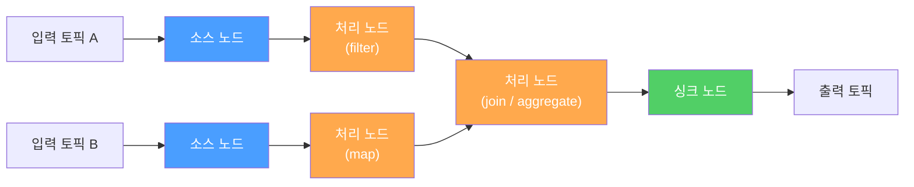
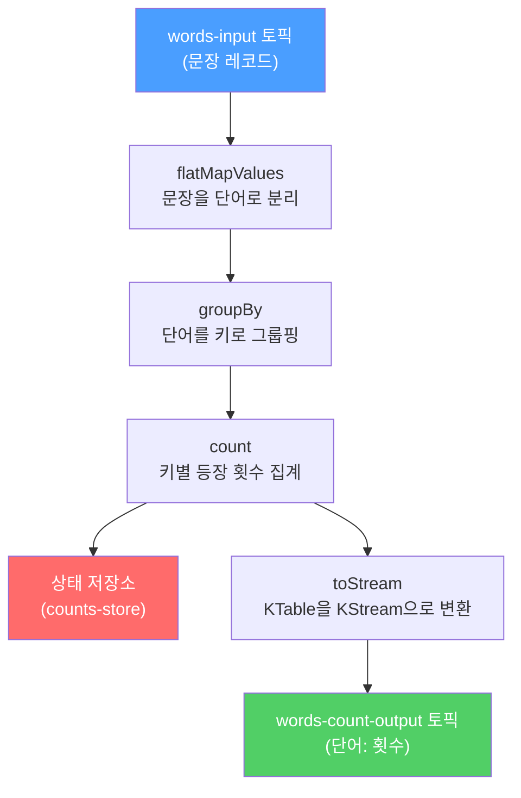

# Kafka Streams 기초 - 스트림 처리와 상태 저장

## 학습 목표
- Consumer 직접 처리와 비교해 Kafka Streams가 제공하는 스트림 처리 모델을 이해한다
- KStream·KTable의 차이와 map·filter·groupBy·count 같은 스트림 연산을 구분한다
- 상태 저장(stateful) 집계를 수행하는 간단한 Streams 애플리케이션을 작성하고 실행한다

## 본문

### Consumer로 직접 짜는 것의 한계
초급에서 우리는 Consumer로 메시지를 읽어 처리했다. "토픽 A를 읽어 가공한 뒤 토픽 B로 다시 보내는" 흐름을 Consumer+Producer로 직접 짤 수도 있다. 하지만 여기에 **집계·변환·여러 토픽 결합**이 더해지면, 오프셋 관리, 상태 저장, 장애 시 복구, 스케일링을 전부 손으로 다뤄야 한다.

**Kafka Streams**는 이런 스트림 처리를 위한 **라이브러리**다(별도 클러스터가 아니라 내 애플리케이션에 의존성으로 추가한다). 내부적으로는 Consumer/Producer를 쓰지만, 그 위에 변환·집계·상태 저장·내결함성을 얹어 준다. 끝없이 들어오는 이벤트(unbounded stream)를 선언적으로 처리하도록 도와준다.

Kafka Streams 애플리케이션을 정의한다는 것은 곧 **처리 토폴로지(processor topology)** 를 정의하는 것이다. 토폴로지는 방향성 비순환 그래프(DAG)로, **소스 노드**(토픽에서 데이터 유입) → **처리 노드**(사용자 로직) → **싱크 노드**(결과를 토픽으로 출력)로 이어진다. 아래 구성도는 이 토폴로지의 기본 구조를 보여 준다.



### KStream vs KTable
Kafka Streams의 핵심은 데이터를 보는 두 가지 관점이다.

- **KStream(이벤트 스트림)**: 각 레코드가 **독립된 사실(event)** 이다. 같은 키의 레코드끼리도 서로 덮어쓰지 않고 모두 별개의 사건으로 취급한다. 예를 들어 키 A로 두 번, 키 B로 두 번 들어오면 **총 4개의 이벤트**다. "결제가 일어났다", "클릭이 발생했다" 같은 **발생한 일의 흐름**에 적합하다.
- **KTable(업데이트 스트림)**: 같은 키의 새 레코드가 이전 값을 **덮어쓴다(update)**. 그래서 키 A·B로 두 번씩 들어와도 최종적으로 **A의 최신값, B의 최신값 2개**만 남는다. "현재 잔액", "현재 재고", "최신 프로필" 같은 **상태의 현재 스냅샷**에 적합하다.

같은 데이터라도 KStream으로 보면 "변화의 기록", KTable로 보면 "현재 상태"가 된다(이를 stream-table duality라 한다). KTable은 최신값을 알아야 하므로 디스크의 **상태 저장소(state store)** 에 값을 보관하며, 기본적으로 모든 변경을 즉시 내보내지 않고 커밋 간격마다 캐시를 flush해 내보낸다.

### Stateless 연산: map, filter
가장 기본적인 연산은 **상태가 필요 없는(stateless)** 것들이다. 각 레코드를 독립적으로 처리하므로 이전 값을 기억할 필요가 없다.

- **mapValues / map**: 값을 변환한다. `mapValues`는 값만, `map`은 키+값을 모두 바꿀 수 있다. 가능하면 **`mapValues`를 우선** 써야 한다 — `map`으로 키를 바꾸면 리파티셔닝(repartitioning)이 일어나 비용이 들기 때문이다.
- **filter**: 술어(predicate)가 true인 레코드만 남긴다. 예: 값이 1000 초과인 이벤트만 통과.

중요한 원칙: 이 연산들은 기존 스트림을 **수정**하는 게 아니라 **새 스트림을 만든다**고 생각해야 한다.

```java
StreamsBuilder builder = new StreamsBuilder();
KStream<String, String> source = builder.stream("input-topic");
KStream<String, String> result = source
    .filter((key, value) -> value.length() > 5)      // 길이 5 초과만
    .mapValues(value -> value.toUpperCase());         // 대문자로 변환
result.to("output-topic");
```

### Stateful 연산: groupBy, count, reduce, aggregate
때로는 "이 키가 지금까지 몇 번 나왔나", "합계가 얼마인가"처럼 **과거를 기억해야** 하는 처리가 필요하다. 이것이 **상태 저장(stateful)** 연산이다.

모든 stateful 연산은 먼저 **`groupByKey()`(또는 `groupBy`)** 로 시작한다. 내부적으로 같은 키의 이벤트를 같은 파티션에 모으는 리파티셔닝이 일어나지만, 대부분 자동으로 처리되므로 우리는 "집계 전에 키로 그룹핑한다"만 기억하면 된다. 그 위에:

- **count**: 키가 등장한 횟수를 센다.
- **reduce**: 같은 타입끼리 합친다(예: 값의 합계). 입력과 출력 타입이 같아야 한다.
- **aggregate**: reduce의 확장으로, **다른 타입으로** 집계할 수 있다(초기값 + 집계 함수를 직접 지정).

집계 결과는 "키별 현재값"이므로 자연스럽게 **KTable**이 되고, 상태 저장소(state store)에 보관된다. 아래 흐름도는 WordCount 예시에서 데이터가 각 연산 단계를 거치며 어떻게 변환되는지를 보여 준다.



단어별 등장 횟수를 세는 고전적 예시는 다음과 같다.

```java
StreamsBuilder builder = new StreamsBuilder();
KStream<String, String> textLines = builder.stream("words-input");

KTable<String, Long> wordCounts = textLines
    .flatMapValues(line -> Arrays.asList(line.toLowerCase().split("\\W+")))
    .groupBy((key, word) -> word)   // 단어를 키로 그룹핑
    .count(Materialized.as("counts-store"));   // 상태 저장소에 카운트 보관

wordCounts.toStream().to("words-count-output",
    Produced.with(Serdes.String(), Serdes.Long()));
```

> 주의: stateful 연산은 결과를 **즉시 내보내지 않는다.** 내부 캐시(기본 10MB)와 커밋 간격(기본 30초)에 따라 버퍼링 후 내보낸다. 개발·디버깅 중 모든 업데이트를 바로 보고 싶다면 캐시 크기와 커밋 간격을 0으로 낮춘다.

### 실습: Streams 애플리케이션 실행
위 WordCount 애플리케이션을 실행하려면 `application.id`(컨슈머 그룹 식별자 역할)와 부트스트랩 서버를 설정하고 `KafkaStreams`를 시작한다.

```java
Properties props = new Properties();
props.put(StreamsConfig.APPLICATION_ID_CONFIG, "wordcount-app");
props.put(StreamsConfig.BOOTSTRAP_SERVERS_CONFIG, "localhost:9092");
props.put(StreamsConfig.DEFAULT_KEY_SERDE_CLASS_CONFIG, Serdes.String().getClass());
props.put(StreamsConfig.DEFAULT_VALUE_SERDE_CLASS_CONFIG, Serdes.String().getClass());

KafkaStreams streams = new KafkaStreams(builder.build(), props);
streams.start();
Runtime.getRuntime().addShutdownHook(new Thread(streams::close));
```

콘솔 프로듀서로 `words-input` 토픽에 문장을 넣고, 콘솔 컨슈머로 `words-count-output`을 읽으면(값이 Long이므로 LongDeserializer 지정) 단어별 카운트가 갱신되는 것을 볼 수 있다.

```bash
kafka-console-consumer.sh --topic words-count-output \
  --bootstrap-server localhost:9092 --from-beginning \
  --property print.key=true \
  --value-deserializer org.apache.kafka.common.serialization.LongDeserializer
```

같은 단어를 다시 넣으면 카운트가 1씩 올라가는데, 이는 애플리케이션이 **상태 저장소에 이전 카운트를 기억**하고 있기 때문이다. 이것이 stateful 스트림 처리의 핵심이다.

## 핵심 요약
- Kafka Streams는 Consumer를 직접 짜는 대신, 변환·집계·상태 저장·내결함성을 얹어 주는 스트림 처리 라이브러리다(애플리케이션 내장, 별도 클러스터 불필요). 처리 토폴로지(DAG)를 정의한다.
- KStream은 각 레코드가 독립 이벤트(변화의 기록), KTable은 같은 키가 덮어써지는 최신 상태 스냅샷이다. 같은 데이터의 두 관점이다.
- stateless 연산(map/mapValues/filter)은 과거를 기억하지 않고 새 스트림을 만든다. 키를 바꾸지 않는 mapValues를 우선한다.
- stateful 연산(count/reduce/aggregate)은 groupByKey 후 상태 저장소에 값을 보관하며 결과는 KTable이 된다. 캐시·커밋 간격 때문에 결과는 즉시가 아니라 버퍼링 후 내보내진다.
