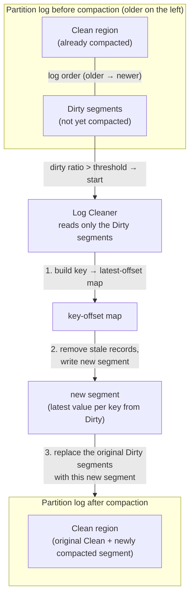
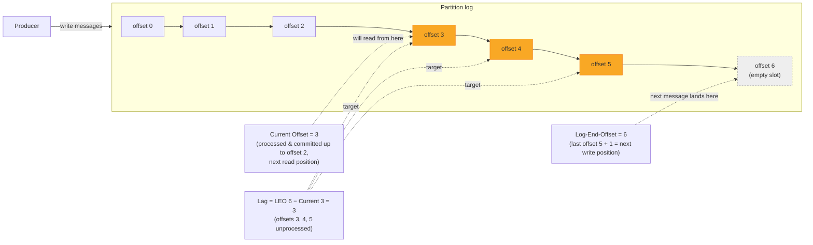

# Retention, Log Compaction, and Operations and Monitoring Fundamentals

## Learning Objectives
- Understand the difference and use cases of time/size-based retention versus log compaction, which keeps only the latest value per key
- Explain what key operational metrics such as Consumer Lag, throughput, and ISR changes mean in practice
- Apply retention and compaction policies to a topic and directly inspect key metrics and Consumer Lag

## Content

### Data Does Not Accumulate Forever
Kafka does not delete a message just because a consumer has read it. Other consumer groups may need to re-read the same data later, so messages remain on disk as a log. But if producers keep pushing data in and nothing is ever removed, the disk fills up and the broker crashes. To prevent this, Kafka provides a **cleanup policy** for retiring old data. There are two policies: **delete** and **compact**.

### Retention: Time- and Size-Based Deletion
`cleanup.policy=delete` (the default) **deletes old data wholesale**. There are two thresholds:

- **Time-based (`retention.ms`)**: Deletes messages older than a configured duration. The default is 7 days (168 hours).
- **Size-based (`retention.bytes`)**: Deletes the oldest records from a partition once it exceeds a configured size.

Kafka stores logs in file units called **segments**. Deletion happens at the segment level — once the oldest segment crosses the retention threshold, the entire segment file is removed. Retention is well-suited for data that **captures a flow of events over time** and loses value as it ages — application logs, clickstreams, sensor readings, and so on.

### Log Compaction: Retaining the Latest Value Per Key
`cleanup.policy=compact` works in a fundamentally different way. Rather than using time, it uses **keys** as the criterion for cleanup. The core behavior is: **keep only the most recent record for each key; remove all older records for that same key**.

Consider a topic mapping "employee ID (key) → salary (value)":

| offset | key (employee ID) | value (salary) |
|--------|-------------------|----------------|
| 0 | 1 | 100 |
| 1 | 2 | 200 |
| ... | ... | ... |
| 46 | 1 | 400 |

If employee 1's salary changed from 100 to 400, the old record at offset 0 (value 100) is no longer needed. Compaction removes that old record and **keeps only the latest value (400)**. The net effect is that disk usage becomes **proportional to the number of unique keys**, while the current value for every key is preserved.

> Compaction **does not reorder records.** It only removes stale records; the offsets of surviving records remain unchanged (gaps may appear in the offset sequence, but consumers skip over them automatically).

To permanently delete a specific key, send a message for that key with a **null value (a tombstone)**. The compactor interprets this as a "delete this key" signal. However, tombstones are not removed immediately — they are retained for a configurable period (`delete.retention.ms`) to ensure that any consumers that were offline during that window can still observe the deletion before the tombstone disappears.

Compaction is ideal for storing **mutable state** — customer profiles, product catalogs, CDC output from a database — any scenario where "you don't need the full history, just the latest value per key." An additional benefit is that a consumer reading from the beginning of a compacted topic can bootstrap the complete current state of all keys in a single pass. This is precisely why Kafka Streams' state store changelog topics and Kafka Connect's internal configuration topics use compaction.

The flowchart below shows how the Log Cleaner selects only the **Dirty segments** for processing. Compaction does not replace the entire Clean region — instead, it reads the Dirty segments, writes new compacted segments in their place, and those new segments are then incorporated into the Clean region.



### Key Operational Metrics
Once a Kafka cluster is in production, a handful of metrics tell you immediately whether it is healthy. Kafka exposes a large number of metrics via JMX; to start, focus on the following.

**Broker health metrics** (typically visualized with Prometheus + Grafana):

- **Active Controller count**: Must always be **exactly 1**. A value of 0 means the cluster has no active controller and is effectively stalled; a value of 2 or more indicates a serious bug.
- **Under-Replicated Partitions (URP)**: Must always be **0**. A non-zero value means some partition replicas have fallen behind the ISR — a signal of broker overload, network issues, or broker failure (directly related to replication and ISR covered in Lecture 1).
- **Offline Partitions**: Must always be **0**. A non-zero value means there are partitions with no active leader, making a portion of the topic unavailable.

**Throughput metrics**: Bytes in/out per second and messages per second. Knowing your normal baseline makes it possible to detect sudden spikes or drops.

**Consumer Lag**: The most important application-level metric. To define it precisely, we first need to be clear about **Log-End-Offset (LEO)**. LEO is commonly misunderstood as "the offset of the last message," but it is actually **the offset of the next message to be written** — that is, the last written offset plus 1. For example, if six messages have been written at offsets 0 through 5, the last message is at offset 5, but **LEO is 6** (the slot where the next message will land). Confusing this off-by-one will cause Consumer Lag calculations to be off by 1, so pay attention.

Lag is calculated as follows:

> **Consumer Lag = LEO (= last offset + 1) − Consumer Group's Current Offset**

Current Offset is where the consumer will read next — the position immediately after the last offset it has committed as processed. Lag therefore tells you exactly how many messages the consumer still has to catch up on. In the example above, if the consumer has processed up to offset 2 so that its Current Offset is 3, then Lag = 6 − 3 = 3 (offsets 3, 4, and 5 have not yet been processed). This is exactly the `LAG = LOG-END-OFFSET − CURRENT-OFFSET` figure shown by the `kafka-consumer-groups` tool.



A lag near zero means real-time processing; a lag that keeps growing means the consumer cannot keep up with the producer's write rate — a signal that you need to scale out consumers, optimize processing logic, or revisit the partition count.

> Operations rule of thumb: set up **alerts** on Active Controller=1, URP=0, and Offline=0. When something goes wrong, you want an immediate notification via email or Slack so you can respond quickly. Collect metrics generously — having more data makes tracing an outage much easier.

### Lab: Applying Policies and Checking Lag
**Creating a compacted topic.** For the lab environment, we set a very low dirty ratio so compaction kicks in quickly.

```bash
kafka-topics.sh --create --topic employee-salary \
  --bootstrap-server localhost:9092 \
  --partitions 1 --replication-factor 1 \
  --config cleanup.policy=compact \
  --config min.cleanable.dirty.ratio=0.001 \
  --config segment.ms=5000
# Note: min.cleanable.dirty.ratio=0.001 and segment.ms=5000 (5 seconds) are
#       used here solely to trigger compaction quickly in a lab setting.
#       In production, segments that close too frequently hurt performance;
#       segment.ms should typically be set to hours or a full day (the default is about 1 week).
```

Send the same key twice with the console producer (using `:` as the key separator).

```bash
kafka-console-producer.sh --topic employee-salary \
  --bootstrap-server localhost:9092 \
  --property parse.key=true --property key.separator=:
# Example input:
# 1:100
# 2:200
# 1:400
```

After a short wait, read the topic **from the beginning** again. You will find that the old value for key 1 (100) is gone, and only the latest value (400) remains.

```bash
kafka-console-consumer.sh --topic employee-salary \
  --bootstrap-server localhost:9092 --from-beginning \
  --property print.key=true --property key.separator=:
```

**Changing retention policy.** To reduce the retention period of an existing topic to 1 hour:

```bash
kafka-configs.sh --alter --topic my-topic \
  --bootstrap-server localhost:9092 \
  --add-config retention.ms=3600000
```

**Checking Consumer Lag.** The standard command for inspecting a consumer group's lag:

```bash
kafka-consumer-groups.sh --describe \
  --group my-consumer-group \
  --bootstrap-server localhost:9092
```

The output shows `CURRENT-OFFSET` (where the consumer will read next), `LOG-END-OFFSET` (the next write position = last offset + 1), and the difference — **`LAG`** — for each partition. Any consumer group whose LAG is steadily increasing is falling behind and should be the first priority for investigation.

## Key Takeaways
- There are two cleanup policies. `cleanup.policy=delete` removes entire segments that have aged past the `retention.ms` / `retention.bytes` threshold (suited for event streams). `compact` removes stale records and keeps only the latest value per key (suited for mutable state).
- Compaction does not reorder records. A null value (tombstone) signals key deletion. Reading a compacted topic from the beginning lets any consumer bootstrap the complete current state of all keys in a single pass.
- Essential operational metrics: Active Controller=1, Under-Replicated Partitions=0, Offline Partitions=0 (alerts are mandatory for all three), plus throughput and Consumer Lag.
- LEO (Log-End-Offset) is the last written offset + 1 (the position where the next message will be written). Consumer Lag = LEO − Current Offset, representing how many messages the consumer has yet to process. Use `kafka-consumer-groups --describe` and check the LAG column; a continuously growing lag signals a need to scale out consumers, optimize processing, or adjust configuration.
