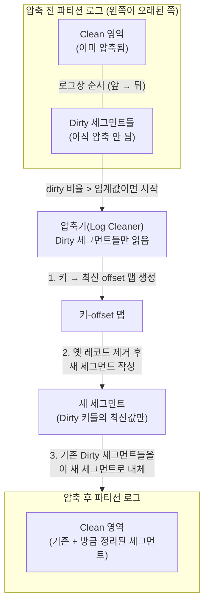
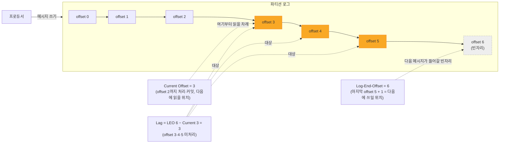

# 보존·로그 압축(Retention/Compaction)과 운영·모니터링 기초

## 학습 목표
- 시간·크기 기반 보존(retention)과 키별 최신값을 유지하는 로그 압축(compaction)의 차이와 용도를 이해한다
- Consumer Lag, 처리량, ISR 변화 등 핵심 운영 지표가 무엇을 의미하는지 설명한다
- 보존·압축 정책을 토픽에 적용하고 주요 메트릭과 Consumer Lag을 직접 확인한다

## 본문

### 데이터는 영원히 쌓이지 않는다
Kafka는 컨슈머가 메시지를 읽었다고 해서 그 메시지를 지우지 않는다. 같은 데이터를 다른 컨슈머 그룹이 다시 읽을 수 있어야 하기 때문이다. 그래서 메시지는 디스크에 로그로 남는다. 하지만 프로듀서가 계속 데이터를 밀어넣는데 아무것도 지우지 않으면 디스크가 가득 차 브로커가 죽는다. 그래서 Kafka는 오래된 데이터를 정리하는 **정리 정책(cleanup policy)** 을 둔다. 정책은 두 가지다: **삭제(delete)** 와 **압축(compact)**.

### 보존(Retention): 시간·크기 기반 삭제
`cleanup.policy=delete`(기본값)는 **오래된 데이터를 통째로 삭제**한다. 기준은 두 가지다.

- **시간 기반(`retention.ms`)**: 일정 시간이 지난 메시지를 지운다. 기본은 7일(168시간).
- **크기 기반(`retention.bytes`)**: 파티션이 일정 용량을 넘으면 오래된 것부터 지운다.

Kafka는 로그를 **세그먼트(segment)** 라는 파일 단위로 나눠 저장하는데, 삭제는 세그먼트 단위로 일어난다. 가장 오래된 세그먼트가 보존 기준을 넘기면 통째로 삭제된다. 보존은 **"발생한 일의 흐름"을 일정 기간 보관**하는 데 적합하다 — 로그, 클릭 스트림, 센서 데이터처럼 시간이 지나면 가치가 떨어지는 데이터.

### 로그 압축(Compaction): 키별 최신값 유지
`cleanup.policy=compact`는 전혀 다른 방식이다. **시간이 아니라 키(key)** 를 기준으로 정리한다. 핵심 동작은 **각 키의 최신 레코드만 남기고, 같은 키의 옛 레코드는 제거**하는 것이다.

예를 들어 "직원 ID(키) → 급여(값)" 토픽을 생각하자.

| offset | key(직원ID) | value(급여) |
|--------|-----------|-----------|
| 0 | 1 | 100 |
| 1 | 2 | 200 |
| ... | ... | ... |
| 46 | 1 | 400 |

직원 1의 급여가 100에서 400으로 바뀌었다면, offset 0의 옛 기록(100)은 더 이상 필요 없다. 압축은 이 옛 기록을 제거하고 **최신값(400)만** 남긴다. 결과적으로 디스크 사용량이 **키의 개수에 비례**하도록 묶이면서도, 모든 키의 현재값은 유지된다.

> 압축은 **순서를 바꾸지 않는다.** 옛 레코드를 제거할 뿐, 남은 레코드의 offset은 그대로다(중간에 구멍이 생길 수 있으나 컨슈머는 이를 건너뛴다).

특정 키를 아예 삭제하고 싶으면, 그 키에 **value가 null인 메시지(tombstone, 묘비)** 를 보낸다. 압축기는 이를 "이 키 삭제" 신호로 해석한다. 단, 묘비를 너무 빨리 지우면 그 사이 멈춰 있던 컨슈머가 삭제 사실을 영영 못 보므로, 일정 시간(`delete.retention.ms`) 동안 묘비를 남겨 둔 뒤 지운다.

압축은 **업데이트 가능한 상태**를 보관하는 데 적합하다 — 고객 프로필, 상품 카탈로그, DB의 CDC 결과처럼 "전체 이력은 필요 없고 키별 최신값만 알면 되는" 경우. 컨슈머가 토픽을 처음부터 읽으면 모든 키의 최신 상태를 한 번에 부트스트랩할 수 있다는 것도 큰 장점이다(이것이 Kafka Streams의 상태 저장소, Connect의 설정 저장 토픽이 compacted인 이유다).

아래 흐름도는 압축기(Log Cleaner)가 **Dirty 영역의 세그먼트들만** 골라 정리하는 단계를 보여준다. 압축은 Clean 영역 전체를 갈아치우는 것이 아니라, 처리 대상이던 **기존 Dirty 세그먼트들을 새 세그먼트로 대체**하고 그 결과가 Clean 영역으로 편입되는 과정이다.



### 핵심 운영 지표
운영 단계에서 "지금 클러스터가 건강한가"를 보는 핵심 지표가 있다. Kafka는 JMX로 수많은 메트릭을 노출하는데, 처음에는 다음에 집중한다.

**브로커 건강 지표** (보통 Prometheus + Grafana로 대시보드화):

- **Active Controller 수**: 항상 **정확히 1**이어야 한다. 0이면 클러스터가 컨트롤러 없이 마비된 것이고, 2 이상이면 심각한 버그다.
- **Under-Replicated Partitions(URP)**: 항상 **0**이어야 한다. 0이 아니면 일부 파티션의 복제본이 ISR에서 뒤처졌다는 뜻 — 브로커 과부하, 네트워크 문제, 또는 브로커 장애의 신호다(1강의 ISR과 직결된다).
- **Offline Partitions**: 항상 **0**이어야 한다. 0이 아니면 리더가 없는 파티션이 생겨 토픽의 일부가 다운된 것이다.

**처리량 지표**: 초당 들어오고 나가는 바이트(bytes in/out per second), 초당 메시지 수. 평소 추세를 알아야 이상 급증·급감을 감지한다.

**Consumer Lag(컨슈머 랙)**: 가장 중요한 애플리케이션 지표다. 정확히 정의하려면 먼저 **Log-End-Offset(LEO)** 을 짚어야 한다. LEO는 흔히 "마지막 메시지의 offset"으로 오해하지만, 실제로는 **다음에 기록될 메시지의 offset**, 즉 **(마지막으로 쓰인 메시지의 offset) + 1**이다. 예를 들어 메시지가 offset 0부터 5까지 6개 쌓여 있으면, 마지막 메시지는 offset 5이지만 **LEO는 6**이다(다음 메시지가 들어갈 빈자리 번호). 이 off-by-one을 헷갈리면 랙을 1만큼 잘못 계산하게 되니 주의하자.

랙은 다음과 같이 계산한다.

> **Consumer Lag = LEO(=마지막 offset + 1) − 컨슈머 그룹의 Current Offset**

여기서 Current Offset은 컨슈머가 다음에 읽을 위치(이미 처리해 커밋한 마지막 offset의 다음)다. 즉 랙은 "컨슈머가 아직 따라잡지 못한 메시지 수"를 정확히 나타낸다. 위 예에서 컨슈머가 offset 2까지 처리해 Current Offset이 3이라면, 랙 = 6 − 3 = 3(offset 3·4·5 세 개가 아직 처리 안 됨)이다. `kafka-consumer-groups` 도구가 보여 주는 `LAG = LOG-END-OFFSET − CURRENT-OFFSET`이 바로 이 값이다.



랙이 0에 가까우면 실시간 처리, 랙이 계속 커지면 컨슈머가 생산 속도를 못 따라가는 것이다 — 컨슈머 증설, 처리 로직 최적화, 파티션 수 점검이 필요하다는 신호다.

> 운영 원칙: Active Controller=1, URP=0, Offline=0 세 지표에는 **알림(alert)** 을 걸어 두라. 문제가 생기면 즉시 이메일/슬랙으로 받아 빠르게 대응할 수 있다. 메트릭은 적게보다 넉넉히 수집하는 편이 장애 추적에 유리하다.

### 실습: 정책 적용과 Lag 확인
**압축 토픽 생성.** 학습용으로 압축이 빨리 일어나도록 dirty ratio를 낮게 잡는다.

```bash
kafka-topics.sh --create --topic employee-salary \
  --bootstrap-server localhost:9092 \
  --partitions 1 --replication-factor 1 \
  --config cleanup.policy=compact \
  --config min.cleanable.dirty.ratio=0.001 \
  --config segment.ms=5000
# 주의: min.cleanable.dirty.ratio=0.001, segment.ms=5000(5초)은
#       오직 실습에서 압축을 빨리 보기 위한 값이다.
#       프로덕션에서는 세그먼트가 너무 자주 닫혀 성능을 해치므로
#       segment.ms는 보통 수 시간~하루(기본 약 1주) 단위로 크게 둔다.
```

콘솔 프로듀서로 같은 키를 두 번 보낸다(키 구분자 `:`).

```bash
kafka-console-producer.sh --topic employee-salary \
  --bootstrap-server localhost:9092 \
  --property parse.key=true --property key.separator=:
# 입력 예시:
# 1:100
# 2:200
# 1:400
```

잠시 뒤 컨슈머를 **처음부터** 다시 읽으면, 키 1의 옛 값(100)은 사라지고 최신값(400)만 남은 것을 확인할 수 있다.

```bash
kafka-console-consumer.sh --topic employee-salary \
  --bootstrap-server localhost:9092 --from-beginning \
  --property print.key=true --property key.separator=:
```

**보존 정책 변경.** 기존 토픽의 보존 기간을 1시간으로 줄이려면:

```bash
kafka-configs.sh --alter --topic my-topic \
  --bootstrap-server localhost:9092 \
  --add-config retention.ms=3600000
```

**Consumer Lag 확인.** 컨슈머 그룹의 랙을 보는 표준 명령이다.

```bash
kafka-consumer-groups.sh --describe \
  --group my-consumer-group \
  --bootstrap-server localhost:9092
```

출력에서 파티션별 `CURRENT-OFFSET`(컨슈머가 다음에 읽을 위치), `LOG-END-OFFSET`(다음에 쓰일 위치 = 마지막 offset + 1), 그리고 그 차이인 **`LAG`** 을 볼 수 있다. LAG이 점점 커지는 그룹이 있다면 그 컨슈머가 뒤처지고 있다는 뜻이므로 우선 조치 대상이다.

## 핵심 요약
- 정리 정책은 두 가지다. `cleanup.policy=delete`는 retention.ms/retention.bytes 기준으로 오래된 세그먼트를 통째로 삭제(이벤트 흐름용), `compact`는 키별 최신값만 남기고 옛 레코드를 제거(업데이트 상태용)한다.
- 압축은 순서를 바꾸지 않으며, value=null(tombstone)로 키 삭제를 표현한다. 처음부터 읽으면 모든 키의 최신 상태를 부트스트랩할 수 있다.
- 핵심 운영 지표: Active Controller=1, Under-Replicated Partitions=0, Offline Partitions=0(이 셋엔 알림 필수), 그리고 처리량과 Consumer Lag.
- LEO(Log-End-Offset)는 '마지막 offset + 1'(다음에 쓰일 위치)이며, Consumer Lag = LEO − Current Offset으로 컨슈머가 못 따라잡은 양이다. `kafka-consumer-groups --describe`의 LAG 열로 확인하며, 계속 커지면 컨슈머 증설·최적화 신호다.
