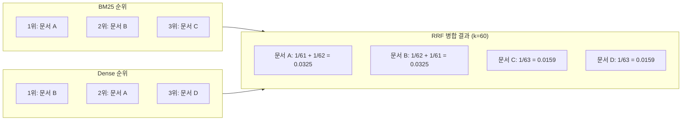

# 하이브리드 검색: Dense 임베딩과 Sparse BM25의 결합

## 학습 목표
- Dense(임베딩 기반) 검색과 Sparse(BM25/TF-IDF) 검색의 강·약점을 비교하고, 프로덕션 RAG에서 두 방식을 결합해야 하는 이유를 설명한다.
- LangChain `EnsembleRetriever`로 Dense + BM25 하이브리드 검색기를 구성하고, 코퍼스에 맞게 가중치를 조정한다.
- Reciprocal Rank Fusion(RRF)으로 이질적인 검색기의 순위 목록을 원점수 없이 병합하는 방법을 구현한다.

## 본문

### 단일 검색기만으로는 충분하지 않은 이유

기본 RAG 파이프라인은 단순하다. 사용자 질문을 임베딩하고, 벡터 인덱스에서 가장 가까운 청크를 찾아 LLM에 넘긴다. 깔끔한 데모에서는 잘 동작한다. 하지만 실제 코퍼스에서는 서로 반대 방향으로 실패하는 두 가지 문제가 생긴다.

- **Dense 검색은 정확한 단어를 놓친다.** 임베딩은 의미를 포착하는 데 특화되어 있어, "면역억제 환자의 COVID-19 치료 프로토콜" 쿼리가 "일반적인 면역저하 케어"로 흘러 COVID-19와 무관한 문서를 가져올 수 있다. 모델이 문장의 분위기는 포착했지만, 실제로 중요한 키워드는 놓친 것이다.
- **Sparse(키워드) 검색은 동의어를 놓친다.** 사용자가 "작은 집"을 검색했는데 관련 문서에는 "소형 주택"이라고 적혀 있다면, BM25는 토큰 겹침을 찾지 못해 정작 맞는 문서를 낮은 순위에 배치한다. "강아지"는 "강아지"와 일치시킬 수 있어도 "어린 개"와는 연결하지 못한다.

두 방식 모두 대부분의 경우에는 잘 동작하지만, 각자 반대 방향의 케이스에서 크게 실패한다. 해결책은 두 파이프라인을 병렬로 돌리고 결과를 합치는 것이다. 이것이 **하이브리드 검색**이며, 두 오류 유형이 거의 겹치지 않는다는 점 때문에 본격적인 RAG 배포의 기본값이 됐다. 한 검색기가 실패하는 지점에서 다른 검색기가 맞는 문서를 잡아내는 경향이 있기 때문이다.

> 경험 법칙: Dense 검색은 의미를, Sparse 검색은 드문 기술 용어와 식별자를 잡는다. 법률·의료·코드 위주 도메인에서는 이 차이가 커서, 순수 Dense 검색만 쓰면 정확도가 수십 퍼센트 떨어질 수 있다.

### BM25 한눈에 보기

BM25("Best Match 25")는 약 50년 된 키워드 스코어링 함수로, 지금도 Elasticsearch·Lucene·OpenSearch·하이브리드 검색을 지원하는 대부분의 벡터 데이터베이스에서 기본 Sparse 알고리즘으로 쓰인다. 원리는 간단하다. 다음 조건에서 문서 점수가 올라간다.

1. 쿼리 단어가 문서에 많이 등장할수록 유리하지만, 한계 효용은 체감한다. 열 번째 등장은 두 번째보다 훨씬 적은 점수를 받는다.
2. 쿼리 단어가 코퍼스 전체에서 **드물수록**(역문서빈도) 가치가 높다. 모든 문서에 등장하는 단어는 사실상 노이즈다.
3. 문서 길이를 정규화한다. 50페이지 브로슈어가 "최고"를 100번 언급했다고 해서, 핵심만 담은 2페이지 가이드를 자동으로 이기지 않는다.

BM25가 할 수 없는 것은 의미 추론이다. 철자 오류, 동의어, 바꿔 쓰기, 교차 언어 매칭은 모두 BM25를 뚫지 못한다. 그 지점이 정확히 Dense 임베딩이 빛나는 곳이므로, 두 방식의 결합이 효과적인 것이다.

### Dense 검색, 한 문단으로 정리

Dense 검색은 임베딩 모델(OpenAI `text-embedding-3-small/large`, BGE, E5, 다국어 SBERT 등)로 쿼리와 모든 청크를 고차원 벡터로 변환하고, 코사인 유사도로 순위를 매긴다. HNSW 같은 근사 최근접 이웃(ANN) 인덱스 덕분에 대규모에서도 빠르게 동작한다. 벡터는 토큰이 아닌 의미를 포착하므로 "어린 개"가 "강아지"를, "소형 주택"이 "작은 집"을 찾아낸다. 하지만 이미 봤듯이, 식별자·제품 코드·드문 전문 용어는 잘 놓친다.

### 하이브리드 레시피

하이브리드 검색기는 두 파이프라인을 모든 쿼리에 대해 동시에 실행하고 결과 목록을 합친다.

1. 쿼리를 임베딩하고 벡터 인덱스에서 상위 N개 청크를 가져온다.
2. 같은 쿼리를 BM25로 돌려 상위 N개 청크를 가져온다.
3. 두 순위 목록을 합산 점수 기준으로 단일 중복 제거 목록으로 병합한다.

병합 방법은 두 가지다. **가중 점수 퓨전**과 **Reciprocal Rank Fusion**이다. 둘은 서로 다른 구체적인 문제를 해결한다. BM25 점수와 코사인 유사도의 스케일은 비교할 수 없다. BM25 점수가 14.7이고 코사인 유사도가 0.83이라면, 그냥 평균을 내면 의미 없는 값이 나온다. 가중 퓨전은 점수를 *재조정*하는 방식으로, RRF는 점수를 *버리고* 순위만 쓰는 방식으로 이 문제를 해결한다.

### LangChain `EnsembleRetriever`로 하이브리드 검색기 만들기

LangChain의 `EnsembleRetriever`는 두 검색기를 연결하는 가장 쉬운 방법이다. 내부적으로 점수를 정규화하고 지정한 가중치를 적용한다.

```python
from langchain_community.retrievers import BM25Retriever
from langchain_community.vectorstores import Chroma
from langchain_openai import OpenAIEmbeddings
from langchain.retrievers import EnsembleRetriever

# 1. Dense 검색기 (벡터 검색)
embeddings = OpenAIEmbeddings(model="text-embedding-3-small")
vectorstore = Chroma.from_documents(docs, embedding=embeddings,
                                    persist_directory="./chroma_db")
dense_retriever = vectorstore.as_retriever(search_kwargs={"k": 10})

# 2. Sparse 검색기 (BM25, 인메모리)
bm25_retriever = BM25Retriever.from_documents(docs)
bm25_retriever.k = 10

# 3. 두 검색기를 가중치로 결합
hybrid = EnsembleRetriever(
    retrievers=[bm25_retriever, dense_retriever],
    weights=[0.3, 0.7],      # BM25 30%, Dense 70%
)

results = hybrid.invoke("COVID-19 treatment protocol for immunosuppressed patients")
for doc in results[:5]:
    print(doc.page_content[:120], "...")
```

실용적인 참고 사항 두 가지가 있다.

- `BM25Retriever.from_documents`는 인메모리 인덱스를 만든다. 청크가 수십만 개 정도까지는 괜찮다. 더 큰 코퍼스라면 Elasticsearch, OpenSearch, 또는 BM25를 내장 지원하는 벡터 DB(Weaviate, Milvus, Qdrant, pgvector + VectorChord-BM25)에 연결한다.
- 동일한 `docs` 목록이 두 검색기에 모두 들어가므로, 청크는 BM25로 토크나이징할 수 있으면서 동시에 임베딩도 가능해야 한다. 인덱싱 전에 노이즈성 보일러플레이트를 제거하면 두 방식 모두에게 도움이 된다.

### 가중치 조정

`weights=[0.3, 0.7]` 설정이 가장 중요한 조정 포인트다. BM25와 임베딩 중 어느 쪽을 얼마나 신뢰할지를 결정한다. 코퍼스에 따라 다르므로 보편적인 정답은 없다.

- **코드, 법률 조항, 제품 ID, 약품명, 오류 코드** → BM25 비중을 높인다. `[0.5, 0.5]` 또는 `[0.6, 0.4]`를 시도해본다. 정확한 토큰이 강한 신호를 가진다.
- **긴 자연어 문서, 고객 지원 티켓, FAQ** → Dense 비중을 높인다. `[0.2, 0.8]`을 시도해본다. 사용자는 질문을 다양하게 표현하므로 임베딩이 더 잘 처리한다.
- **혼합 코퍼스(실제 시스템 대부분)** → `[0.3, 0.7]`에서 시작한 뒤 평가한다.

어떻게 최적값을 찾을까? 평가 셋이 필요하다. 실제 쿼리 수십 개와 각 쿼리가 기대하는 문서를 모아두고, 가중치를 `0.1`에서 `0.9`까지 스윕하면서 상위 k개의 재현율을 계산해 플롯한다. 이 평가 루프는 4강에서 다룬다.

### Reciprocal Rank Fusion(RRF)

가중 퓨전은 여전히 점수 보정에 의존한다. Dense 점수가 `[0.4, 0.95]` 범위이고 BM25 점수가 `[2, 30]` 범위라면, 단순 가중치는 범위가 넓은 쪽을 과도하게 반영한다. **Reciprocal Rank Fusion**은 이 문제를 완전히 회피한다. 점수를 버리고 각 검색기가 문서에 부여한 *순위 위치*만 사용한다.

문서 `d`의 RRF 점수 계산식은 다음과 같다.

```
RRF(d) = sum over retrievers r of  1 / (k + rank_r(d))
```

`k`는 작은 상수(일반적으로 `60`, Cormack et al. 원 논문 값)로, 최상위 항목이 너무 지배적이 되지 않도록 곡선을 완만하게 한다. 두 검색기 모두에서 1위를 차지한 문서가 가장 높은 점수를 받고, Dense에서 1위지만 BM25에서 아예 검색되지 않은 문서도 여전히 높은 점수를 받는다.

구체적인 예시를 보면 동작 원리가 명확해진다. 두 검색기가 겹치지만 순서가 다른 목록을 반환하는 경우, RRF는 순위만 읽고 역수를 합산한다.



임의의 두 LangChain 검색기와 함께 동작하는 최소한의 RRF 구현이다.

```python
from collections import defaultdict

def reciprocal_rank_fusion(result_lists, k: int = 60):
    """result_lists: 문서의 순위 목록들. 병합된 목록을 반환한다."""
    scores = defaultdict(float)
    doc_lookup = {}
    for results in result_lists:
        for rank, doc in enumerate(results, start=1):
            key = doc.page_content        # 또는 메타데이터의 안정적인 doc_id
            scores[key] += 1.0 / (k + rank)
            doc_lookup[key] = doc
    fused = sorted(scores.items(), key=lambda x: x[1], reverse=True)
    return [doc_lookup[key] for key, _ in fused]

dense_hits = dense_retriever.invoke(query)
sparse_hits = bm25_retriever.invoke(query)
merged = reciprocal_rank_fusion([dense_hits, sparse_hits])[:5]
```

쿼리가 들어오면 동일한 쿼리가 두 검색기에 병렬로 전달되고, 각각 상위 N개 목록을 반환하면 퓨저가 최종 상위 K개로 병합한다.

```mermaid 하이브리드 검색 흐름: 쿼리가 BM25와 Dense 검색기에 병렬로 전달되고 RRF 또는 가중 퓨전으로 순위 목록이 병합된다
flowchart LR
    Q[사용자 쿼리]
    BM25[BM25 / Sparse 검색기]
    DENSE[Dense / 벡터 검색기]
    FUSE[퓨전: 가중 점수 또는 RRF]
    TOPK[상위 K개 병합 청크]
    Q --> BM25
    Q --> DENSE
    BM25 -- 순위 목록 --> FUSE
    DENSE -- 순위 목록 --> FUSE
    FUSE --> TOPK
```

**가중 퓨전 vs RRF, 어느 것을 써야 하나?**

- **가중 퓨전**(`EnsembleRetriever`)은 평가 셋 대비 가중치를 조정할 시간이 있고, Dense/Sparse 균형을 세밀하게 제어하고 싶을 때 쓴다.
- **RRF**는 세 개 이상의 검색기를 결합하거나, 점수 스케일 차이가 클 때, 또는 가중치 보정에 쓸 평가 데이터가 아직 없을 때 쓴다. 초기 단계 시스템에서 더 안전한 기본값이다.

대부분의 프로덕션 시스템은 결국 Dense, BM25, 때로는 멀티벡터 인덱스, 그래프나 메타데이터 필터 등 세 개에서 다섯 개의 검색기를 묶어 RRF를 돌린다.

### 흔한 실수들

- **메타데이터 필터를 먼저 적용하지 않는 것.** 하이브리드 검색은 권한 필터와 테넌트 스코프 *이후에* 실행해야 한다. 그 전에 돌리면 문서가 유출된다.
- **토크나이저 불일치.** BM25는 토크나이징에 민감하다. Dense 인덱스가 `"GPT-4o"`를 하나의 토큰으로 유지하는데 BM25가 `gpt`, `4o`로 분리하면, 모델명에 대한 Sparse 재현율이 무너진다. 하이픈, 식별자, 코드 기호를 올바르게 처리하는 토크나이저를 쓴다.
- **문서 단위와 청크 단위 인덱스를 혼용하는 것.** 두 검색기의 검색 단위가 일치해야 한다. BM25는 문서를, Dense는 청크를 반환한다면 퓨전 결과가 의미 없다.
- **리랭킹은 그 다음 단계다.** 하이브리드 검색은 강력한 상위 N개 후보 셋을 만들어준다. 최종 프롬프트에 들어갈 상위 3~5개를 고르는 건 여전히 리랭커의 역할이다. 이는 2강에서 다룬다.

## 핵심 정리
- Dense 검색은 의미를 잡지만 드문 토큰을 놓치고, BM25는 드문 토큰을 잡지만 의미를 놓친다. 두 실패 유형이 거의 겹치지 않기 때문에 하이브리드 검색이 어느 방식보다 일관되게 우수하다.
- LangChain의 `EnsembleRetriever`를 쓰면 Dense + BM25 하이브리드 검색을 한 줄로 설정할 수 있다. `weights` 파라미터가 핵심 조정 포인트다. 전문 용어가 많은 코퍼스에는 BM25를, 자연어 문서에는 Dense를 높인다.
- BM25 원점수와 코사인 유사도는 직접 비교할 수 없다. 점수를 재조정(가중 퓨전)하거나 버리고 순위를 쓰는(Reciprocal Rank Fusion) 방법 중 하나를 택한다.
- `k=60`의 RRF는 두 개 이상의 검색기를 병합할 때 점수 없이도 강력하게 동작하는 기본값으로, 평가 셋이 아직 없을 때 더 안전한 선택이다.
- 하이브리드 검색은 재현율(recall)을 높이는 메커니즘이지, 정밀도(precision)를 높이는 것이 아니다. LLM에 실제로 전달할 최종 상위 K개 청크를 고르려면 여전히 리랭커(2강)가 필요하다.
