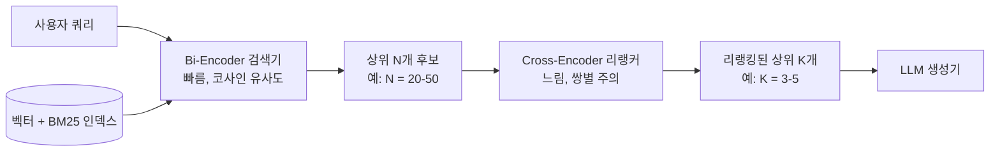
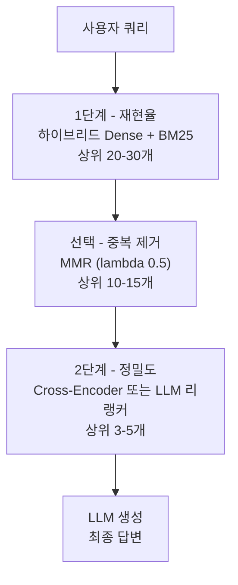

# 리랭킹과 컨텍스트 필터링: 상위 K개의 정밀도 높이기

## 학습 목표
- 2단계 검색 패턴을 설명한다. 빠른 Bi-Encoder로 재현율을 확보하고, 느리지만 정밀한 Cross-Encoder로 정밀도를 높이는 구조다.
- `ContextualCompressionRetriever`를 사용해 Cohere Rerank, BGE Reranker, 로컬 Cross-Encoder 등 리랭킹 모델을 LangChain RAG 파이프라인에 연결한다.
- Maximal Marginal Relevance(MMR)로 중복 청크를 줄이고 최종 컨텍스트의 다양성과 관련성을 함께 높인다.

## 본문

### 검색기 하나로는 끝이 아닌 이유

하이브리드 검색(1강)으로 훌륭한 상위 20개 목록을 만들었더라도, 이 자체를 그대로 LLM에 전달하기에는 너무 많고 노이즈도 많다. 세 가지 이유가 있다.

- **비용과 지연.** 프롬프트에 들어가는 모든 청크는 비용이 들고, 프롬프트가 길수록 생성이 느려진다.
- **주의력 희석.** 청크를 많이 넣을수록 모델의 주의가 분산된다. 19개의 평범한 청크 아래 묻힌 핵심 문장 하나는 무시될 수 있다.
- **중복에 가까운 청크.** 실제 코퍼스는 내용이 반복된다. 같은 단락을 살짝 다르게 표현한 청크 다섯 개가 컨텍스트 윈도우의 80%를 차지하면서 새로운 정보를 전혀 추가하지 않는 상황이 생긴다.

해결책은 **두 번째 단계**를 추가하는 것이다. 빠른 검색기에서 상위 20~50개 후보를 가져온 뒤, 각 `(쿼리, 청크)` 쌍을 개별적으로 보는 더 느리고 정확한 모델로 다시 점수를 매기고, 최상위 3~5개만 남긴다. 이 2단계 패턴은 지금 고품질 RAG의 기본 아키텍처가 됐다.

### Bi-Encoder vs Cross-Encoder

두 번째 단계가 왜 도움이 되는지 이해하려면 두 인코더 계열이 어떻게 동작하는지 비교해야 한다.

**Bi-Encoder**(벡터 데이터베이스가 사용하는 방식)는 쿼리와 모든 청크를 각각 독립적으로 하나의 벡터로 임베딩하고, 코사인 유사도로 순위를 매긴다. 청크는 인덱싱 시점에 이미 임베딩되어 있으므로, 쿼리 측에서는 새 임베딩 하나만 만들어 수백만 건의 문서를 검색할 수 있다. 벡터 검색이 빠른 이유가 바로 이것이다. 하지만 그 대가로 쿼리와 청크는 서로를 실제로 "보지" 못한다. 사전 계산된 두 벡터가 공간에서 얼마나 가까운지로만 관련성을 판단한다.

**Cross-Encoder**는 반대로 동작한다. `(쿼리, 청크)` 쌍을 구분자 토큰과 함께 이어 붙인 뒤 전체를 트랜스포머(주로 BERT 계열)에 통째로 넣는다. 모델 내부에서 쿼리의 모든 토큰이 청크의 모든 토큰에 주의를 기울일 수 있고, 그 반대도 마찬가지다. 이 *늦은 상호작용(late interaction)* 덕분에 관련성 판단이 훨씬 정확하다. 하지만 이는 쿼리 시점에 후보마다 모델을 *한 번씩* 실행해야 한다는 의미다. 사전 계산이 불가능하다. 따라서 Cross-Encoder는 수백만 문서를 순위 매기기에는 너무 느리지만, 수십 밀리초 안에 상위 20개를 재점수 매기기에는 완벽하다.

2단계 검색 아키텍처는 각 모델의 약점이 상대의 강점이 되는 구조다. Bi-Encoder가 수백만 청크를 빠르게 수십 개로 좁히고, Cross-Encoder가 그 수십 개를 높은 정밀도로 재점수 매긴다.



### LangChain에 리랭커 연결하기

LangChain은 `ContextualCompressionRetriever` 안에 리랭킹을 감싼다. 베이스 검색기(1강의 하이브리드 검색기)와 베이스 검색기가 반환한 문서를 필터링하거나 재정렬하는 "compressor"를 전달하면 된다. 주목할 compressor는 두 가지다. `CohereRerank`(호스팅 서비스)와 `CrossEncoderReranker`(로컬).

**옵션 A - Cohere Rerank (관리형, 가장 빠르게 설정):**

```python
import os
from langchain_cohere import CohereRerank
from langchain.retrievers import ContextualCompressionRetriever

os.environ["COHERE_API_KEY"] = "..."

compressor = CohereRerank(model="rerank-multilingual-v3.0", top_n=3)
reranked_retriever = ContextualCompressionRetriever(
    base_compressor=compressor,
    base_retriever=hybrid,           # 1강의 하이브리드 검색기
)

docs = reranked_retriever.invoke("How do I configure SSO with our payroll vendor?")
```

`base_retriever`가 약 20개 후보를 반환하고, `CohereRerank`가 재점수를 매겨 상위 3개만 유지한다. Cohere는 검색당 요금을 부과한다(작성 시점 기준 1,000 리랭크당 약 $1). RAG 기준으로 저렴하며 매우 빠르다.

**옵션 B - 로컬 Cross-Encoder (API 호출 없음, 무료, 약간 느림):**

```python
from langchain.retrievers.document_compressors import CrossEncoderReranker
from langchain_community.cross_encoders import HuggingFaceCrossEncoder

model = HuggingFaceCrossEncoder(model_name="BAAI/bge-reranker-base")
compressor = CrossEncoderReranker(model=model, top_n=3)

reranked_retriever = ContextualCompressionRetriever(
    base_compressor=compressor,
    base_retriever=hybrid,
)
```

`BAAI/bge-reranker-base`는 성능이 뛰어나고 무료인 다국어 Cross-Encoder다. 한국어/영어 혼합 코퍼스에는 `BAAI/bge-reranker-v2-m3`이 자주 쓰인다. CPU 단일 코어에서 후보 20개에 대해 50~200ms가 추가되고, 소형 GPU에서는 노이즈 수준에 묻힌다.

> 항상 LLM에 보낼 청크 수보다 *더 많이* 검색한다. 프롬프트에 3개를 넣고 싶다면 베이스 검색기에 최소 20개를 요청한다. 리랭커는 1단계가 준 결과만 재정렬할 수 있다. 올바른 청크가 상위 20개에 없다면 어떤 리랭커도 구해줄 수 없다.

### Cross-Encoder로 부족할 때: LLM-as-reranker

Cross-Encoder에는 근본적인 한계가 하나 있다. 정확히 `(쿼리, 청크)` 쌍만 입력으로 받는다. *"삼성전자 관련 문서를 우선시하고, 정치적으로 민감한 내용은 제외하고, 거의 동일한 청크는 하나로 줄여라"* 같은 추가 지시를 넣을 방법이 없다. 모델은 쌍을 점수 매길 뿐이고, 그 점수 기준은 훈련 데이터가 정의한 것으로 대체로 일반적이고 영어 중심적이다.

도메인 특화 사용 사례에서는 이 한계가 문제가 된다. 다음을 처리할 수 있는 리랭커가 필요할 수 있다.

- 도메인 이해(회사 제품, 지역 맥락, 내부 용어).
- 후보끼리 비교해 중복 제거(개별 점수 매기기가 아닌).
- 정책 준수("기밀로 태그된 항목 제외", "최신 버전 문서 우선").

실용적인 대안은 **LLM-as-reranker**다. 후보 20개를 단일 프롬프트에 모두 넣고 모델에게 최상위 3개의 인덱스를 이유와 함께 순서대로 반환하게 한다. 요즘 LLM은 128K 토큰 컨텍스트 윈도우가 있어 후보 20개가 충분히 들어가고, Cross-Encoder 20번 실행 대신 단 1번의 호출로 처리할 수 있다.

```python
from langchain_openai import ChatOpenAI
from langchain_core.prompts import ChatPromptTemplate
from langchain_core.output_parsers import JsonOutputParser

rerank_prompt = ChatPromptTemplate.from_template("""
You are reranking RAG search results. Given the user query and a list
of candidate documents, return the indices of the top 3 most relevant,
in descending order of relevance.

Rules:
- Prioritize documents that directly answer the query intent.
- If two documents say almost the same thing, keep only the better one.
- Exclude any document tagged "confidential" in its metadata.

Query: {query}

Candidates:
{candidates}

Return JSON: {{"top_indices": [int, int, int], "reasoning": "..."}}
""")

llm = ChatOpenAI(model="gpt-4o-mini", temperature=0)
chain = rerank_prompt | llm | JsonOutputParser()

# ... 포맷된 후보 목록과 함께 chain 호출 ...
```

소형 오픈소스 모델(Gemma 3, 확장 컨텍스트를 지원하는 Qwen 등)로 비용이 중요하다면 로컬에서 실행할 수 있다. LLM 리랭커는 지저분한 엔터프라이즈 데이터에서 Cross-Encoder보다 성능이 좋은 경향이 있지만, 호출당 지연이 더 높다.

### Maximal Marginal Relevance(MMR)

관련성만으로 리랭킹하면 미묘한 문제가 생긴다. 상위 K개가 모두 서로 중복에 가까울 수 있다. 가장 관련성 높은 청크가 *"주문 #1234는 2024-03-12에 배송됨"*이고 2~5위 청크도 같은 사실의 살짝 다른 표현이라면, 네 개 슬롯을 낭비한 것이다.

**Maximal Marginal Relevance(MMR)**는 쿼리와의 관련성과 이미 선택된 결과와의 비유사성을 함께 최적화해 이 문제를 해결한다. 각 단계에서 다음 점수가 가장 높은 청크를 선택한다.

```
MMR(d) = lambda * sim(q, d)  -  (1 - lambda) * max_{d' in selected} sim(d, d')
```

- `lambda = 1.0` → 순수 관련성(베이스 검색기와 동일).
- `lambda = 0.0` → 순수 다양성(단독으로는 대체로 쓸모없음).
- `lambda = 0.5` → 균형; 좋은 출발점.

LangChain은 대부분의 벡터 스토어에서 MMR을 직접 노출한다.

```python
mmr_retriever = vectorstore.as_retriever(
    search_type="mmr",
    search_kwargs={
        "k": 5,           # 최종 반환 수
        "fetch_k": 20,    # 고려할 후보 수
        "lambda_mult": 0.5,
    },
)
```

`fetch_k`는 후보 풀 크기, `k`는 최종 출력 수다. MMR은 일반적으로 하이브리드 검색 *이후에*, 코퍼스에서 중복이 얼마나 심한지에 따라 Cross-Encoder *대신에* 또는 *앞에* 쓴다.

### 레이어를 합쳐보면

견고한 2단계 파이프라인은 다음과 같다.

1. **1단계 - 재현율.** 하이브리드 검색기(Dense + BM25)가 20~30개 후보를 반환한다.
2. **선택 - 중복 제거.** MMR이 중복에 가까운 것들을 걸러내 10~15개로 좁힌다.
3. **2단계 - 정밀도.** Cross-Encoder 또는 LLM 리랭커가 점수를 매겨 상위 3~5개만 남긴다.
4. **LLM 생성.** 최종 3~5개 청크가 프롬프트에 들어간다.

레이어가 쌓인 파이프라인은 큰 후보 풀을 LLM을 위한 촘촘하고 중복 없는 고정밀 컨텍스트로 좁혀나간다.



순서가 중요하다. 중복 제거 전에 리랭킹하면 Cross-Encoder 호출을 중복에 낭비한다. 충분한 후보를 가져오기 전에 중복 제거하면 중요한 신호를 버린다. 최적 지점은 넉넉하게 검색하고, 가볍게 중복 제거하고, 공격적으로 리랭킹하는 것이다.

### 흔한 실수들

- **후보가 너무 적은 리랭킹.** 후보 5개만 리랭커에 보내는데 실제 답이 15위에 있다면 리랭커도 도움이 안 된다. 리랭킹 전에 20개 이상을 검색한다.
- **메타데이터를 잊는 것.** Cross-Encoder는 텍스트만 본다. 권한, 최신성, 출처 신뢰도를 강제해야 한다면, 리랭킹 *전에* 별도의 메타데이터 필터로 처리한다. 리랭커 안에서가 아니다.
- **모델을 너무 많이 쌓는 것.** Bi-Encoder + Cross-Encoder + LLM 리랭커를 모두 쌓으면 지연이 2초 이상으로 늘어날 수 있다. 각 단계가 추가하는 지연 대비 재현율/정밀도 향상을 측정하고, 충분한 효과를 내지 못하는 단계는 제거한다.
- **다국어 불일치를 무시하는 것.** 영어로 훈련된 리랭커는 한국어 청크가 맞는 답변임에도 낮은 점수를 준다. 한국어 외 언어가 포함된 코퍼스에는 다국어 리랭커(`rerank-multilingual-v3.0`, `bge-reranker-v2-m3`)를 써야 한다.

## 핵심 정리
- 고품질 RAG 검색은 **2단계 파이프라인**이다. 빠른 Bi-Encoder(또는 하이브리드 검색기)가 많은 후보를 가져오고, 느리지만 정밀한 Cross-Encoder가 프롬프트에 들어갈 소수로 리랭킹한다.
- LangChain의 `ContextualCompressionRetriever`가 어떤 리랭커든 감쌀 수 있다. `CohereRerank`는 가장 빠르게 설정되고, `bge-reranker-base/v2-m3`는 성능 좋은 무료 로컬 옵션이다.
- Cross-Encoder는 정확하지만 지시를 따르지 못한다. 도메인 규칙, 후보 간 중복 제거, 정책 강제가 필요하다면 **LLM-as-reranker**(후보 20개를 한 번에 처리하는 단일 호출)가 더 나은 선택인 경우가 많다.
- **MMR**은 최종 상위 K개에서 관련성과 다양성을 균형 있게 맞춘다. 코퍼스에 중복이 많을 때 필수적이며, `lambda_mult = 0.5`가 균형 잡힌 기본값이다.
- LLM에 보낼 것보다 *더 많이* 검색하고, 권한/최신성 필터는 리랭커 *전에* 적용한다.
