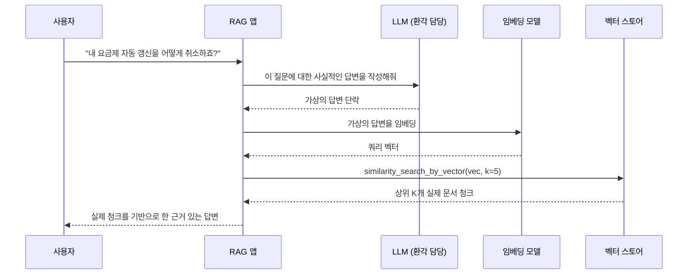
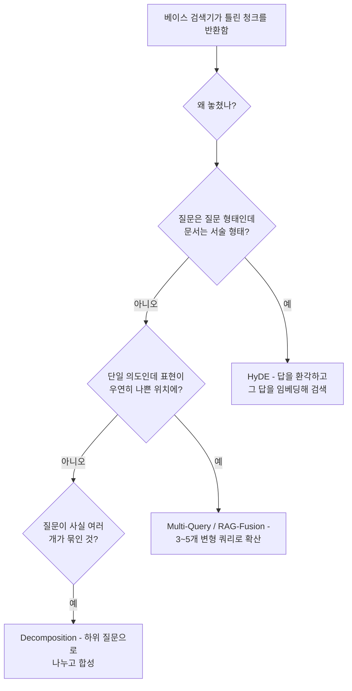

# 쿼리 변환: HyDE, Multi-Query, Decomposition

## 학습 목표
- 사용자의 원본 질문이 시맨틱 검색기에 왜 좋지 않은 입력이 되는지 설명하고, 쿼리를 변환해 재현율이 어떻게 높아지는지 이해한다.
- HyDE(Hypothetical Document Embeddings)로 질문 형태의 쿼리와 답변 형태의 문서 사이의 간극을 좁히는 원리를 구현한다.
- LangChain `MultiQueryRetriever`로 단일 질문에서 여러 변형 쿼리를 생성하고 결과를 합친다.
- 복합 질문을 하위 질문으로 분해하고, 각각 독립적으로 답을 구한 뒤 최종 답변으로 합성한다.

## 본문

### 문제: 사용자 질문과 문서는 다른 언어를 쓴다

사용자가 입력한다. *"내 요금제 자동 갱신을 어떻게 취소하죠?"* 관련 문서에는 *"자동 청구를 중단하려면 계정 > 구독으로 이동해 갱신을 토글 off하세요."*라고 적혀 있다. 토큰이 겹치지 않는다. 두 표현은 임베딩 공간에서 서로 다른 위치에 있다. Dense 검색기는 올바른 문서보다 관련 없는 청구 FAQ 다섯 개를 먼저 반환할 수 있다.

이것이 **쿼리-문서 비대칭 문제**다. 어디서나 나타나는 문제다.

- 사용자는 *질문*을 쓰고, 문서는 *서술문*과 *지시문*으로 작성된다.
- 사용자는 일상적인 어휘를 쓰고("자동 갱신 취소"), 문서는 공식적인 용어를 쓴다("정기 결제 중단").
- 사용자는 큰 것 하나를 묻고("v1과 v2 스펙을 비교하고 보안에서 바뀐 게 뭔지 알려줘"), 문서는 작은 것 하나씩 답한다.

해결책은 임베딩 모델을 재학습하는 것이 아니다. 검색 전에 **쿼리를 변환**해서 찾으려는 문서와 더 비슷하게 만드는 것이다. 이 강의에서는 세 가지 핵심 기법을 다룬다. HyDE, Multi-Query, Decomposition이다.

### 기법 1 - HyDE: 답을 환각하고, 그 답으로 검색한다

HyDE(Hypothetical Document Embeddings)는 세 기법 중 가장 단순하면서도 종종 가장 효과적이다. 아이디어가 역발상적이다. LLM에게 사용자 질문에 대한 답을 *만들어내도록* 요청하고, 그 환각된 답을 임베딩해 쿼리로 사용한다.

왜 이게 동작할까? 환각된 답은 질문이 아닌 문서의 형태를 띠기 때문이다. 사실이 틀리더라도 그 *어휘*, *표현 방식*, *구조*는 실제 답변을 담은 문서와 임베딩 공간에서 훨씬 가깝게 위치한다.

호출 순서가 짧지만 순서대로 보는 게 중요하다. 벡터 스토어에 도달하는 임베딩 벡터가 사용자의 원본 질문이 아닌 *가상의 답변*임을 확인해야 한다.



```python
from langchain_openai import ChatOpenAI, OpenAIEmbeddings
from langchain_community.vectorstores import Chroma
from langchain_core.prompts import ChatPromptTemplate
from langchain_core.output_parsers import StrOutputParser

llm = ChatOpenAI(model="gpt-4o-mini", temperature=0)

hyde_prompt = ChatPromptTemplate.from_template(
    "이 질문에 직접 답하는 짧고 사실적인 단락을 작성해줘. "
    "'모른다'고 하지 말고 최선을 다해 추측해줘. 질문: {question}"
)
hyde_chain = hyde_prompt | llm | StrOutputParser()

question = "내 요금제 자동 갱신을 어떻게 취소하죠?"
hypothetical = hyde_chain.invoke({"question": question})
# hypothetical ~ "자동 갱신을 취소하려면 계정에 로그인하고 구독 페이지로
#                 이동한 뒤 자동 갱신을 off로 전환하세요..."

# 질문이 아닌 가상의 답변을 임베딩해 검색:
embeddings = OpenAIEmbeddings(model="text-embedding-3-small")
hypo_vec = embeddings.embed_query(hypothetical)
docs = vectorstore.similarity_search_by_vector(hypo_vec, k=5)
```

실제로 많은 팀에서 원본 질문과 HyDE 답변 **모두로** 검색한 뒤 RRF(1강)로 결과를 합친다.

> HyDE는 사용자 표현이 문서 스타일과 다른 짧고 모호한 질문에서 빛난다. 질문이 이미 상세하고 기술적이라면, 질문 자체가 이미 문서처럼 생겼으므로 HyDE의 효과가 크지 않다.

주의사항: HyDE는 쿼리당 LLM 호출을 하나 추가한다. 지연 예산이 빠듯하다면 베이스 검색기가 낮은 점수를 반환할 때만 HyDE를 실행하거나, 환각 단계에 작고 빠른 모델을 사용한다.

### 기법 2 - Multi-Query: 같은 것을 여러 방식으로 묻는다

Multi-Query는 다른 문제를 해결한다. 하나의 표현이 임베딩 공간에서 우연히 좋지 않은 위치에 있어 맞는 문서를 약간의 차이로 놓칠 수 있다. 같은 질문의 서로 다른 각도를 담은 3~5개의 대안 표현을 생성하면 검색이 산탄총처럼 동작한다. 더 많은 쿼리를 병렬로 발사하면서 올바른 청크를 맞출 확률이 높아진다.

LangChain은 바로 이 목적으로 `MultiQueryRetriever`를 제공한다.

```python
from langchain.retrievers.multi_query import MultiQueryRetriever

multi_query = MultiQueryRetriever.from_llm(
    retriever=vectorstore.as_retriever(search_kwargs={"k": 5}),
    llm=ChatOpenAI(model="gpt-4o-mini", temperature=0),
)

docs = multi_query.invoke("내 요금제 자동 갱신을 어떻게 취소하죠?")
# 내부 동작:
#   1. LLM이 약 3개의 변형 쿼리 생성:
#      - "구독 자동 갱신을 어떻게 비활성화하나요?"
#      - "계정에서 정기 결제를 중단하는 방법"
#      - "자동 갱신 설정을 어디서 끌 수 있나요?"
#   2. 각 변형 쿼리로 검색기 실행 (각 k=5).
#   3. 반환된 문서의 중복을 제거한 합집합 반환.
```

실용적인 팁 두 가지가 있다.

- **합집합 크기를 확인한다.** 변형 쿼리 3개에 `k=5`면 청크 15개가 나올 수 있다. LLM에 직접 보내려면 다운스트림에 리랭커(2강)가 필요하다.
- **영어 외 쿼리에 변형 프롬프트를 커스터마이징한다.** 기본 영어 전용 생성기가 다른 언어 쿼리에 대해 좋지 않은 변형을 만들 수 있다. 다국어 템플릿과 함께 `prompt=` 파라미터를 사용한다.

가까운 사촌으로 **RAG-Fusion**이 있다. Multi-Query 이후 결과 목록 간에 Reciprocal Rank Fusion을 적용하는 방식으로, 같은 아이디어에 병합을 좀 더 엄밀하게 한다.

### 기법 3 - Query Decomposition: 큰 질문을 작게 나눈다

어떤 질문은 검색 문제가 아니라 *여러 개의* 검색 문제를 하나로 엮은 것이다. 예를 들면 이런 것들이다.

- *"2023년과 2024년 사고 포스트모템 트렌드를 비교하고 어떤 근본 원인이 악화됐는지 알려줘."*
- *"v1 스펙에는 있지만 v2 릴리스 노트에는 없는 보안 요건이 뭐야?"*
- *"세 번의 분기별 이사회 업데이트에서 채용에 대해 각각 뭐라고 했어?"*

청크 다섯 개를 검색해 LLM이 알아서 이어주길 기대하는 방식으로는 답할 수 없다. 검색기는 두 개의 서로 다른 문서(2023 vs 2024, v1 vs v2, Q1/Q2/Q3 업데이트)에서 균등하게 청크를 가져와야 한다는 것을 알 방법이 없다. Multi-Query가 약간 도움이 되지만, 여전히 전체를 하나의 검색으로 처리한다.

**Decomposition**은 질문을 원자적 하위 질문들로 분해하고, 각각을 독립적으로 검색·답변한 뒤 최종 답변을 합성한다.

```python
from langchain_core.prompts import ChatPromptTemplate
from langchain_core.output_parsers import StrOutputParser, JsonOutputParser

# 1. 분해
decompose_prompt = ChatPromptTemplate.from_template("""
다음 복잡한 질문을 각각 문서에서 독립적으로 답할 수 있는
2~5개의 단순한 하위 질문으로 나눠줘.
JSON 형식으로 반환: {{"sub_questions": [string, ...]}}

질문: {question}
""")
decompose = decompose_prompt | llm | JsonOutputParser()

# 2. 각 하위 질문에 대해 검색 후 답변
answer_prompt = ChatPromptTemplate.from_template(
    "컨텍스트만 사용해서 질문에 답해줘. 모르면 모른다고 해줘.\n"
    "컨텍스트: {context}\n질문: {question}\n답변:"
)
answer_chain = answer_prompt | llm | StrOutputParser()

# 3. 합성
synth_prompt = ChatPromptTemplate.from_template("""
하위 질문들의 답변을 원래 질문에 대한 하나의 일관된 답변으로 합쳐줘.
인용 출처는 보존해줘.

원래 질문: {question}
하위 질문 답변:
{partial_answers}
""")
synthesize = synth_prompt | llm | StrOutputParser()

def decomposed_rag(question, retriever):
    plan = decompose.invoke({"question": question})
    partials = []
    for sub in plan["sub_questions"]:
        ctx = "\n\n".join(d.page_content for d in retriever.invoke(sub))
        ans = answer_chain.invoke({"context": ctx, "question": sub})
        partials.append(f"Q: {sub}\nA: {ans}")
    return synthesize.invoke({
        "question": question,
        "partial_answers": "\n\n".join(partials),
    })
```

Decomposition은 비용이 더 많이 든다(분해 1회 + N회 검색 + N회 답변 + 합성 1회). 하지만 합성 질문을 안정적으로 처리하는 유일한 기법이다.

### 올바른 기법 선택하기

세 기법은 각각 다른 실패 유형을 해결하므로, 선택은 베이스 검색기가 어떻게 실패하는지에 따라 달라진다.



실제로는 혼합해서 쓴다. 견고한 프로덕션 검색기는 대부분의 쿼리에 HyDE *와* Multi-Query를 병렬로 돌리고 RRF로 합친 뒤, LLM이 다중 파트 질문을 감지할 때만 Decomposition으로 폴백한다. 비용은 일반 RAG의 약 2~4배인데, 대체로 재현율 향상에 비해 합리적인 트레이드오프다.

### 실용적인 가드레일

- **적극적으로 캐시한다.** HyDE 출력과 Multi-Query 변형은 결정론적(`temperature=0`)이며 사용자 질문에만 의존한다. 질문을 키로 캐시하면 같은 쿼리에 두 번 비용을 내지 않는다.
- **드리프트를 주의한다.** 주제에서 크게 벗어난 환각된 HyDE 답변은 원본 쿼리보다 검색을 더 나쁜 방향으로 끌 수 있다. HyDE 결과를 베이스 쿼리 결과와 비교하고 더 좋은 상위 K개를 유지한다(또는 RRF로 합친다).
- **Decomposition 깊이를 제한한다.** 하위 질문 2~4개가 적정이다. 5개를 초과하면 대체로 분해 프롬프트가 너무 허술한 것이고, 지연과 비용으로 대가를 치른다.
- **항상 리랭커와 함께 쓴다.** 쿼리 변환은 후보 셋 크기를 늘린다. 다운스트림에 리랭커(2강) 없이 LLM이 너무 많은 변방 관련 청크를 보게 된다.

## 핵심 정리
- 검색이 나쁜 가장 큰 원인은 임베딩 모델이 아니다. 사용자가 질문을 표현하는 방식과 문서가 쓰인 방식의 차이다. 쿼리 변환이 그 간극을 좁힌다.
- **HyDE**는 LLM에게 가상의 답변을 쓰게 한 뒤 그 답변을 임베딩한다. 환각된 텍스트가 문서처럼 생겼기 때문에 실제 문서와 임베딩 공간에서 더 가깝게 위치한다.
- **Multi-Query**(와 형제인 **RAG-Fusion**)는 같은 질문의 3~5가지 바꿔 쓰기를 생성하고 결과 셋을 합쳐 단일 의도 질문의 재현율을 높인다.
- **Decomposition**은 합성 질문을 하위 질문으로 나누고 각각 독립적으로 답한 뒤 최종 답변을 합성한다. "X와 Y를 비교해줘" 스타일 쿼리를 처리하는 유일하게 안정적인 방법이다.
- 프로덕션에서는 기법을 조합한다. 대부분의 쿼리에 HyDE + Multi-Query를 RRF로 합치고, 질문이 다중 파트일 때만 Decomposition을 쓴다. 항상 캐시하고, 항상 다운스트림에 리랭커를 쓴다.
