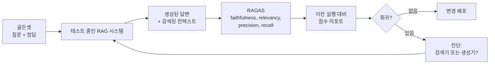

# RAG 평가: RAGAS와 핵심 지표 4가지

## 학습 목표
- RAG 핵심 지표 4가지인 **Faithfulness**, **Answer Relevancy**, **Context Precision**, **Context Recall**이 각각 무엇을 진단하는지 정확히 이해한다.
- 코드 변경마다 재실행할 수 있는 작은 **골든셋**(질문 + 참조 답변 + 예상 출처)을 구축한다.
- **RAGAS** 프레임워크로 함수 호출 한 번에 이 지표들을 계산하고 결과를 읽어 검색기와 생성기 중 어디가 병목인지 판단한다.
- 버전 간 회귀를 추적해 "프롬프트 소소한 수정"이 정확도를 10%나 조용히 떨어뜨리는 일이 없도록 한다.

## 본문

### 데모 당일이 지나면 "느낌으로 확인하기"는 한계가 온다

RAG를 만드는 팀은 처음에 데모를 이리저리 클릭하면서 "좋아 보이네"라고 말한다. 첫 주는 그걸로 충분하다. 그러다 누군가 청크 크기를 바꾸고, 다른 누군가는 임베딩 모델을 교체하고, 프롬프트도 다시 쓴다. 이제 답변이 좋아지는지 나빠지는지 알 수 없다. 고객이 불만을 제기하면 세 번의 변경이 위에 쌓여 있고 어디서 문제가 생겼는지 추적할 수 없다.

RAG 시스템에는 **움직이는 부품이 두 개** 있다. *검색기*(올바른 청크를 가져오는가?)와 *생성기*(LLM이 그 청크를 올바르게 활용하는가?)다. 답변이 틀렸을 때 어느 쪽이 실패했는지 알아야 한다. 그 진단 질문에 답하기 위해 RAG 특화 지표가 설계됐다.

BLEU나 ROUGE 같은 전통적인 NLP 지표는 참조 텍스트와의 n-gram 겹침을 측정한다. 번역이나 요약에서는 괜찮다. 정답이 딱 하나의 표현 방식으로 정해지기 때문이다. RAG에서는 쓸모없다. 좋은 RAG 답변은 여러 방식으로 표현될 수 있고도 정확할 수 있기 때문이다. 필요한 지표는 이것이다. *이 답변이 검색된 증거에 근거하는가? 검색기가 처음부터 올바른 증거를 가져왔는가?*

### 4가지 지표, 쉽게 설명하면

RAG 평가의 사실상 표준 오픈소스 프레임워크인 RAGAS는 시스템의 두 축인 검색과 생성을 따라 점수를 정리한다. 핵심 작업은 네 가지 지표가 담당한다.

**1. Context Precision** — *검색기가 반환한 것 중 실제로 유용한 비율은?*

검색기가 청크 5개를 가져왔는데 2개만 질문과 관련이 있다면 Precision은 2/5 = 0.40이다. Precision이 높다는 것은 프롬프트의 노이즈가 적다는 뜻이다. Precision이 낮으면 컨텍스트 윈도우를 낭비하고 LLM의 주의를 분산시킨다.

**2. Context Recall** — *검색기가 필요한 것을 모두 찾았는가?*

질문에 답하기 위해 *반드시 검색해야 할* 청크(실제 정답에 필요한 청크들) 중 검색기가 실제로 반환한 비율은 얼마인가? 코퍼스에 테슬라 창립 사실을 담은 청크가 세 개인데 검색기가 두 개만 반환했다면 Recall은 2/3 = 0.67이다. 낮은 Recall은 RAG의 조용한 킬러다. 누락된 청크는 LLM에 도달하지 않고, 어떤 경고도 없이 답변이 불완전해진다.

**3. Faithfulness** — *답변이 실제로 검색된 청크로 뒷받침되는가?*

생성된 답변의 각 주장이 검색된 컨텍스트에 증거가 있는지 확인한다. 컨텍스트에 없는 주장은 환각으로 집계된다. LLM이 문서가 아닌 자신의 학습 데이터에서 끌어온 사실로 "살을 붙일" 때마다 Faithfulness가 떨어진다. 규제 환경에서는 단일 지표 중 가장 중요하다.

**4. Answer Relevancy** — *답변이 실제로 묻는 질문에 답하는가?*

완벽하게 신뢰할 수 있고 정확한 답변도 요점을 빗나갈 수 있다. 사용자가 *"어떻게 취소하나요?"*라고 물었는데 시스템이 (정확한) *가격 구조* 설명으로 답한다면 Relevancy가 낮다. RAGAS는 답변이 자연스럽게 응답할 만한 질문들을 LLM이 생성하게 하고, 그것들을 원본 질문과 비교하는 방식으로 이를 측정한다.

| 지표 | 진단 대상 | 낮으면 의미하는 것 |
|---|---|---|
| Context Precision | 검색기 (노이즈) | 상위 K개에 관련 없는 청크가 너무 많음 |
| Context Recall | 검색기 (누락) | 올바른 청크가 상위 K개에 포함되지 않음 |
| Faithfulness | 생성기 | LLM이 컨텍스트를 벗어나 환각 |
| Answer Relevancy | 생성기 | LLM이 다른 질문에 답변 |

함께 읽는 것이 핵심이다. Recall이 낮고 Faithfulness도 낮다면 검색기를 먼저 고친다. LLM은 보지 못한 증거에 근거할 수 없다. Recall과 Precision이 모두 높은데 Faithfulness가 낮다면 LLM이 문제다. 프롬프트를 강화하거나 모델을 교체한다.

### 골든셋 구축하기

이 지표 중 어느 것도 평가 데이터셋 없이는 계산할 수 없다. 최소 실행 가능한 형태는 작은 스프레드시트이며 흔히 **골든셋**이라고 부른다. 행마다 네 개의 컬럼이 있다.

- `question` — 실제 사용자가 물어볼 만한 것.
- `ground_truth` — 사람 전문가가 정확하다고 판단하는 답변.
- `expected_contexts` — *반드시 검색되어야 하는* 문서 청크 또는 ID.
- `notes` — 엣지 케이스, 의도적 모호성, 예상되는 거절.

처음에는 30~100개 질문을 목표로 한다. 다음을 포함한다.

- 실제 사용자의 가장 흔한 쿼리 다섯 열 개(로그에서 가져옴).
- 코퍼스에 답이 *없는* 질문(시스템이 환각이 아닌 거절을 해야 함).
- "X와 Y를 비교해줘" 방식의 합성 질문(Decomposition 스트레스 테스트용).
- 대상 독자가 이중 언어라면 다중 언어 질문.

> 절대 실행하지 않는 거대한 골든셋보다, 작지만 집중된 골든셋이 낫다. 변경마다 2분 안에 평가할 수 있는 50개의 잘 선별된 질문이, 분기에 한 번 실행하는 5,000개보다 회귀를 더 많이 잡는다.

RAGAS는 코퍼스에서 골든셋을 **합성**할 수도 있다. LLM을 사용해 문서를 읽고 그럴듯한 질문과 참조 답변을 생성한다. 아직 실제 쿼리 로그가 없을 때 평가를 빠르게 시작하는 데 유용하다.

> **중요: RAGAS가 실제로 사용하는 것.** 위의 네 컬럼 중 RAGAS가 소비하는 것은 `question`과 `ground_truth`(그리고 시스템의 실행 시점 `answer`와 검색된 `contexts`)다. `expected_contexts` 목록은 읽지 **않는다**. 대신 RAGAS의 `context_recall`은 LLM 판정자에게 `ground_truth` 답변의 각 문장을 보여주고 검색된 컨텍스트에 그 증거가 있는지 확인하도록 요청한다. 참조 *답변*을 "무엇이 검색됐어야 하는가"의 대리 지표로 사용하는 것이다. 따라서 RAGAS의 Recall은 **LLM 판정 근사치**이지, 진정한 문서 수준 Recall이 아니다. 엄격한 버전 — "검색기가 내 코퍼스에서 청크 X, Y, Z를 반환했는가?" — 이 필요하다면, 검색기의 청크 ID를 손수 정리한 `expected_contexts`와 직접 비교해 계산해야 한다. 골든셋에 `expected_contexts` 컬럼은 어쨌든 보존한다. RAGAS 자체는 무시하지만 사람이 디버깅하고 더 엄격한 Recall 계산을 할 때 매우 유용하기 때문이다.

### 실제로 RAGAS 실행하기

설정은 간단하다. 질문, 시스템의 답변, 시스템이 검색한 컨텍스트, 그리고 정답 답변이 필요하다.

```python
# pip install ragas datasets

from datasets import Dataset
from ragas import evaluate
from ragas.metrics import (
    faithfulness, answer_relevancy,
    context_precision, context_recall,
)

# RAG 출력으로 평가 데이터셋 구성.
# RAGAS 스키마 참고:
#   - 키는 `ground_truths` (복수형)
#   - 값은 리스트의 리스트: 질문당 참조 답변의 내부 리스트 하나
samples = {
    "question": [
        "아인슈타인은 언제 태어났나요?",
        "슈퍼볼을 가장 많이 이긴 팀은?",
    ],
    "answer": [                # RAG 시스템이 생성한 답변
        "알버트 아인슈타인은 1879년 3월 14일에 태어났습니다.",
        "뉴잉글랜드 패트리어츠가 슈퍼볼을 가장 많이 이겼습니다.",
    ],
    "contexts": [              # 검색기가 반환한 청크
        ["아인슈타인은 1879년 3월 14일 독일 울름에서 태어났다 ..."],
        ["슈퍼볼은 매년 1월 또는 2월에 열리는 NFL 챔피언십 경기다 ..."],
    ],
    "ground_truths": [         # 리스트의 리스트 — 질문당 하나 이상의 참조 답변
        ["알버트 아인슈타인은 1879년 3월 14일에 태어났다."],
        ["피츠버그 스틸러스와 뉴잉글랜드 패트리어츠가 각각 6회로 동률이다."],
    ],
}
eval_ds = Dataset.from_dict(samples)

results = evaluate(
    eval_ds,
    metrics=[faithfulness, answer_relevancy,
             context_precision, context_recall],
)
print(results)
# {'faithfulness': 0.50, 'answer_relevancy': 0.83,
#  'context_precision': 0.50, 'context_recall': 0.50}
```

결과를 줄 단위로 해석한다. 아인슈타인 예시에서는 네 지표가 모두 높다. 검색이 올바른 청크를 찾았고 LLM이 근거에 충실했다. 슈퍼볼 예시에서는 검색된 컨텍스트가 패트리어츠를 언급하지 않아 **Faithfulness가 0으로 떨어진다**. 답변이 상식적으로는 정확하지만 검색된 컨텍스트로 뒷받침되지 않는다. 이것이 진단 신호다. LLM이 검색 증거를 우회하고 자신의 기억에서 끌어냈다. 프로덕션에서 위험한 동작이다.

### 평가 루프는 단위 테스트처럼 파이프라인에 들어간다

깔끔한 통합은 다음과 같다. 커밋마다(최소한 릴리스마다) 현재 RAG 설정으로 골든셋을 실행하고 네 점수를 이전 실행과 나란히 리포트한다.



RAGAS 출력을 단위 테스트 출력처럼 다룬다. 50개 질문 셋에서 Faithfulness가 3% 떨어지면 회귀가 발생한 명확한 신호다. 머지하기 전에 조사한다.

### 지표가 알려주지 *않는* 것들

RAG 지표는 강력하지만 완전하지 않다. 몇 가지 한계를 알아둔다.

- **LLM 판정자 편향.** 대부분의 RAGAS 지표는 내부에서 LLM(주로 GPT-4 수준)을 판정자로 사용한다. 이 판정자에게는 고유한 편향이 있다. 더 긴 답변을 선호하고, 자신의 글쓰기 스타일을 선호한다. RAGAS와 주기적인 사람 검토를 병행한다.
- **어조, 브랜드 보이스, 포맷은 측정하지 않는다.** 이런 것들은 별도의 가벼운 점검을 추가한다.
- **생성된 답변을 평가하지, 사용자가 원한 답변을 평가하지 않는다.** 실제 사용자 피드백(좋아요/싫어요, 재질문, "도움이 안 됐어요" 클릭)을 로깅하고 흔한 실패를 골든셋에 다시 넣는다.
- **비용.** 모든 RAGAS 평가는 지표당 예시당 하나 이상의 LLM 호출을 한다. 네 지표에 걸쳐 100개 질문 셋은 LLM 호출 약 400~1,000회다. 커밋마다 실행하되 예산 한도를 설정한다.

### 간단한 최적화 워크플로

지표가 갖춰지면 RAG 개선이 추측이 아닌 체계적 작업이 된다.

1. **기준선.** 현재 시스템으로 RAGAS를 실행하고 네 점수를 기록한다.
2. **최악의 지표를 찾는다.** Context Recall이 가장 낮다면 검색기가 청크를 놓치고 있다. 하이브리드 검색(1강), 쿼리 변환(3강), 또는 더 나은 청킹을 시도한다.
3. **한 가지만 바꾼다.** 임베딩 모델 교체, 상위 K 증가, HyDE 추가 — 한 번에 변수 하나씩.
4. **재실행.** 네 점수를 기준선과 비교한다. 목표 지표가 올라가면서 다른 것이 떨어지지 않을 때만 변경을 유지한다.
5. **승격.** 기준선을 업데이트하고 실험을 기록하고, 다음으로 나쁜 지표로 반복한다.

매주 실행하는 이 루프가 부서지기 쉬운 데모를 실제로 시간이 갈수록 좋아지는 시스템으로 바꾼다.

## 핵심 정리
- RAG에는 **검색**과 **생성** 두 가지 실패 지점이 있고, 각각에 별도의 지표가 필요하다. RAGAS의 4개 지표 suite가 둘 다 커버한다. **Context Precision/Recall**은 검색을, **Faithfulness/Answer Relevancy**는 생성을 담당한다.
- 질문/답변/예상 컨텍스트가 손수 정리된 30~100개 행의 **골든셋**이 최소 실행 가능한 평가 하니스다. 변경마다 재실행한다.
- **RAGAS `context_recall`은 LLM 판정 근사치**로, 검색되어야 할 것의 대리 지표로 참조 *답변*(`ground_truths`)을 사용한다. `expected_contexts` 목록은 읽지 않는다. 진정한 문서 수준 Recall이 필요하다면 검색된 청크 ID를 손수 정리한 예상 청크와 직접 비교해 계산한다.
- **Faithfulness**는 규제 환경이나 고위험 사용 사례에서 가장 중요한 지표다. LLM이 검색된 증거로 뒷받침되지 않는 사실을 "채워 넣는" 것을 포착한다.
- RAGAS는 내부에서 LLM 판정자를 사용한다. 주기적인 사람 검토와 병행하고, 평가 비용이 LLM 호출로 발생하므로 한도를 설정한다.
- 개선은 반복 루프다. 기준선 → 최악 지표 찾기 → 변수 하나 바꾸기 → 재측정 → 승격. 느낌 점검만으로는 프로덕션을 견디지 못한다.
