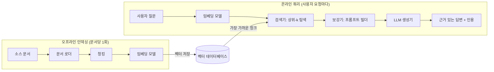
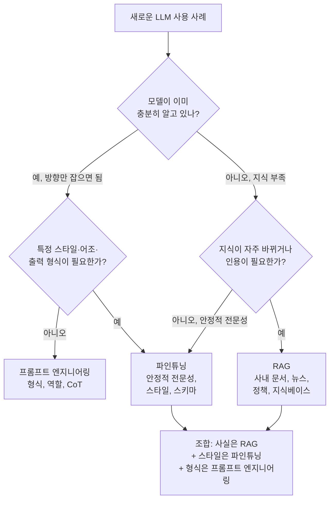

# RAG 개요와 아키텍처: LLM에 검색을 붙이는 이유

## 학습 목표
- 순수 LLM이 가진 근본적 한계(환각, 지식 陳腐化, 도메인 지식 부재)를 설명하고, RAG가 각 한계를 어떻게 해결하는지 기술한다.
- RAG 시스템의 세 구성 요소(검색기·보강기·생성기)를 식별하고, 사용자 질문에서 근거 있는 답변까지의 데이터 흐름을 추적한다.
- RAG와 파인튜닝(및 프롬프트 엔지니어링)을 비교하고, 주어진 문제에 어떤 접근법이 적합한지 판단한다.

## 본문

### LLM만으로는 부족한 이유

대형 언어 모델(LLM)은 놀라운 능력을 가지고 있지만, 한 가지 고질적인 특성이 있다. 바로 시간이 멈춰 있다는 점이다. 학습이 끝나는 순간부터 모델은 더 이상 배우지 않는다. 학습 마감일까지의 세상만 알 뿐, 그 이후는 아무것도 모른다. 회사 내부 위키, 고객 계약서, 독점 코드베이스, 오늘 아침 새로 발행된 정책처럼 *우리만의* 세계는 처음부터 존재하지 않는 셈이다.

이 공백이 오늘날 대부분의 실용적 AI 프로젝트를 이끄는 세 가지 실패 유형을 만들어낸다.

1. **환각(Hallucination).** 정작 모르는 것을 물어보면, 잘 학습된 LLM이 "모르겠다"고 말하는 경우는 드물다. 틀렸음에도 매끄럽고 자신감 있게 들리는 답변을 만들어낸다. 예를 들어 2024년 초에 "저금리 정부 주택대출 상품"을 물어보면, 모델은 2023년 기사에 자주 등장했던 특례보금자리론을 추천할 수 있다. 그런데 이 상품은 2024년 1월에 종료되고 새 이름으로 대체됐다. 모델이 거짓말을 하는 게 아니다. 데이터가 바뀌었다는 사실을 알 방법이 없을 뿐이다.
2. **지식 진부화(Stale knowledge).** 학습 마감일 이후에 일어난 일은 모두 보이지 않는다. 새로 바뀐 규정, 최신 API 릴리스, 지난주 장애 보고서—모델에게는 존재하지 않는 일이다.
3. **도메인 맥락 부재.** 학습 기간 내의 정보라 해도, 범용 모델은 내부 문서를 본 적이 없으므로 그에 대해 추론할 수 없다.

이 공백이 낳는 또 다른 문제가 있다. 모델이 출처를 댈 수 없다는 점이다. "그 근거가 뭐냐"고 물어도 LLM 단독으로는 솔직한 답이 없다. 법률, 의료, 금융, 고객 지원처럼 검증이 필요한 기업 환경에서는 확인할 수 없는 답변이 답변이 없는 것보다 오히려 더 나쁜 경우가 많다.

여기서 **검색 증강 생성(Retrieval-Augmented Generation, RAG)** 이 등장한다. 아이디어는 단순하다. 모델이 모든 걸 *기억*하기를 기대하는 대신, 답변 시점에 필요한 내용을 *찾아볼* 수 있게 하고, 그 내용에 충실하게 답변을 작성하도록 요청하는 것이다.

> RAG는 LLM을 더 똑똑하게 만들지 않는다. LLM이 받는 질문 자체를 바꾼다. "X에 대해 뭘 기억하고 있니?"가 "이 구체적인 문단들을 바탕으로 X에 대한 최선의 답은 뭐니?"로 바뀐다. 이 재구성이 핵심이다.

### RAG의 세 가지 구성 요소

이름이 곧 아키텍처다. **검색 증강 생성(Retrieval-Augmented Generation)** 은 세 단계로 분해되며, 단순하든 정교하든 거의 모든 RAG 시스템은 이 세 단계의 변형이다.

**1. 검색(Retrieval).** 사용자가 질문하면, 시스템은 그것을 바로 LLM에 보내지 않는다. 먼저 외부 지식 저장소—주로 *벡터 데이터베이스*—를 검색해 답이 담겼을 가능성이 높은 문단을 찾는다. 단어를 그대로 맞추는 키워드 검색과 달리, RAG의 검색은 **의미론적(semantic)**이다. 질문과 모든 문서 청크는 의미를 담아낸 수치 벡터(임베딩)로 변환된다. "지난 분기 매출 성장"을 묻는 쿼리가 "4분기 영업 실적"을 다룬 문서에 매칭될 수 있다. 단어가 겹치지 않더라도 말이다. 임베딩과 벡터 데이터베이스는 2강과 3강에서 자세히 다룬다.

**2. 보강(Augmentation).** 상위 랭킹 문단이 최종 답변이 되는 것은 아니다. 이것들은 *날 증거*다. 시스템은 이 문단들을 LLM에 보낼 프롬프트에 엮어 넣는다. 보통 이런 형식이다. *"아래 출처만 사용해 사용자 질문에 답하세요. 출처에 답이 없으면 모른다고 말하세요. 출처: [문단 1] [문단 2] ... 질문: ..."* 이 단계가 일반적인 프롬프트를 실제 검색된 사실로 근거를 갖춘 프롬프트로 바꿔준다.

**3. 생성(Generation).** 이제 LLM이 가장 잘하는 일을 한다. 유창하고 잘 구조화된 답변 작성이다. 관련 사실이 컨텍스트 윈도우 안에 이미 들어와 있으므로, 기억에서 추측할 필요가 없다. 그리고 각 문단에는 문서명, 페이지 번호, URL 같은 메타데이터가 붙어 있으므로, 답변과 함께 인용 출처도 제공할 수 있다.

시스템을 직관적으로 이해하려면 두 흐름이 LLM에서 만나는 그림을 떠올리면 좋다. **오프라인 인덱싱 흐름**: 문서가 로드되고, 청크로 나뉘고, 벡터로 임베딩되어 벡터 데이터베이스에 저장된다. 문서당 한 번만 일어나고, 이후 모든 쿼리에 재사용된다. **온라인 쿼리 흐름**: 사용자 질문이 임베딩되고, 인덱스와 매칭되어 상위 청크가 추출되고, 프롬프트가 만들어지고, LLM이 응답을 생성한다. 이 두 흐름을 깔끔하게 연결하는 것이 설계자의 역할이다. 아래 다이어그램에 전체 구조가 나와 있다.

### 구체적인 예제로 흐름 따라가기

질문 하나를 처음부터 끝까지 따라가 보면 각 부품이 어떻게 맞물리는지 확실히 와 닿는다.

사용자가 입력한다. *"v1 사양과 v1.2 릴리스 노트 사이에서 빠진 보안 요구사항이 뭔가요?"* LLM만 쓰는 방식에서는 이 질문에 답할 방법이 없다. 모델이 내부 문서 두 개를 본 적이 없기 때문이다. RAG 방식에서는 이렇게 동작한다.

- 사용자 질문이 쿼리 벡터로 변환된다.
- 벡터 데이터베이스가 의미론적 유사도 순위로 상위 8개 청크를 반환한다. 요구사항 문서에서 "인증"과 "암호화"가 언급된 것들, 릴리스 노트에서 출시된 기능과 알려진 결함이 언급된 것들이다.
- 이 청크들이 프롬프트에 삽입된다. *"아래 요구사항 목록과 릴리스 노트를 비교하세요. 사양에는 있지만 릴리스에 없는 요구사항을 나열하고, 각 항목의 출처를 인용하세요."*
- LLM이 해당 청크들에 근거한 답변을 인용과 함께 생성한다.

두 가지를 주목하자. 첫째, LLM은 재학습이 전혀 필요 없었다. 보고 있는 내용만 바뀌었을 뿐이다. 둘째, 검색 품질이 전부다. 관련 청크가 상위 k개 결과에 들어오지 않으면 모델은 그것을 볼 수 없고, 답변은 틀리거나 불완전해진다. 이걸 감지하기도 어렵다. 커뮤니티에서는 이것을 **조용한 실패(silent failure)**라고 부른다. 올바른 정보는 데이터베이스에 있지만, 검색기가 그것을 찾아내지 못해 모델이 무언가 빠졌다는 경고 없이 자신감 있는 불완전한 답변을 생성하는 것이다. 프로덕션 RAG 시스템에서 엔지니어링 노력의 대부분이 이 조용한 실패를 막는 데 들어간다. 더 좋은 청킹, 더 좋은 임베딩 모델, 리랭킹, 키워드+벡터 혼합 검색 등이 그 방법이다. 이런 조정 방법은 4강과 5강에서 다시 다룬다.

### 컨텍스트 윈도우에 전부 넣으면 안 되나?

여기서 합당한 반론이 나온다. "최신 LLM은 백만 토큰 컨텍스트 윈도우를 가지고 있는데, 왜 굳이 벡터 데이터베이스를 쓰나? 전체 지식 베이스를 프롬프트에 그냥 붙여 넣으면 되지 않나?"

이것이 **롱 컨텍스트 접근법**이다. 실제로 특정 문제에서는 충분히 매력적이다. 데이터셋이 작고 한정적이라면—계약서 한 건, 제품 매뉴얼 하나, 논문 한 편 수준—전체를 넣는 방식이 RAG보다 오히려 나은 추론을 낼 때가 있다. 모델이 전체 그림을 보고 문서 간 관계나 누락된 부분을 발견할 수 있기 때문이다. RAG는 설계상 모델에게 격리된 단편 몇 개만 보여준다.

하지만 롱 컨텍스트가 RAG를 완전히 대체할 수는 없다. 세 가지 구체적인 이유가 있다.

- **쿼리마다 드는 연산 비용.** RAG는 임베딩 비용을 인덱싱 시점에 한 번만 낸다. 롱 컨텍스트 방식은 요청마다 동일한 문서를 다시 처리한다. 500페이지 매뉴얼은 약 25만 토큰인데, 사용자 요청마다 모델에 밀어 넣으면 비용이 빠르게 불어난다. 정적인 콘텐츠는 프롬프트 캐싱으로 완화할 수 있지만, 자주 바뀌는 데이터에는 효과가 없다.
- **건초 더미 속 바늘 문제.** 컨텍스트가 수십만 토큰으로 늘어날수록 모델의 주의력이 분산된다는 연구 결과가 꾸준히 나온다. 2,000페이지 분량의 문서 중간에 박혀 있는 핵심 문장 하나는 무시되거나, 주변 텍스트에서 잘못된 세부 내용을 끌어와 환각이 생기기도 한다. RAG는 관련성이 가장 높은 5~10개 문단만 모델에 건네 신호를 높이고 노이즈를 줄인다.
- **기업 규모.** 백만 토큰도 테라바이트나 페타바이트 단위의 기업 데이터 레이크 앞에서는 작다. "전부"를 현존하는 어떤 컨텍스트 윈도우에도 담을 수 없다. 규모를 다루기 위해서라도 어떤 형태의 검색 레이어는 필수다.

실용적인 기준으로 정리하면 이렇다. **데이터가 한정적이고 깊은 추론이 필요하다 → 롱 컨텍스트. 데이터가 무한하고 사실 조회가 목적이다 → RAG.** 실제 시스템은 둘을 함께 쓰는 경우가 많다. 어떤 문단을 읽을지 고르는 데 RAG를 쓰고, 그 문단을 다루는 데 롱 컨텍스트를 쓰는 방식이다.

### RAG vs. 파인튜닝 vs. 프롬프트 엔지니어링

LLM 출력을 개선하는 방법은 세 가지가 있다. RAG, 파인튜닝, 프롬프트 엔지니어링이다. 이들은 겹치면서도 서로 다른 문제를 해결하며, 초보자가 가장 자주 저지르는 실수는 RAG가 더 저렴하고 효과적인 상황에서 파인튜닝을 먼저 고르는 것이다.

**프롬프트 엔지니어링**은 가장 가벼운 개입이다. 예시를 추가하거나, "단계별로 생각하라"고 요청하거나, 제약을 명확히 하는 방식으로 프롬프트 문구만 바꾼다. 모델이나 데이터는 건드리지 않는다. 무료에 즉각적이며 생각보다 강력하다. 하지만 모델이 모르는 지식을 추가할 수는 없다. 아무리 영리한 문구도 내부 API가 어떻게 생겼는지를 모델에게 가르칠 수 없다.

**파인튜닝**은 반대 방향이다. 기존 사전 학습 모델을 원하는 동작을 보여주는 입출력 쌍 데이터셋으로 추가 학습한다. 모델 가중치가 업데이트되므로, 새로운 지식이나 스타일이 *내재화*된다. 깊은 도메인 전문성, 특정 어조, 구조화된 출력 형식이 필요할 때 빛을 발한다. 검색 단계가 없어 추론이 빠르다. 다만 실제 비용이 만만치 않다. 수천 개의 고품질 예제, GPU 학습 예산, 유지보수 계획이 필요하다. 지식이 바뀌면 재학습해야 한다. 그리고 전문화하는 과정에서 범용 능력이 저하되는 **파국적 망각(catastrophic forgetting)** 위험도 있다.

**RAG**는 그 중간 어딘가다. 모델을 전혀 수정하지 않고, 모델이 볼 수 있는 것만 바꾼다. 새 문서를 벡터 스토어에 추가하는 데 며칠이 아니라 수분이 걸린다. 어제의 정책을 업데이트하는 건 바뀐 파일을 다시 임베딩하는 것으로 충분하다. 각 사실의 출처도 인용할 수 있다. 대신 운영 복잡도가 따라온다. 청킹 전략, 임베딩 모델, 벡터 데이터베이스, 경우에 따라 리랭커, 그리고 매 쿼리마다 검색에 드는 지연 시간이 그것이다.

선택은 결국 지식의 특성에 달려 있다. 아래 의사결정 트리가 가장 흔한 판단 경로를 담고 있다.

- **지식이 자주 바뀌거나 인용이 필요하다?** RAG. 예: 사내 지식 베이스, 제품 문서, 뉴스, 규정, 고객 기록.
- **깊고 안정적인 전문성, 또는 특정 행동/스타일이 필요하다?** 파인튜닝. 예: 법률 문서 작성 스타일, 의료 코딩 관례, 고객 서비스 어조, 구조화된 JSON 출력 스키마.
- **모델이 이미 알지만 방향을 잡아줘야 한다?** 프롬프트 엔지니어링. 예: 형식 제어, 역할 설정, 연쇄 사고(CoT) 추론.

실제로는 세 가지를 조합해 쓰는 경우가 많다. 법률 AI 어시스턴트라면 최신 판례를 가져오는 데 RAG를, 사내 문서 작성 스타일을 강제하는 데 파인튜닝을, 특정 문서 템플릿을 따르는 데 프롬프트 엔지니어링을 사용할 수 있다. 문제는 "셋 중 하나"가 아니라 "어떤 비율로?"다.

### RAG가 주는 것, 요약

잠시 기계적인 내용에서 벗어나 보자. 검색 단계를 추가하면 실제로 무엇을 얻는가?

- **재학습 없는 최신성.** 새 문서는 모델 가중치가 아닌 벡터 스토어에 들어간다. LLM을 건드리지 않고도 지식을 매일 갱신할 수 있다.
- **사내 데이터의 도메인 지식.** 내부 문서가 외부로 나가지 않아도 답변에 반영된다.
- **출처 귀속.** 검색된 청크마다 메타데이터가 붙어 있어 답변에 인용을 달 수 있다. 규제 환경에서 RAG가 받아들여지게 만드는 핵심 기능인 경우가 많다.
- **제어 가능한 실패 방식.** "출처에 답이 없으면 모른다고 말하세요" 같은 지시를 넣으면, 환각 대신 정중한 거절로 동작하도록 조정할 수 있다. 신뢰 문제가 크게 줄어든다.
- **지식이 바뀌는 경우 파인튜닝보다 장기 비용이 낮다.** 재인덱싱이 재학습보다 훨씬 저렴하기 때문이다.

RAG가 하지 *못하는* 것도 있다. 약한 모델을 똑똑하게 만드는 건 RAG의 역할이 아니다. 생성 단계는 여전히 LLM이 담당한다. 모델이 주어진 문단을 바탕으로 추론하지 못한다면, 더 좋은 문단을 검색해도 소용없다. RAG는 지식 레이어이지 지능 레이어가 아니다.

### 이 강좌의 앞으로의 여정

*왜* 와 *어떻게*의 큰 그림을 설명했다. 나머지 강의에서는 실제 RAG 시스템을 만드는 데 필요한 각 구성 요소를 하나씩 살펴본다.

- **2강 - 임베딩.** 텍스트가 벡터가 되는 방법, 코사인 유사도가 의미론적 검색을 가능하게 하는 이유. OpenAI text-embedding-3 계열, BGE, SBERT, 그리고 한국어에 친화적인 다국어 모델을 비교한다.
- **3강 - 벡터 데이터베이스.** Chroma, FAISS, Pinecone, pgvector, Weaviate—각각 어떤 상황에 적합한지, 그리고 HNSW와 IVF 같은 ANN 알고리즘이 속도와 정확도를 어떻게 절충하는지.
- **4강 - 문서 로딩과 청킹.** 검색이 동작할지 말지를 결정하는 화려하지 않지만 중요한 단계. 고정 크기, 문장, 재귀적, 의미론적 청킹; 청크 크기와 오버랩; 인용을 위한 메타데이터.
- **5강 - 엔드투엔드 MVP 구축.** LangChain으로 전부 연결하기. 로드, 청킹, 임베딩, 저장, 검색, 프롬프트, 응답.

이 강좌를 마치면 자신의 문서에 맞게 조정할 수 있는 작동하는 RAG 파이프라인을 직접 만들게 된다. 지금 가져갈 핵심 비유는 이것이다. LLM은 뛰어나지만 건망증 심한 동료이고, RAG는 그 동료가 답하기 직전에 딱 맞는 책의 딱 맞는 페이지를 건네주는 행위다.

## 핵심 정리
- 순수 LLM은 시간이 멈춰 있고, 환각에 취약하며, 사내 도메인을 모른다. RAG는 쿼리 시점에 관련 문단을 검색하고 그에 근거한 답변을 요청함으로써 세 가지를 모두 해결한다.
- RAG는 세 단계로 구성된다. **검색**(벡터 데이터베이스의 의미론적 검색), **보강**(검색된 문단을 프롬프트에 삽입), **생성**(LLM이 인용과 함께 최종 답변 작성).
- 검색 품질이 전부다. 올바른 청크가 상위 k개 결과에 없으면 모델은 그것을 볼 수 없다. 출력만으로는 감지하기 어려운 "조용한 실패"다.
- 롱 컨텍스트 윈도우가 RAG를 대체하지 않는다. 작고 한정적인 데이터와 깊은 추론에서는 롱 컨텍스트가 유리하지만, 기업 규모에서는, 비용 통제 측면에서, 그리고 주의력 분산을 피하기 위해서는 RAG가 필요하다.
- 지식이 자주 바뀌거나, 인용이 필요하거나, 사내 데이터에서 나온다면 RAG를 선택한다. 깊고 안정적인 전문성이나 특정 행동이 필요하다면 파인튜닝을 선택한다. 모델이 이미 아는 것을 방향만 잡아주려면 프롬프트 엔지니어링을 쓴다. 세 가지는 배타적이지 않고 서로 보완한다.
