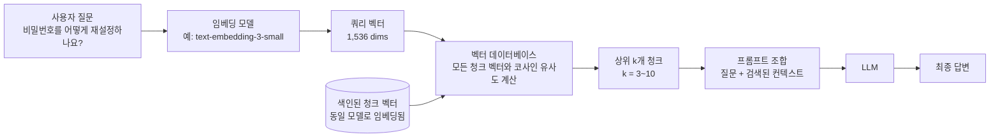
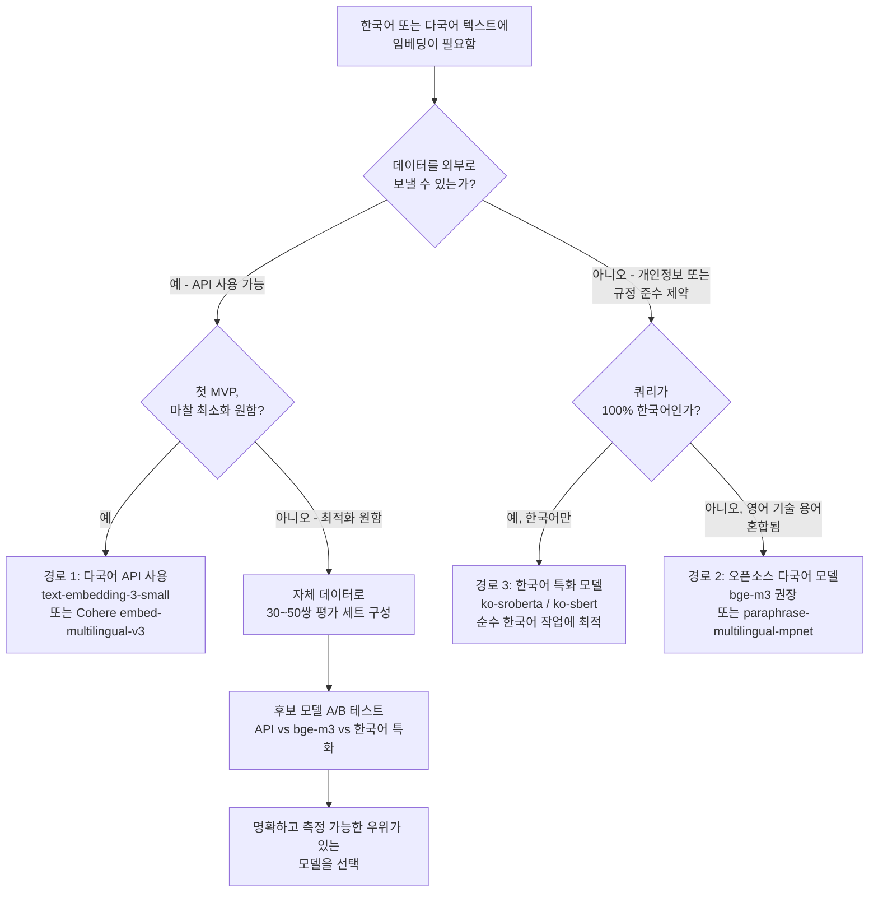

# 임베딩 모델과 벡터 표현: 의미를 숫자로 바꾸는 방법

## 학습 목표
- 임베딩이 무엇인지, 그리고 코사인 유사도가 어떻게 의미 기반 검색을 가능하게 하는지 설명할 수 있다.
- OpenAI `text-embedding-3`, BGE, SBERT 등 주요 임베딩 모델의 특징, 차원 수, 비용 트레이드오프를 비교할 수 있다.
- 한국어가 포함된 다국어 환경에서 어떤 임베딩 모델을 선택할지 판단할 수 있다.

## 본문

### RAG에서 임베딩이 핵심인 이유

앞 강의에서 RAG(Retrieval-Augmented Generation)는 지식 베이스에서 *적절한* 문단을 찾아 언어 모델에 넘기는 방식으로 동작한다고 배웠다. 그렇다면 검색기는 어떤 문단이 "적절한지"를 어떻게 알까? 예전 방식의 검색은 키워드를 매칭했다. 사용자가 "구독을 어떻게 취소하나요?"라고 묻고, 문서에 "cancel subscription"이라는 단어가 그대로 들어 있다면 키워드 색인으로 찾을 수 있다. 그런데 같은 의미를 "terminate your membership"으로 표현한 문서가 있다면, 의미는 똑같아도 전통적인 키워드 검색은 이를 놓쳐버린다.

임베딩은 바로 이 간극을 메운다. 임베딩 모델은 텍스트를 읽고 긴 숫자 목록, 즉 벡터를 출력하는데, 이 벡터는 *의미*가 비슷한 텍스트가 정확히 어떤 단어를 썼든 관계없이 해당 숫자 공간에서 서로 가까이 위치하도록 설계되어 있다. RAG 검색은 이 아이디어를 그대로 활용한다. 사용자의 질문을 임베딩하고, 문서의 모든 청크(chunk)도 임베딩한 뒤, 질문 벡터와 가장 가까운 청크 벡터를 반환하는 것이다. 임베딩 모델을 잘못 고르면 벡터 데이터베이스, 청킹, 프롬프트 등 나머지 파이프라인이 아무리 잘 짜여 있어도 결과를 만회할 수 없다. 이번 강의는 RAG 시스템이 쿼리를 진정으로 *이해*할 수 있는지, 아니면 단순히 문자열을 대조하는 데 그치는지를 결정하는 계층을 다룬다.

### 단어에서 벡터로: 핵심 직관

임베딩을 가장 쉽게 이해하는 방법은 단어를 그래프에 점으로 찍어보는 것이다. 잠깐 2차원 임베딩을 상상해보자. 대규모 텍스트로 학습한 모델이라면 `cat`을 `dog` 근처에, `house`를 그 둘과 멀리 떨어진 곳에, `apple`을 `orange` 가까이 놓되 `airplane`과는 멀리 배치할 것이다. 각 단어의 위치가 그 의미를 담고 있다. "the cat purred", "the dog barked"처럼 비슷한 맥락에서 쓰이는 단어들은 학습 과정에서 서로 가깝게 당겨지고, 관련 없는 맥락에서 쓰이는 단어들은 멀어진다.

물론 실제 언어를 표현하기에 2차원은 턱없이 부족하다. 상용 임베딩 모델은 수백에서 수천 차원의 벡터를 출력한다. OpenAI의 `text-embedding-3-small`은 기본 설정에서 1,536차원 벡터를 생성하고, `text-embedding-3-large`는 3,072차원을 생성한다. 3,072차원 공간을 머릿속에 그릴 수는 없지만 원리는 같다. 각 차원은 모델이 학습 과정에서 파악한 어떤 잠재적 속성(예: "생물 여부", "격식체 여부", "금융 관련 여부")을 담고 있으며, 이 숫자들의 조합이 텍스트의 위치를 광활한 *의미 공간* 안에 고정한다.

오늘 소개한 강의 영상 중 하나에서 유용한 비유를 들었다. 고양이의 임베딩은 "털이 있다", "다리가 있다" 같은 차원을 활성화하고, 집의 임베딩은 "지붕이 있다"는 활성화하지만 "털이 있다"는 활성화하지 않으며, 개의 임베딩은 고양이와 많은 차원을 공유한다. 실제 모델에서 차원에 이런 깔끔한 레이블은 없다. 차원은 설계된 것이 아니라 학습을 통해 생겨나기 때문이다. 그러나 이 비유는 비슷한 것들이 왜 모이는지를 잘 설명해준다.

> 임베딩은 결정론적이다. 같은 텍스트를 같은 모델에 넣으면 항상 같은 벡터가 나온다. GPT-4나 Gemini 같은 대화형 모델과 달리, 같은 프롬프트라도 매번 다른 답이 나오지 않는다. 임베딩은 해시 함수에 가깝다. 안정적이고, 재현 가능하며, 색인을 위해 만들어진 것이다.

### 반드시 알아야 할 임베딩의 세 가지 성질

이후의 모든 내용과 직결되는 세 가지 성질이 있다.

첫째, **임베딩은 밀집(dense) 벡터다.** TF-IDF나 bag-of-words 같은 예전 기법은 어휘의 각 단어에 슬롯을 하나씩 배정하는데, 대부분이 0으로 채워지는 희소(sparse) 벡터를 만든다. 반면 현대의 신경망 임베딩은 모든 차원에 작은 실수값이 들어 있다. 이 밀도 덕분에 "은행에 돈을 맡기러 갔다"와 "강가 둑에 앉아 있었다"처럼 미묘한 차이도 표현할 수 있다. 그리고 이것이 바로 효율적인 검색을 위해 특화된 벡터 데이터베이스(다음 강의 주제)가 필요한 이유이기도 하다.

둘째, **임베딩은 모델에 종속적이다.** OpenAI 모델이 만든 벡터와 Cohere 모델이나 BGE 모델이 만든 벡터는, 차원 수가 같더라도 서로 아무런 의미 있는 관계가 없다. 각각 다른 의미 공간에 존재하기 때문이다. 따라서 섞어 쓸 수 없다. 벡터 데이터베이스에 저장된 모든 청크는 검색 시 쿼리를 임베딩하는 것과 동일한 모델로 임베딩되어야 한다. 모델을 교체하면 전체 말뭉치를 다시 임베딩해야 한다.

셋째, **현대 임베딩은 문맥을 반영한다.** word2vec이나 GloVe 같은 초기 기법은 단어마다 고정된 벡터 하나를 부여했다. 그래서 `bank`는 금융 얘기든 강가 얘기든 항상 같은 벡터였다. 반면 오늘날 쓰는 트랜스포머 기반 임베딩 모델은 문장 전체(또는 단락, 문서 전체)를 읽고 주변 맥락이 이미 반영된 벡터를 만든다. RAG 파이프라인에서 개별 단어가 아닌 *청크* 단위로 임베딩하는 이유가 여기에 있다.

### 코사인 유사도: "가깝다"는 것을 어떻게 측정하는가

임베딩이 고차원 공간에 존재한다면, 두 벡터가 "얼마나 가까운가"를 따질 방법이 필요하다. RAG에서 표준 답안은 **코사인 유사도**다.

코사인 유사도는 벡터의 *길이*를 무시하고 두 벡터 사이의 *각도*만 본다. 완전히 같은 방향을 가리키는 두 벡터의 코사인 유사도는 1.0(완전히 일치), 직각인 두 벡터는 0(전혀 관련 없음), 반대 방향은 -1.0(반대 의미)이다. 실제 텍스트 임베딩에서 나오는 점수는 거의 0에서 1 사이다. 완전히 반대되는 의미를 가진 텍스트는 생각보다 드문데, 어떤 자연어 텍스트든 "사람의 말이다"라는 공통 방향을 어느 정도 공유하기 때문이다.

수식이 궁금하다면, 두 벡터의 내적을 각 벡터 크기의 곱으로 나눈 값이다.

`cos(A, B) = (A · B) / (||A|| × ||B||)`

수식보다 중요한 것은 *직관*이다. 코사인 유사도는 이렇게 묻는다. "이 두 화살표의 길이는 무시하고, 같은 방향을 가리키고 있는가?" "구독을 어떻게 취소하나요?"와 "회원 자격을 종료하고 싶습니다"는 같은 의미를 겨냥하므로 거의 같은 방향을 가리킨다. "구독을 어떻게 취소하나요?"와 "빛의 속도는 얼마인가요?"는 전혀 다른 방향을 가리킨다.

실용적인 참고 사항이 두 가지 있다. 첫째, OpenAI의 `text-embedding-3` 계열 등 많은 임베딩 모델은 이미 **L2 정규화된** 벡터, 즉 길이가 1인 벡터를 반환한다. 모든 벡터의 길이가 1이면, 코사인 유사도는 수학적으로 단순 내적과 동일해지므로 계산이 더 빠르다. 일부 라이브러리에서 "내적"과 "코사인 유사도"를 같은 의미로 쓰는 이유가 여기에 있다. 정규화된 벡터에 한해서는 실제로 같은 값이기 때문이다.

둘째, 코사인 유사도만이 유일한 거리 측정 방식은 아니다. 유클리드 거리와 내적도 흔히 쓰인다. 정규화된 임베딩을 쓰는 대부분의 RAG 상황에서는 세 가지 모두 순위 결과가 거의 같으므로 코사인을 기본값으로 써도 무방하다. 중요한 것은 일관성이다. 색인할 때와 쿼리할 때 같은 측정 방식을 쓰고, 벡터 데이터베이스 설정에 맞는 방식을 유지해야 한다.

### 전형적인 RAG 검색 흐름

사용자가 질문을 입력할 때 내부에서 일어나는 일을 단계별로 살펴보자. 아래 다이어그램처럼 총 네 단계로 진행된다.

1. 사용자가 "비밀번호를 어떻게 재설정하나요?"라고 입력한다.
2. 애플리케이션이 그 질문을 임베딩 모델에 보내고 벡터(예: 1,536개의 부동소수점 숫자)를 받아온다.
3. 벡터 데이터베이스는 그 쿼리 벡터를 색인 시점에 저장해둔 모든 청크 벡터와 비교해 코사인 유사도를 계산하고, 상위 k개(보통 k = 3~10)의 유사 청크를 반환한다.
4. 이 청크들을 프롬프트로 이어 붙여("다음 컨텍스트만 참고해서 질문에 답하세요: ...") LLM에 전달하면 최종 답변이 생성된다.

시스템 품질의 상당 부분이 2단계와 3단계에 달려 있다는 점을 주목하자. 임베딩 모델이 의미를 제대로 포착하지 못하면, 가장 관련성 높은 청크가 1위가 아닌 10위로 밀려나 LLM에 전달되지 않을 수 있다.

### 주요 임베딩 모델 둘러보기

시장에는 수십 가지 임베딩 모델이 있다. 첫 RAG 시스템을 만들 때 가장 많이 만나게 될 세 가지 계열에 집중해보자. OpenAI의 `text-embedding-3`, BAAI의 BGE, 그리고 SBERT다.

**OpenAI `text-embedding-3`** 은 가장 손쉬운 기본 선택지다. API를 호출해 텍스트를 보내면 벡터를 돌려받는다. `text-embedding-3-small`은 1,536차원 벡터를 백만 입력 토큰당 약 $0.02에, `text-embedding-3-large`는 3,072차원 벡터를 약 $0.13에 제공한다. MTEB(Massive Text Embedding Benchmark) 리더보드에서는 `large`가 `small`보다 높은 점수를 내지만, `small`만으로도 대부분의 상용 RAG 시스템에는 충분히 강력하다. 두 모델 모두 한국어를 포함한 여러 언어를 무난하게 지원한다.

`text-embedding-3`의 유용한 기능 중 하나는 **Matryoshka 표현 학습**으로, 벡터를 더 짧은 길이(예: 512 또는 256차원)로 잘라내도 품질이 거의 유지된다. 벡터가 짧으면 저장 공간도 줄고 검색도 빨라지므로, 말뭉치 규모가 커질 때 유용하게 쓸 수 있는 장치다. 단점도 명확하다. API 호출마다 비용이 들고, 데이터가 외부 네트워크로 나가므로 일부 기업에서는 도입이 어려울 수 있다.

**BGE (BAAI General Embedding)** 는 베이징 인공지능 학술원(BAAI)이 공개한 오픈소스 임베딩 모델 계열이다. `bge-small-en`, `bge-base-en`, `bge-large-en`, 그리고 다국어 모델인 `bge-m3` 등이 대표적이다. BGE 모델은 MTEB 리더보드 상위권을 꾸준히 유지하며, 상용 API를 능가하는 경우도 많다. 오픈소스 모델이므로 Hugging Face에서 내려받아 자체 GPU(규모가 작으면 CPU도 가능)에서 실행할 수 있다.

특히 `bge-m3`는 100개 이상의 언어(한국어 포함)를 지원하며, 하나의 모델에서 밀집·희소·다중 벡터 검색을 모두 쓸 수 있어 주목할 만하다. BGE 모델의 차원은 384(small)에서 1,024(large)까지 다양하다. API 비용이 없고 데이터를 완전히 통제할 수 있다는 것이 장점이지만, 추론 서버를 직접 운영해야 한다는 부담이 따른다.

**SBERT (Sentence-BERT)** 는 단일 모델이라기보다 하나의 *기법*이다. 사전 학습된 BERT(또는 유사 트랜스포머)를 샴(siamese) 아키텍처로 파인튜닝해 문장 전체에 의미 있는 풀링 임베딩을 부여하는 방식이다. `sentence-transformers` 파이썬 라이브러리에는 이렇게 만들어진 모델 수백 가지가 올라와 있다. `all-MiniLM-L6-v2`(384차원, 속도 매우 빠름), `paraphrase-multilingual-mpnet-base-v2`(다국어, 768차원), 각종 도메인 특화 모델 등이 있다. SBERT 모델은 성숙도가 높고 문서화가 잘 되어 있으며, 노트북에서도 실행할 수 있을 만큼 가볍다. 최신 BGE나 OpenAI 모델에 비해 벤치마크 점수는 낮지만, 프로토타입이나 중소 규모 말뭉치에는 훌륭한 출발점이 된다. 특히 `all-MiniLM-L6-v2`는 전 세계에서 가장 널리 배포된 임베딩 모델로 꼽힌다.

### 트레이드오프: 차원 수, 비용, 품질

임베딩 모델을 비교할 때 주요하게 따져야 할 요소는 네 가지다.

**차원 수**는 저장 공간과 검색 속도 모두에 영향을 미친다. 1,536차원으로 청크 1,000만 개를 저장하면 벡터만 약 60 GB가 필요하다(1,000만 × 1,536 × 4 바이트). 같은 말뭉치를 384차원으로 저장하면 15 GB다. 검색 시간도 비슷한 비율로 줄어든다. 따라서 품질이 크게 떨어지지 않는 선에서 작을수록 좋다.

**비용**은 두 가지 형태로 나타난다. API 비용(토큰당 요금을 내되 하드웨어 관리 불필요)과 인프라 비용(모델 가중치는 무료지만 GPU가 있어야 대규모 서빙 가능)이다. 하루 수천 건 쿼리 수준의 소규모 RAG 시스템이라면, 자체 GPU를 운영하는 것보다 OpenAI API가 총 비용 면에서 대체로 유리하다. 쿼리가 수천만 건을 넘어가면 BGE나 SBERT를 자체 호스팅하는 편이 경제적인 경우가 많다.

**품질**은 MTEB 같은 벤치마크로 가늠하는 것이 좋지만, 주의가 필요하다. MTEB는 여러 태스크와 언어를 평균하므로, 자신의 상황과 다를 수 있다. 가장 신뢰할 수 있는 측정 방법은 *자신의* 문서와 질문으로 소규모 평가 세트를 직접 만들어, 각 후보 모델로 임베딩한 뒤 올바른 청크가 상위에 오는지 확인하는 것이다. 손으로 만든 질문-답변 쌍 30~50개만 있어도 품질 차이를 충분히 확인할 수 있다.

**데이터 프라이버시**는 다른 모든 요소보다 우선할 수 있다. 말뭉치에 개인 정보, 의료 기록, 영업 비밀이 포함되어 있다면 외부 API에 데이터를 보내는 것 자체가 불가능할 수 있다. 이 경우 BGE나 SBERT 자체 호스팅은 선호의 문제가 아니라 필수 요건이 된다.

### 한국어 및 비영어 데이터를 위한 임베딩 모델 선택

한국어(또는 기타 비영어) 데이터를 처리해야 하는 RAG 시스템을 만든다면, 영어 MTEB 리더보드 1위 모델을 그대로 가져다 쓸 수는 없다. 영어 전용 모델은 학습 데이터의 95% 이상이 영어인 경우가 많아 한국어 텍스트에서 성능이 크게 떨어진다. 아래 의사결정 트리에 정리한 세 가지 실용적인 경로가 있다.

**경로 1: 강력한 다국어 API 활용.** OpenAI의 `text-embedding-3-small`과 `text-embedding-3-large`는 한국어를 무난하게 처리하며, Cohere의 `embed-multilingual-v3.0`이나 Google의 Vertex AI 다국어 임베딩도 마찬가지다. 마찰이 가장 적은 선택지로, 모델 선정이나 GPU, 파인튜닝이 필요 없다. 첫 RAG MVP를 만드는 대부분의 팀에 적합한 출발점이다.

**경로 2: 오픈소스 다국어 모델 활용.** `bge-m3`는 현재 가장 강력한 오픈소스 다국어 임베딩 모델로, 한국어에서도 뛰어난 성능을 보인다. 다소 오래됐지만 여전히 유효한 옵션으로는 `paraphrase-multilingual-mpnet-base-v2`와 `LaBSE`가 있다. 데이터 프라이버시나 비용이 중요한 경우 자체 인프라에서 실행한다.

**경로 3: 한국어 특화 모델 활용.** Hugging Face에는 한국어 전용 임베딩 모델이 여럿 있다(`ko-sroberta`, `ko-sbert` 등). 한국어 말뭉치로 학습하고 한국어 형태소 처리에 맞는 토크나이저를 쓰기 때문에, 순수 한국어 태스크에서는 범용 다국어 모델을 앞서는 경우가 많다. 단점은 영어가 섞인 쿼리에 약할 수 있다는 점이다. 문서와 쿼리 모두 100% 한국어라면 특화 모델이 유력한 선택이지만, 한국어와 영어 기술 용어가 혼재하는 IT·비즈니스 환경이라면 다국어 모델이 대체로 더 안전하다.

한국어 데이터를 다룰 때 주의해야 할 두 가지 함정이 있다. 첫째, **토크나이저**를 확인하자. 일부 영어 학습 모델은 한국어를 글자 단위로 토크나이즈해 토큰 수(및 API 비용)가 부풀려지고 품질도 떨어진다. 한국어 텍스트로 학습한 모델은 한국어 음절과 형태소 단위를 인식하는 토크나이저를 사용한다. 둘째, **청크 크기를 글자 수가 아닌 토큰 수** 기준으로 설정하자. 한국어는 글자당 정보 밀도가 높아서, 500글자짜리 한국어 청크는 500글자짜리 영어 청크보다 훨씬 많은 의미를 담는다. 이 부분은 청킹 강의에서 다시 다룬다.

> 한 가지 기준점: 처음 한국어 RAG를 만들고 일단 돌아가는 것이 목표라면, OpenAI `text-embedding-3-small`로 시작하길 권한다. 작동하는 베이스라인이 생기면, 자체 평가 세트를 기준으로 `bge-m3`와 한국어 특화 모델을 A/B 테스트해보자. 명확하고 측정 가능한 개선이 확인될 때만 전환하는 것이 좋다.

### 정리

임베딩 모델은 인간의 언어를 검색이 가능한 벡터 수학으로 연결하는 다리다. 문장을 숫자 목록으로 변환해 "구독 취소"와 "멤버십 해지"는 가깝게, "빛의 속도"는 멀리 놓는다. 코사인 유사도는 그 거리를 벡터 간 각도로 측정한다. 어떤 모델을 고르느냐에 따라 의미 공간의 *기하 구조*가 달라지고, 그것이 곧 RAG 시스템 품질의 상한선이 된다.

다음 강의에서는 그 벡터들이 실제로 저장되는 곳, 즉 벡터 데이터베이스와 수백만 개의 고차원 벡터를 밀리초 안에 검색할 수 있게 해주는 색인 알고리즘(HNSW, IVF)을 살펴본다.

## 핵심 요약
- 임베딩은 텍스트를 고차원 숫자 벡터로 변환해 의미가 비슷한 텍스트가 가까이 위치하도록 한다. 이 덕분에 RAG는 정확한 키워드가 아닌 의미로 검색할 수 있다.
- 코사인 유사도는 두 벡터 사이의 각도를 측정한다(1.0 = 같은 방향, 0 = 무관). RAG 검색의 표준 유사도 지표이며, L2 정규화된 임베딩에서는 내적과 동일하다.
- 임베딩은 모델에 종속적이며 결정론적이다. 색인과 쿼리에 동일한 모델을 써야 하고, 모델을 바꾸면 전체 말뭉치를 다시 임베딩해야 한다.
- OpenAI `text-embedding-3`는 손쉬운 API 기본값이고, BGE(특히 `bge-m3`)는 가장 강력한 오픈소스 계열이며, SBERT 모델은 성숙하고 가벼워 프로토타입에 적합하다. 차원 수, 비용, 품질, 데이터 프라이버시를 기준으로 선택한다.
- 한국어 등 다국어 말뭉치에는 강력한 다국어 모델(`text-embedding-3-small` 또는 `bge-m3`)로 시작하고, 자체 평가 세트에서 측정 가능한 개선이 확인될 때만 한국어 특화 모델로 전환한다.

## 출처
- IBM Technology, *What are Word Embeddings?* — https://www.youtube.com/watch?v=wgfSDrqYMJ4
- Google Cloud Tech, *What are text embeddings?* — https://www.youtube.com/watch?v=vlcQV4j2kTo
- Google for Developers, *Machine Learning Crash Course: Embeddings* — https://www.youtube.com/watch?v=my5wFNQpFO0
