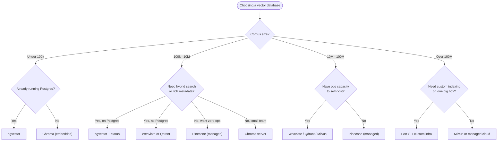

# Comparing Vector Databases - Chroma, FAISS, Pinecone, and pgvector

## Learning Objectives
- Distinguish the operational models behind Chroma, FAISS, Pinecone, pgvector, and Weaviate — embedded library, managed service, and relational-database extension.
- Explain how approximate-nearest-neighbor (ANN) indexes such as HNSW and IVF trade accuracy for speed, and why that trade-off matters for RAG.
- Apply a clear set of criteria — data volume, operational burden, latency, and cost — to choose the right vector database for a given RAG project.

## Body

### Why a vector database, and why a separate category?

In the previous lecture you turned text into embeddings — high-dimensional vectors where semantically similar passages sit close together in space. That representation only becomes useful if you can do two things efficiently at scale: **store** millions of these vectors alongside their source text and metadata, and **search** them by similarity in tens of milliseconds. A traditional relational database can technically hold the numbers in an array column, but `SELECT ... WHERE color = 'orange'` cannot ask "find the documents whose meaning is closest to this query." That mismatch between how computers store data and how humans want to query it is often called the **semantic gap**, and closing it is the entire reason vector databases exist as a category.

A vector database is, at its core, three things glued together:

1. A **storage layer** for vectors plus payload (the original chunk text, document IDs, page numbers, tags, timestamps).
2. An **index** built over those vectors so similarity search does not have to scan every row.
3. A **query API** that takes a query vector (and often metadata filters) and returns the top-k nearest neighbours with their distances.

The reason this matters for RAG is that the retriever stage of your pipeline lives or dies on this component. If retrieval is slow, your whole chatbot is slow. If retrieval is inaccurate, the LLM gets the wrong context and either hallucinates or politely refuses to answer. Choosing the wrong vector store also has a long tail of operational costs — re-indexing, snapshots, scaling, monitoring — that you will pay for every week the system is in production.

> The vector database is the part of RAG you will spend the most time operating. Pick something you are comfortable running for a year, not just for a weekend prototype.

### The three operational models you actually have to choose between

There are dozens of vector databases on the market, and the marketing pages all sound similar. The first useful filter is not features but **how the thing runs in your environment**. Almost every option falls into one of three operational shapes.

**1. Embedded library — runs inside your application process.** The vector store is a Python package (or a binary linked into your app). There is no separate server, no network hop, no infrastructure to provision. Chroma in its default mode and FAISS are the two canonical examples. You import a library, hand it some vectors, and it stores them in memory and on local disk. This model is ideal for prototypes, single-process apps, notebooks, and small-to-medium corpora that fit on one machine. It is terrible for anything that needs multiple readers, horizontal scaling, or high availability — when your process dies, the index dies with it (or has to reload from disk on restart).

**2. Standalone server — runs as its own service, like Postgres or Redis.** You deploy a dedicated process (often in a container) and your app talks to it over the network. Weaviate, Qdrant, Milvus, and Chroma in server mode all fit here. You get a real database with users, persistence, backup hooks, often clustering, and an HTTP/gRPC API. You also inherit a real operational burden: somebody has to update the binary, monitor memory pressure, tune the index, and recover from disk failures. This is the right model for production workloads where retrieval is a shared service used by multiple applications.

**3. Managed service — somebody else runs the server.** You sign up, get an API key, and pay per vector stored or per query. Pinecone is the archetype; recent managed offerings from Weaviate Cloud, Qdrant Cloud, and others belong here. You trade money for operational simplicity — no servers to patch, automatic scaling, SLA-backed uptime. The trade-off is cost (a non-trivial bill at scale) and lock-in (your data lives in someone else's cloud and the API is proprietary).

There is a fourth shape worth calling out separately because it changes the conversation: **the relational-database extension**. pgvector is a PostgreSQL extension that adds a `vector` column type and ANN indexing to a database your team almost certainly already runs. You are not adopting a new system; you are adding a feature to an existing one. The same logic applies to vector support in MongoDB Atlas, Elasticsearch, Redis, and SQLite (via `sqlite-vec`). For teams whose data already lives in one of these databases, this model is often the pragmatic winner — even if a dedicated vector DB would be marginally faster.

### A closer look at the five options in the title

**Chroma** is a developer-friendly vector database written in Python with a Rust core, designed first for the embedded use case. Its API is famously short — create a client, create a collection, call `collection.add(...)` with embeddings, metadata, and IDs, then `collection.query(...)` for retrieval. That collection metaphor maps neatly onto a table in a relational database. Chroma persists to a local directory by default, and a server mode is available when you outgrow single-process use. It is the natural starting point for LangChain and LlamaIndex tutorials because the friction is minimal. The weak point is that Chroma is still maturing operationally — clustering, multi-tenant isolation, and very large indexes are not its strongest suit yet.

**FAISS** (Facebook AI Similarity Search) is the elder statesman. It is not really a database — it is a C++/Python library for similarity search and clustering of dense vectors. There is no server, no persistence layer, no metadata filtering out of the box. What FAISS gives you is an extraordinarily rich menu of index types (flat, IVF, HNSW, PQ, OPQ, and many combinations) and the best raw performance in the field when you tune it properly. It is what you reach for when you need to index a hundred million vectors on a single GPU box and you are willing to build the rest of the database around it yourself. Many other vector databases — including older versions of Milvus — use FAISS under the hood.

**Pinecone** is the canonical managed vector database. You create an index in the Pinecone console, get an endpoint and an API key, and your application stays vector-DB-agnostic. Pinecone handles sharding, replication, scaling, and zero-downtime upgrades. It introduced the concept of "serverless" vector indexes that auto-scale storage and compute independently. The downside is that Pinecone is closed-source and priced per vector and per query unit; at large volumes that bill grows noticeably. You also cannot self-host it, which is a non-starter for organisations with strict data residency rules.

**pgvector** turns PostgreSQL into a competent vector database. It adds a `vector` data type, distance operators (`<->` for L2, `<=>` for cosine, `<#>` for inner product), and supports both IVF and HNSW indexes. The killer feature is that you can mix vector similarity with normal SQL in a single query — `WHERE customer_id = 42 AND created_at > '2025-01-01' ORDER BY embedding <=> $1 LIMIT 5`. For any team already running Postgres, this is hard to beat: you get transactions, joins, backups, replication, and access control for free. The limitation is throughput at the very top end — pgvector is excellent up to tens of millions of vectors, and gets squeezed by dedicated vector engines beyond that.

**Weaviate** is a standalone open-source vector database with a GraphQL-style API, built-in hybrid search (vector plus keyword), a module system for plugging in embedding models, and first-class multi-tenancy. It sits in the same "real database server" category as Qdrant and Milvus. Weaviate is a strong fit when you want to host your own production-grade vector store, you care about hybrid (keyword + vector) ranking, and you do not want to assemble the pieces yourself.

The table below gives you the short version. Read it as orientation, not gospel — every one of these projects ships features quickly.

| Database  | Operational model              | Index types          | Metadata filter | Hybrid search | Best fit                                                |
| --------- | ------------------------------ | -------------------- | --------------- | ------------- | ------------------------------------------------------- |
| Chroma    | Embedded library / server      | HNSW                 | Yes             | Limited       | Prototypes, single-app RAG, LangChain tutorials         |
| FAISS     | Library only                   | Flat, IVF, HNSW, PQ  | Manual          | No            | Large-scale offline search, custom systems              |
| Pinecone  | Managed cloud only             | Proprietary          | Yes             | Yes           | Teams that want zero ops and will pay for it            |
| pgvector  | Postgres extension             | IVFFlat, HNSW        | Yes (full SQL)  | With extras   | Teams already on Postgres, mixed relational + vector    |
| Weaviate  | Self-hosted server / cloud     | HNSW                 | Yes             | Yes (BM25)    | Production self-hosted, hybrid search, multi-tenant     |

### Why you cannot ignore the index: brute force, IVF, and HNSW

All vector databases face the same algorithmic problem. Given a query vector and N stored vectors, find the k nearest under some distance metric (usually cosine similarity or L2 distance). The naive approach — compute the distance between the query and every stored vector — is called **brute force** or **flat** search. It is exact, simple, and embarrassingly parallel. It also has O(N) time complexity, which means doubling your corpus doubles your latency. At a few thousand vectors this is fine. At a few million it is a problem. At a hundred million it is a disaster.

The fix is to give up exactness in exchange for speed. Algorithms in this category are called **approximate nearest neighbour (ANN)** methods. They do not guarantee they will return the absolute closest vectors, but they return vectors that are *almost certainly* among the closest, often in O(log N) time. For RAG, that trade is almost always worth it — your embedding model is fuzzy anyway, and the LLM does not care whether it got the 1st, 3rd, and 7th most similar chunks instead of the 1st, 2nd, and 3rd.

Two ANN families dominate vector databases today.

**IVF — Inverted File Index.** During build time, IVF runs k-means clustering on your vectors and divides space into `nlist` clusters, each with a centroid. At query time, you find the few clusters whose centroids are closest to the query vector (controlled by a parameter called `nprobe`), and you only search inside those clusters. If you have a million vectors split into a thousand clusters and you probe ten of them, you have just reduced the search from one million distance computations to roughly ten thousand. Tuning IVF is mostly about choosing `nlist` (how finely you partition the space) and `nprobe` (how many partitions you check at query time). More probes mean better recall and slower queries.

IVF is conceptually simple, memory-efficient, and works very well in FAISS and pgvector's `ivfflat` mode. Its weakness is that you need to "train" the index on a representative sample before you insert vectors, and the partition boundaries become stale if your data distribution changes a lot over time.

**HNSW — Hierarchical Navigable Small World.** HNSW builds a multi-layer graph where each vector is a node connected to a small number of its nearest neighbours. The bottom layer is dense and contains every vector; each higher layer is exponentially sparser and acts like an "express lane" through the graph. At query time you start at the top layer, greedily walk towards the query vector by following edges that reduce the distance, and drop down to the next layer once you are stuck on a local minimum. You repeat this at every layer until you arrive at the bottom and converge on the nearest neighbours.

The layered structure is easier to grasp visually — the diagram below shows how a query enters at the sparse top layer and is funnelled down into the dense bottom layer where the true neighbours live.

```mermaid HNSW multi-layer graph traversal from sparse top to dense bottom
flowchart TB
    Q["Query vector"]
    subgraph L2["Layer 2 (sparse - express lane)"]
        A2["node"]
        B2["node"]
    end
    subgraph L1["Layer 1 (medium density)"]
        A1["node"]
        B1["node"]
        C1["node"]
        D1["node"]
    end
    subgraph L0["Layer 0 (dense - contains every vector)"]
        A0["node"]
        B0["node"]
        C0["node"]
        D0["node"]
        E0["node"]
        F0["node"]
        G0["node"]
        H0["nearest neighbour"]
    end
    Q -->|"1. enter at top"| A2
    A2 -->|"2. greedy walk"| B2
    B2 -->|"3. drop down"| C1
    C1 -->|"4. greedy walk"| D1
    D1 -->|"5. drop down"| F0
    F0 -->|"6. converge"| H0
```

The result is roughly logarithmic search time and excellent recall, and HNSW does not need a separate training step — you can insert vectors incrementally. Its main downsides are higher memory consumption (the graph edges live in RAM) and slower build time than IVF. HNSW is the default index in Chroma, Weaviate, and modern pgvector versions, and is increasingly the default everywhere.

> Practical heuristic: if your corpus is small or you stream new vectors in continuously, prefer HNSW. If you are indexing a very large static dataset and memory is tight, IVF (often combined with product quantization, IVF-PQ) is the safer choice.

Both algorithms expose tuning knobs you should know about:

- **HNSW parameters.** `M` (number of neighbours per node, typically 8–48) controls graph density — higher M means more recall, more memory, slower build. `efConstruction` (typically 100–400) controls build-time search depth — higher means a better-quality graph. `efSearch` (typically 50–500) is the query-time knob — higher means slower queries but better recall.
- **IVF parameters.** `nlist` is roughly `sqrt(N)` as a starting point. `nprobe` is the recall-vs-latency dial; start at 10 and tune from there.

A pure flat (brute-force) index remains useful in two situations: tiny corpora where the algorithm overhead exceeds the savings, and offline batch jobs where you want exact recall as a ground truth to evaluate your ANN index against. Most production deployments build both — a flat index for a small evaluation set, and HNSW or IVF for the real search.

### Distance metrics matter, but less than you think

Every vector database supports at least three distance functions: **L2 (Euclidean)**, **inner product**, and **cosine similarity**. Cosine similarity is the most common choice for text embeddings because modern embedding models (OpenAI `text-embedding-3`, BGE, SBERT) are trained with a cosine objective and produce vectors whose magnitude does not carry meaningful information. If your embeddings are already L2-normalised, cosine similarity and inner product give the same ranking, so many systems use inner product internally for speed. The takeaway is: use whatever metric your embedding model's documentation recommends, and do not switch metrics between indexing time and query time.

### How to actually choose for your project

You have the operational models, the index algorithms, and the feature checklists. Now apply them. The questions below, in this order, will narrow your choice down quickly.

**1. How many vectors do you really have?** Be honest. Pulling a number out of the air is the most common mistake.
- Under 100k vectors: anything works. Reach for the lowest-friction option — Chroma if you are starting fresh, pgvector if you already run Postgres.
- 100k to 10 million vectors: most options still work, but operational details start to matter. Chroma, pgvector, Weaviate, Qdrant, and Pinecone all handle this range well.
- 10 million to 100 million vectors: you are now in the territory of dedicated engines. pgvector is feasible but you will pay for it in memory and CPU; Weaviate, Qdrant, Milvus, or Pinecone are stronger choices.
- Above 100 million vectors: think hard about FAISS with custom infrastructure, Milvus, or a managed offering. Sharding is now mandatory and you want a system designed for it.

**2. Who runs the database, and at what cost?** A team of two senior engineers can run a self-hosted Weaviate cluster; a team of two product engineers probably should not. Compute your annual cost honestly: a managed Pinecone bill of $500–$2000 per month is often cheaper than the half-FTE of operations a self-hosted cluster takes. The smaller your team, the more managed services are worth.

**3. What does your data look like besides vectors?** If every retrieval needs to filter by tenant, user, document type, or time window, you want a database with strong metadata filtering. pgvector is unbeatable here because you have full SQL. Pinecone, Weaviate, and Qdrant all support rich filtering. Pure FAISS does not — you would have to filter results after the ANN search, which is wasteful and sometimes wrong.

**4. Do you need hybrid search?** "Hybrid" means combining vector similarity with traditional keyword (BM25) search, then merging the rankings. Hybrid often outperforms pure vector search for queries that include proper nouns, code, error messages, or domain jargon. Weaviate, Pinecone, and Elasticsearch have first-class hybrid support; Chroma and FAISS do not.

**5. What does your update pattern look like?** If documents change constantly and you need vectors inserted and deleted live, prefer HNSW-based stores (Chroma, Weaviate, pgvector-HNSW, Pinecone). If your corpus is mostly static and rebuilt on a schedule, IVF-based stores save memory.

**6. What are your latency and recall targets?** For a chatbot, p99 retrieval latency below 100 ms with recall@10 above 0.9 is a reasonable bar. Measure these on your actual data before committing. Every vendor will quote impressive benchmarks; only your benchmark on your embeddings counts.

For most readers of this course building a first RAG project, the answer is genuinely simple: **start with Chroma or pgvector**. Chroma if you want zero setup and you are following a LangChain tutorial verbatim; pgvector if you already operate Postgres and want one less system to learn. Migrate to a dedicated server (Weaviate, Qdrant) or a managed service (Pinecone) only once you have measured a real problem in your starting choice. Premature optimisation in your vector layer wastes weeks you could have spent improving chunking and prompting — which, in practice, matter more.

The decision tree below condenses those six questions into a fast path to a sensible default — follow it top to bottom, taking the first branch that fits your situation.



## Key Takeaways
- Vector databases differ first by **operational model** — embedded library (Chroma, FAISS), standalone server (Weaviate, Qdrant, Milvus), managed cloud (Pinecone), and relational extension (pgvector). Pick the model your team can run before you compare features.
- Brute-force search is O(N) and only viable for small corpora. **ANN indexes** trade a small amount of recall for huge speedups; **HNSW** (graph-based, log-time, easy to update) and **IVF** (cluster-based, memory-efficient, needs training) are the two algorithms you must know.
- **HNSW is becoming the default** across Chroma, Weaviate, and modern pgvector. Tune `M`, `efConstruction`, and `efSearch` (or `nlist`/`nprobe` for IVF) against your own data, not against vendor benchmarks.
- **pgvector is the pragmatic winner for teams already on Postgres**, especially when retrieval must combine vector similarity with rich SQL filtering.
- For most first RAG projects, **start with Chroma or pgvector**, prove the system works end-to-end, and migrate to Weaviate/Qdrant/Pinecone only when you have measured a real bottleneck. Choosing a vector database is a multi-year operational commitment, not just a feature comparison.
