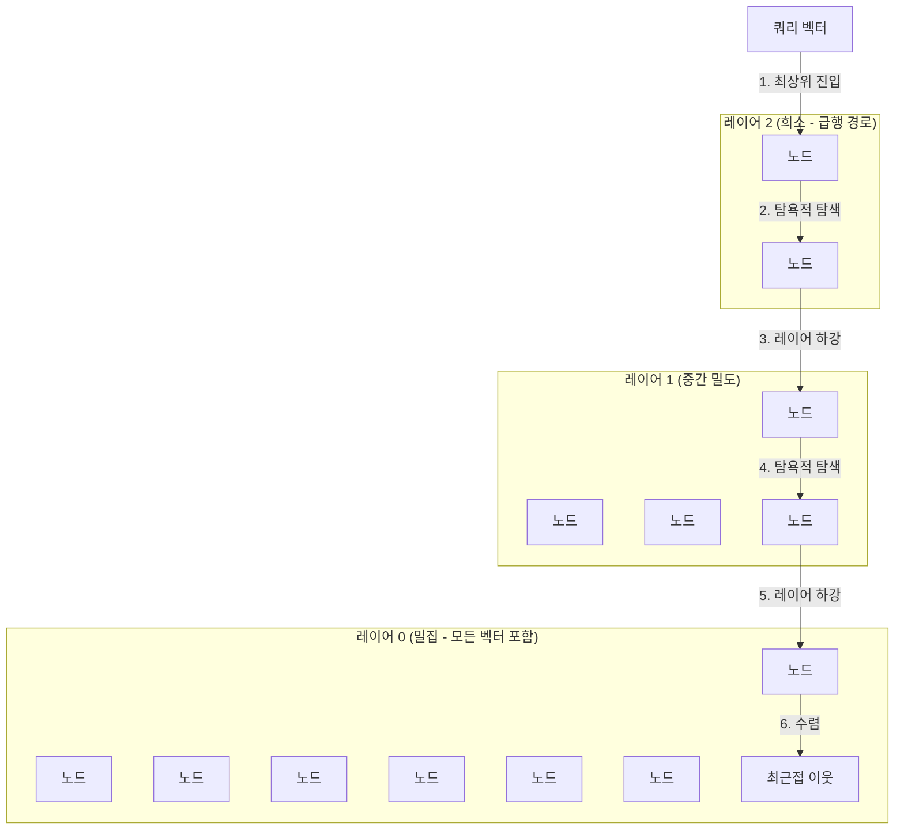
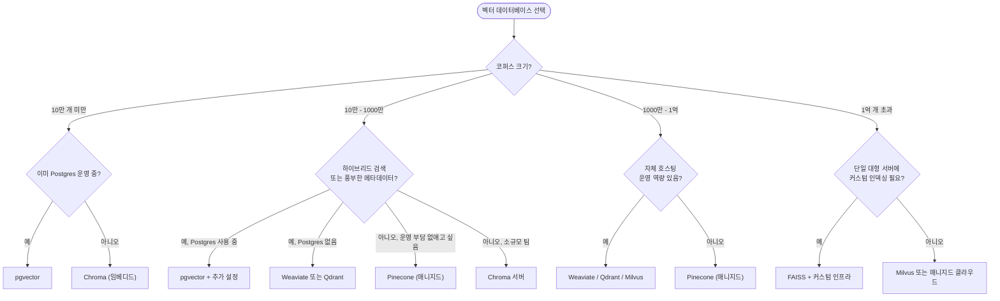

# 벡터 데이터베이스 비교와 선택 — Chroma, FAISS, Pinecone, pgvector

## 학습 목표
- Chroma, FAISS, Pinecone, pgvector, Weaviate의 운영 모델 — 임베디드 라이브러리, 매니지드 서비스, 관계형 데이터베이스 확장 — 을 구분할 수 있다.
- HNSW, IVF 같은 ANN(근사 최근접 이웃) 인덱스가 정확도와 속도를 어떻게 교환하는지, 그리고 그 교환이 RAG에서 왜 중요한지 설명할 수 있다.
- 데이터 규모, 운영 부담, 지연 시간, 비용이라는 명확한 기준을 적용해 주어진 RAG 프로젝트에 적합한 벡터 데이터베이스를 선택할 수 있다.

## 본문

### 벡터 데이터베이스가 필요한 이유

앞 강의에서 텍스트를 임베딩 — 의미가 비슷한 문장이 공간상 가까이 모이는 고차원 벡터 — 으로 변환했다. 이 표현이 실제로 쓸모 있으려면 두 가지를 대규모로 효율적으로 처리해야 한다. 수백만 개의 벡터를 원본 텍스트·메타데이터와 함께 **저장**하고, 수십 밀리초 안에 유사도 기준으로 **검색**하는 것이다. 관계형 데이터베이스도 기술적으로는 배열 컬럼에 숫자를 담을 수 있지만, `SELECT ... WHERE color = 'orange'` 같은 쿼리로는 "이 질의와 의미가 가장 가까운 문서를 찾아달라"는 요청에 답할 수 없다. 컴퓨터가 데이터를 저장하는 방식과 사람이 쿼리를 원하는 방식 사이의 이 간극을 흔히 **시맨틱 갭(semantic gap)**이라 부른다. 벡터 데이터베이스라는 범주가 존재하는 이유가 바로 이 갭을 메우기 위해서다.

벡터 데이터베이스는 핵심적으로 세 가지 요소로 구성된다.

1. 벡터와 페이로드(원본 청크 텍스트, 문서 ID, 페이지 번호, 태그, 타임스탬프)를 담는 **저장 레이어**
2. 유사도 검색 시 전체 행을 스캔하지 않아도 되도록 벡터 위에 쌓은 **인덱스**
3. 쿼리 벡터(와 메타데이터 필터)를 받아 가장 가까운 이웃 k개와 거리를 반환하는 **쿼리 API**

RAG 파이프라인에서 리트리버 단계의 성패가 이 컴포넌트에 달려 있다. 검색이 느리면 챗봇 전체가 느려지고, 검색 결과가 부정확하면 LLM이 엉뚱한 컨텍스트를 받아 환각을 일으키거나 응답을 거부한다. 잘못된 벡터 스토어를 선택하면 재인덱싱, 스냅숏, 스케일링, 모니터링 등 시스템이 운영되는 매주마다 그 비용을 치르게 된다.

> 벡터 데이터베이스는 RAG에서 가장 오래 운영해야 하는 부분이다. 주말 프로토타입이 아니라 1년 내내 편하게 돌릴 수 있는 것을 골라라.

### 실제로 선택해야 하는 세 가지 운영 모델

시장에는 수십 가지 벡터 데이터베이스가 있고 마케팅 페이지는 하나같이 비슷해 보인다. 기능 비교보다 더 유용한 첫 번째 필터는 **내 환경에서 어떻게 동작하느냐**다. 거의 모든 선택지는 세 가지 운영 형태 중 하나에 속한다.

**1. 임베디드 라이브러리 — 애플리케이션 프로세스 안에서 실행.** 벡터 스토어가 Python 패키지(또는 앱에 링크된 바이너리)다. 별도 서버도, 네트워크 홉도, 인프라 프로비저닝도 없다. 기본 모드의 Chroma와 FAISS가 대표 사례다. 라이브러리를 임포트해 벡터를 넘기면 메모리와 로컬 디스크에 저장된다. 프로토타입, 단일 프로세스 앱, 노트북, 한 대 머신에 들어가는 중소 규모 데이터에 이상적이다. 반면 다중 리더, 수평 스케일링, 고가용성이 필요한 환경에는 적합하지 않다. 프로세스가 종료되면 인덱스도 함께 사라지거나 재시작 시 디스크에서 다시 로드해야 한다.

**2. 독립 서버 — Postgres나 Redis처럼 독자 서비스로 실행.** 전용 프로세스(주로 컨테이너)를 배포하고 앱이 네트워크를 통해 통신한다. 서버 모드의 Weaviate, Qdrant, Milvus, Chroma가 여기 해당한다. 사용자 관리, 퍼시스턴스, 백업 훅, 클러스터링, HTTP/gRPC API를 갖춘 진짜 데이터베이스를 얻는 대신, 바이너리 업데이트, 메모리 압력 모니터링, 인덱스 튜닝, 디스크 장애 복구를 담당할 누군가가 필요하다. 여러 애플리케이션이 공유하는 검색 서비스가 필요한 프로덕션 워크로드에 적합한 모델이다.

**3. 매니지드 서비스 — 서버 운영을 외부에 맡긴다.** 가입 후 API 키를 받아 사용하고, 저장 벡터 수나 쿼리당 비용을 낸다. Pinecone이 전형적인 사례이며, Weaviate Cloud, Qdrant Cloud 등도 여기 속한다. 돈으로 운영 부담을 덜 수 있다. 서버 패치 없이 자동 스케일링과 SLA 보장 업타임을 제공한다. 대신 비용(대규모에서는 청구액이 상당해진다)과 락인(데이터가 외부 클라우드에 있고 API가 독점적이다)이 단점이다.

별도로 언급할 만한 네 번째 형태가 있다. **관계형 데이터베이스 확장**이다. pgvector는 PostgreSQL 확장으로, `vector` 컬럼 타입과 ANN 인덱싱을 팀이 이미 운영 중인 데이터베이스에 추가한다. 새 시스템을 도입하는 게 아니라 기존 시스템에 기능을 하나 추가하는 셈이다. MongoDB Atlas, Elasticsearch, Redis, SQLite(`sqlite-vec`)의 벡터 지원도 같은 맥락이다. 데이터가 이미 이런 데이터베이스에 있는 팀에게는 전용 벡터 DB가 다소 더 빠르더라도 이 모델이 현실적으로 가장 나은 선택인 경우가 많다.

### 다섯 가지 선택지 자세히 보기

**Chroma**는 Rust 코어 위에 Python으로 만든 개발자 친화적 벡터 데이터베이스로, 임베디드 사용 사례를 최우선으로 설계됐다. API가 간결하기로 유명하다. 클라이언트를 만들고, 컬렉션을 생성하고, `collection.add(...)`에 임베딩·메타데이터·ID를 전달하면 저장되고, `collection.query(...)`로 검색하면 된다. 이 컬렉션 개념은 관계형 데이터베이스의 테이블과 잘 대응된다. 기본적으로 로컬 디렉터리에 퍼시스트하며, 단일 프로세스로 부족해지면 서버 모드를 쓸 수 있다. 마찰이 적어 LangChain, LlamaIndex 튜토리얼의 기본 선택지가 된다. 약점은 운영 성숙도인데, 클러스터링, 멀티테넌트 격리, 매우 큰 인덱스 처리는 아직 강점이 아니다.

**FAISS**(Facebook AI Similarity Search)는 이 분야의 원로다. 데이터베이스라기보다는 밀집 벡터 유사도 검색·클러스터링을 위한 C++/Python 라이브러리다. 서버도, 퍼시스턴스 레이어도, 기본 제공 메타데이터 필터링도 없다. FAISS가 제공하는 것은 인덱스 유형의 풍부한 메뉴(flat, IVF, HNSW, PQ, OPQ와 그 조합)와, 제대로 튜닝했을 때 업계 최고 수준의 원시 성능이다. GPU 한 대에 벡터 1억 개를 인덱싱해야 하고 나머지 데이터베이스 기능은 직접 구축할 의향이 있을 때 꺼내드는 도구다. 초기 버전의 Milvus를 포함한 여러 벡터 데이터베이스가 FAISS를 내부 엔진으로 사용한다.

**Pinecone**은 매니지드 벡터 데이터베이스의 대표 주자다. Pinecone 콘솔에서 인덱스를 만들고 엔드포인트와 API 키를 받으면, 앱은 벡터 DB 구현에 무관하게 동작한다. 샤딩, 복제, 스케일링, 무중단 업그레이드를 Pinecone이 처리한다. 스토리지와 컴퓨팅을 독립적으로 자동 스케일링하는 "서버리스" 벡터 인덱스 개념도 도입했다. 단점은 소스가 공개되지 않고 벡터 수·쿼리 단위로 요금이 부과되어 대규모에서는 청구액이 커진다는 것이다. 자체 호스팅이 불가능하므로, 데이터 상주(data residency) 규정이 엄격한 조직에는 처음부터 선택지가 되지 않는다.

**pgvector**는 PostgreSQL을 쓸 만한 벡터 데이터베이스로 만들어준다. `vector` 데이터 타입, 거리 연산자(`<->` L2, `<=>` 코사인, `<#>` 내적), IVF·HNSW 인덱스를 추가한다. 핵심 장점은 벡터 유사도와 일반 SQL을 한 쿼리에 섞을 수 있다는 것이다. `WHERE customer_id = 42 AND created_at > '2025-01-01' ORDER BY embedding <=> $1 LIMIT 5`처럼 쓴다. 이미 Postgres를 운영하는 팀에게는 트랜잭션, 조인, 백업, 복제, 접근 제어를 추가 비용 없이 얻는 셈이라 무시하기 어렵다. 한계는 최고 부하에서의 처리량이다. 벡터 수천만 개까지는 우수하지만, 그 이상에서는 전용 벡터 엔진에 밀리기 시작한다.

**Weaviate**는 GraphQL 스타일 API, 내장 하이브리드 검색(벡터 + 키워드), 임베딩 모델을 플러그인하는 모듈 시스템, 퍼스트클래스 멀티테넌시를 갖춘 독립 오픈소스 벡터 데이터베이스다. Qdrant, Milvus와 함께 "진짜 데이터베이스 서버" 범주에 속한다. 자체 프로덕션 벡터 스토어를 직접 호스팅하고, 하이브리드(키워드 + 벡터) 랭킹이 필요하며, 조각들을 직접 조립하기 싫을 때 Weaviate는 좋은 선택이다.

아래 표는 요약 비교다. 이 프로젝트들은 모두 빠르게 기능을 추가하므로 방향 지침으로만 활용하길 바란다.

| 데이터베이스 | 운영 모델                        | 인덱스 유형              | 메타데이터 필터 | 하이브리드 검색 | 적합한 상황                                            |
| ------------ | -------------------------------- | ------------------------ | --------------- | --------------- | ------------------------------------------------------ |
| Chroma       | 임베디드 라이브러리 / 서버       | HNSW                     | 있음            | 제한적          | 프로토타입, 단일 앱 RAG, LangChain 튜토리얼            |
| FAISS        | 라이브러리만                     | Flat, IVF, HNSW, PQ      | 직접 구현       | 없음            | 대규모 오프라인 검색, 커스텀 시스템                    |
| Pinecone     | 매니지드 클라우드만              | 독점                     | 있음            | 있음            | 운영 부담 없이 비용을 낼 수 있는 팀                    |
| pgvector     | Postgres 확장                    | IVFFlat, HNSW            | 있음 (풀 SQL)   | 추가 설정 필요  | 이미 Postgres 운영 중, 관계형+벡터 혼합 필요           |
| Weaviate     | 자체 호스팅 서버 / 클라우드      | HNSW                     | 있음            | 있음 (BM25)     | 프로덕션 자체 호스팅, 하이브리드 검색, 멀티테넌트      |

### 인덱스를 무시할 수 없는 이유: 브루트 포스, IVF, HNSW

모든 벡터 데이터베이스는 같은 알고리즘 문제에 직면한다. 쿼리 벡터와 저장된 N개의 벡터가 있을 때, 어떤 거리 지표(주로 코사인 유사도 또는 L2 거리) 기준으로 가장 가까운 k개를 찾아야 한다. 가장 단순한 방법 — 쿼리와 모든 벡터 간 거리를 일일이 계산하는 것 — 을 **브루트 포스(brute force)** 또는 **플랫(flat)** 검색이라 부른다. 정확하고 단순하며 병렬화하기 쉽다. 하지만 O(N) 시간 복잡도를 가져서, 코퍼스가 두 배가 되면 지연 시간도 두 배가 된다. 벡터 수천 개에는 괜찮지만, 수백만 개에서는 문제가 되고, 1억 개에서는 재앙이다.

해결책은 정확도를 일부 포기하고 속도를 얻는 것이다. 이 범주의 알고리즘을 **ANN(Approximate Nearest Neighbour, 근사 최근접 이웃)** 방법이라 한다. 절대적으로 가장 가까운 벡터를 보장하지는 않지만, *거의 확실히* 가장 가까운 것들을 반환하며 대체로 O(log N) 시간에 동작한다. RAG에서 이 교환은 거의 항상 가치 있다. 임베딩 모델 자체가 확률적 근사치를 내고, LLM 입장에서도 2번째·3번째 대신 1번째·3번째·7번째 청크가 오더라도 결과에 크게 영향이 없기 때문이다.

오늘날 벡터 데이터베이스에서 두 ANN 계열이 지배적이다.

**IVF — Inverted File Index.** 인덱스 구축 시 k-means 클러스터링으로 벡터 공간을 `nlist`개의 클러스터로 분할하고 각각에 중심점(centroid)을 부여한다. 쿼리 시에는 쿼리 벡터와 가장 가까운 중심점을 가진 몇 개의 클러스터만(`nprobe` 파라미터로 제어) 탐색한다. 1000개 클러스터로 나뉜 벡터 100만 개에서 10개 클러스터만 탐색한다면, 계산 횟수가 100만 번에서 약 1만 번으로 줄어든다. IVF 튜닝의 핵심은 `nlist`(공간 분할 세분도)와 `nprobe`(쿼리 시 탐색할 파티션 수) 조정이다. `nprobe`가 클수록 재현율(recall)은 높아지고 쿼리는 느려진다.

IVF는 개념적으로 단순하고 메모리 효율적이며, FAISS와 pgvector의 `ivfflat` 모드에서 잘 동작한다. 약점은 벡터를 삽입하기 전에 대표 샘플로 인덱스를 "훈련"해야 하고, 데이터 분포가 크게 바뀌면 파티션 경계가 낡아진다는 것이다.

**HNSW — Hierarchical Navigable Small World.** HNSW는 각 벡터를 노드로 삼아 소수의 가장 가까운 이웃들과 연결하는 다층 그래프를 만든다. 최하위 레이어는 밀집하고 모든 벡터를 포함하며, 상위 레이어로 갈수록 지수적으로 희소해져 그래프를 빠르게 가로지르는 "급행 경로" 역할을 한다. 쿼리 시에는 최상위 레이어에서 시작해 거리를 줄이는 방향으로 엣지를 따라가다가 로컬 최솟값에서 막히면 다음 레이어로 내려간다. 이 과정을 반복하다가 최하위 레이어에 도달하면 최근접 이웃에 수렴한다.

이 다층 구조는 시각적으로 이해하기 쉽다. 아래 다이어그램은 쿼리가 희소한 최상위 레이어에 진입해 밀집한 최하위 레이어로 내려가는 과정을 보여준다.

결과는 대략 로그 시간 검색과 우수한 재현율이며, 별도 훈련 단계 없이 벡터를 점진적으로 삽입할 수 있다. 주요 단점은 그래프 엣지를 RAM에 유지해야 해 메모리 소비가 크고 IVF보다 구축 시간이 길다는 것이다. HNSW는 Chroma, Weaviate, 최신 pgvector의 기본 인덱스이며 점점 더 많은 곳에서 기본값이 되고 있다.

> 실용적인 기준: 코퍼스가 작거나 새 벡터를 지속적으로 삽입한다면 HNSW를 택하라. 매우 큰 정적 데이터셋을 인덱싱하고 메모리가 부족하다면 IVF(흔히 PQ와 결합한 IVF-PQ)가 더 안전한 선택이다.

두 알고리즘 모두 알아두어야 할 튜닝 파라미터를 제공한다.

- **HNSW 파라미터.** `M`(노드당 이웃 수, 보통 8–48)은 그래프 밀도를 제어한다. M이 클수록 재현율이 높아지지만 메모리가 늘고 구축이 느려진다. `efConstruction`(보통 100–400)은 구축 시 탐색 깊이를 제어하며, 높을수록 고품질 그래프를 만든다. `efSearch`(보통 50–500)는 쿼리 시 조절 파라미터로, 높을수록 쿼리가 느려지지만 재현율이 높아진다.
- **IVF 파라미터.** `nlist`는 시작점으로 `sqrt(N)` 정도가 적당하다. `nprobe`는 재현율-지연 시간 조절 다이얼이다. 10에서 시작해 튜닝하면 된다.

플랫(브루트 포스) 인덱스가 여전히 유용한 두 가지 상황이 있다. 알고리즘 오버헤드가 절약보다 큰 소규모 코퍼스, 그리고 ANN 인덱스를 평가할 정확한 기준값(ground truth)이 필요한 오프라인 배치 작업이다. 프로덕션 배포 대부분은 두 인덱스를 모두 구축한다. 소규모 평가 셋에는 플랫 인덱스를, 실제 검색에는 HNSW나 IVF를 쓴다.

### 거리 지표는 중요하지만 생각보다 덜하다

모든 벡터 데이터베이스는 세 가지 거리 함수를 지원한다: **L2(유클리드 거리)**, **내적(inner product)**, **코사인 유사도**. 텍스트 임베딩에는 코사인 유사도가 가장 많이 쓰인다. 현대 임베딩 모델(OpenAI `text-embedding-3`, BGE, SBERT)이 코사인 목적함수로 훈련되고, 벡터의 크기(magnitude)에 의미 있는 정보가 담기지 않기 때문이다. 임베딩이 이미 L2 정규화되어 있다면 코사인 유사도와 내적의 랭킹 결과가 같아서, 많은 시스템이 내부적으로 속도를 위해 내적을 쓴다. 핵심은 임베딩 모델 문서에서 권장하는 지표를 사용하고, 인덱싱 시점과 쿼리 시점에 서로 다른 지표를 쓰지 않는 것이다.

### 프로젝트에 맞는 선택을 하는 방법

운영 모델, 인덱스 알고리즘, 기능 체크리스트를 살펴봤다. 이제 적용할 차례다. 아래 질문들을 순서대로 따라가면 선택지가 빠르게 좁혀진다.

**1. 실제 벡터 수는 얼마인가?** 솔직하게 따져봐야 한다. 숫자를 막연히 추정하는 게 가장 흔한 실수다.
- 10만 개 미만: 어떤 선택지도 무방하다. 마찰이 가장 적은 걸 택하면 된다. 새로 시작한다면 Chroma, 이미 Postgres를 운영 중이라면 pgvector.
- 10만~1000만 개: 대부분 잘 동작하지만 운영 세부사항이 중요해지기 시작한다. Chroma, pgvector, Weaviate, Qdrant, Pinecone 모두 이 범위를 커버한다.
- 1000만~1억 개: 전용 엔진 영역이다. pgvector도 가능하지만 메모리·CPU 비용이 높아지고, Weaviate, Qdrant, Milvus, Pinecone이 더 강한 선택지다.
- 1억 개 초과: 커스텀 인프라와 함께 FAISS를, 또는 Milvus나 매니지드 서비스를 진지하게 고민해야 한다. 이 규모에서는 샤딩이 필수이므로 처음부터 그에 맞게 설계된 시스템이 필요하다.

**2. 누가 데이터베이스를 운영하며 비용은 얼마인가?** 시니어 엔지니어 둘이라면 자체 호스팅 Weaviate 클러스터를 운영할 수 있지만, 제품 개발자 둘이라면 무리다. 연간 비용을 솔직히 계산해봐야 한다. 월 $500~$2000의 Pinecone 요금이 자체 호스팅 클러스터에 드는 0.5 FTE 운영 비용보다 저렴한 경우가 많다. 팀이 작을수록 매니지드 서비스의 가치가 커진다.

**3. 벡터 외에 데이터가 어떻게 생겼는가?** 모든 검색에 테넌트, 사용자, 문서 유형, 시간 범위 필터가 필요하다면 메타데이터 필터링이 강한 데이터베이스가 필요하다. pgvector는 풀 SQL을 쓸 수 있어 이 부분에서 독보적이다. Pinecone, Weaviate, Qdrant도 풍부한 필터링을 지원한다. 순수 FAISS는 그렇지 않다. ANN 검색 후 결과를 필터링해야 하는데, 이는 낭비적이고 부정확할 수 있다.

**4. 하이브리드 검색이 필요한가?** "하이브리드"란 벡터 유사도와 전통적인 키워드(BM25) 검색을 결합해 랭킹을 합치는 것이다. 고유명사, 코드, 에러 메시지, 도메인 전문 용어가 포함된 쿼리에서는 하이브리드가 순수 벡터 검색보다 자주 낫다. Weaviate, Pinecone, Elasticsearch는 하이브리드 검색을 퍼스트클래스로 지원한다. Chroma와 FAISS는 그렇지 않다.

**5. 업데이트 패턴은 어떤가?** 문서가 계속 바뀌어 벡터를 실시간으로 삽입·삭제해야 한다면 HNSW 기반 스토어(Chroma, Weaviate, pgvector-HNSW, Pinecone)가 맞다. 코퍼스가 대부분 정적이고 일정에 따라 재구축된다면 IVF 기반 스토어가 메모리를 절약한다.

**6. 지연 시간과 재현율 목표는?** 챗봇 기준으로 p99 검색 지연 시간 100ms 미만, recall@10 0.9 이상이 합리적인 기준이다. 선택을 확정하기 전에 실제 데이터로 직접 측정해야 한다. 모든 벤더가 인상적인 벤치마크를 제시하지만, 본인 임베딩으로 측정한 결과만이 의미 있다.

이 강좌를 듣는 독자 대부분이 첫 RAG 프로젝트를 만들고 있다면, 답은 실제로 단순하다. **Chroma나 pgvector로 시작하라.** LangChain 튜토리얼을 그대로 따라가고 있다면 Chroma, 이미 Postgres를 운영 중이고 새 시스템을 하나 더 배우기 싫다면 pgvector를 쓰면 된다. 시작점에서 실제 문제를 측정한 뒤에야 전용 서버(Weaviate, Qdrant)나 매니지드 서비스(Pinecone)로 마이그레이션을 고려하라. 벡터 레이어에서 섣불리 최적화하면 청킹과 프롬프팅을 개선하는 데 써야 할 시간이 낭비된다. 실전에서는 청킹과 프롬프팅이 더 많은 영향을 미친다.

아래 의사결정 트리는 앞선 여섯 가지 질문을 빠른 경로로 압축한다. 위에서 아래로 내려가며 자신의 상황에 맞는 첫 번째 분기를 택하면 된다.

## 핵심 정리
- 벡터 데이터베이스는 **운영 모델**에 따라 가장 먼저 구분된다. 임베디드 라이브러리(Chroma, FAISS), 독립 서버(Weaviate, Qdrant, Milvus), 매니지드 클라우드(Pinecone), 관계형 확장(pgvector). 기능 비교 전에 팀이 운영할 수 있는 모델부터 골라야 한다.
- 브루트 포스 검색은 O(N)이라 소규모 코퍼스에서만 현실적이다. **ANN 인덱스**는 재현율을 일부 포기하는 대신 큰 속도 향상을 얻는다. 반드시 알아야 할 두 알고리즘은 **HNSW**(그래프 기반, 로그 시간, 점진 업데이트 가능)와 **IVF**(클러스터 기반, 메모리 효율적, 훈련 필요)다.
- **HNSW는 Chroma, Weaviate, 최신 pgvector에서 기본값이 되어가고 있다.** `M`, `efConstruction`, `efSearch`(또는 IVF의 `nlist`/`nprobe`)는 벤더 벤치마크가 아닌 본인 데이터로 튜닝해야 한다.
- **이미 Postgres를 운영하는 팀에게는 pgvector가 현실적인 최선이다.** 특히 벡터 유사도와 풍부한 SQL 필터링을 함께 써야 할 때 그렇다.
- 첫 RAG 프로젝트 대부분에서는 **Chroma나 pgvector로 시작하고**, 시스템이 처음부터 끝까지 동작함을 확인한 뒤, 실제 병목을 측정하고 나서야 Weaviate/Qdrant/Pinecone으로 마이그레이션을 고민하라. 벡터 데이터베이스 선택은 기능 비교 한 번으로 끝나는 게 아니라 수년간의 운영 약속이다.
