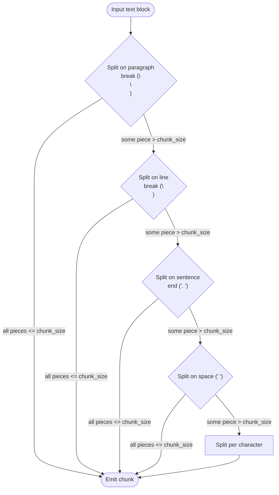

# Document Loading and Chunking Strategies: chunk_size, overlap, and Metadata

## Learning Objectives
- Load PDFs, HTML pages, and Markdown files into a unified `Document` representation using LangChain loaders.
- Compare Fixed, Sentence, Recursive, and Semantic chunking, and tune `chunk_size` and `chunk_overlap` for your data.
- Preserve source, page, and section metadata alongside each chunk to improve retrieval quality and citation accuracy.

## Body

### Why chunking is the make-or-break step

In a RAG pipeline the retriever does not search "documents" — it searches **chunks**. The chunk is the unit that gets embedded, stored in the vector database, and pulled back into the prompt at query time. That means the way you split your text silently decides the ceiling of everything downstream: relevance, factual accuracy, hallucination rate, and even how trustworthy your citations look.

Two failure modes show this most clearly. If chunks are **too small**, a single idea gets sliced across pieces and the retriever returns sub-sentences that the LLM cannot reason over — a definition ends up separated from the example that explains it. If chunks are **too large**, several unrelated topics get fused into one block, the embedding becomes a blurry average of all of them, and the LLM has to wade through irrelevant context to answer a narrow question. High-quality chunks produce high-quality answers; the inverse is just as reliable.

> The chunking layer is not glue code — it is a retrieval design decision. Treat `chunk_size`, `chunk_overlap`, and the separator list as tunable hyperparameters of your RAG system, not as defaults to leave alone.

### Step 1: Loading documents into a uniform shape

LangChain solves the "every file format is different" problem by giving every loader the same output: a list of `Document` objects, where each document carries `page_content` (the text) and `metadata` (a dict). Once your raw files are in that shape, the rest of the pipeline does not care whether they came from a PDF, an HTML page, or a Markdown file.

Here is the basic pattern for the three formats you will hit most often.

```python
# Load a folder full of PDFs (one Document per page, with page metadata).
from langchain_community.document_loaders import PyPDFDirectoryLoader

pdf_loader = PyPDFDirectoryLoader("data/manuals/")
pdf_docs = pdf_loader.load()

print(len(pdf_docs), "pages loaded")
print(pdf_docs[0].metadata)
# -> {'source': 'data/manuals/monopoly.pdf', 'page': 0}
print(pdf_docs[0].page_content[:200])
```

`PyPDFDirectoryLoader` walks a directory and emits one `Document` per page, with the file path and page number already filled in — those two fields will become your citation key later.

For web pages, the equivalent loaders strip boilerplate (nav bars, footers) before handing back text.

```python
# Load one or more web pages as plain text.
from langchain_community.document_loaders import WebBaseLoader

web_loader = WebBaseLoader([
    "https://example.com/docs/getting-started",
    "https://example.com/docs/api",
])
web_docs = web_loader.load()

for d in web_docs:
    print(d.metadata.get("source"), "->", len(d.page_content), "chars")
```

For Markdown, keep the two roles cleanly separated. **Loading** is what `UnstructuredMarkdownLoader` does: it reads the file from disk and returns it as a `Document`. **Splitting** is what `MarkdownHeaderTextSplitter` does: it takes already-loaded Markdown text and slices it on `#`, `##`, `###` headers, attaching the heading hierarchy as metadata. The splitter is not a loader — it never touches the filesystem — but its structural awareness is exactly what you want for technical docs, so it typically runs **after** the loader.

```python
# Load first, then split by header — two different responsibilities.
from langchain_community.document_loaders import UnstructuredMarkdownLoader
from langchain_text_splitters import MarkdownHeaderTextSplitter

# 1) Load the file -> one Document with page_content + metadata.
md_docs = UnstructuredMarkdownLoader("docs/architecture.md").load()

# 2) Split that text on header levels and keep the heading path as metadata.
headers_to_split_on = [("#", "h1"), ("##", "h2"), ("###", "h3")]
md_splitter = MarkdownHeaderTextSplitter(headers_to_split_on=headers_to_split_on)
md_chunks = md_splitter.split_text(md_docs[0].page_content)

print(md_chunks[0].metadata)
# -> {'h1': 'Architecture', 'h2': 'Retrieval Layer'}
```

A practical note: loaders return wildly different document counts for the same logical content. A 30-page PDF gives you 30 documents (one per page), while a 30,000-character HTML page gives you one. Both still need a second pass — the chunker — to bring everything to a comparable, embedder-friendly size. The flow below makes the loader-vs-splitter split explicit: every file type goes through a **loader** first to land in the uniform `Document` stream, then the file type decides **which splitter** is applied next (Markdown takes the structure-aware path, everything else takes the generic recursive path), and both paths converge at the metadata-enrichment step that the vector store will later use for filtering and citation.

```mermaid Loading-to-chunking pipeline: loaders feed Documents into one splitter each, not both
flowchart LR
    PDF["PDF files"]
    HTML["Web pages"]
    MD["Markdown files"]

    PDFL["LOADER<br/>PyPDFDirectoryLoader"]
    HTMLL["LOADER<br/>WebBaseLoader"]
    MDL["LOADER<br/>UnstructuredMarkdownLoader"]

    DOC["Unified Document list<br/>page_content + metadata"]
    ROUTE{"File type?"}
    MDSPLIT["SPLITTER<br/>MarkdownHeaderTextSplitter<br/>(structure-aware)"]
    SPLIT["SPLITTER<br/>RecursiveCharacterTextSplitter<br/>(generic)"]
    ENRICH["Metadata enrichment<br/>source + page + chunk_id"]
    EMBED["Embedding step<br/>next lecture"]

    PDF --> PDFL
    HTML --> HTMLL
    MD --> MDL
    PDFL --> DOC
    HTMLL --> DOC
    MDL --> DOC
    DOC --> ROUTE
    ROUTE -- "Markdown" --> MDSPLIT
    ROUTE -- "PDF / HTML / plain text" --> SPLIT
    MDSPLIT --> ENRICH
    SPLIT --> ENRICH
    ENRICH --> EMBED
```

### Step 2: The five levels of chunking

Once you have documents, you have to slice them. There is a natural progression from naive to sophisticated, and each level fixes a specific defect of the previous one.

#### Level 1 — Fixed-size (character) chunking

The simplest strategy: define a single separator, cut on it, and pack the pieces back together up to a length budget. LangChain calls this `CharacterTextSplitter`. It is fast, predictable, and almost always the wrong choice for prose — but understanding exactly what it does (and does **not** do) is the foundation for everything that follows.

The key thing to internalize: `CharacterTextSplitter` is **not** a character-by-character sliding window. It splits the input on **one** `separator` (default `"\n\n"`, i.e. blank lines between paragraphs) and then **merges** those pieces back together so that each merged group stays under `chunk_size`. Two consequences fall out of that:

- If the separator does not appear in the input at all, the split produces a single piece and you get **one chunk back regardless of `chunk_size`**.
- If your input is shorter than `chunk_size`, you also get one chunk back — there is nothing to merge.

A worked example with the default separator makes both the merge behavior and the size limit concrete. The text below has three paragraphs of 42, 45, and 155 characters; with `chunk_size=200` the splitter packs whatever fits and stops when adding the next piece would overflow.

```python
from langchain_text_splitters import CharacterTextSplitter

text = (
    "Paragraph one is short and self-contained.\n\n"               # 42 chars
    "Paragraph two adds one more fact for context.\n\n"            # 45 chars
    "Paragraph three is noticeably longer because it walks "       # part of P3
    "through an example end to end, mentions a caveat about "
    "edge cases, and finishes with a short summary."               # P3 = 155 chars total
)

splitter = CharacterTextSplitter(
    separator="\n\n",   # default — split on blank lines
    chunk_size=200,
    chunk_overlap=0,
)
chunks = splitter.split_text(text)
for i, c in enumerate(chunks):
    print(f"[{i}] ({len(c)} chars) {c[:60]}...")
# [0] (89 chars)  Paragraph one is short and self-contained.\n\nParagraph t...
# [1] (155 chars) Paragraph three is noticeably longer because it walks th...
```

Trace it carefully. The splitter first cuts on `"\n\n"` to get three pieces of length 42, 45, and 155. Then it greedily merges:

1. Start with P1 (42 chars). Try to add `"\n\n"` + P2: 42 + 2 + 45 = **89 ≤ 200**, so merge — chunk so far is 89 chars.
2. Try to add `"\n\n"` + P3: 89 + 2 + 155 = **246 > 200**, so refuse. Emit the current chunk (89 chars) and start a new one with P3.
3. P3 alone is 155 chars (≤ 200), so it fits as its own chunk.

You get **two chunks back**, not three — exactly because the merger respected the 200-character budget. If you drop `chunk_size` to 80, P1 + separator + P2 (89 chars) no longer fits, so the merger refuses to combine them and you get three chunks (one per paragraph) instead.

Now contrast that with `separator=""`. People reach for this expecting a fixed-width slicer, but in `CharacterTextSplitter` it just means "the split produced one giant piece" — there is no separator anywhere to cut on — so the input comes back as a single chunk even when it is much longer than `chunk_size`. If you actually want hard fixed-width slicing of a long string, use `RecursiveCharacterTextSplitter` (which falls back through a list of separators and will eventually split per character) or a token-based splitter like `TokenTextSplitter`.

The takeaway: `CharacterTextSplitter` is really a **single-separator merge tool**, not a length enforcer. It is fine for content where the chosen separator reliably appears and the resulting pieces are roughly the size you want; for anything else, prefer the recursive splitter described in Level 3.

#### Level 2 — Sentence / delimiter-based chunking

A small upgrade in the same family: pick a more meaningful separator. You can configure `CharacterTextSplitter` with `separator="."` or `"\n\n"` so the splits happen at sentence or paragraph boundaries. This stops mid-word breakage, but it introduces a new problem — a chunk may now end at a period even though the next paragraph continues the same idea, and (per Level 1) you still get nothing back if your separator does not appear in the input. The retriever can pull back the first paragraph and miss the explanation that follows.

#### Level 3 — Recursive character chunking (the default you should reach for first)

`RecursiveCharacterTextSplitter` is the workhorse. Instead of using one separator, it tries a **list** of separators in order: paragraph break, then line break, then sentence end, then space, then individual character. It packs as much text as it can into a chunk under `chunk_size`, falling back to a finer separator only when needed.

```python
from langchain_text_splitters import RecursiveCharacterTextSplitter

splitter = RecursiveCharacterTextSplitter(
    chunk_size=500,         # target chunk length in CHARACTERS, not tokens
    chunk_overlap=50,       # last 50 chars of chunk N are repeated at the start of chunk N+1
    separators=["\n\n", "\n", ". ", " ", ""],  # the default — tune for your data
    length_function=len,
)

with open("docs/architecture.md", "r", encoding="utf-8") as f:
    text = f.read()

chunks = splitter.split_text(text)
print(f"{len(chunks)} chunks, avg length = {sum(len(c) for c in chunks) // len(chunks)} chars")
```

A worked example makes the behavior concrete. Suppose your document has four paragraphs of roughly 200, 240, 600, and 300 characters, and you set `chunk_size=500, chunk_overlap=0`:

- Paragraph 1 (200) + paragraph 2 (240) = 440 chars, fits under 500 -> **chunk A**.
- Paragraph 3 alone is 600 chars, over the limit -> the splitter recurses into sentences and packs them up to 500 -> **chunks B and C**.
- Paragraph 4 (300) -> **chunk D**.

Result: four paragraphs become four chunks, and every chunk ends on a sentence or paragraph boundary. Drop `chunk_size` to 250 and the same text produces roughly twice as many chunks, with paragraph 3 alone forced to split into three or four pieces.

The fallback logic is easier to see as a flow: the splitter only descends to a finer separator when the current attempt still leaves a piece that exceeds `chunk_size`.



> The `chunk_size` argument is measured in **characters**, not tokens. A safe rule of thumb for English is about 4 characters per token, so `chunk_size=1000` is roughly 250 tokens. Plan around your embedding model's input limit (8,192 tokens for OpenAI `text-embedding-3`) with comfortable headroom.

#### Level 4 — Structure-aware splitters

For source code or marked-up text, you can do better than "look for `\n\n`". LangChain ships specialized splitters whose separator lists already understand the syntax of the language.

```python
from langchain_text_splitters import (
    RecursiveCharacterTextSplitter,
    Language,
)

# Python-aware: prefers splitting at "class ", "def ", "\n\n" before falling back to spaces.
py_splitter = RecursiveCharacterTextSplitter.from_language(
    language=Language.PYTHON,
    chunk_size=800,
    chunk_overlap=100,
)

# JavaScript, Markdown, HTML, and others are also supported.
js_splitter = RecursiveCharacterTextSplitter.from_language(
    language=Language.JS,
    chunk_size=800,
    chunk_overlap=100,
)
```

Use these whenever the document type is known. A code chunk that ends in the middle of a function body is much less useful than one that ends at a function boundary, and the structured splitter gives you that for free.

#### Level 5 — Semantic chunking

The strategies above split by **shape** (characters, separators, syntax). Semantic chunking splits by **meaning**: it embeds each sentence, measures the cosine distance between consecutive sentences, and starts a new chunk whenever the distance jumps above a threshold. The result is chunks that correspond to topic boundaries rather than arbitrary character counts.

```python
# pip install langchain-experimental
from langchain_experimental.text_splitter import SemanticChunker
from langchain_openai import OpenAIEmbeddings

semantic_splitter = SemanticChunker(
    embeddings=OpenAIEmbeddings(model="text-embedding-3-small"),
    breakpoint_threshold_type="percentile",   # also: "standard_deviation", "interquartile"
    breakpoint_threshold_amount=95,           # split at the 95th-percentile distance
)

with open("docs/long_article.md", "r", encoding="utf-8") as f:
    long_text = f.read()

semantic_docs = semantic_splitter.create_documents([long_text])
for i, d in enumerate(semantic_docs[:3]):
    print(f"--- chunk {i} ({len(d.page_content)} chars) ---")
    print(d.page_content[:120], "...")
```

Semantic chunking shines on long, free-form documents (articles, transcripts, contracts) where topic shifts do not align with paragraph breaks. The trade-off is cost and latency: you pay for embeddings during ingestion, and the chunker is slower than the recursive splitter by orders of magnitude. A sensible pattern is to use the recursive splitter by default and switch to semantic chunking only for the corpora where retrieval quality is unacceptable.

### Step 3: Tuning `chunk_size` and `chunk_overlap`

There is no universally best value. The right setting depends on the granularity of the questions you expect, the density of your text, and the context window of your LLM. A useful starting matrix:

| Content type | Typical `chunk_size` | Typical `chunk_overlap` | Why |
|---|---|---|---|
| Technical docs, API references | 500-1000 chars | 50-100 | Concise definitions; small chunks keep answers precise. |
| Long-form articles, books | 1000-1500 chars | 150-200 | Ideas span multiple paragraphs; overlap preserves context. |
| Source code | 800-1200 chars | 100 | Function-sized units; overlap keeps imports/signatures visible. |
| Conversational transcripts | 500-800 chars | 100-150 | Speakers change topic often; smaller chunks avoid topic mixing. |
| Tables / structured data | 1500-2000 chars | 0 | Row groups are atomic; overlap creates duplicate rows. |

Two failure patterns to watch for:

1. **Too small.** If the retriever returns the top 4 chunks and they are 50 characters each, the LLM has 200 characters of context — not enough to answer anything beyond a single fact. Symptom: the model says "I don't know" even when the answer is in your corpus.
2. **Too large.** If each chunk packs three unrelated topics, the embedding is an average of all of them and the retriever can no longer distinguish queries. Symptom: the same chunks come back for very different questions.

`chunk_overlap` exists to soften the boundary problem. When a sentence at the end of chunk N introduces a concept that chunk N+1 elaborates on, the overlap ensures both chunks contain the bridging sentence — the retriever will surface whichever one the query lands closest to. A reasonable default is **10-20% of `chunk_size`**. More overlap means more redundancy in the index (slower, more expensive) but better recall on cross-boundary questions; zero overlap is fine for atomic, self-contained chunks like table rows.

> Tune empirically. Build a small evaluation set of 20-30 realistic questions with known correct answers, sweep `chunk_size` over {300, 500, 800, 1200} and `chunk_overlap` over {0, 10%, 20%}, and measure retrieval precision. The right values are the ones that win on **your** data, not the ones in a blog post.

### Step 4: Preserving metadata for retrieval and citation

A chunk without metadata is anonymous. The retriever can find it, but neither the LLM nor your user can tell where it came from. Two concrete benefits come from carrying metadata through the pipeline:

- **Filtered retrieval.** "Only search the 2024 product manual" becomes a metadata filter (`source` or `year` equals X) applied before similarity search, drastically reducing noise.
- **Citations.** The final answer can footnote "see *Monopoly rules*, p. 7" by reading `metadata["source"]` and `metadata["page"]` from the retrieved chunk.

The good news is that LangChain loaders already attach the obvious fields (`source`, `page`). The job of the chunking step is to **preserve** that metadata when one document becomes many chunks, and to **enrich** it where useful.

```python
from langchain_community.document_loaders import PyPDFDirectoryLoader
from langchain_text_splitters import RecursiveCharacterTextSplitter

# 1. Load — each Document already has source + page metadata.
docs = PyPDFDirectoryLoader("data/manuals/").load()

# 2. Split — split_documents() carries metadata into every child chunk.
splitter = RecursiveCharacterTextSplitter(chunk_size=800, chunk_overlap=100)
chunks = splitter.split_documents(docs)

# 3. Enrich — give each chunk a stable, human-readable ID for de-duplication.
#    Counter resets at every new (source, page) pair so the ID stays readable.
last_page_id: str | None = None
chunk_index: int = 0
for chunk in chunks:
    source = chunk.metadata.get("source", "unknown")
    page = chunk.metadata.get("page", 0)
    page_id = f"{source}:{page}"

    if page_id == last_page_id:
        chunk_index += 1          # same page as previous chunk -> advance
    else:
        chunk_index = 0           # new page (or very first chunk) -> reset
    last_page_id = page_id

    chunk.metadata["chunk_id"] = f"{page_id}:{chunk_index}"

print(chunks[0].metadata)
# -> {'source': 'data/manuals/monopoly.pdf', 'page': 0, 'chunk_id': 'data/manuals/monopoly.pdf:0:0'}
```

Two design choices worth highlighting:

- **`split_documents()` vs `split_text()`.** Always prefer `split_documents()` when you have `Document` objects. It propagates metadata to every output chunk automatically. `split_text()` discards metadata because it only takes a raw string.
- **Stable chunk IDs.** Composing the ID from `source + page + chunk_index` lets you do incremental indexing — when a new version of `monopoly.pdf` arrives, you can compute IDs for the new chunks and ask the vector store "which of these IDs do you not already have?" instead of rebuilding from scratch.

For domain-specific filtering, add your own fields before indexing — for example, `chunk.metadata["product"] = "billing"` or `chunk.metadata["lang"] = "en"`. These then become first-class filters at query time:

```python
# Restrict retrieval to a specific document subset using metadata filters.
results = vectorstore.similarity_search(
    query="How do refunds work for annual plans?",
    k=4,
    filter={"product": "billing"},
)
```

### Putting it together: a minimal end-to-end loading and chunking script

The following script ties the lecture together. It loads a folder of PDFs, splits them with the recursive splitter at sensible defaults, stamps each chunk with a stable ID, and prints a summary you can sanity-check before sending the chunks to embeddings.

```python
from langchain_community.document_loaders import PyPDFDirectoryLoader
from langchain_text_splitters import RecursiveCharacterTextSplitter


def load_and_chunk(folder: str, chunk_size: int = 800, chunk_overlap: int = 100):
    # 1) Load every PDF in the folder; metadata = source + page.
    docs = PyPDFDirectoryLoader(folder).load()

    # 2) Split with a recursive character splitter — the safe default.
    splitter = RecursiveCharacterTextSplitter(
        chunk_size=chunk_size,
        chunk_overlap=chunk_overlap,
        length_function=len,
    )
    chunks = splitter.split_documents(docs)

    # 3) Assign a stable chunk_id for incremental indexing.
    #    Initialize the per-page counter OUTSIDE the loop so it survives
    #    across iterations; reset it whenever the (source, page) changes.
    last_page_id: str | None = None
    chunk_index: int = 0
    for c in chunks:
        source = c.metadata.get("source", "unknown")
        page = c.metadata.get("page", 0)
        page_id = f"{source}:{page}"

        if page_id == last_page_id:
            chunk_index += 1      # still on the same page
        else:
            chunk_index = 0       # new page (or first chunk overall)
        last_page_id = page_id

        c.metadata["chunk_id"] = f"{page_id}:{chunk_index}"

    return chunks


if __name__ == "__main__":
    chunks = load_and_chunk("data/manuals/")
    print(f"{len(chunks)} chunks generated")
    print("first chunk metadata:", chunks[0].metadata)
    print("first chunk preview:")
    print(chunks[0].page_content[:300])
```

It is worth tracing the counter logic once by hand, because off-by-one mistakes here silently produce duplicate `chunk_id`s. Imagine the splitter returns three chunks for page 0 of `monopoly.pdf`, then two chunks for page 1:

1. **First chunk** (`monopoly.pdf`, page 0): `last_page_id` starts as `None`, so `page_id == last_page_id` is `False`. The `else` branch runs -> `chunk_index = 0`. ID -> `monopoly.pdf:0:0`.
2. **Second chunk** (same page 0): `page_id` now equals `last_page_id`, so the `if` branch runs -> `chunk_index = 1`. ID -> `monopoly.pdf:0:1`.
3. **Third chunk** (same page 0): same branch -> `chunk_index = 2`. ID -> `monopoly.pdf:0:2`.
4. **Fourth chunk** (page 1): `page_id` differs -> `else` branch -> `chunk_index = 0`. ID -> `monopoly.pdf:1:0`.
5. **Fifth chunk** (same page 1): `if` branch -> `chunk_index = 1`. ID -> `monopoly.pdf:1:1`.

Every chunk gets a unique, human-readable ID, and the counter resets cleanly at every page boundary. Run the script against any folder of PDFs and you will see the contract clearly: each chunk is a self-contained piece of text plus a metadata dictionary that tells the rest of the pipeline where it came from. That is the input shape the embedding step (next lecture) expects.

## Key Takeaways
- Chunking is not preprocessing — it is the upper bound on retrieval quality. Bad chunks make every downstream stage worse.
- Use LangChain loaders (`PyPDFDirectoryLoader`, `WebBaseLoader`, `UnstructuredMarkdownLoader`) so every source format becomes the same `Document` shape with `page_content` and `metadata`; remember that `MarkdownHeaderTextSplitter` is a splitter, not a loader.
- `CharacterTextSplitter` splits on a single separator and merges back up to `chunk_size` — it is not a fixed-width slicer. Reach for `RecursiveCharacterTextSplitter` first as a general-purpose default, and jump to `SemanticChunker` when topic boundaries matter more than length.
- `chunk_size` is measured in characters, not tokens. Tune it empirically with an evaluation set; defaults of 500-1000 characters with 10-20% overlap are reasonable starting points for prose.
- Always use `split_documents()` (not `split_text()`) so loader-supplied metadata flows into every chunk, and add a stable `chunk_id` to enable incremental indexing and precise citations.
