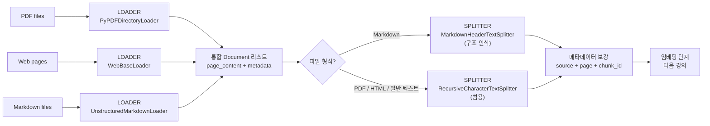
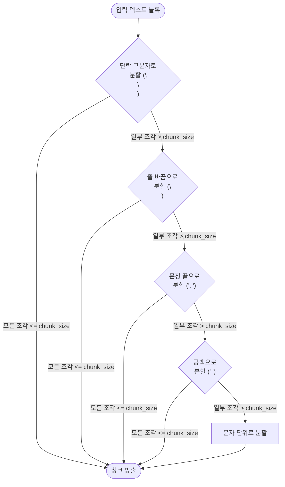

# 문서 로딩과 청킹 전략: chunk_size, overlap, 메타데이터

## 학습 목표
- LangChain 로더를 사용해 PDF, HTML 페이지, 마크다운 파일을 통일된 `Document` 형태로 불러온다.
- Fixed, Sentence, Recursive, Semantic 청킹을 비교하고, 데이터에 맞게 `chunk_size`와 `chunk_overlap`을 조정한다.
- 검색 품질과 인용 정확도를 높이기 위해 각 청크에 출처·페이지·섹션 메타데이터를 보존한다.

## 본문

### 청킹이 파이프라인의 핵심인 이유

RAG 파이프라인에서 검색기가 탐색하는 대상은 "문서" 전체가 아니라 **청크**다. 청크는 임베딩되고 벡터 데이터베이스에 저장된 뒤 쿼리 시점에 프롬프트로 가져오는 기본 단위다. 즉, 텍스트를 어떻게 분할하느냐가 이후 모든 단계의 상한선을 조용히 결정한다 — 관련성, 사실 정확도, 환각 발생률, 인용의 신뢰도까지.

두 가지 실패 유형이 이를 잘 보여준다. 청크가 **너무 작으면** 하나의 개념이 여러 조각으로 잘리고, 검색기는 LLM이 제대로 추론하기 어려운 반쪽짜리 문장을 돌려보낸다 — 정의가 그것을 설명하는 예시와 분리되는 식이다. 청크가 **너무 크면** 서로 관련 없는 여러 주제가 하나의 블록에 섞이고, 임베딩은 그 전체를 흐릿하게 평균한 값이 되어, LLM은 좁은 질문에 답하기 위해 불필요한 맥락을 헤쳐 나가야 한다. 품질 좋은 청크가 품질 좋은 답을 만든다는 명제의 역도 그만큼 확실하다.

> 청킹 레이어는 단순한 접착 코드가 아니라 검색 설계 결정이다. `chunk_size`, `chunk_overlap`, 구분자 목록은 RAG 시스템의 조정 가능한 하이퍼파라미터로 다뤄야 한다 — 기본값을 그대로 두는 설정값이 아니다.

### 1단계: 문서를 통일된 형태로 불러오기

LangChain은 모든 로더가 동일한 출력을 내도록 설계되어 있다. 각 로더는 `Document` 객체의 리스트를 반환하는데, 각 Document는 `page_content`(텍스트)와 `metadata`(딕셔너리)를 담는다. 원본 파일이 이 형태로 변환되면, 이후 파이프라인은 그것이 PDF였는지 HTML이었는지 마크다운이었는지 신경 쓰지 않는다.

가장 자주 접하는 세 가지 형식의 기본 패턴을 살펴보자.

```python
# PDF가 들어있는 폴더 전체를 불러온다 (페이지당 Document 하나, 페이지 메타데이터 포함).
from langchain_community.document_loaders import PyPDFDirectoryLoader

pdf_loader = PyPDFDirectoryLoader("data/manuals/")
pdf_docs = pdf_loader.load()

print(len(pdf_docs), "pages loaded")
print(pdf_docs[0].metadata)
# -> {'source': 'data/manuals/monopoly.pdf', 'page': 0}
print(pdf_docs[0].page_content[:200])
```

`PyPDFDirectoryLoader`는 디렉터리를 순회하며 페이지당 `Document` 하나를 생성하고, 파일 경로와 페이지 번호를 자동으로 채워 넣는다 — 이 두 필드가 나중에 인용 키가 된다.

웹 페이지의 경우 대응 로더들이 네비게이션 바, 푸터 같은 불필요한 부분을 제거한 뒤 텍스트를 돌려준다.

```python
# 웹 페이지를 하나 이상 일반 텍스트로 불러온다.
from langchain_community.document_loaders import WebBaseLoader

web_loader = WebBaseLoader([
    "https://example.com/docs/getting-started",
    "https://example.com/docs/api",
])
web_docs = web_loader.load()

for d in web_docs:
    print(d.metadata.get("source"), "->", len(d.page_content), "chars")
```

마크다운의 경우, 두 역할을 명확히 분리해야 한다. **로딩**은 `UnstructuredMarkdownLoader`의 역할이다 — 파일을 디스크에서 읽어 `Document`로 반환한다. **분할**은 `MarkdownHeaderTextSplitter`의 역할이다 — 이미 로드된 마크다운 텍스트를 `#`, `##`, `###` 헤더 기준으로 자르고, 헤딩 계층 구조를 메타데이터로 붙인다. 분할기는 로더가 아니다 — 파일 시스템에 직접 접근하지 않는다 — 하지만 구조를 인식하는 특성 덕분에 기술 문서에 매우 유용하므로, 보통 로더 다음에 실행한다.

```python
# 먼저 로드한 뒤 헤더 기준으로 분할한다 — 각각 별도의 역할이다.
from langchain_community.document_loaders import UnstructuredMarkdownLoader
from langchain_text_splitters import MarkdownHeaderTextSplitter

# 1) 파일 로드 -> page_content + metadata를 가진 Document 하나.
md_docs = UnstructuredMarkdownLoader("docs/architecture.md").load()

# 2) 헤더 레벨 기준으로 텍스트를 분할하고, 헤딩 경로를 메타데이터로 보존한다.
headers_to_split_on = [("#", "h1"), ("##", "h2"), ("###", "h3")]
md_splitter = MarkdownHeaderTextSplitter(headers_to_split_on=headers_to_split_on)
md_chunks = md_splitter.split_text(md_docs[0].page_content)

print(md_chunks[0].metadata)
# -> {'h1': 'Architecture', 'h2': 'Retrieval Layer'}
```

실용적인 주의사항 하나: 같은 논리적 내용이어도 로더에 따라 반환되는 Document 수가 크게 다를 수 있다. 30페이지짜리 PDF는 Document 30개를, 3만 자짜리 HTML 페이지는 Document 1개를 돌려준다. 어느 경우든 임베딩하기 적합한 크기로 맞추기 위한 두 번째 단계 — 청커 — 가 필요하다. 아래 흐름도는 로더와 분할기의 역할 분리를 명확히 보여준다. 모든 파일 형식은 먼저 **로더**를 거쳐 통일된 `Document` 스트림에 합류하고, 파일 형식에 따라 **어떤 분할기**를 적용할지 결정된다. 마크다운은 구조 인식 경로를, 나머지는 범용 재귀 경로를 거치며, 두 경로는 벡터 스토어가 나중에 필터링과 인용에 사용할 메타데이터 보강 단계에서 합류한다.



### 2단계: 청킹의 다섯 가지 수준

문서를 불러왔다면 이제 잘라야 한다. 단순한 방법부터 정교한 방법까지 자연스러운 발전 단계가 있으며, 각 수준은 이전 수준의 특정 결함을 해결한다.

#### 수준 1 — 고정 크기(문자) 청킹

가장 단순한 전략이다. 구분자 하나를 정하고, 그 위치에서 자른 뒤, 길이 예산 안에서 조각들을 다시 합친다. LangChain에서는 이를 `CharacterTextSplitter`라 부른다. 빠르고 예측 가능하지만 산문에는 거의 항상 좋지 않은 선택이다 — 그러나 이것이 정확히 무엇을 하는지(그리고 **하지 않는지**) 이해하는 것이 이후 모든 내용의 토대가 된다.

핵심적으로 파악해야 할 점은 `CharacterTextSplitter`가 **문자 단위 슬라이딩 윈도우가 아니라**는 것이다. 이 클래스는 입력을 **하나의** `separator`(기본값 `"\n\n"`, 즉 단락 사이의 빈 줄)로 분할한 뒤, 각 합산 그룹이 `chunk_size` 이하를 유지하도록 조각들을 **합쳐 나간다**. 여기서 두 가지 결과가 따라온다.

- 입력에 구분자가 전혀 없으면, 분할 결과가 조각 하나뿐이라 **`chunk_size`와 무관하게 청크 하나만 반환된다**.
- 입력이 `chunk_size`보다 짧아도 청크 하나만 반환된다 — 합칠 것이 없기 때문이다.

기본 구분자를 쓴 구체적인 예시를 통해 병합 동작과 크기 제한을 명확히 살펴보자. 아래 텍스트는 42자, 45자, 155자짜리 단락 세 개로 구성되어 있고, `chunk_size=200`으로 설정하면 분할기는 다음 조각을 추가했을 때 초과되기 직전까지 최대한 채운다.

```python
from langchain_text_splitters import CharacterTextSplitter

text = (
    "Paragraph one is short and self-contained.\n\n"               # 42자
    "Paragraph two adds one more fact for context.\n\n"            # 45자
    "Paragraph three is noticeably longer because it walks "       # P3 일부
    "through an example end to end, mentions a caveat about "
    "edge cases, and finishes with a short summary."               # P3 합계 = 155자
)

splitter = CharacterTextSplitter(
    separator="\n\n",   # 기본값 — 빈 줄 기준으로 분할
    chunk_size=200,
    chunk_overlap=0,
)
chunks = splitter.split_text(text)
for i, c in enumerate(chunks):
    print(f"[{i}] ({len(c)} chars) {c[:60]}...")
# [0] (89 chars)  Paragraph one is short and self-contained.\n\nParagraph t...
# [1] (155 chars) Paragraph three is noticeably longer because it walks th...
```

단계별로 추적해 보자. 분할기는 먼저 `"\n\n"`을 기준으로 42자, 45자, 155자 세 조각을 만든다. 그런 다음 탐욕적으로 병합한다.

1. P1(42자)에서 시작. `"\n\n"` + P2를 추가하면: 42 + 2 + 45 = **89 ≤ 200**, 병합 가능 — 현재까지 89자.
2. `"\n\n"` + P3를 추가하면: 89 + 2 + 155 = **246 > 200**, 거부. 현재 청크(89자)를 방출하고 P3로 새 청크를 시작한다.
3. P3 단독은 155자(≤ 200)이므로 그 자체로 청크가 된다.

결과는 세 개가 아닌 **두 개의 청크** — 정확히 병합 로직이 200자 예산을 지켰기 때문이다. `chunk_size`를 80으로 줄이면, P1 + 구분자 + P2(89자)가 더 이상 들어가지 않아 병합이 거부되고 세 청크(단락당 하나씩)가 나온다.

이제 `separator=""`와 비교해 보자. 이것을 설정하면 고정 폭 슬라이서처럼 동작할 것 같지만, `CharacterTextSplitter`에서는 "분할 기준이 어디에도 없어서 조각 하나만 나왔다"는 뜻이다 — 구분자가 없으므로 입력이 `chunk_size`보다 훨씬 길어도 단일 청크로 반환된다. 긴 문자열을 진짜 고정 폭으로 자르고 싶다면 `RecursiveCharacterTextSplitter`(구분자 목록을 순서대로 시도하다 결국 문자 단위까지 내려간다) 또는 `TokenTextSplitter` 같은 토큰 기반 분할기를 쓴다.

결론: `CharacterTextSplitter`는 **단일 구분자 병합 도구**이지 길이 강제 도구가 아니다. 선택한 구분자가 신뢰할 수 있게 등장하고 결과 조각의 크기가 원하는 범위에 들어온다면 충분히 쓸 만하다. 그 외의 경우에는 수준 3에서 설명하는 재귀 분할기가 더 적합하다.

#### 수준 2 — 문장/구분자 기반 청킹

같은 계열에서 한 단계 개선한 방식이다. 더 의미 있는 구분자를 고른다. `CharacterTextSplitter`에 `separator="."` 또는 `"\n\n"`을 설정하면 문장이나 단락 경계에서 분할이 일어난다. 단어 중간에서 잘리는 문제는 해결되지만 새로운 문제가 생긴다 — 청크가 마침표에서 끝나더라도 다음 단락이 같은 주제를 이어갈 수 있고, (수준 1에서 살펴봤듯) 구분자가 입력에 없으면 여전히 아무것도 반환되지 않는다. 검색기가 첫 번째 단락만 가져오고 그 뒤에 이어지는 설명을 놓칠 수 있다.

#### 수준 3 — 재귀 문자 청킹 (기본으로 가장 먼저 시도해야 할 방법)

`RecursiveCharacterTextSplitter`는 파이프라인의 핵심 도구다. 구분자 하나 대신 **목록**을 순서대로 시도한다. 단락 구분 → 줄 바꿈 → 문장 끝 → 공백 → 개별 문자 순으로 내려가며, `chunk_size` 이하를 유지하면서 최대한 채우고, 필요할 때만 더 세밀한 구분자로 넘어간다.

```python
from langchain_text_splitters import RecursiveCharacterTextSplitter

splitter = RecursiveCharacterTextSplitter(
    chunk_size=500,         # 청크 길이 목표값 — 토큰이 아닌 문자 수 기준
    chunk_overlap=50,       # 청크 N의 마지막 50자가 청크 N+1의 앞부분에 반복됨
    separators=["\n\n", "\n", ". ", " ", ""],  # 기본값 — 데이터에 맞게 조정
    length_function=len,
)

with open("docs/architecture.md", "r", encoding="utf-8") as f:
    text = f.read()

chunks = splitter.split_text(text)
print(f"{len(chunks)} chunks, avg length = {sum(len(c) for c in chunks) // len(chunks)} chars")
```

구체적인 예시로 동작을 살펴보자. 문서에 약 200자, 240자, 600자, 300자짜리 단락이 네 개 있고 `chunk_size=500, chunk_overlap=0`으로 설정했다고 가정한다.

- 단락 1(200자) + 단락 2(240자) = 440자, 500 이하 -> **청크 A**.
- 단락 3(600자)은 한계 초과 -> 분할기가 문장 단위로 재귀해 500자 이하로 채움 -> **청크 B와 C**.
- 단락 4(300자) -> **청크 D**.

결과: 네 단락이 네 청크가 되고, 모든 청크는 문장 또는 단락 경계에서 끝난다. `chunk_size`를 250으로 줄이면 같은 텍스트에서 대략 두 배의 청크가 나오고, 단락 3 혼자 세 개 또는 네 개의 조각으로 쪼개진다.

폴백 로직은 흐름으로 보면 더 쉽게 이해된다. 분할기는 현재 시도 결과에 `chunk_size`를 초과하는 조각이 남아 있을 때만 더 세밀한 구분자로 내려간다.



> `chunk_size` 인자는 **토큰이 아닌 문자 수** 기준이다. 영어는 대략 문자 4개가 토큰 1개에 해당하므로 `chunk_size=1000`은 약 250토큰이다. 임베딩 모델의 입력 한도(OpenAI `text-embedding-3`는 8,192토큰)를 여유 있게 고려해 설정한다.

#### 수준 4 — 구조 인식 분할기

소스 코드나 마크업 텍스트라면 `\n\n`을 찾는 것보다 더 잘할 수 있다. LangChain은 언어 문법을 이미 이해하는 구분자 목록을 가진 전용 분할기를 제공한다.

```python
from langchain_text_splitters import (
    RecursiveCharacterTextSplitter,
    Language,
)

# Python 인식: 공백으로 폴백하기 전 "class ", "def ", "\n\n" 기준 분할을 선호한다.
py_splitter = RecursiveCharacterTextSplitter.from_language(
    language=Language.PYTHON,
    chunk_size=800,
    chunk_overlap=100,
)

# JavaScript, Markdown, HTML 등도 지원된다.
js_splitter = RecursiveCharacterTextSplitter.from_language(
    language=Language.JS,
    chunk_size=800,
    chunk_overlap=100,
)
```

문서 형식을 알고 있다면 이 분할기를 쓴다. 함수 본문 중간에서 끝나는 코드 청크보다 함수 경계에서 끝나는 청크가 훨씬 유용하며, 구조 인식 분할기가 그것을 자동으로 보장한다.

#### 수준 5 — 시맨틱 청킹

앞선 전략들은 **형태**(문자, 구분자, 문법)로 분할한다. 시맨틱 청킹은 **의미**로 분할한다. 각 문장을 임베딩하고 연속된 문장들 사이의 코사인 거리를 측정한 뒤, 거리가 임계값을 넘으면 새 청크를 시작한다. 결과는 임의의 문자 수가 아닌 주제 경계에 대응하는 청크다.

```python
# pip install langchain-experimental
from langchain_experimental.text_splitter import SemanticChunker
from langchain_openai import OpenAIEmbeddings

semantic_splitter = SemanticChunker(
    embeddings=OpenAIEmbeddings(model="text-embedding-3-small"),
    breakpoint_threshold_type="percentile",   # "standard_deviation", "interquartile"도 가능
    breakpoint_threshold_amount=95,           # 95번째 백분위 거리에서 분할
)

with open("docs/long_article.md", "r", encoding="utf-8") as f:
    long_text = f.read()

semantic_docs = semantic_splitter.create_documents([long_text])
for i, d in enumerate(semantic_docs[:3]):
    print(f"--- chunk {i} ({len(d.page_content)} chars) ---")
    print(d.page_content[:120], "...")
```

시맨틱 청킹은 주제 전환이 단락 구분과 일치하지 않는 긴 자유 형식 문서(기사, 녹취록, 계약서)에서 빛을 발한다. 단점은 비용과 지연 시간이다. 수집 시 임베딩 비용이 발생하고, 재귀 분할기보다 수 배 느리다. 합리적인 접근법은 기본적으로 재귀 분할기를 쓰고, 검색 품질이 만족스럽지 않은 코퍼스에 한해 시맨틱 청킹으로 전환하는 것이다.

### 3단계: `chunk_size`와 `chunk_overlap` 튜닝

보편적으로 최선인 값은 없다. 적절한 설정은 예상 질문의 세분화 수준, 텍스트 밀도, LLM의 컨텍스트 윈도우에 따라 달라진다. 실용적인 기준표는 다음과 같다.

| 콘텐츠 유형 | 일반적인 `chunk_size` | 일반적인 `chunk_overlap` | 이유 |
|---|---|---|---|
| 기술 문서, API 레퍼런스 | 500~1000자 | 50~100 | 간결한 정의 중심; 작은 청크가 답을 정확하게 유지한다. |
| 장문 기사, 도서 | 1000~1500자 | 150~200 | 아이디어가 여러 단락에 걸쳐 전개; 오버랩이 문맥을 보존한다. |
| 소스 코드 | 800~1200자 | 100 | 함수 크기의 단위; 오버랩이 임포트/시그니처를 함께 유지한다. |
| 대화 녹취록 | 500~800자 | 100~150 | 화자가 주제를 자주 바꿈; 작은 청크가 주제 혼합을 방지한다. |
| 표/구조화 데이터 | 1500~2000자 | 0 | 행 그룹이 원자적 단위; 오버랩이 중복 행을 만든다. |

주의해야 할 실패 패턴 두 가지:

1. **너무 작은 경우.** 검색기가 상위 청크 4개를 반환했는데 각각 50자라면, LLM에게는 200자의 컨텍스트밖에 없다 — 단순한 사실 하나 외에는 아무것도 답할 수 없다. 증상: 답이 코퍼스에 있는데도 모델이 "모르겠다"고 말한다.
2. **너무 큰 경우.** 청크 하나에 서로 무관한 주제 세 개가 뭉쳐 있으면 임베딩이 그 평균값이 되고, 검색기가 서로 다른 질문에 같은 청크를 계속 돌려보낸다. 증상: 전혀 다른 질문들에 같은 청크가 반복 등장한다.

`chunk_overlap`은 경계 문제를 완화하기 위해 존재한다. 청크 N의 끝 문장이 청크 N+1에서 이어지는 개념을 소개할 때, 오버랩은 두 청크 모두에 그 연결 문장이 포함되도록 보장한다 — 쿼리가 어느 쪽 청크에 더 가까이 떨어지든 검색기가 놓치지 않는다. 합리적인 기본값은 **`chunk_size`의 10~20%**다. 오버랩이 클수록 인덱스 중복이 늘어(속도·비용 증가) 경계를 넘나드는 질문의 재현율이 높아지고, 표 행처럼 자체 완결적인 청크라면 오버랩 0도 괜찮다.

> 실험으로 튜닝한다. 정답을 알고 있는 현실적인 질문 20~30개로 평가 셋을 만들고, `chunk_size`를 {300, 500, 800, 1200}, `chunk_overlap`을 {0, 10%, 20%}으로 조합해 검색 정밀도를 측정한다. 블로그 포스트의 값이 아닌 **내 데이터**에서 이기는 값이 정답이다.

### 4단계: 검색과 인용을 위한 메타데이터 보존

메타데이터 없는 청크는 익명이다. 검색기가 찾아낼 수는 있지만, LLM도 사용자도 그것이 어디서 왔는지 알 수 없다. 메타데이터를 파이프라인 전체에 걸쳐 유지하면 두 가지 구체적인 이점이 생긴다.

- **필터링된 검색.** "2024년 제품 매뉴얼만 검색"이라는 요구사항이 유사도 검색 전에 적용되는 메타데이터 필터(`source` 또는 `year` 값이 X)가 되어 노이즈를 크게 줄인다.
- **인용.** 검색된 청크의 `metadata["source"]`와 `metadata["page"]`를 읽어 최종 답변에 "모노폴리 규칙, 7쪽 참조"처럼 각주를 달 수 있다.

다행히 LangChain 로더는 이미 명백한 필드(`source`, `page`)를 자동으로 붙여 준다. 청킹 단계의 역할은 문서 하나가 여러 청크로 나뉠 때 그 메타데이터를 **보존**하고, 필요한 경우 **보강**하는 것이다.

```python
from langchain_community.document_loaders import PyPDFDirectoryLoader
from langchain_text_splitters import RecursiveCharacterTextSplitter

# 1. 로드 — 각 Document에는 이미 source + page 메타데이터가 있다.
docs = PyPDFDirectoryLoader("data/manuals/").load()

# 2. 분할 — split_documents()가 모든 자식 청크에 메타데이터를 전달한다.
splitter = RecursiveCharacterTextSplitter(chunk_size=800, chunk_overlap=100)
chunks = splitter.split_documents(docs)

# 3. 보강 — 중복 제거를 위해 안정적이고 읽기 쉬운 ID를 각 청크에 부여한다.
#    (source, page) 쌍이 바뀔 때마다 카운터를 초기화해 ID가 읽기 쉽게 유지된다.
last_page_id: str | None = None
chunk_index: int = 0
for chunk in chunks:
    source = chunk.metadata.get("source", "unknown")
    page = chunk.metadata.get("page", 0)
    page_id = f"{source}:{page}"

    if page_id == last_page_id:
        chunk_index += 1          # 이전 청크와 같은 페이지 -> 카운터 증가
    else:
        chunk_index = 0           # 새 페이지(또는 첫 청크) -> 초기화
    last_page_id = page_id

    chunk.metadata["chunk_id"] = f"{page_id}:{chunk_index}"

print(chunks[0].metadata)
# -> {'source': 'data/manuals/monopoly.pdf', 'page': 0, 'chunk_id': 'data/manuals/monopoly.pdf:0:0'}
```

설계 선택 두 가지를 짚어 두자.

- **`split_documents()` vs `split_text()`.** `Document` 객체가 있을 때는 항상 `split_documents()`를 쓴다. 메타데이터가 모든 출력 청크에 자동으로 전파된다. `split_text()`는 원시 문자열만 받으므로 메타데이터가 사라진다.
- **안정적인 청크 ID.** `source + page + chunk_index`로 ID를 구성하면 증분 인덱싱이 가능하다 — 새 버전의 `monopoly.pdf`가 도착했을 때 새 청크의 ID를 계산하고 벡터 스토어에 "이 ID 중 없는 게 뭐야?"라고 물어보면 처음부터 다시 빌드하지 않아도 된다.

도메인별 필터링이 필요하다면 인덱싱 전에 직접 필드를 추가한다 — 예컨대 `chunk.metadata["product"] = "billing"`이나 `chunk.metadata["lang"] = "en"` 같은 식으로. 이 값들은 쿼리 시점의 일급 필터가 된다.

```python
# 메타데이터 필터를 사용해 특정 문서 서브셋으로 검색을 제한한다.
results = vectorstore.similarity_search(
    query="How do refunds work for annual plans?",
    k=4,
    filter={"product": "billing"},
)
```

### 종합: 최소한의 로딩·청킹 엔드투엔드 스크립트

아래 스크립트가 이번 강의를 하나로 묶는다. PDF 폴더를 불러오고, 재귀 분할기로 합리적인 기본값을 사용해 분할하고, 각 청크에 안정적인 ID를 부여하고, 임베딩으로 보내기 전에 눈으로 확인할 수 있는 요약을 출력한다.

```python
from langchain_community.document_loaders import PyPDFDirectoryLoader
from langchain_text_splitters import RecursiveCharacterTextSplitter


def load_and_chunk(folder: str, chunk_size: int = 800, chunk_overlap: int = 100):
    # 1) 폴더의 모든 PDF를 로드한다; 메타데이터 = source + page.
    docs = PyPDFDirectoryLoader(folder).load()

    # 2) 재귀 문자 분할기로 분할 — 안전한 기본값.
    splitter = RecursiveCharacterTextSplitter(
        chunk_size=chunk_size,
        chunk_overlap=chunk_overlap,
        length_function=len,
    )
    chunks = splitter.split_documents(docs)

    # 3) 증분 인덱싱을 위한 안정적인 chunk_id 부여.
    #    페이지별 카운터는 루프 밖에서 초기화해야 반복 사이에 값이 유지된다;
    #    (source, page)가 바뀔 때마다 초기화한다.
    last_page_id: str | None = None
    chunk_index: int = 0
    for c in chunks:
        source = c.metadata.get("source", "unknown")
        page = c.metadata.get("page", 0)
        page_id = f"{source}:{page}"

        if page_id == last_page_id:
            chunk_index += 1      # 같은 페이지 진행 중
        else:
            chunk_index = 0       # 새 페이지(또는 첫 청크)
        last_page_id = page_id

        c.metadata["chunk_id"] = f"{page_id}:{chunk_index}"

    return chunks


if __name__ == "__main__":
    chunks = load_and_chunk("data/manuals/")
    print(f"{len(chunks)} chunks generated")
    print("first chunk metadata:", chunks[0].metadata)
    print("first chunk preview:")
    print(chunks[0].page_content[:300])
```

카운터 로직을 한 번 손으로 추적해 볼 가치가 있다. 여기서 오프바이원 실수가 생기면 중복 `chunk_id`가 조용히 만들어지기 때문이다. 분할기가 `monopoly.pdf` 0페이지에 대해 청크 3개를, 1페이지에 대해 청크 2개를 반환한다고 가정하자.

1. **첫 번째 청크** (`monopoly.pdf`, 페이지 0): `last_page_id`가 `None`이라 `page_id == last_page_id`가 `False`. `else` 분기 실행 -> `chunk_index = 0`. ID -> `monopoly.pdf:0:0`.
2. **두 번째 청크** (같은 페이지 0): `page_id`가 `last_page_id`와 같으므로 `if` 분기 실행 -> `chunk_index = 1`. ID -> `monopoly.pdf:0:1`.
3. **세 번째 청크** (같은 페이지 0): 같은 분기 -> `chunk_index = 2`. ID -> `monopoly.pdf:0:2`.
4. **네 번째 청크** (페이지 1): `page_id` 다름 -> `else` 분기 -> `chunk_index = 0`. ID -> `monopoly.pdf:1:0`.
5. **다섯 번째 청크** (같은 페이지 1): `if` 분기 -> `chunk_index = 1`. ID -> `monopoly.pdf:1:1`.

모든 청크가 고유하고 읽기 쉬운 ID를 얻으며, 카운터는 페이지 경계마다 깔끔하게 초기화된다. 임의의 PDF 폴더에 이 스크립트를 실행하면 동작 원리가 명확히 보인다. 각 청크는 자체 완결적인 텍스트 조각과 파이프라인의 나머지 단계에 출처를 알려주는 메타데이터 딕셔너리의 조합이다. 이것이 다음 강의에서 다룰 임베딩 단계가 기대하는 입력 형태다.

## 핵심 정리
- 청킹은 전처리가 아니라 검색 품질의 상한선이다. 잘못된 청크는 이후 모든 단계를 나쁘게 만든다.
- LangChain 로더(`PyPDFDirectoryLoader`, `WebBaseLoader`, `UnstructuredMarkdownLoader`)를 사용하면 모든 소스 형식이 `page_content`와 `metadata`를 가진 동일한 `Document` 형태가 된다. `MarkdownHeaderTextSplitter`는 로더가 아닌 분할기라는 점을 기억한다.
- `CharacterTextSplitter`는 단일 구분자로 분할한 뒤 `chunk_size`까지 병합하는 도구이지 고정 폭 슬라이서가 아니다. 범용 기본값으로는 `RecursiveCharacterTextSplitter`를 먼저 쓰고, 주제 경계가 길이보다 중요할 때 `SemanticChunker`로 전환한다.
- `chunk_size`는 토큰이 아닌 문자 수 기준이다. 평가 셋으로 실험해 튜닝하며, 산문 기준 500~1000자에 10~20% 오버랩이 합리적인 출발점이다.
- `split_text()` 대신 항상 `split_documents()`를 써서 로더가 붙인 메타데이터가 모든 청크로 흘러가게 하고, 안정적인 `chunk_id`를 추가해 증분 인덱싱과 정확한 인용을 가능하게 한다.
