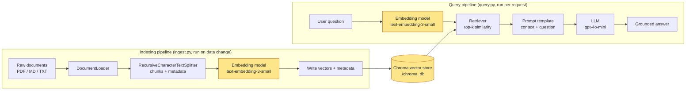
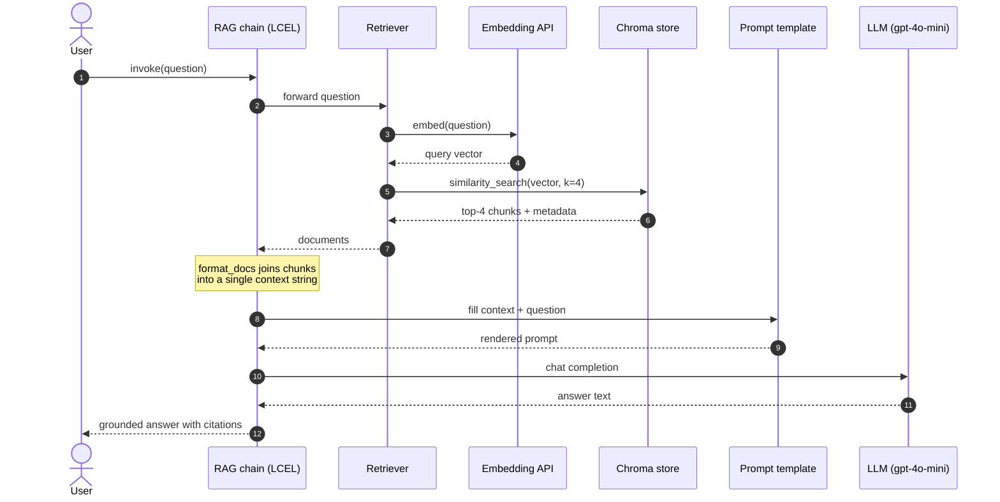

# Building a Basic RAG Pipeline: An End-to-End MVP with LangChain

## Learning Objectives
- Build an indexing pipeline with LangChain that goes from raw documents through chunking, embedding, and vector store ingestion.
- Take a user question, retrieve the most relevant chunks, inject them into a prompt, and call an LLM to produce a grounded answer.
- Run the resulting RAG MVP end-to-end and do a quick sanity check on whether the retrieval is actually helping.

## Body

### Why this lecture exists

For the past four lectures you have been gathering ingredients — what RAG is, how embeddings turn text into vectors, which vector database to pick, and how to chunk documents well. This lecture is where you finally cook. By the end of the next forty minutes (the reading plus typing the code), you should have a working Python program that you can point at a folder of your own documents and ask questions about them.

We will use **LangChain** because it is the de-facto glue library for RAG in Python. It is not the only option — LlamaIndex is a very capable alternative and a lot of the same ideas carry over — but LangChain's components map almost one-to-one onto the conceptual diagram of a RAG system, which makes it the gentlest first build.

> The goal here is not a production system. It is a *minimum viable* pipeline that you can hold in your head, debug with print statements, and iterate on. Production concerns (auth, caching, evaluation, observability) come later, after you can feel where the rough edges are.

### The mental model: two pipelines, one shared store

A RAG application is two pipelines that meet at a vector store.

The first is the **indexing pipeline**. It runs whenever your knowledge base changes. Documents come in, get split into chunks, get embedded into vectors, and land in the vector store with their metadata.

The second is the **query pipeline**. It runs every time a user asks a question. The question is embedded with the same model, the vector store returns the top-k most similar chunks, those chunks are stitched into a prompt, and an LLM writes the final answer.

The shared piece — and the most common source of bugs — is the embedding model. Indexing and querying **must** use the exact same embedding model, or the vectors live in incompatible spaces and retrieval returns garbage.

The diagram below makes the shape concrete: two pipelines running on different schedules, meeting at the same Chroma store, both depending on the same embedding model.



The yellow nodes are the pieces both pipelines share. If the two embedding boxes are not the exact same model, the whole system silently breaks.

### Setting up your environment

Create a project folder and a virtual environment. We will use OpenAI for the LLM and embeddings because it is the most predictable starting point, and Chroma as the vector store because it runs in-process with zero infrastructure.

```bash
mkdir rag-mvp && cd rag-mvp
python -m venv venv
# Windows
.\venv\Scripts\activate
# macOS / Linux
source venv/bin/activate

pip install langchain langchain-openai langchain-chroma langchain-community \
            chromadb pypdf python-dotenv
```

Create a `.env` file in the project root for your API key. Never commit this file.

```
OPENAI_API_KEY=sk-...
```

Make a `data/` folder and drop a few PDFs, Markdown files, or `.txt` files into it. For a first run, two or three documents that you genuinely know the contents of are much better than fifty you don't — you need to be able to judge whether the answers are correct.

> If you cannot use OpenAI (corporate policy, cost, offline lab), the second half of this lecture shows the same pipeline with **Ollama** running everything locally. The structure is identical; only the model classes change.

### Step 1 — Loading documents

LangChain ships **document loaders** for almost every format you will encounter. A loader's job is to read a file and produce a list of `Document` objects, where each `Document` has a `page_content` string and a `metadata` dict.

For a directory of mixed files, `DirectoryLoader` is the simplest entry point. We register one loader per extension so that PDFs, Markdown, and plain text are all picked up:

```python
# ingest.py
from pathlib import Path
from langchain_community.document_loaders import (
    DirectoryLoader,
    PyPDFLoader,
    TextLoader,
)

DATA_DIR = Path("data")

pdf_loader = DirectoryLoader(
    str(DATA_DIR),
    glob="**/*.pdf",
    loader_cls=PyPDFLoader,
)
md_loader = DirectoryLoader(
    str(DATA_DIR),
    glob="**/*.md",
    loader_cls=TextLoader,
    loader_kwargs={"encoding": "utf-8"},
)
txt_loader = DirectoryLoader(
    str(DATA_DIR),
    glob="**/*.txt",
    loader_cls=TextLoader,
    loader_kwargs={"encoding": "utf-8"},
)

docs = pdf_loader.load() + md_loader.load() + txt_loader.load()
print(f"Loaded {len(docs)} document fragments")
print("Sample metadata:", docs[0].metadata)
```

PyPDFLoader returns one `Document` per page and stamps `source` and `page` into metadata automatically. That metadata is gold — keep it. When the LLM later cites "Article 335, Section 2," you want to be able to trace that back to a specific page of a specific file.

> If your Markdown files have a strong heading structure (handbooks, RFCs, API docs), consider swapping `TextLoader` for `UnstructuredMarkdownLoader`, or pre-splitting with `MarkdownHeaderTextSplitter`, so chunks respect section boundaries instead of cutting through them.

### Step 2 — Chunking

Lecture 4 covered the theory; here is the practical default. For most prose and technical documentation, **`RecursiveCharacterTextSplitter`** with a chunk size of around 800–1,000 characters and an overlap of about 10–15% works well enough to ship.

```python
from langchain_text_splitters import RecursiveCharacterTextSplitter

splitter = RecursiveCharacterTextSplitter(
    chunk_size=1000,
    chunk_overlap=150,
    separators=["\n\n", "\n", ". ", " ", ""],
    length_function=len,
)

chunks = splitter.split_documents(docs)
print(f"Split into {len(chunks)} chunks")
print("First chunk preview:\n", chunks[0].page_content[:200])
```

The recursive splitter tries the separators in order: it first tries to split on blank lines, then single newlines, then sentence boundaries, then spaces, and only falls back to mid-word cuts as a last resort. That hierarchy is why it preserves semantic units better than a naive fixed-size splitter.

Notice we used `split_documents` rather than `split_text`. That matters: `split_documents` carries the parent document's metadata onto every child chunk, so each chunk still knows which file and page it came from.

### Step 3 — Embedding and storing

Now we vectorize the chunks and push them into Chroma. We point Chroma at a local directory so the index persists between runs — there is no need to re-embed every time the script starts.

```python
from langchain_openai import OpenAIEmbeddings
from langchain_chroma import Chroma
from dotenv import load_dotenv

load_dotenv()

embeddings = OpenAIEmbeddings(model="text-embedding-3-small")

PERSIST_DIR = "./chroma_db"

vector_store = Chroma.from_documents(
    documents=chunks,
    embedding=embeddings,
    collection_name="rag_mvp",
    persist_directory=PERSIST_DIR,
)

print(f"Indexed {vector_store._collection.count()} chunks into Chroma")
```

`text-embedding-3-small` is a good default: 1,536 dimensions, cheap, and strong on English plus reasonable on other major languages including Korean. If you are working with mostly Korean content and want a stronger multilingual option, swap in a BGE-M3 or a multilingual-e5 model via `HuggingFaceEmbeddings` — the rest of the pipeline does not change.

> Run this script once when your data changes. Embedding costs money (or time, if local) — don't re-embed on every query.

### Step 4 — Retrieving

Querying is a one-liner once the index exists. We re-open the same persistent Chroma collection and turn it into a **retriever**.

```python
# query.py
from langchain_openai import OpenAIEmbeddings
from langchain_chroma import Chroma
from dotenv import load_dotenv

load_dotenv()

embeddings = OpenAIEmbeddings(model="text-embedding-3-small")

vector_store = Chroma(
    collection_name="rag_mvp",
    embedding_function=embeddings,
    persist_directory="./chroma_db",
)

retriever = vector_store.as_retriever(
    search_type="similarity",
    search_kwargs={"k": 4},
)

# Quick sanity check
question = "What does the policy say about expense reimbursement deadlines?"
hits = retriever.invoke(question)
for i, doc in enumerate(hits, 1):
    print(f"--- Hit {i} (source: {doc.metadata.get('source')}) ---")
    print(doc.page_content[:300])
    print()
```

The `k=4` says "return the four most similar chunks." Two to six is the usual sweet spot: too few and you miss relevant context; too many and you drown the LLM in noise and burn tokens.

> Before you wire up the LLM, **always run this sanity check**. Pick three or four questions where you already know the answer should come from a specific document. If the retriever isn't surfacing the right chunks here, no amount of clever prompting downstream will save you. Fix retrieval first.

### Step 5 — Prompt, LLM, and the full chain

Now we glue retrieval to generation. We want the LLM to answer **only from the retrieved context**, cite sources where it can, and admit when the context doesn't contain the answer — the most important instruction in a RAG prompt, because it is the main lever against hallucination.

We will assemble the pipeline using LangChain Expression Language (LCEL), which composes components with the `|` operator and is the modern idiomatic style.

```python
from langchain_openai import ChatOpenAI
from langchain_core.prompts import ChatPromptTemplate
from langchain_core.output_parsers import StrOutputParser
from langchain_core.runnables import RunnablePassthrough

llm = ChatOpenAI(model="gpt-4o-mini", temperature=0)

prompt = ChatPromptTemplate.from_template(
    """You are a careful assistant that answers questions strictly from the provided context.

Rules:
- Use only the information in the context below.
- If the answer is not in the context, say "I don't know based on the provided documents."
- Quote short phrases verbatim when helpful and cite the source filename in parentheses.

Context:
{context}

Question:
{question}

Answer:"""
)

def format_docs(docs):
    formatted = []
    for d in docs:
        src = d.metadata.get("source", "unknown")
        page = d.metadata.get("page")
        tag = f"{src}" + (f", p.{page+1}" if page is not None else "")
        formatted.append(f"[{tag}]\n{d.page_content}")
    return "\n\n---\n\n".join(formatted)

rag_chain = (
    {"context": retriever | format_docs, "question": RunnablePassthrough()}
    | prompt
    | llm
    | StrOutputParser()
)

answer = rag_chain.invoke(question)
print(answer)
```

Read the chain definition out loud and it tells you exactly what happens: the question flows in; in parallel it goes to the retriever (which returns documents that `format_docs` turns into a single context string) and straight through as the `question` variable; the prompt is filled in; the LLM responds; the output parser strips it to a plain string.

`temperature=0` makes the model deterministic, which is what you want for factual Q&A. Higher temperatures are for creative writing, not for "what does the policy say."

The sequence below traces what actually happens on the wire for a single `rag_chain.invoke(question)` call.



Notice that the embedding call in step 3 must use the *same* model as the indexing pipeline used — that is the shared dependency the earlier diagram highlighted.

### Step 6 — Running the MVP

Wrap it in a tiny REPL so you can poke at it:

```python
if __name__ == "__main__":
    print("RAG MVP ready. Type 'exit' to quit.\n")
    while True:
        q = input("You: ").strip()
        if q.lower() in {"exit", "quit"}:
            break
        if not q:
            continue
        print("\nBot:", rag_chain.invoke(q), "\n")
```

Run it:

```bash
python ingest.py   # one-time, or whenever your docs change
python query.py    # interactive
```

That's the whole MVP. Roughly seventy lines of real code, and it does end-to-end retrieval-augmented generation over your own documents.

### A fully local variant with Ollama

If you cannot send data to a cloud API, the same skeleton runs on your laptop. Install [Ollama](https://ollama.ai), then pull a chat model and an embedding model:

```bash
ollama pull llama3.2
ollama pull mxbai-embed-large
pip install langchain-ollama
```

Swap two lines:

```python
from langchain_ollama import OllamaLLM, OllamaEmbeddings

embeddings = OllamaEmbeddings(model="mxbai-embed-large")
llm = OllamaLLM(model="llama3.2")
```

Everything else — the loaders, splitter, Chroma store, retriever, prompt, chain — is unchanged. That swap-ability is the point of LangChain: the abstractions let you change *one component at a time* and isolate where quality changes are coming from.

### Sanity-checking retrieval quality

You now have a running system, but "running" and "good" are not the same thing. A five-minute quality check goes a long way:

1. **Write a small eval set.** Five to ten questions whose answers you already know, ideally covering different documents and different parts of each document.
2. **Inspect the retrieved chunks, not just the final answer.** A correct-looking answer can still be a lucky guess if the retriever pulled the wrong chunks. Print the top-k for every test question and read them.
3. **Trace failures to a stage.** If retrieval already missed, the LLM never had a chance — the fix is in chunking, embedding model, or `k`. If retrieval was correct but the answer is wrong, the fix is in the prompt or the LLM.
4. **Vary one thing at a time.** Change `chunk_size` *or* `k` *or* the embedding model — not all three at once — so you can attribute the improvement.
5. **Watch for the "confidently wrong" mode.** If the model invents a number or a citation that isn't in the context, your prompt's "say I don't know" instruction is being overridden. Tighten it, lower temperature, and consider re-ranking the retrieved chunks.

> A useful diagnostic: ask a question whose answer is *deliberately* not in your documents. A healthy RAG MVP should say it doesn't know. If it cheerfully makes something up, your guardrails need work before you show this to anyone.

### Where to go next

You have a working baseline. The next natural improvements, in roughly the order they pay off, are:

- **Better chunking** for your specific content type — Markdown-aware or code-aware splitters, larger chunks for long-form prose, smaller for FAQs.
- **Hybrid retrieval** — combine vector similarity with BM25 keyword search for cases where exact terms matter (product names, error codes).
- **Re-ranking** — fetch `k=20` candidates and use a cross-encoder to re-score down to the top 4. Often a bigger quality jump than swapping the LLM.
- **Source citations in the UI** — surface the `metadata['source']` and page number alongside the answer so users can verify.
- **Lightweight evaluation** — automate the eval set with a framework like RAGAS so you can tell whether changes actually help.

But none of that matters until the basic loop works and you trust it. That loop is what this lecture gave you.

## Key Takeaways
- A RAG MVP is two pipelines around a shared vector store: an **indexing** pipeline (load → chunk → embed → store) you run when data changes, and a **query** pipeline (embed question → retrieve top-k → prompt → LLM) you run per request.
- LangChain's components map directly onto those steps, so the code reads like the diagram: loader → splitter → embeddings → Chroma → retriever → prompt → LLM.
- Indexing and querying must use the **same embedding model**; mismatches silently destroy retrieval quality.
- The prompt's most important job is to tell the LLM to answer *only* from the context and to say "I don't know" otherwise — this is your primary defense against hallucinations.
- Always sanity-check retrieval (print the top-k) **before** blaming the LLM. Most "bad RAG" problems are retrieval problems.
- Start with cloud APIs (OpenAI + Chroma) for the cleanest first build; the same skeleton runs fully local by swapping in Ollama for the LLM and embedder.
