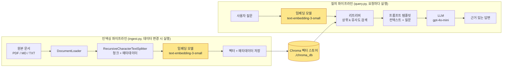
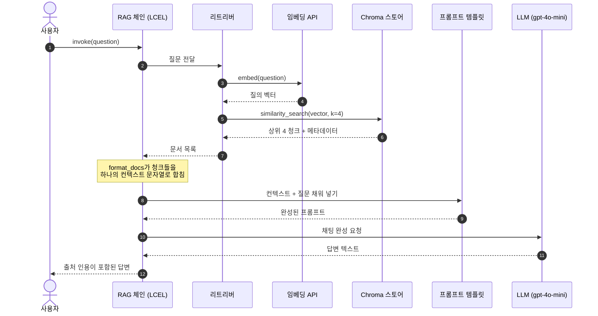

# 기본 RAG 파이프라인 구현: LangChain으로 만드는 엔드-투-엔드 MVP

## 학습 목표
- LangChain으로 인덱싱 파이프라인을 구성한다. 원본 문서에서 청킹, 임베딩, 벡터 스토어 적재까지 이어지는 흐름이다.
- 사용자 질문을 받아 가장 관련성 높은 청크를 검색하고, 이를 프롬프트에 주입한 뒤 LLM을 호출해 근거 있는 답변을 생성한다.
- 완성된 RAG MVP를 처음부터 끝까지 실행하고, 검색이 실제로 효과를 내는지 간단히 검증한다.

## 본문

### 이 강의가 필요한 이유

지금까지 네 강의에서 재료를 모아 왔다. RAG가 무엇인지, 임베딩이 텍스트를 어떻게 벡터로 변환하는지, 어떤 벡터 데이터베이스를 고를지, 문서를 어떻게 청킹할지를 배웠다. 이제 실제로 요리할 차례다. 이 강의를 읽고 코드를 직접 입력하는 40분쯤이 지나면, 자신의 문서 폴더를 가리켜 질문할 수 있는 동작하는 Python 프로그램이 생긴다.

**LangChain**을 사용하는 이유는 Python RAG 생태계에서 사실상 표준 연결 라이브러리이기 때문이다. LlamaIndex도 훌륭한 대안이고 핵심 개념도 대부분 공통적이지만, LangChain의 컴포넌트가 RAG 시스템의 개념 다이어그램과 거의 1:1로 대응되어 처음 만들어 보기에 가장 이해하기 쉽다.

> 여기서 목표는 프로덕션 시스템이 아니다. 머릿속에 전체 구조가 담기고, `print` 문으로 디버그할 수 있으며, 이것저것 바꿔 보면서 개선할 수 있는 *최소 기능 파이프라인*이다. 인증, 캐싱, 평가, 가시성 같은 프로덕션 과제는 나중에, 어디가 거친지 직접 느끼고 난 뒤에 다룬다.

### 핵심 구조: 두 파이프라인, 하나의 공유 스토어

RAG 애플리케이션은 벡터 스토어에서 만나는 두 개의 파이프라인이다.

첫 번째는 **인덱싱 파이프라인**이다. 지식 베이스가 바뀔 때마다 실행된다. 문서가 들어오면 청크로 분할되고, 벡터로 임베딩된 뒤 메타데이터와 함께 벡터 스토어에 저장된다.

두 번째는 **질의 파이프라인**이다. 사용자가 질문할 때마다 실행된다. 질문이 동일한 모델로 임베딩되고, 벡터 스토어가 가장 유사한 청크 상위 k개를 반환하면, 그 청크들을 프롬프트에 엮어 LLM이 최종 답변을 생성한다.

두 파이프라인이 공유하는 부분, 즉 버그가 가장 자주 발생하는 지점이 바로 임베딩 모델이다. 인덱싱과 질의에는 **반드시 동일한 임베딩 모델**을 써야 한다. 모델이 다르면 벡터가 서로 호환되지 않는 공간에 존재하게 되어, 검색이 엉뚱한 결과를 반환한다.

아래 다이어그램에서 이 구조를 확인할 수 있다. 서로 다른 일정으로 실행되는 두 파이프라인이 동일한 Chroma 스토어에서 만나고, 둘 다 같은 임베딩 모델에 의존한다.



노란색 노드가 두 파이프라인이 공유하는 부분이다. 두 임베딩 박스가 완전히 동일한 모델이 아니면 시스템 전체가 조용히 망가진다.

### 환경 설정

프로젝트 폴더와 가상 환경을 만든다. LLM과 임베딩에는 OpenAI를 사용하는데, 예측 가능성이 가장 높은 출발점이기 때문이다. 벡터 스토어는 Chroma를 쓴다. 별도 인프라 없이 프로세스 안에서 바로 실행된다.

```bash
mkdir rag-mvp && cd rag-mvp
python -m venv venv
# Windows
.\venv\Scripts\activate
# macOS / Linux
source venv/bin/activate

pip install langchain langchain-openai langchain-chroma langchain-community \
            chromadb pypdf python-dotenv
```

프로젝트 루트에 API 키를 담은 `.env` 파일을 만든다. 이 파일은 절대 커밋하지 않는다.

```
OPENAI_API_KEY=sk-...
```

`data/` 폴더를 만들고 PDF, Markdown, `.txt` 파일을 몇 개 넣는다. 처음 실행할 때는 내용을 직접 아는 문서 두세 개가 모르는 문서 50개보다 훨씬 낫다. 답변이 맞는지 판단할 수 있어야 하기 때문이다.

> OpenAI를 사용할 수 없는 상황이라면(사내 정책, 비용, 오프라인 환경), 이 강의 후반부에서 동일한 파이프라인을 **Ollama**로 로컬에서 전부 실행하는 방법을 다룬다. 구조는 동일하고, 모델 클래스만 바뀐다.

### 1단계 — 문서 로딩

LangChain은 거의 모든 형식에 대응하는 **문서 로더(document loader)**를 제공한다. 로더의 역할은 파일을 읽어 `Document` 객체 리스트를 만드는 것이다. 각 `Document`는 `page_content` 문자열과 `metadata` 딕셔너리를 가진다.

여러 형식이 섞인 디렉터리를 처리할 때는 `DirectoryLoader`가 가장 간단한 진입점이다. 확장자별로 로더를 등록하면 PDF, Markdown, 일반 텍스트가 모두 수집된다.

```python
# ingest.py
from pathlib import Path
from langchain_community.document_loaders import (
    DirectoryLoader,
    PyPDFLoader,
    TextLoader,
)

DATA_DIR = Path("data")

pdf_loader = DirectoryLoader(
    str(DATA_DIR),
    glob="**/*.pdf",
    loader_cls=PyPDFLoader,
)
md_loader = DirectoryLoader(
    str(DATA_DIR),
    glob="**/*.md",
    loader_cls=TextLoader,
    loader_kwargs={"encoding": "utf-8"},
)
txt_loader = DirectoryLoader(
    str(DATA_DIR),
    glob="**/*.txt",
    loader_cls=TextLoader,
    loader_kwargs={"encoding": "utf-8"},
)

docs = pdf_loader.load() + md_loader.load() + txt_loader.load()
print(f"Loaded {len(docs)} document fragments")
print("Sample metadata:", docs[0].metadata)
```

`PyPDFLoader`는 페이지당 `Document` 하나를 반환하고 `source`와 `page`를 메타데이터에 자동으로 기록한다. 이 메타데이터는 매우 중요하니 반드시 보존한다. 나중에 LLM이 "제35조 2항"을 인용할 때, 어떤 파일의 몇 페이지인지 추적할 수 있어야 한다.

> Markdown 파일에 섹션 헤딩 구조가 잘 갖춰져 있다면(핸드북, RFC, API 문서 등), `TextLoader` 대신 `UnstructuredMarkdownLoader`를 쓰거나 `MarkdownHeaderTextSplitter`로 미리 분할하는 것이 좋다. 섹션 경계를 무시하고 중간에서 잘리는 문제를 막을 수 있다.

### 2단계 — 청킹

청킹 이론은 4강에서 다뤘고, 여기서는 실용적인 기본값을 쓴다. 일반 산문과 기술 문서 대부분에서는 청크 크기 800~1,000자에 10~15% 오버랩을 주는 **`RecursiveCharacterTextSplitter`**가 바로 출시해도 될 만큼 잘 동작한다.

```python
from langchain_text_splitters import RecursiveCharacterTextSplitter

splitter = RecursiveCharacterTextSplitter(
    chunk_size=1000,
    chunk_overlap=150,
    separators=["\n\n", "\n", ". ", " ", ""],
    length_function=len,
)

chunks = splitter.split_documents(docs)
print(f"Split into {len(chunks)} chunks")
print("First chunk preview:\n", chunks[0].page_content[:200])
```

재귀 분할기는 구분자를 순서대로 시도한다. 먼저 빈 줄, 다음에 단일 개행, 그 다음 문장 경계, 공백 순으로 시도하고, 어쩔 수 없을 때만 단어 중간을 자른다. 이 계층적 처리 방식 덕분에 단순 고정 크기 분할기보다 의미 단위를 더 잘 보존한다.

`split_text` 대신 `split_documents`를 사용한 점도 중요하다. `split_documents`는 부모 문서의 메타데이터를 각 자식 청크에 그대로 전달하므로, 모든 청크가 어느 파일의 몇 페이지에서 왔는지 계속 알 수 있다.

### 3단계 — 임베딩과 저장

청크를 벡터화해 Chroma에 저장한다. Chroma가 로컬 디렉터리를 가리키도록 설정하면 인덱스가 실행 간에 유지되므로, 스크립트를 시작할 때마다 다시 임베딩할 필요가 없다.

```python
from langchain_openai import OpenAIEmbeddings
from langchain_chroma import Chroma
from dotenv import load_dotenv

load_dotenv()

embeddings = OpenAIEmbeddings(model="text-embedding-3-small")

PERSIST_DIR = "./chroma_db"

vector_store = Chroma.from_documents(
    documents=chunks,
    embedding=embeddings,
    collection_name="rag_mvp",
    persist_directory=PERSIST_DIR,
)

print(f"Indexed {vector_store._collection.count()} chunks into Chroma")
```

`text-embedding-3-small`은 좋은 기본값이다. 1,536차원에 비용이 저렴하고, 영어에서 강하며 한국어를 포함한 주요 언어에서도 준수한 성능을 낸다. 한국어 콘텐츠가 주를 이루고 더 강한 다국어 옵션이 필요하다면, `HuggingFaceEmbeddings`를 통해 BGE-M3나 multilingual-e5 모델로 교체할 수 있다. 나머지 파이프라인은 바꾸지 않아도 된다.

> 데이터가 바뀔 때마다 이 스크립트를 한 번 실행하면 된다. 임베딩은 비용(또는 로컬이라면 시간)이 드니, 매번 질의할 때 재임베딩하지 않는다.

### 4단계 — 검색

인덱스가 있으면 질의는 한 줄로 끝난다. 동일한 영구 Chroma 컬렉션을 다시 열고 **리트리버(retriever)**로 변환한다.

```python
# query.py
from langchain_openai import OpenAIEmbeddings
from langchain_chroma import Chroma
from dotenv import load_dotenv

load_dotenv()

embeddings = OpenAIEmbeddings(model="text-embedding-3-small")

vector_store = Chroma(
    collection_name="rag_mvp",
    embedding_function=embeddings,
    persist_directory="./chroma_db",
)

retriever = vector_store.as_retriever(
    search_type="similarity",
    search_kwargs={"k": 4},
)

# 동작 확인용 간단 테스트
question = "What does the policy say about expense reimbursement deadlines?"
hits = retriever.invoke(question)
for i, doc in enumerate(hits, 1):
    print(f"--- Hit {i} (source: {doc.metadata.get('source')}) ---")
    print(doc.page_content[:300])
    print()
```

`k=4`는 "가장 유사한 청크 4개를 반환한다"는 뜻이다. 2~6이 일반적인 적정 범위다. 너무 적으면 관련 컨텍스트를 놓치고, 너무 많으면 LLM에 노이즈를 쏟아붓고 토큰을 낭비한다.

> LLM을 연결하기 전에 **항상 이 동작 확인을 먼저 실행한다**. 특정 문서에서 답이 와야 한다고 알고 있는 질문 서너 개를 준비해 테스트한다. 여기서 리트리버가 올바른 청크를 가져오지 못한다면, 아무리 정교한 프롬프트를 써도 소용없다. 검색 문제를 먼저 잡아야 한다.

### 5단계 — 프롬프트, LLM, 그리고 완성된 체인

이제 검색과 생성을 연결한다. LLM이 **검색된 컨텍스트에서만** 답하고, 가능하면 출처를 인용하며, 컨텍스트에 답이 없으면 솔직히 모른다고 말하도록 한다. RAG 프롬프트에서 가장 중요한 지시사항이다. 환각을 막는 핵심 장치이기 때문이다.

파이프라인은 LangChain Expression Language(LCEL)로 조립한다. LCEL은 `|` 연산자로 컴포넌트를 연결하는 현대적인 관용 방식이다.

```python
from langchain_openai import ChatOpenAI
from langchain_core.prompts import ChatPromptTemplate
from langchain_core.output_parsers import StrOutputParser
from langchain_core.runnables import RunnablePassthrough

llm = ChatOpenAI(model="gpt-4o-mini", temperature=0)

prompt = ChatPromptTemplate.from_template(
    """You are a careful assistant that answers questions strictly from the provided context.

Rules:
- Use only the information in the context below.
- If the answer is not in the context, say "I don't know based on the provided documents."
- Quote short phrases verbatim when helpful and cite the source filename in parentheses.

Context:
{context}

Question:
{question}

Answer:"""
)

def format_docs(docs):
    formatted = []
    for d in docs:
        src = d.metadata.get("source", "unknown")
        page = d.metadata.get("page")
        tag = f"{src}" + (f", p.{page+1}" if page is not None else "")
        formatted.append(f"[{tag}]\n{d.page_content}")
    return "\n\n---\n\n".join(formatted)

rag_chain = (
    {"context": retriever | format_docs, "question": RunnablePassthrough()}
    | prompt
    | llm
    | StrOutputParser()
)

answer = rag_chain.invoke(question)
print(answer)
```

체인 정의를 읽으면 흐름이 그대로 드러난다. 질문이 들어오면, 한쪽에서는 리트리버에 전달되어 `format_docs`가 문서 목록을 하나의 컨텍스트 문자열로 만들고, 다른 한쪽에서는 `question` 변수로 그대로 통과한다. 프롬프트가 채워지고, LLM이 응답하면, 출력 파서가 순수 문자열로 정리한다.

`temperature=0`은 모델을 결정론적으로 만든다. 사실 기반 Q&A에서는 이것이 맞다. 높은 temperature는 창의적 글쓰기용이지, "정책에는 뭐라고 나와 있나요?"에는 어울리지 않는다.

아래 시퀀스 다이어그램은 `rag_chain.invoke(question)` 호출 한 번에 실제로 어떤 일이 일어나는지 보여준다.



3번 단계의 임베딩 호출은 인덱싱 파이프라인에서 사용한 것과 *동일한* 모델이어야 한다. 앞서 다이어그램에서 강조한 공유 의존성이 바로 이 부분이다.

### 6단계 — MVP 실행

간단한 REPL로 감싸면 편하게 이것저것 시험해 볼 수 있다.

```python
if __name__ == "__main__":
    print("RAG MVP ready. Type 'exit' to quit.\n")
    while True:
        q = input("You: ").strip()
        if q.lower() in {"exit", "quit"}:
            break
        if not q:
            continue
        print("\nBot:", rag_chain.invoke(q), "\n")
```

실행:

```bash
python ingest.py   # 최초 1회, 또는 문서가 바뀔 때마다
python query.py    # 대화형 실행
```

이것이 MVP 전부다. 실제 코드 약 70줄로 자신의 문서에 대한 엔드-투-엔드 검색 증강 생성이 동작한다.

### Ollama를 이용한 완전 로컬 버전

클라우드 API로 데이터를 보낼 수 없는 상황이라면, 동일한 뼈대를 노트북에서 실행할 수 있다. [Ollama](https://ollama.ai)를 설치하고 채팅 모델과 임베딩 모델을 내려받는다.

```bash
ollama pull llama3.2
ollama pull mxbai-embed-large
pip install langchain-ollama
```

두 줄만 바꾼다.

```python
from langchain_ollama import OllamaLLM, OllamaEmbeddings

embeddings = OllamaEmbeddings(model="mxbai-embed-large")
llm = OllamaLLM(model="llama3.2")
```

나머지, 즉 로더, 분할기, Chroma 스토어, 리트리버, 프롬프트, 체인은 모두 그대로다. 이것이 LangChain 추상화의 핵심이다. 한 번에 하나의 컴포넌트만 바꾸면서 품질 변화가 어디서 오는지 격리해 볼 수 있다.

### 검색 품질 확인

시스템이 돌아가고 있지만, "돌아간다"는 것과 "잘 된다"는 것은 다르다. 5분짜리 품질 점검이 큰 차이를 만든다.

1. **작은 평가 세트를 만든다.** 답을 이미 알고 있는 질문 5~10개를 준비한다. 가능하면 서로 다른 문서와 문서의 다른 부분을 커버하도록 한다.
2. **최종 답변뿐 아니라 검색된 청크를 직접 확인한다.** 그럴싸해 보이는 답변도 리트리버가 엉뚱한 청크를 가져온 상태에서 운 좋게 맞춘 것일 수 있다. 모든 테스트 질문의 상위 k 청크를 출력해서 읽어 본다.
3. **어느 단계에서 실패했는지 추적한다.** 검색 단계에서 이미 실패했다면 LLM은 처음부터 기회가 없었던 것이다. 청킹, 임베딩 모델, 또는 `k`를 고쳐야 한다. 검색은 맞았는데 답변이 틀렸다면, 프롬프트나 LLM에서 원인을 찾는다.
4. **한 번에 한 가지만 바꾼다.** `chunk_size`, `k`, 임베딩 모델 중 하나만 바꾼다. 셋을 동시에 바꾸면 어디서 개선이 왔는지 알 수 없다.
5. **"자신 있게 틀리는" 모드를 주의한다.** 모델이 컨텍스트에 없는 숫자나 인용을 만들어 낸다면, 프롬프트의 "모른다고 말하라" 지시가 무시되고 있는 것이다. 지시를 강화하고, temperature를 낮추고, 검색된 청크를 재순위화하는 것을 고려한다.

> 유용한 진단 방법이 있다. 답이 *의도적으로* 문서에 없는 질문을 해 본다. 건강한 RAG MVP라면 모른다고 답해야 한다. 아무렇지 않게 무언가를 만들어 낸다면, 가드레일을 강화해야 한다.

### 다음 단계

동작하는 기준선이 생겼다. 이후 개선 작업을 효과를 발휘하는 순서로 나열하면 다음과 같다.

- **콘텐츠 유형에 맞는 청킹**: Markdown 인식, 코드 인식 분할기, 장문 산문에는 큰 청크, FAQ에는 작은 청크.
- **하이브리드 검색**: 벡터 유사도와 BM25 키워드 검색을 결합한다. 제품명, 오류 코드처럼 정확한 용어가 중요한 경우에 유용하다.
- **재순위화(Re-ranking)**: `k=20`개를 가져온 뒤 크로스 인코더로 상위 4개로 재채점한다. LLM을 교체하는 것보다 품질 향상 효과가 클 때가 많다.
- **UI에서 출처 표시**: 답변 옆에 `metadata['source']`와 페이지 번호를 함께 보여줘 사용자가 직접 확인할 수 있게 한다.
- **경량 평가**: RAGAS 같은 프레임워크로 평가 세트를 자동화해 변경이 실제로 도움이 되는지 측정한다.

다만 이 모든 것은 기본 루프가 동작하고 신뢰할 수 있게 된 뒤의 이야기다. 그 루프를 이번 강의에서 만들었다.

## 핵심 정리
- RAG MVP는 공유 벡터 스토어를 중심으로 돌아가는 두 파이프라인이다. 데이터가 바뀔 때 실행하는 **인덱싱** 파이프라인(로드 → 청킹 → 임베딩 → 저장)과, 요청마다 실행하는 **질의** 파이프라인(질문 임베딩 → 상위 k 검색 → 프롬프트 → LLM)이다.
- LangChain 컴포넌트는 각 단계에 직접 대응한다. 코드가 다이어그램처럼 읽힌다. loader → splitter → embeddings → Chroma → retriever → prompt → LLM.
- 인덱싱과 질의에는 **동일한 임베딩 모델**을 써야 한다. 모델이 달라지면 검색 품질이 소리 없이 무너진다.
- 프롬프트에서 가장 중요한 역할은 LLM이 컨텍스트에서만 답하고, 모를 때는 "모른다"고 말하도록 지시하는 것이다. 환각에 대한 1차 방어선이다.
- LLM을 탓하기 전에 항상 검색부터 확인한다(상위 k를 출력해 본다). "나쁜 RAG" 문제 대부분은 검색 문제다.
- 처음 만들 때는 클라우드 API(OpenAI + Chroma)로 시작하는 것이 가장 깔끔하다. 동일한 뼈대가 Ollama로 LLM과 임베더만 교체해 완전 로컬로도 돌아간다.
